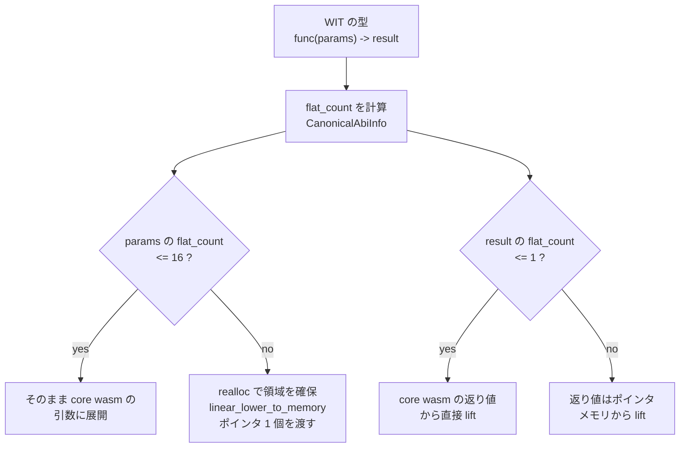

## 型を core wasm の引数に潰す

component の関数は `func(x: string, y: option<u32>) -> result<list<u8>, string>` のような型を持つが、実際に呼ばれるのは core wasm の関数だ。だから WIT の型を `i32` / `i64` / `f32` / `f64` の列に潰す規則が要る。これが canonical ABI の **flattening** で、規則自体は素直だ。

`u8` から `u32` までは `i32` 1 個、`u64` は `i64` 1 個、`f32` / `f64` はそのまま 1 個。`record` はフィールドの flatten を連結、`tuple` も同じ。`string` と `list<T>` は「ポインタと長さ」の 2 個。`variant` は「discriminant 1 個 + 全ケースの flatten を重ね合わせたもの」。

この規則をそのまま適用すると、深くネストした型では平坦化後の個数がいくらでも増える。だから**打ち切りがある**。

```rust title="crates/environ/src/component.rs"
/// Canonical ABI-defined constant for the maximum number of "flat" parameters
/// to a wasm function, or the maximum number of parameters a core wasm function
/// will take for just the parameters used. Over this number the heap is used
/// for transferring parameters.
pub const MAX_FLAT_PARAMS: usize = 16;

/// Similar to `MAX_FLAT_PARAMS`, but used for async-lowered imports instead of
/// sync ones.
pub const MAX_FLAT_ASYNC_PARAMS: usize = 4;

/// Canonical ABI-defined constant for the maximum number of "flat" results.
/// This number of results are returned directly from wasm and otherwise results
/// are transferred through memory.
pub const MAX_FLAT_RESULTS: usize = 1;
```

[crates/environ/src/component.rs](https://github.com/bytecodealliance/wasmtime/blob/d8a0da6d661605713798c1c9c76be5c28e3159ff/crates/environ/src/component.rs#L21-L34)

**引数は 16 個、結果は 1 個。** これを超えたら値は線形メモリに置き、代わりにポインタ 1 個を渡す。async で lower された import では引数の上限が 4 個とさらに厳しい。



なぜ打ち切りが必要かは、引数を渡す先が実際の CPU であることを考えれば分かる。core wasm の関数は引数の個数に仕様上の上限がないが、生成される機械語では引数はレジスタに載り、載り切らない分はスタックに積まれる。x86_64 の整数引数レジスタは 6 本、aarch64 でも 8 本しかない。無制限に平坦化を許すと「引数 400 個の関数」が生まれ、呼び出し規約の処理が肥大化する。そして平坦化しても値が大きければ結局メモリへの退避が起きるので、**一定サイズを超えたら最初からメモリ経由にしたほうが単純で速い**。

## `CanonicalAbiInfo` — 型 1 つあたり 5 つの数値

Wasmtime は各型について、サイズ・アラインメント・flat 個数をまとめて持っている。

```rust title="crates/environ/src/component/types.rs"
pub struct CanonicalAbiInfo {
    /// The byte-size of this type in a 32-bit memory.
    pub size32: u32,
    /// The byte-alignment of this type in a 32-bit memory.
    pub align32: u32,
    /// The byte-size of this type in a 64-bit memory.
    pub size64: u32,
    /// The byte-alignment of this type in a 64-bit memory.
    pub align64: u32,
    /// The number of types it takes to represents this type in the "flat"
    /// representation of the canonical abi where everything is passed as
    /// immediate arguments or results.
    ///
    /// If this is `None` then this type is not representable in the flat ABI
    /// because it is too large.
    pub flat_count: Option<u8>,
}
```

[crates/environ/src/component/types.rs](https://github.com/bytecodealliance/wasmtime/blob/d8a0da6d661605713798c1c9c76be5c28e3159ff/crates/environ/src/component/types.rs#L646-L663)

`size` と `align` が 32bit メモリ用と 64bit メモリ用で 2 組あるのは、ポインタ幅が違うからだ。そして **`flat_count: Option<u8>` の `None` が「flat 表現不能」を意味する**。「大きすぎる」を別のフラグではなく `Option` の `None` で表現しているので、加算のたびに上限判定が入る。

```rust title="crates/environ/src/component/types.rs"
const fn add_flat(a: Option<u8>, b: Option<u8>) -> Option<u8> {
    const MAX: u8 = MAX_FLAT_TYPES as u8;
    let sum = match (a, b) {
        (Some(a), Some(b)) => match a.checked_add(b) {
            Some(c) => c,
            None => return None,
        },
        _ => return None,
    };
    if sum > MAX { None } else { Some(sum) }
}
```

[crates/environ/src/component/types.rs](https://github.com/bytecodealliance/wasmtime/blob/d8a0da6d661605713798c1c9c76be5c28e3159ff/crates/environ/src/component/types.rs#L1338-L1348)

`MAX_FLAT_TYPES` は `MAX_FLAT_PARAMS` と `MAX_FLAT_RESULTS` の大きいほう、つまり 16 だ。**片方が `None` なら結果も `None`** という単調な伝播になっているので、一度「表現不能」になった型を含む型はすべて表現不能になる。

`list` と `string` は「ポインタと長さのペア」として定数で定義されている。

```rust title="crates/environ/src/component/types.rs"
/// ABI information for lists/strings which are "pointer pairs"
pub const POINTER_PAIR: CanonicalAbiInfo = CanonicalAbiInfo {
    size32: 8,
    align32: 4,
    size64: 16,
    align64: 8,
    flat_count: Some(2),
};
```

32bit メモリなら 4 バイトのポインタ + 4 バイトの長さで size 8 / align 4、64bit メモリなら 8 + 8 で size 16 / align 8。flat 個数はどちらでも 2 個だ。

`record` は素直にフィールドを畳み込む。

```rust title="crates/environ/src/component/types.rs"
pub fn record<'a>(fields: impl Iterator<Item = &'a CanonicalAbiInfo>) -> CanonicalAbiInfo {
    let mut ret = CanonicalAbiInfo::default();
    for field in fields {
        ret.size32 = align_to(ret.size32, field.align32) + field.size32;
        ret.align32 = ret.align32.max(field.align32);
        ret.size64 = align_to(ret.size64, field.align64) + field.size64;
        ret.align64 = ret.align64.max(field.align64);
        ret.flat_count = add_flat(ret.flat_count, field.flat_count);
    }
    ret.size32 = align_to(ret.size32, ret.align32);
    ret.size64 = align_to(ret.size64, ret.align64);
    return ret;
}
```

[crates/environ/src/component/types.rs](https://github.com/bytecodealliance/wasmtime/blob/d8a0da6d661605713798c1c9c76be5c28e3159ff/crates/environ/src/component/types.rs#L726-L740)

C の構造体レイアウトと同じで、各フィールドの前に padding を入れ、最後に全体のアラインメントに切り上げる。flat 個数はフィールドの和。

## variant は「和」ではなく「最大」

`variant` は面白い。サイズは「discriminant + 全ケースの最大」で、flat 個数は「1 + 各ケースの最大」になる。

```rust title="crates/environ/src/component/types.rs"
fn variant<'a, I>(cases: I) -> CanonicalAbiInfo {
    let discrim_size = u32::from(DiscriminantSize::from_count(cases.len()).unwrap());
    let mut max_size32 = 0;
    let mut max_align32 = discrim_size;
    // ...
    let mut max_case_count = Some(0);
    for case in cases {
        if let Some(case) = case {
            max_size32 = max_size32.max(case.size32);
            max_align32 = max_align32.max(case.align32);
            // ...
            max_case_count = max_flat(max_case_count, case.flat_count);
        }
    }
    CanonicalAbiInfo {
        size32: align_to(align_to(discrim_size, max_align32) + max_size32, max_align32),
        align32: max_align32,
        // ...
        flat_count: add_flat(max_case_count, Some(1)),
    }
}
```

[crates/environ/src/component/types.rs](https://github.com/bytecodealliance/wasmtime/blob/d8a0da6d661605713798c1c9c76be5c28e3159ff/crates/environ/src/component/types.rs#L852-L889)

ペイロードを持たないケース (`None`) は最大値に寄与しない。discriminant のサイズはケース数から決まる (256 未満なら 1 バイト、といった具合)。

問題は「最大を取る」が個数だけでは済まないことだ。`variant { a(s32), b(f32) }` の 2 番目のスロットは、ケース `a` なら `i32`、ケース `b` なら `f32` になる。**1 つの core wasm 関数シグネチャは 1 つの型しか書けない**ので、どちらでも収まる型に統合しなければならない。

## flat 型の結合規則は 3 行

その統合規則が `FlatType::join` だ。

```rust title="crates/environ/src/component/types_builder.rs"
impl FlatType {
    fn join(&mut self, other: FlatType) {
        if *self == other {
            return;
        }
        *self = match (*self, other) {
            (FlatType::I32, FlatType::F32) | (FlatType::F32, FlatType::I32) => FlatType::I32,
            _ => FlatType::I64,
        };
    }
}
```

[crates/environ/src/component/types_builder.rs](https://github.com/bytecodealliance/wasmtime/blob/d8a0da6d661605713798c1c9c76be5c28e3159ff/crates/environ/src/component/types_builder.rs#L969-L979)

**同じなら変わらない。`i32` と `f32` なら `i32`。それ以外は全部 `i64`。** これが canonical ABI の join そのもので、格子は次の形をしている。

```text
        i64          <- 幅 64bit が要るものは全部ここに落ちる
       /   \
     i32    f64      <- f64 は i64 と join すると i64
    /   \
  i32   f32          <- i32 と f32 は i32 に統合 (ビットパターンを詰め込む)
```

`f32` を `i32` に載せるのは「ビットパターンをそのまま入れる」ということで、値としての意味は失われるが、受け取った側は discriminant を見て正しい型として読み直す。`f64` と `f32` を join すると `i64` になるのは、`f64` を `f32` のスロットに入れられないからだ。

この join を実際に回しているのが `build_variant` で、discriminant として最初に `i32` を 1 個積んでから、各ケースの flat 型列を 1 個ずらして重ねていく。

```rust title="crates/environ/src/component/types_builder.rs"
fn build_variant<'a, I>(&mut self, cases: I) {
    let cases = cases.into_iter();
    self.flat.push(FlatType::I32, FlatType::I32);   // discriminant

    for info in cases {
        // ...
        let dst = self.flat.memory32.iter_mut().zip(&mut self.flat.memory64).skip(1);
        for (i, ((t32, t64), (dst32, dst64))) in types.memory32.iter().zip(types.memory64).zip(dst).enumerate() {
            if i + 1 < usize::from(self.flat.len) {
                // If this index hs already been set by some previous case
                // then the types are joined together.
                dst32.join(*t32);
                dst64.join(*t64);
            } else {
                self.flat.len += 1;
                *dst32 = *t32;
                *dst64 = *t64;
            }
        }
    }
}
```

[crates/environ/src/component/types_builder.rs](https://github.com/bytecodealliance/wasmtime/blob/d8a0da6d661605713798c1c9c76be5c28e3159ff/crates/environ/src/component/types_builder.rs#L1058-L1124)

既に他のケースが埋めたスロットなら `join`、まだ誰も使っていないスロットなら初期化して長さを伸ばす。`option<T>` と `result<T, E>` も内部的にはこの `build_variant` を通る (`options` / `results` メソッドが 2 ケースの variant として呼ぶ)。

## 「表現不能」をセンチネル長で表す

flat 型の列は固定長配列で持っている。理由がコメントに書いてある。

```rust title="crates/environ/src/component/types_builder.rs"
struct FlatTypesStorage {
    // This could be represented as `Vec<FlatType>` but on 64-bit architectures
    // that's 24 bytes. Otherwise `FlatType` is 1 byte large and
    // `MAX_FLAT_TYPES` is 16, so it should ideally be more space-efficient to
    // use a flat array instead of a heap-based vector.
    memory32: [FlatType; MAX_FLAT_TYPES],
    memory64: [FlatType; MAX_FLAT_TYPES],

    // Tracks the number of flat types pushed into this storage. If this is
    // `MAX_FLAT_TYPES + 1` then this storage represents an un-reprsentable
    // type in flat types.
    len: u8,
}
```

`Vec` なら 64bit 環境で 24 バイト (ポインタ + 長さ + 容量) だが、`FlatType` は 1 バイトで最大 16 個なので配列 16 バイトのほうが小さい。`FlatType` が `I32` / `I64` / `F32` / `F64` の 4 バリアントだけなのも、`types.rs` に「core wasm の型システムが変わってもここは整数と浮動小数点しか使わないので、1 バイトを保つために意図的に別定義にしている」と注記がある。

そして **`len == MAX_FLAT_TYPES + 1` が「表現不能」のセンチネル**になっている。

```rust title="crates/environ/src/component/types_builder.rs"
fn as_flat_types(&self) -> Option<FlatTypes<'_>> {
    let len = usize::from(self.len);
    if len > MAX_FLAT_TYPES {
        assert_eq!(len, MAX_FLAT_TYPES + 1);
        None
    } else {
        Some(FlatTypes { memory32: &self.memory32[..len], memory64: &self.memory64[..len] })
    }
}

fn push(&mut self, t32: FlatType, t64: FlatType) -> bool {
    let len = usize::from(self.len);
    if len < MAX_FLAT_TYPES {
        self.memory32[len] = t32;
        self.memory64[len] = t64;
        self.len += 1;
        true
    } else {
        // If this was the first one to go over then flag the length as
        // being incompatible with a flat representation.
        if len == MAX_FLAT_TYPES {
            self.len += 1;
        }
        false
    }
}
```

[crates/environ/src/component/types_builder.rs](https://github.com/bytecodealliance/wasmtime/blob/d8a0da6d661605713798c1c9c76be5c28e3159ff/crates/environ/src/component/types_builder.rs#L910-L967)

`push` は 17 個目で `len` を 17 にした後、それ以上は増やさない。**`Option<FlatTypesStorage>` にせず 1 バイトのフィールドを 1 つ余分に使うだけで表現しているのは、この構造体が型の数だけ作られるからだ。** `assert_eq!(len, MAX_FLAT_TYPES + 1)` が「17 より大きくなることはない」という不変条件を明文化している。

## 呼び出し側での分岐

ホストがゲストの関数を呼ぶときは、この `flat_count` を見て 4 通りに分岐する。

```rust title="crates/wasmtime/src/runtime/component/func/typed.rs"
pub(crate) fn lower_args<T>(
    cx: &mut LowerContext<T>,
    ty: InterfaceType,
    dst: &mut [MaybeUninit<ValRaw>],
    params: &Params,
) -> Result<()> {
    if Params::flatten_count() <= MAX_FLAT_PARAMS {
        let dst: &mut MaybeUninit<Params::Lower> = unsafe { slice_to_storage_mut(dst) };
        Self::lower_stack_args(cx, &params, ty, dst)
    } else {
        Self::lower_heap_args(cx, &params, ty, &mut dst[0])
    }
}
```

[crates/wasmtime/src/runtime/component/func/typed.rs](https://github.com/bytecodealliance/wasmtime/blob/d8a0da6d661605713798c1c9c76be5c28e3159ff/crates/wasmtime/src/runtime/component/func/typed.rs#L187-L204)

引数側で 2 通り、結果側で 2 通り、合わせて 4 通り。`call_impl` のコメントがこの構造を説明している。

```rust title="crates/wasmtime/src/runtime/component/func/typed.rs"
// Note that this is in theory simpler than it might read at this time.
// Here we're doing a runtime dispatch on the `flatten_count` for the
// params/results to see whether they're inbounds. This creates 4 cases
// to handle. In reality this is a highly optimizable branch where LLVM
// will easily figure out that only one branch here is taken.
//
// Otherwise this current construction is done to ensure that the stack
// space reserved for the params/results is always of the appropriate
// size (as the params/results needed differ depending on the "flatten"
// count)
```

[crates/wasmtime/src/runtime/component/func/typed.rs](https://github.com/bytecodealliance/wasmtime/blob/d8a0da6d661605713798c1c9c76be5c28e3159ff/crates/wasmtime/src/runtime/component/func/typed.rs#L206-L341)

**`flatten_count()` は型から決まる定数なので、実行時分岐に見えて LLVM は単一の枝しか残さない。** 分岐として書いてあるのは「スタックに確保する領域のサイズが flatten 数で変わるので、型ごとに正しいサイズを確保させたい」からだ。`TypedFunc<Params, Return>` は型パラメータで単相化されるので ([型を静的に固定して、呼び出しを速くする](../typed-func/))、各インスタンス化では 1 つの経路だけが残る。

heap 経路では `realloc` を呼んで領域を確保し、そこにポインタを書き込む。

```rust title="crates/wasmtime/src/runtime/component/func/typed.rs"
// Note that `realloc` will bake in a check that the returned pointer is
// in-bounds.
let ptr = cx.realloc(0, 0, Params::ALIGN32, Params::SIZE32)?;
params.linear_lower_to_memory(cx, ty, ptr)?;

// Note that the pointer here is stored as a 64-bit integer. This allows
// this to work with either 32 or 64-bit memories.
dst.write(ValRaw::i64(ptr as i64));
```

**確保するのはホストではなくゲストの `realloc`** で、これが shared-nothing の核心になる。lift 側も対称で、`lift_heap_result` はポインタのアラインメントと範囲を検証してからメモリを読む。この 4 つのメソッド (`linear_lower_to_flat` / `linear_lower_to_memory` / `linear_lift_from_flat` / `linear_lift_from_memory`) が次のページの主題だ ([lifting と lowering、realloc と post-return](../lifting-lowering/))。

## 持ち帰り

「サイズが閾値を超えたら値渡しからポインタ渡しに切り替える」というのは、C の呼び出し規約でも同じことが起きている。canonical ABI が特徴的なのは、**その閾値と平坦化規則を仕様として明文化し、複数の言語処理系が合意できる形にした**ことだ。ABI を跨いだ相互運用を設計するときは、この「閾値と、閾値を超えたときの逃がし方」を先に決めておくと、後から型が増えても規則が壊れない。
