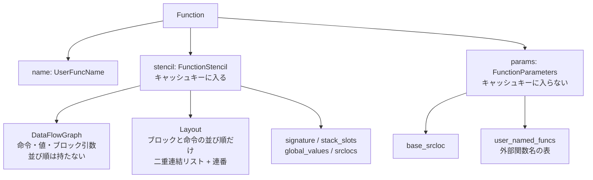

CLIF (Cranelift IR) の関数表現には、2 段階の分割が入っている。**命令の中身と、命令の並び順**が別の構造体になっている。そして**コンパイル結果を決めるものと、決めないもの**が別の構造体になっている。どちらの分割にもはっきりした目的がある。



## DataFlowGraph は順序を持たない

`DataFlowGraph` は「どんな命令が存在し、どんな値があるか」だけを持つ。doc コメントがその分担を明示している。

```rust title="cranelift/codegen/src/ir/dfg.rs"
/// A data flow graph defines all instructions and basic blocks in a function as well as
/// the data flow dependencies between them. The DFG also tracks values which can be either
/// instruction results or block parameters.
///
/// The layout of blocks in the function and of instructions in each block is recorded by the
/// `Layout` data structure which forms the other half of the function representation.
pub struct DataFlowGraph {
    /// Data about all of the instructions in the function, including opcodes and operands.
    /// The instructions in this map are not in program order. That is tracked by `Layout`, along
    /// with the block containing each instruction.
    pub insts: Insts,

    /// List of result values for each instruction.
    results: SecondaryMap<Inst, ValueList>,

    /// basic blocks in the function and their parameters.
    ///
    /// This map is not in program order. That is handled by `Layout`, and so is the sequence of
    /// instructions contained in each block.
    pub blocks: Blocks,

    /// Primary value table with entries for all values.
    values: PrimaryMap<Value, ValueDataPacked>,
    // ...
}
```

[cranelift/codegen/src/ir/dfg.rs](https://github.com/bytecodealliance/wasmtime/blob/d8a0da6d661605713798c1c9c76be5c28e3159ff/cranelift/codegen/src/ir/dfg.rs#L96-L170)

「このマップはプログラム順ではない」と 2 か所で念を押している。`Inst` を作った順に `insts` に並ぶだけで、それが実行順を意味しない。**どの命令がどのブロックにあるかすら DFG は知らない。**

対する `Layout` は、順序しか持たない。

```rust title="cranelift/codegen/src/ir/layout.rs"
/// The `Layout` struct determines the layout of blocks and instructions in a function. It does not
/// contain definitions of instructions or blocks, but depends on `Inst` and `Block` entity references
/// being defined elsewhere.
///
/// This data structure determines:
///
/// - The order of blocks in the function.
/// - Which block contains a given instruction.
/// - The order of instructions with a block.
///
/// While data dependencies are not recorded, instruction ordering does affect control
/// dependencies, so part of the semantics of the program are determined by the layout.
pub struct Layout {
    /// Linked list nodes for the layout order of blocks Forms a doubly linked list, terminated in
    /// both ends by `None`.
    blocks: SecondaryMap<Block, BlockNode>,

    /// Linked list nodes for the layout order of instructions. Forms a double linked list per block,
    /// terminated in both ends by `None`.
    insts: SecondaryMap<Inst, InstNode>,

    first_block: Option<Block>,
    last_block: Option<Block>,
}
```

[cranelift/codegen/src/ir/layout.rs](https://github.com/bytecodealliance/wasmtime/blob/d8a0da6d661605713798c1c9c76be5c28e3159ff/cranelift/codegen/src/ir/layout.rs#L14-L40)

`Layout` は `Inst` や `Block` の**中身をまったく知らない**。持っているのは前後関係を表す連結リストのノードだけだ。だから命令を移動しても DFG には一切触らない。連結リストのポインタを張り替えるだけで済み、値の定義も使用も何も変わらない。逆に、命令のオペランドを書き換えても `Layout` は無関係だ。

**この分離が効くのは、Cranelift が命令をよく動かすからである。** ミッドエンドの e-graph 最適化は命令を作り直して並べ替えるし、lowering は逆順に走査して命令を選び直す。もし「命令データそのものを `Vec` に順番に並べる」表現なら、命令を 1 つ前に動かすたびに配列をずらすか、全体を作り直すことになる。

## 連番で O(1) の前後比較をする

二重連結リストには弱点がある。「命令 A は命令 B より前か」を答えるのに、リストを辿るしかない。支配関係の判定やエイリアス解析でこの問い合わせは頻出する。

Cranelift は各命令に**連番**を振ってこれを解決している。番号の付け方の説明が印象的だ。

```rust title="cranelift/codegen/src/ir/layout.rs"
/// Sequence numbers.
///
/// All instructions are given a sequence number that can be used to quickly determine
/// their relative position in a block. The sequence numbers are not contiguous, but are assigned
/// like line numbers in BASIC: 10, 20, 30, ...
///
/// Sequence numbers are strictly increasing within a block, but are reset between blocks.
type SequenceNumber = u32;

/// Initial stride assigned to new sequence numbers.
const MAJOR_STRIDE: SequenceNumber = 10;
/// Secondary stride used when renumbering locally.
const MINOR_STRIDE: SequenceNumber = 2;
/// Limit on the sequence number range we'll renumber locally. If this limit is exceeded, we'll
/// switch to a full block renumbering.
const LOCAL_LIMIT: SequenceNumber = 100 * MINOR_STRIDE;
```

[cranelift/codegen/src/ir/layout.rs](https://github.com/bytecodealliance/wasmtime/blob/d8a0da6d661605713798c1c9c76be5c28e3159ff/cranelift/codegen/src/ir/layout.rs#L66-L84)

BASIC の行番号と同じで、10 飛ばしにしておけば間に挿入できる。`pp_cmp` は 2 つの連番を `u32` として比べるだけになり、リストを辿らない。

挿入で番号が埋まったときの縮退も丁寧に段階が付いている。`assign_inst_seq` はまず前後の中点を取ろうとし、取れなければ `MINOR_STRIDE`(=2) で局所的に振り直し、それが `LOCAL_LIMIT`(=200) を超えたらブロック全体を `MAJOR_STRIDE` で振り直す。**償却でならせば、命令の挿入は定数時間に近く保たれる。**

## キャッシュに影響するかどうかで型を割る

もうひとつの分割は `Function` にある。

```rust title="cranelift/codegen/src/ir/function.rs"
pub struct Function {
    /// Name of this function.
    ///
    /// Mostly used by `.clif` files, only there for debugging / naming purposes.
    pub name: UserFuncName,

    /// All the fields required for compiling a function, independently of details irrelevant to
    /// compilation and that are stored in the `FunctionParameters` `params` field instead.
    pub stencil: FunctionStencil,

    /// All the parameters that can be applied onto the function stencil, that is, that don't
    /// matter when caching compilation artifacts.
    pub params: FunctionParameters,
}
```

[cranelift/codegen/src/ir/function.rs](https://github.com/bytecodealliance/wasmtime/blob/d8a0da6d661605713798c1c9c76be5c28e3159ff/cranelift/codegen/src/ir/function.rs#L374-L391)

`FunctionStencil` の doc コメントが目的を言い切っている。「関数のコンパイルに必要なフィールド。加えて、**同じようにコンパイルされる 2 つの関数では、これらのフィールドは同じでありうる** (`these fields can be the same for two functions that would be compiled the same way`)」。つまり **stencil (型紙) は、生成される機械語を一意に決める部分**である。一方 `FunctionParameters` に入るのは、`base_srcloc` と外部関数名の表だけだ。呼び出し先の名前が `foo` でも `bar` でも、生成される命令列は同じで、リロケーションの宛先が違うだけになる。

この分割がそのままインクリメンタルキャッシュのキーになる。

```rust title="cranelift/codegen/src/incremental_cache.rs"
/// Key for caching a single function's compilation.
///
/// If two functions get the same `CacheKey`, then we can reuse the compiled artifacts, modulo some
/// fixups.
struct CacheKey<'a> {
    stencil: &'a FunctionStencil,
    isa: &'a dyn TargetIsa,
}
```

[cranelift/codegen/src/incremental_cache.rs](https://github.com/bytecodealliance/wasmtime/blob/d8a0da6d661605713798c1c9c76be5c28e3159ff/cranelift/codegen/src/incremental_cache.rs#L128-L148)

`Function` 全体をハッシュすると、名前が違うだけの同型の関数がキャッシュヒットしなくなる。かといって「ハッシュ対象から名前を除く」という手続きで済ませると、フィールドが増えたときに入れ忘れる。**「キャッシュに影響するか」という区別を型の境界にしてしまえば、フィールドを足すときにどちらの構造体に入れるかを必ず考えることになる。** `FunctionStencil` の先頭フィールドが `VersionMarker` なのも同じ発想で、Cranelift のバージョンが変われば必ずキーが変わる。

`Function` は `FunctionStencil` に `Deref` / `DerefMut` しているので、利用側は `func.dfg` や `func.layout` と書ける。**分割の代償を利用側に払わせていない**のがうまい。

## entity 型 — Rust でコンパイラを書くためのインデックス

CLIF の構造体を眺めると、`PrimaryMap`、`SecondaryMap`、`ValueList`、`PackedOption` が繰り返し出てくる。これらは `cranelift-entity` という独立したクレートにまとまっていて、その狙いがモジュールコメントに書かれている。

```rust title="cranelift/entity/src/lib.rs"
//! This crate defines a number of data structures based on arrays. The arrays are not indexed by
//! `usize` as usual, but by *entity references* which are integers wrapped in new-types. This has
//! a couple advantages:
//!
//! - Improved type safety. The various map and set types accept a specific key type, so there is
//!   no confusion about the meaning of an array index, as there is with plain arrays.
//! - Smaller indexes. The normal `usize` index is often 64 bits which is way too large for most
//!   purposes. The entity reference types can be smaller, allowing for more compact data
//!   structures.
```

[cranelift/entity/src/lib.rs](https://github.com/bytecodealliance/wasmtime/blob/d8a0da6d661605713798c1c9c76be5c28e3159ff/cranelift/entity/src/lib.rs#L1-L30)

役割分担は明確だ。**`PrimaryMap` が実体の所有者**で、`push` すると新しい `Value` や `Inst` が採番される。**`SecondaryMap` は付随情報**で、キーが存在するかを追跡せず、未知のエンティティはデフォルト値を返す。`Layout` が `SecondaryMap<Inst, InstNode>` なのはこれで、「まだレイアウトに挿入されていない命令」が自然にデフォルト値になる。`EntityList` は共有プール (`ValueListPool`) から確保する可変長リストで、`Vec` よりフットプリントが小さい。命令の引数リストや結果リストがこれである。

`PackedOption` は `Option<T>` のサイズ問題への答えだ。「32bit のエンティティ参照は表や連結リストで `Option<T>` として使われることが多いが、`Option<T>` は `T` の 2 倍のサイズになるので表が倍に膨らむ」と [packed_option.rs](https://github.com/bytecodealliance/wasmtime/blob/d8a0da6d661605713798c1c9c76be5c28e3159ff/cranelift/entity/src/packed_option.rs#L1-L8) が説明している。予約値 (`ReservedValue`) を `None` として使えば `u32` のまま 4 バイトで済む。連結リストのノードが 1 つあたり `prev` と `next` を持つことを考えれば、これは効く。

**この 5 つを組み合わせると、コンパイラのデータ構造を書くときにポインタも `Rc` も `RefCell` も要らなくなる。** グラフは「インデックスの配列」として表現され、借用チェッカと戦わずに済み、シリアライズもそのまま通り、キャッシュ局所性も良い。Wasmtime 本体も `wasmtime-environ` で同じ `cranelift-entity` を使っていて、`FuncIndex` や `MemoryIndex` はこの仕組みで作られている。

## phi ではなく、ブロック引数

CLIF の SSA には phi 命令がない。合流点でどの値を選ぶかは、**ブロックがパラメータを取り、分岐が引数を渡す**という形で表現される。LLVM との比較文書が理由を書いている。

```text title="cranelift/docs/compare-llvm.md"
Both LLVM and Cranelift use a graph of *basic blocks* as their IR for functions.
However, LLVM uses phi instructions in its SSA representation while Cranelift
passes arguments to BBs instead. The two representations are equivalent, but the
BB arguments are better suited to handle BBs that may contain multiple branches
to the same destination block with different arguments. Passing arguments to a BB
looks a lot like passing arguments to a function call, and the register allocator
treats them very similarly. Arguments are assigned to registers or stack
locations.
```

[cranelift/docs/compare-llvm.md](https://github.com/bytecodealliance/wasmtime/blob/d8a0da6d661605713798c1c9c76be5c28e3159ff/cranelift/docs/compare-llvm.md#L128-L136)

理由が 2 つある。

ひとつは **1 つのブロックから同じ宛先へ、違う引数で複数回分岐する場合**だ。phi は `[値, 来た元のブロック]` の対で書かれるので、「同じ元ブロックから 2 本のエッジがあり、それぞれ違う値を渡す」状況を表現できない。`brif` の then 側と else 側が同じブロックを指し、渡す値だけ違う、というコードは実際に生じる。ブロック引数ならエッジごとに引数が付くので、この曖昧さが原理的に発生しない。

もうひとつは**レジスタアロケータとの相性**だ。「ブロックに引数を渡す」ことは「関数呼び出しに引数を渡す」ことによく似ていて、regalloc は両者をほぼ同じに扱える。phi はブロックの先頭にあるが実際の move は先行ブロックの末尾で起きる、という「命令の位置と意味がずれる」問題を抱えている。ブロック引数にはこのずれがない。

Wasm から CLIF への翻訳器がブロック引数を**さらに使わずに済ませようとする**のは、この上のレイヤの話になる ([Wasm のブロック引数を、CLIF のブロック引数にしない](../block-params-not-phi/))。

## verifier が何を守っているか

CLIF が壊れていないことは、`verifier` が確かめる。何を見ているかがモジュールコメントに列挙されている。

```rust title="cranelift/codegen/src/verifier/mod.rs"
//! block integrity
//!
//! - All instructions reached from the `block_insts` iterator must belong to
//!   the block as reported by `inst_block()`.
//! - Every block must end in a terminator instruction, ...
//!
//! SSA form
//!
//! - Values must be defined by an instruction that exists and that is inserted in
//!   a block, or be an argument of an existing block.
//! - Values used by an instruction must dominate the instruction.
//!
//! Control flow graph and dominator tree integrity:
//!
//! - All predecessors in the CFG must be branches to the block.
//! - All branches to a block must be present in the CFG.
//! - A recomputed dominator tree is identical to the existing one.
//!
//! Type checking
//!
//! - Compare input and output values against the opcode's type constraints.
//! - Branches and jumps must pass arguments to destination blocks that match the
//!   expected types exactly.
//!
//! Global values
//!
//! - Detect cycles in global values.
//!
//! Memory types
//!
//! - Ensure that struct fields are completely within the overall
//!   struct size, and do not overlap.
```

[cranelift/codegen/src/verifier/mod.rs](https://github.com/bytecodealliance/wasmtime/blob/d8a0da6d661605713798c1c9c76be5c28e3159ff/cranelift/codegen/src/verifier/mod.rs#L1-L59)

**ブロック整合性**が最初に来るのは、DFG と `Layout` を分けた設計の直接の帰結だ。2 つの構造体が別々に更新される以上、「`Layout` がブロック B に属すると言っている命令を、`inst_block()` も B と言うか」を確かめる必要がある。分離の代償は、整合性を別途検証しなければならないことである。**SSA の支配関係**の検証、つまり「値を使う場所を、値を定義する場所が支配していること」は、CLIF が SSA であることの実質的な定義になっている。

**CFG と支配木の整合**が面白い。既存の支配木と一致するかを、**支配木を再計算して比較する**。デバッグビルドでしか走らないからこそ許される富豪的なやり方だが、最適化パスが CFG を書き換えたあと解析結果の無効化を忘れる、という種類のバグを確実に捕まえる。

型検査には「分岐は宛先ブロックのパラメータと**厳密に**一致する型の引数を渡さねばならない」が含まれる。SIMD の bitcast を撒く羽目になっているのは、この規則があるからだ ([SIMD で bitcast を撒く羽目になった話](../simd-bitcast/))。**global value の循環検出**と **memory type のフィールド重なり検査**は、Wasmtime が VMContext のレイアウトを CLIF の memory type として記述するときに効く ([VMContext — JIT コードが固定オフセットで触る構造体](../vmcontext/))。

## どう活かすか

3 つの分割は、いずれも「一緒に変わらないものを一緒にしない」という同じ原則から出ている。命令の中身と並び順は独立に変わる。コンパイル結果を決める情報と、決めない情報も独立に変わる。エンティティの実体と付随情報も独立に変わる。分けておくと、片方だけを触る操作が安くなり、片方だけを比較する処理 (キャッシュキー) が書ける。

代償は整合性検証が要ることで、Cranelift はそれを verifier に集中させ、デバッグビルドと fuzzing で常時回している。**分離を選ぶなら、分離が壊れたことを検出する仕組みを同時に持つ**。この 2 つはセットである。
