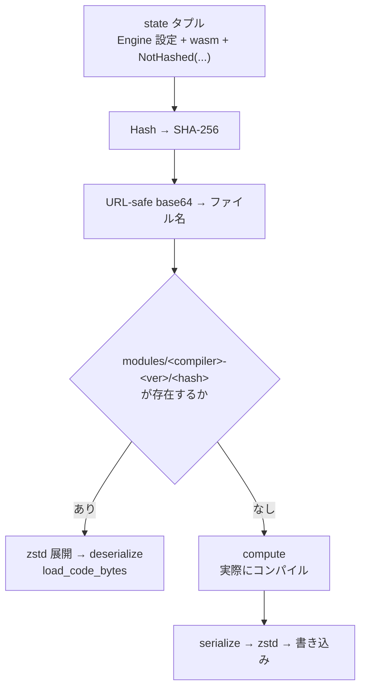

コンパイルキャッシュのバグは、他のキャッシュのバグより厄介だ。**キーが不足しているとき、返ってくるのは古いデータではなく「別の設定でコンパイルされた機械語」**になる。それは動くかもしれないし、静かに壊れるかもしれない。

Wasmtime のキャッシュ実装が神経を使っているのは、まさにこの「キーに何を入れ忘れないか」という一点だ。

## キーの構成

キャッシュを引く箇所は、コード全体で 1 か所しかない。

```rust title="crates/wasmtime/src/compile/runtime.rs"
            let state = (
                crate::compile::HashedEngineCompileEnv(self.engine),
                &wasm,
                &dwarf_package,
                &unsafe_intrinsics_import,
                // Don't hash this as it's just its own "pure" function pointer.
                NotHashed(build_artifacts),
                // Don't hash the FinishedObject state: this contains
                // things like required runtime alignment, and does
                // not impact the compilation result itself.
                NotHashed(state),
            );
```

[crates/wasmtime/src/compile/runtime.rs](https://github.com/bytecodealliance/wasmtime/blob/d8a0da6d661605713798c1c9c76be5c28e3159ff/crates/wasmtime/src/compile/runtime.rs)

このタプルをまるごと `Hash` して SHA-256 を取り、それがキャッシュファイル名になる。エンジン側の寄与は `HashedEngineCompileEnv` にまとまっている。

```rust title="crates/wasmtime/src/compile/code_builder.rs"
/// The hash computed for this structure is used to key the global wasmtime
/// cache and dictates whether artifacts are reused. Consequently the contents
/// of this hash dictate when artifacts are or aren't re-used.
pub struct HashedEngineCompileEnv<'a>(pub &'a Engine);

impl std::hash::Hash for HashedEngineCompileEnv<'_> {
    fn hash<H: std::hash::Hasher>(&self, hasher: &mut H) {
        // Hash the compiler's state based on its target and configuration.
        if let Some(compiler) = self.0.compiler() {
            compiler.triple().hash(hasher);
            compiler.flags().hash(hasher);
            compiler.isa_flags().hash(hasher);
        }

        // Hash configuration state read for compilation
        let config = self.0.config();
        self.0.tunables().hash(hasher);
        self.0.features().hash(hasher);
        config.wmemcheck.hash(hasher);

        // Catch accidental bugs of reusing across crate versions.
        config.module_version.hash(hasher);
    }
}
```

顔ぶれは [Tunables を全フィールド分割代入して、互換性の判断漏れを防ぐ](../tunables-compat/) で見た AOT の互換性判定とほぼ同じだ。ターゲット、コンパイラのフラグ、`Tunables`、有効な Wasm proposal。**「AOT 成果物を再利用してよい条件」と「キャッシュを再利用してよい条件」は同じもの**なので、これは当然そうなる。

`Tunables` が `Hash` を導出しているのは、この用途のためでもある。定義側のマクロで `Hash + Serialize + Deserialize` をまとめて付けており、それがキャッシュキーと `.cwasm` の互換性チェックの両方に効いている。

## 「ハッシュしない」を型で表す

タプルの後ろ 2 つには `NotHashed` というラッパが被っている。実装はこれだけだ。

```rust title="crates/wasmtime/src/compile/runtime.rs"
            struct NotHashed<T>(T);

            impl<T> std::hash::Hash for NotHashed<T> {
                fn hash<H: std::hash::Hasher>(&self, _hasher: &mut H) {}
            }
```

`Hash` を空実装するだけの型で、タプルに入れても何も寄与しない。単にタプルから外せばよさそうだが、そうしない理由がある。**この 2 つの値はコールバックの引数として必要**だからだ。`get_data_raw` は `state` を受け取ってそのままコールバックに渡すので、渡したい値はすべてタプルに入れなければならない。

そこで「渡すが、ハッシュには寄与しない」を型で表す。しかも 2 か所とも、なぜ寄与させないのかがコメントで説明されている。片方は「純粋な関数ポインタなので」、もう片方は「実行時のアラインメント要求などを持つが、コンパイル結果そのものには影響しない」。

## コールバックはクロージャであってはならない

キャッシュ API の署名に、この実装で最も鋭い判断が現れている。

```rust title="crates/cache/src/lib.rs"
    pub fn get_data_raw<T, U, E>(
        &self,
        state: &T,
        // NOTE: These are function pointers instead of closures so that they
        // don't accidentally close over something not accounted in the cache.
        compute: fn(&T) -> Result<U, E>,
        serialize: fn(&T, &U) -> Option<Vec<u8>>,
        deserialize: fn(&T, Vec<u8>) -> Option<U>,
    ) -> Result<U, E>
    where
        T: Hash,
```

[crates/cache/src/lib.rs](https://github.com/bytecodealliance/wasmtime/blob/d8a0da6d661605713798c1c9c76be5c28e3159ff/crates/cache/src/lib.rs)

`impl Fn(...)` ではなく `fn(...)` になっている。**関数ポインタはキャプチャを持てない**ので、コールバックが参照できるのは引数の `state` だけになる。

これが防いでいる事故は具体的だ。クロージャを許すと、こう書ける。

```rust
let my_option = compute_something();
cache.get_data_raw(&state, |s| build(s, my_option), ..., ...);
```

`my_option` はコンパイル結果を左右するのに、`state` には入っていないのでハッシュされない。結果として、`my_option` が違う 2 回の呼び出しが同じキャッシュエントリを共有する。しかもこのバグは、キャッシュが効いたときにしか顕在化しない。

関数ポインタに縛れば、この書き方はコンパイルを通らない。**「ハッシュしていない値をコールバックが見る」ことが型レベルで不可能になる。** 引数の `state` はハッシュされることが `T: Hash` で保証されているので、コールバックが見られるものはすべてキーに入っている。

代償として、渡したい値は全部タプルに詰めなければならず、そのせいで `NotHashed` が必要になる。制約を先に置いて、そこから逃げる手段を明示的に用意する、という順序になっている。

## キャッシュディレクトリに mtime を混ぜる

キーの最後の要素はファイル名ではなくディレクトリ名にある。

```rust title="crates/cache/src/lib.rs"
        // For git builds (see `build.rs`), include the executable's mtime so
        // successive local rebuilds don't share cached compilations from prior
        // source states. crates.io builds rely on `COMPILER_VERSION` alone,
        // which is stable across rebuilds.
        let maybe_mtime = {
            if env!("USE_MTIME") == "true" {
                fn self_mtime() -> Option<String> {
                    let path = std::env::current_exe().ok()?;
                    let metadata = path.metadata().ok()?;
                    let mtime = metadata.modified().ok()?;
                    // ...
                }
                self_mtime().unwrap_or_else(|| "-no-mtime".to_string())
            } else {
                String::new()
            }
        };
        let compiler_dir = format!(
            "{comp_name}-{comp_ver}{maybe_mtime}",
            comp_name = compiler_name,
            comp_ver = env!("COMPILER_VERSION"),
        );
```

キャッシュのパスは `modules/<compiler>-<COMPILER_VERSION>[-<mtime>]/<hash>` になる。

リリース版なら `COMPILER_VERSION` だけで十分だ。バージョンが同じなら Cranelift も同じなので、生成される機械語も同じになる。ところが**開発中はそうならない**。`COMPILER_VERSION` は git ビルドでも変わらないのに、Cranelift のコードは編集のたびに変わる。同じバージョン文字列で違うコンパイラができてしまう。

そこで git ビルドのときだけ、Wasmtime 自身の実行ファイルの更新時刻をディレクトリ名に混ぜる。ビルドし直せば mtime が変わり、キャッシュディレクトリが別になる。**「バージョン番号は同一性の代理でしかない」という前提が崩れる場所を特定して、そこだけ別の代理に切り替えている。**

## キャッシュを引く経路

全体の流れは短い。



ハッシュは URL-safe な base64 に変換される。標準の base64 が使う `/` はファイル名に使えないからだ。中身は zstd で圧縮される。

そして `deserialize` に失敗したら、黙って `compute` に落ちる。キャッシュエントリが壊れていても、古い Wasmtime が書いたものでも、結果は「少し遅い」だけで済む。これは [Module::deserialize はなぜ unsafe なのか](../deserialize-unsafe/) で見る「バージョン違いの入力は決定論的かつ安全に `Err` になる」という保証があってはじめて成立する設計で、キャッシュ層とデシリアライズ層の契約が噛み合っている。

## どう活かすか

キャッシュのキー設計で本当に難しいのは、キーに何を入れるかを決めることではなく、**入れ忘れを将来にわたって防ぐこと**だ。設定は増えるし、コードは書き換わる。

Wasmtime が取った手は 3 つとも、人間の注意力ではなく構造に頼っている。コールバックを関数ポインタに縛って「キーに入っていない値を見る」ことを不可能にする。除外は `NotHashed` という型で明示させ、理由を書く場所を作る。バージョン番号が同一性を保証しない状況（ローカルビルド）を特定して、そこだけ別の指標に切り替える。

どれも、その気になれば「気をつける」で済ませられる項目だ。済ませなかったところに、このコードの性格が出ている。
