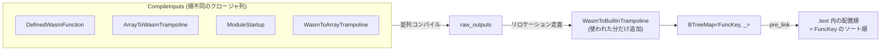

`(module (func (export "add") ...))` という関数 1 つのモジュールをコンパイルすると、生成されるコードは 1 つではない。**Wasm 関数の本体、それを host から呼ぶための array-to-wasm トランポリン、そのシグネチャに対応する wasm-to-array トランポリン**、そして必要ならモジュール初期化関数と builtin トランポリンが作られる。しかもこれらは特別扱いされず、Wasm 関数とまったく同じキューに、同じ形のクロージャとして積まれる。

## 積むのはクロージャ

コンパイル対象のリストは `CompileInputs` で、中身は `Vec<Box<dyn FnOnce(&dyn Compiler) -> Result<CompileOutput>>>` でしかない。

```rust title="crates/wasmtime/src/compile.rs"
type CompileInput<'a> = Box<dyn FnOnce(&dyn Compiler) -> Result<CompileOutput<'a>> + Send + 'a>;

struct CompileOutput<'a> {
    key: FuncKey,
    symbol: String,
    function: CompiledFunctionBody,
    start_srcloc: FilePos,

    // Only present when `self.key` is a `FuncKey::DefinedWasmFunction(..)`.
    translation: Option<&'a ModuleTranslation<'a>>,

    // Only present when `self.key` is a `FuncKey::DefinedWasmFunction(..)`.
    func_body: Option<wasmparser::FunctionBody<'a>>,
}
```

[crates/wasmtime/src/compile.rs#L263-L277](https://github.com/bytecodealliance/wasmtime/blob/d8a0da6d661605713798c1c9c76be5c28e3159ff/crates/wasmtime/src/compile.rs#L263-L277)

**「何をコンパイルするか」の違いはクロージャの中に閉じ込められ、外から見ればすべて同じ型になる。** 並列実行する側 (`run_maybe_parallel`) は、それが Wasm 関数なのかトランポリンなのかを知らずに済む。

`collect_inputs_in_translations` がこのキューを埋める。1 つのモジュールに対して積むのは 4 種類だ。

```rust title="crates/wasmtime/src/compile.rs"
for (module, translation, functions) in translations {
    for (def_func_index, func_body_data) in functions {
        self.push_input(move |compiler| {
            let key = FuncKey::DefinedWasmFunction(module, def_func_index);
            // ... compiler.compile_function(...)
        });

        let func_index = translation.module.func_index(def_func_index);
        if translation.module.functions[func_index].is_escaping() {
            self.push_input(move |compiler| {
                let key = FuncKey::ArrayToWasmTrampoline(module, def_func_index);
                // ... compiler.compile_trampoline(...)
            });
        }
    }

    if !translation.module.startup.is_none() {
        for abi in [Abi::Wasm, Abi::Array] {
            self.push_input(move |compiler| {
                let key = FuncKey::ModuleStartup(abi, module);
                // ...
            });
        }
    }
}

let mut trampoline_types_seen = HashSet::new();
for (_func_type_index, trampoline_type_index) in types.trampoline_types() {
    if !trampoline_types_seen.insert(trampoline_type_index) { continue; }
    self.push_input(move |compiler| {
        let key = FuncKey::WasmToArrayTrampoline(trampoline_type_index);
        // ...
    });
}
```

[compile.rs#L467-L588](https://github.com/bytecodealliance/wasmtime/blob/d8a0da6d661605713798c1c9c76be5c28e3159ff/crates/wasmtime/src/compile.rs#L467-L588)

数え方が対象ごとに違うのが要点だ。定義済み Wasm 関数は **関数ごとに 1 つ**。array-to-wasm トランポリンは **escaping な関数ごとに 1 つ** (エクスポートされている、`ref.func` されている、テーブルに入っている、のいずれか)。`ModuleStartup` は **ABI ごとに 1 つずつ、モジュールに最大 2 つ**。wasm-to-array トランポリンは関数ごとではなく **シグネチャごとに 1 つ**で、`HashSet` で明示的に重複を排除している。トランポリンが 3 種類ある理由そのものは [array-call ABI — 全関数が同じ Rust シグネチャになる](../array-call-abi/) で扱う。ここで押さえるのは、**それらがコンパイル単位として Wasm 関数と同列だ**ということだ。

## builtin トランポリンは後から必要な分だけ

5 番目の種類だけは、この時点では積まれない。「メモリを伸ばす」「GC を走らせる」といったランタイム呼び出し (builtin / libcall) のトランポリンは、**全関数のコンパイルが終わってから、実際に参照されたものだけ**を追加でコンパイルする。

```rust title="crates/wasmtime/src/compile.rs"
for output in raw_outputs.iter() {
    for reloc in compiler.compiled_function_relocation_targets(&*output.function.code) {
        match reloc {
            FuncKey::WasmToBuiltinTrampoline(builtin)
            | FuncKey::PatchableToBuiltinTrampoline(builtin) => {
                if builtins.insert(builtin) {
                    new_inputs.push(compile_builtin(reloc));
                }
            }
            _ => {}
        }
    }
}
raw_outputs.extend(engine.run_maybe_parallel(new_inputs, |c| c(compiler))?);
```

[compile.rs#L1028-L1042](https://github.com/bytecodealliance/wasmtime/blob/d8a0da6d661605713798c1c9c76be5c28e3159ff/crates/wasmtime/src/compile.rs#L1028-L1042)

これができるのは、**リロケーションのターゲットが `FuncKey` そのものだから**だ。コード生成時点では「`memory.grow` の呼び先」は未解決のシンボル参照でしかなく、その参照が `FuncKey::WasmToBuiltinTrampoline(...)` として記録されている。コンパイル済みコードを走査してリロケーション先を集めるだけで、「このモジュールが実際に使う builtin の集合」が正確に求まる。前もって全 builtin 分のトランポリンを生成しておくより、生成コードが小さくなる。呼び出し規約の詳細は [libcall はトランポリンと sentinel 返り値で呼ぶ](../libcall-trampoline/)。

## FuncKey — 10 種類を 2 つの u32 に詰める

ここまで全部の主役だった `FuncKey` は、コンパイル対象の種類を表す 10 個のバリアントを持つ enum だ。

```rust title="crates/environ/src/key.rs"
pub enum FuncKey {
    DefinedWasmFunction(StaticModuleIndex, DefinedFuncIndex),
    ArrayToWasmTrampoline(StaticModuleIndex, DefinedFuncIndex),
    WasmToArrayTrampoline(ModuleInternedTypeIndex),
    WasmToBuiltinTrampoline(BuiltinFunctionIndex),
    PulleyHostCall(HostCall),
    PatchableToBuiltinTrampoline(BuiltinFunctionIndex),
    #[cfg(feature = "component-model")]
    ComponentTrampoline(Abi, component::TrampolineIndex),
    #[cfg(feature = "component-model")]
    ResourceDropTrampoline,
    #[cfg(feature = "component-model")]
    UnsafeIntrinsic(Abi, component::UnsafeIntrinsic),
    ModuleStartup(Abi, StaticModuleIndex),
}
```

[crates/environ/src/key.rs#L233-L270](https://github.com/bytecodealliance/wasmtime/blob/d8a0da6d661605713798c1c9c76be5c28e3159ff/crates/environ/src/key.rs#L233-L270)

そしてこの enum は、常に `(FuncKeyNamespace, FuncKeyIndex)` という 2 つの `u32` に可逆変換できる。namespace の上位 4bit が種類のタグ、残り 28bit がモジュールインデックスや ABI などの「第 2 の軸」になる。

```rust title="crates/environ/src/key.rs"
const KIND_BITS: u32 = 4;
const KIND_OFFSET: u32 = 32 - Self::KIND_BITS;
const KIND_MASK: u32 = ((1 << Self::KIND_BITS) - 1) << Self::KIND_OFFSET;
const MODULE_MASK: u32 = !Self::KIND_MASK;
```

[key.rs#L288-L292](https://github.com/bytecodealliance/wasmtime/blob/d8a0da6d661605713798c1c9c76be5c28e3159ff/crates/environ/src/key.rs#L288-L292)

```text
FuncKeyNamespace (u32)              FuncKeyIndex (u32)
+--------+------------------------+ +------------------------------+
| kind   |  module / abi / 0      | |  DefinedFuncIndex や型 index |
| 4 bits |  28 bits               | |  32 bits                     |
+--------+------------------------+ +------------------------------+
```

この 2 ワードという形が効いてくるのは、Cranelift の IR に載せるときだ。CLIF の外部シンボル参照は `UserExternalName { namespace: u32, index: u32 }` という、まさに 2 つの `u32` を持つ型になっている。

```rust title="crates/cranelift/src/compiler.rs"
fn key_to_name(key: FuncKey) -> ir::UserFuncName {
    let (namespace, index) = key.into_raw_parts();
    ir::UserFuncName::User(ir::UserExternalName { namespace, index })
}
```

[crates/cranelift/src/compiler.rs#L1921-L1924](https://github.com/bytecodealliance/wasmtime/blob/d8a0da6d661605713798c1c9c76be5c28e3159ff/crates/cranelift/src/compiler.rs#L1921-L1924)

**`FuncKey` は 1 つの型で 4 つの役割を兼ねている。** (1) コンパイルキューのエントリの識別子、(2) CLIF 上の未解決シンボルとリロケーションのターゲット、(3) 人間が読むシンボル名の材料 (`wasm[0]::function[3]::add` のような文字列を作る)、(4) 実行時に「この関数の機械語はどこか」を引く `CompiledFunctionsTable` の検索キー。(4) は順序に依存していて、キーは必ずソート順に push されねばならず、種類によって稠密なら添字計算、疎なら二分探索で引かれる ([module_artifacts.rs#L404-L425](https://github.com/bytecodealliance/wasmtime/blob/d8a0da6d661605713798c1c9c76be5c28e3159ff/crates/environ/src/module_artifacts.rs#L404-L425))。

## そして 5 番目の役割 — ELF 内の配置順

`pre_link` は `BTreeMap<FuncKey, CompileOutput>` を単純に走査して平坦なリストを作る。それだけの関数だが、コメントが長い。

```rust title="crates/wasmtime/src/compile.rs"
// We must ensure that `compiled_funcs` contains the function bodies
// sorted by their `FuncKey`, as `CompiledFunctionsTable` relies on that
// property.
//
// Furthermore, note that, because the order functions end up in
// `compiled_funcs` is the order they will ultimately be laid out inside
// the object file, we will group all trampolines together, all defined
// Wasm functions from the same module together, and etc... This is a
// nice property, because it means that (a) cold functions, like builtin
// trampolines, are not interspersed between hot Wasm functions, and (b)
// Wasm functions that are likely to call each other (i.e. are in the
// same module together) are grouped together.
let mut compiled_funcs = vec![];
```

[compile.rs#L1051-L1074](https://github.com/bytecodealliance/wasmtime/blob/d8a0da6d661605713798c1c9c76be5c28e3159ff/crates/wasmtime/src/compile.rs#L1051-L1074)

**Wasmtime には明示的なコードレイアウト最適化パスがない。** ホット/コールドの分離も、呼び合う関数を近づける配置も、専用のパスがやっているのではない。`FuncKey` の `Ord` 実装 (上位 4bit の種類タグが最上位ビットに来るように詰めた raw parts の比較) がそのまま `BTreeMap` の走査順になり、それがそのまま `.text` セクション内のバイト位置になる。**エンコーディングの設計が、副作用としてバイナリ内の局所性を決めている。**

種類タグの割り当てを見ると、`DefinedWasmFunction = 0b0000` が最小なので Wasm 関数が `.text` の先頭に固まり、その後にトランポリン類が続く。同じモジュールの関数同士は namespace の下位 28bit (モジュールインデックス) が同じなので隣接する。狙いどおりの並びになる。



## ModuleStartup — 6 段階を 1 つの関数にまとめる

コンパイル対象の 1 つとして出てきた `ModuleStartup` は、インスタンス化時に走る初期化処理をコンパイル済みの Wasm 関数として持つものだ。中身は 6 段階になっている。

```rust title="crates/cranelift/src/func_environ.rs"
pub fn translate_module_startup(&mut self, builder: &mut FunctionBuilder) -> WasmResult<()> {
    for (i, expr) in self.translation.global_initializers.iter() {
        self.module_initialize_global(builder, *i, expr)?;
    }
    for (i, exprs) in self.translation.passive_elements.iter() {
        self.module_initialize_passive_element(builder, i, exprs)?;
    }
    for (i, init) in self.translation.table_initialization.initial_values.iter() {
        match init {
            TableInitialValue::Null => {}
            TableInitialValue::Expr(expr) => {
                self.module_initialize_table_with_fill(builder, i, expr)?;
            }
        }
    }
    for segment in self.translation.table_initialization.segments.iter() {
        self.module_initialize_table_with_segment(builder, segment)?;
    }
    match &self.translation.memory_init {
        MemoryInit::Unprocessed(_) => unreachable!(),
        MemoryInit::Processed(segments) => {
            for (memory, offset, data) in segments.iter() {
                self.module_initialize_memory_segment(builder, *memory, offset, *data)?;
            }
        }
    }
    if let Some(i) = self.translation.start_func {
        self.module_start(builder, i)?;
    }
    Ok(())
}
```

[crates/cranelift/src/func_environ.rs#L5847-L5876](https://github.com/bytecodealliance/wasmtime/blob/d8a0da6d661605713798c1c9c76be5c28e3159ff/crates/cranelift/src/func_environ.rs#L5847-L5876)

「複雑な」グローバル初期化子 → passive 要素セグメント → テーブルの初期値 fill → テーブルのアクティブセグメント → メモリのアクティブセグメント → `start` 関数。**インスタンス化時にインタプリタで初期化子を評価する代わりに、初期化そのものをコンパイルしてしまう。**

そして startup が必要かどうかの記録が 3 状態になっている。

```rust title="crates/environ/src/module.rs"
pub enum ModuleStartup {
    None,
    Always(EngineOrModuleTypeIndex),
    /// Startup is only required if some linear memory within this module, at
    /// runtime, says `needs_init() == true`.
    ///
    /// This special mode of startup indicates that the startup function has no
    /// purpose other than to initialize the initial contents of
    /// `MemoryInitialization::Static` linear memories. In this situation if all
    /// memories say `needs_init() == false` then the startup function won't
    /// actually do anything meaning that it can be optimized slightly by
    /// skipping it entirely.
    IfMemoriesNeedInit(EngineOrModuleTypeIndex),
}
```

[crates/environ/src/module.rs#L810-L830](https://github.com/bytecodealliance/wasmtime/blob/d8a0da6d661605713798c1c9c76be5c28e3159ff/crates/environ/src/module.rs#L810-L830)

`IfMemoriesNeedInit` は「startup 関数の仕事がメモリの初期内容の書き込みしかない」ケースだ。[copy-on-write でインスタンス化を速くする](../cow-instantiation/) が効いて全メモリが CoW イメージで用意できたなら、`needs_init()` が全部 `false` になり、**startup 関数の呼び出し自体を丸ごと飛ばせる**。`Always` と `None` の間にこの中間状態を置いたことで、「コンパイル時には分からないが実行時には安く判定できる」条件を最適化に使えるようになっている。

## どう活かすか

`FuncKey` の設計から取れるものが 2 つある。1 つは、**識別子を「タグ + ペイロード」の固定幅にエンコードしておくと、後から現れる用途 (シンボル名、リロケーション、検索表) にそのまま流用できる**こと。もう 1 つは、**その識別子に順序を与えておくと、順序を意識した最適化パスを書かずに済むことがある**ことだ。`pre_link` は 30 行程度のただの走査だが、レイアウト最適化として機能している。順序の設計を前倒しにしたぶん、後段が単純になっている。
