`Module::new(&engine, wasm)` が返るまでにバイト列が通る道は、大きく 5 段階ある。**パースと検証** (セクション単位で逐次)、**コンパイル対象の収集**、**関数単位の並列コード生成**、**ELF への平坦化とリロケーション解決**、そして **mmap を read-execute に切り替える publish**。この群の 5 ページはこの経路を分担して扱う。ここではその地図を引く。

## 設計者が書いた 4 行の要約

このパイプラインの骨格は、オーケストレーションを担うモジュールの冒頭コメントにそのまま書かれている。

```rust title="crates/wasmtime/src/compile.rs"
//! Wasm compilation orchestration.
//!
//! It works roughly like this:
//!
//! * We walk over the Wasm module/component and make a list of all the things
//!   we need to compile. This is a `CompileInputs`.
//!
//! * The `CompileInputs::compile` method compiles each of these in parallel,
//!   producing a `UnlinkedCompileOutputs`. This is an unlinked set of compiled
//!   functions, bucketed by type of function.
//!
//! * The `UnlinkedCompileOutputs::pre_link` method re-arranges the compiled
//!   functions into a flat list. This is the order we will place them within
//!   the ELF file, so we must also keep track of all the functions' indices
//!   within this list, because we will need them for resolving
//!   relocations. These indices are kept track of in the resulting
//!   `FunctionIndices`.
//!
//! * The `FunctionIndices::link_and_append_code` method appends the functions
//!   to the given ELF file and resolves relocations. It produces an `Artifacts`
//!   which contains the data needed at runtime to find and call Wasm
//!   functions.
```

[crates/wasmtime/src/compile.rs](https://github.com/bytecodealliance/wasmtime/blob/d8a0da6d661605713798c1c9c76be5c28e3159ff/crates/wasmtime/src/compile.rs#L1-L23)

型の名前がそのまま段階の名前になっている。`CompileInputs` (何を作るかのリスト) → `UnlinkedCompileOutputs` (作ったが繋がっていないコード) → `FunctionIndices` (ELF 内での並び順) → `Artifacts` (実行時に必要なメタデータ)。

入口は `build_module_artifacts` で、上の 4 段階がほぼそのままの順で並んでいる。

```rust title="crates/wasmtime/src/compile.rs"
let mut translation = ModuleEnvironment::new(tunables, &mut validator, &mut types, StaticModuleIndex::from_u32(0))
    .translate(parser, wasm)
    .context("failed to parse WebAssembly module")?;
prepare_translation(engine, compiler, &mut translation, &mut types);
let functions = mem::take(&mut translation.function_body_inputs);

let compile_inputs = CompileInputs::for_module(&types, &translation, functions);
let unlinked_compile_outputs = compile_inputs.compile(engine, &types)?;
let PreLinkOutput { needs_gc_heap, compiled_funcs, indices } = unlinked_compile_outputs.pre_link();
// ...
let (mut object, compilation_artifacts) = indices.link_and_append_code(
    object, engine, compiled_funcs, std::iter::once(translation).collect(), dwarf_package,
)?;
```

[compile.rs#L61-L131](https://github.com/bytecodealliance/wasmtime/blob/d8a0da6d661605713798c1c9c76be5c28e3159ff/crates/wasmtime/src/compile.rs#L61-L131)

`docs/contributing-architecture.md` の "Compiling a module" 節はこれを 4 フェーズとして説明していて、フェーズ 1 が「関数本体以外をすべて検証する同期的なパス」、フェーズ 2 が「並列に関数を検証しコンパイルする」、フェーズ 3 が「結果を ELF イメージに織り込む (この時点ではまだ実行できない)」、フェーズ 4 が「mmap して read/write から read/execute へ切り替える」となっている。

## データ構造の変遷

同じバイト列が、担当 crate を跨ぐたびに表現を変えていく。

```mermaid
flowchart LR
    A["wasm バイト列"]
    B["FunctionBodyData<br/>本体は未検証のまま保持"]
    C["ir::Function<br/>(CLIF)"]
    D["VCode<br/>仮想レジスタの機械語"]
    E["MachBufferFinalized<br/>確定したバイト列"]
    F["ELF オブジェクト<br/>.text + メタデータ"]
    G["MmapVec"]
    H["CodeMemory<br/>RX"]
    A -->|wasmparser<br/>wasmtime-environ| B
    B -->|wasmtime-cranelift| C
    C -->|cranelift-codegen| D
    D -->|regalloc2 + emit| E
    E -->|object crate| F
    F -->|wasmtime| G
    G -->|publish| H
```



`FunctionBodyData` から `ir::Function` までが「Wasm → CLIF」([スタックマシンから SSA へ](../wasm-to-clif/))、`ir::Function` から `MachBufferFinalized` までが Cranelift の中身 ([逆順 1 スキャンの lowering と、MachBuffer の island](../lowering-and-machbuffer/)) で、この群が扱うのはその外側にある。

## コンパイル前に走る 2 つの前処理

`ModuleEnvironment::translate` の直後に呼ばれる `prepare_translation` は、パースの結果を「コンパイルしやすい形」に整形する。中身は 2 つだけだ。

```rust title="crates/wasmtime/src/compile.rs"
fn prepare_translation(...) {
    // If configured attempt to use static memory initialization
    // which can either at runtime be implemented as a single memcpy
    // to initialize memory or otherwise enabling
    // virtual-memory-tricks such as mmap'ing from a file to get
    // copy-on-write.
    let align = compiler.page_size_align();
    let max_always_allowed = engine.config().memory_guaranteed_dense_image_size;
    translation.finalize_memory_init(engine.tunables(), align, max_always_allowed, types);

    // Attempt to convert table initializer segments to FuncTable
    // representation where possible, to enable table lazy init.
    translation.finalize_table_init(engine.tunables(), types);
}
```

[compile.rs#L243-L260](https://github.com/bytecodealliance/wasmtime/blob/d8a0da6d661605713798c1c9c76be5c28e3159ff/crates/wasmtime/src/compile.rs#L243-L260)

どちらも「バラバラのセグメントの列」を「1 枚の完成イメージ」に畳もうとする最適化で、成功すればインスタンス化が劇的に速くなる ([copy-on-write でインスタンス化を速くする](../cow-instantiation/))。興味深いのは、**どちらも「諦める」経路を持っていて、しかも諦める理由が違う**ことだ。

## メモリを畳むのを諦める基準は、率直に暫定である

線形メモリの静的初期化は、データセグメントを全部展開した 1 枚のページ揃えイメージを作る。問題は、`offset 0` と `offset 1GiB` に 4 バイトずつ置くようなモジュールで、素直に作れば 1GiB のイメージができてしまうことだ。判定は 2 条件になっている。

```rust title="crates/environ/src/compile/module_environ.rs"
// If the range of memory being initialized is less than twice the
// total size of the data itself then it's assumed that static
// initialization is ok. This means we'll at most double memory
// consumption during the memory image creation process, which is
// currently assumed to "probably be ok" but this will likely need
// tweaks over time.
if image_size < info.data_size.saturating_mul(2) {
    continue;
}

// If the memory initialization image is larger than the size of all
// data, then we still allow memory initialization if the image will
// be of a relatively modest size, such as 1MB here.
if image_size < max_image_size_always_allowed {
    continue;
}

// At this point memory initialization is concluded to be too
// expensive to do at compile time so it's entirely deferred to
// happen at runtime.
return;
```

[module_environ.rs#L1391-L1411](https://github.com/bytecodealliance/wasmtime/blob/d8a0da6d661605713798c1c9c76be5c28e3159ff/crates/environ/src/compile/module_environ.rs#L1391-L1411)

**「今のところ『たぶん大丈夫』と仮定しているが、時間とともに調整が要るだろう」と、閾値の根拠のなさをコメントに明記してある。** ヒューリスティクスの正体としては誠実で、後から読む人が「この 2 倍という数字に深い意味がある」と誤解せずに済む。

なお `max_image_size_always_allowed` は `Config::memory_guaranteed_dense_image_size` で、[既定値は 16 MiB](https://github.com/bytecodealliance/wasmtime/blob/d8a0da6d661605713798c1c9c76be5c28e3159ff/crates/wasmtime/src/config.rs#L307) (コード中のコメントの "1MB" は例示であって実際の既定値ではない)。埋め込む側がモジュールの最大ヒープサイズを把握しているなら、ここを引き上げて「常に CoW イメージを得る」と決め打ちできる、という設計になっている。

## テーブルを畳むのを諦める理由は、セマンティクスである

テーブルの静的初期化はもっと厳しい制約に縛られる。ループがセグメントを 1 つずつ舐めていき、適用できないものが 1 つ出た時点で **残り全部を実行時送りにする**。

```rust title="crates/environ/src/compile/module_environ.rs"
// The goal of this loop is to interpret a table segment and apply it
// "statically" to a local table. This will iterate over segments and
// apply them one-by-one to each table.
//
// If any segment can't be applied, however, then this loop exits and
// all remaining segments are placed back into the segment list. This is
// because segments are supposed to be initialized one-at-a-time which
// means that intermediate state is visible with respect to traps. If
// anything isn't statically known to not trap it's pessimistically
// assumed to trap meaning all further segment initializers must be
// applied manually at instantiation time.
while let Some(segment) = segments.peek() {
```

[module_environ.rs#L1563-L1575](https://github.com/bytecodealliance/wasmtime/blob/d8a0da6d661605713798c1c9c76be5c28e3159ff/crates/environ/src/compile/module_environ.rs#L1563-L1575)

これは **最適化がセマンティクスに縛られる典型例**だ。Wasm のアクティブ要素セグメントは順に 1 つずつ適用され、途中でテーブル境界外に出ればトラップする。トラップした時点でそこまでの適用結果はインスタンスに残る (中間状態が観測可能である) から、「3 番目のセグメントがトラップするかもしれない」なら 4 番目以降を先回りして畳み込むことは許されない。だからループは `break` で抜けるだけで、`continue` して次を試すことをしない。実際コード中には「技術的にはこの初期化子はトラップしないので処理を続けられるが、必要になったら将来の最適化に回す」というコメントが 2 か所ある。**正しさのために保守的にしているのではなく、正しさが選択肢を奪っている**。

## 最終段 — ELF を mmap して RX にする

`link_and_append_code` が返す時点で、成果物はメモリ上の ELF イメージ (`MmapVec`) にすぎない。これを実行可能にするのが `CodeMemory::publish()` で、順序に意味がある。

```rust title="crates/wasmtime/src/runtime/code_memory.rs"
// Next freeze the contents of this image by making all of the
// memory readonly. Nothing after this point should ever be modified
// so commit everything. ...
//
// Note that if virtual memory is disabled this is skipped because
// we aren't able to make it readonly, but this is just a
// defense-in-depth measure and isn't required for correctness.
#[cfg(has_virtual_memory)]
if self.mmap.supports_virtual_memory() {
    self.mmap.make_readonly(0..self.mmap.len())?;
}

// Switch the executable portion from readonly to read/execute.
if self.needs_executable {
    // ... make_executable(self.text.clone(), ...)
}

if !self.registered {
    self.register_unwind_info()?;
    #[cfg(feature = "debug-builtins")]
    self.register_debug_image()?;
    self.registered = true;
}
```

[code_memory.rs#L402-L478](https://github.com/bytecodealliance/wasmtime/blob/d8a0da6d661605713798c1c9c76be5c28e3159ff/crates/wasmtime/src/runtime/code_memory.rs#L402-L478)

**まずイメージ全体を read-only にしてから、`.text` だけを read-execute に上げる。** 「これは defense-in-depth の措置であって正しさには必要ない」と明記されている。正しさに必要ないのは、リロケーション解決が終わった後に誰もこのイメージに書かないからだ。それでも書ける状態を残さないのは、W^X を機構として保証しておけばコード書き換えの経路が 1 本減るからで、仮想メモリが使えない環境ではこの手順が丸ごとスキップされる (スキップしても動く) ことが、まさに「正しさには不要」を裏付けている。

さらに一段降りると、mprotect の前後にキャッシュ操作が挟まる。

```rust title="crates/wasmtime/src/runtime/vm/sys/unix/mmap.rs"
// Clear the newly allocated code from cache if the processor requires
// it
//
// Do this before marking the memory as R+X, technically we should be
// able to do it after but there are some CPU's that have had errata
// about doing this with read only memory.
#[cfg(feature = "std")]
unsafe {
    wasmtime_jit_icache_coherence::clear_cache(base, len).context("failed cache clear")?;
}

let flags = MprotectFlags::READ | MprotectFlags::EXEC;
// ...
unsafe { mprotect(base, len, flags)?; }

// Flush any in-flight instructions from the pipeline
#[cfg(feature = "std")]
wasmtime_jit_icache_coherence::pipeline_flush_mt().context("Failed pipeline flush")?;
```

[unix/mmap.rs#L140-L192](https://github.com/bytecodealliance/wasmtime/blob/d8a0da6d661605713798c1c9c76be5c28e3159ff/crates/wasmtime/src/runtime/vm/sys/unix/mmap.rs#L140-L192)

順序は `clear_cache` → `mprotect(READ|EXEC)` → `pipeline_flush_mt` になっている。**icache のクリアを mprotect の前に置くのは、read-only メモリに対して行うと問題のある CPU errata が存在するから**で、これも「理屈上は後でもよいが、実在するハードウェアの都合で前にしてある」という類の判断だ。書き込んだ側の CPU が発行した store が、実行する側の CPU の命令キャッシュに反映される保証がないので、JIT では避けて通れない手順になる。

## この群の残り 4 ページ

- [パースと検証をインターリーブし、関数本体だけ遅延する](../interleaved-validation/) — 上の段階 1。なぜセクションは逐次で、関数本体だけ並列にできるのか。
- [コンパイル対象は「関数」だけではない](../compile-inputs/) — 段階 2。1 モジュールから何個のコードが生成されるのか、`FuncKey` が何を兼ねているのか。
- [並列コンパイルのエラーを、わざと非効率にして決定論にする](../parallel-determinism/) — 段階 3 の並列化と、そこで捨てたもの。
- [モジュールを跨いでインライン化し、呼び出しグラフを層に切る](../inlining-strata/) — 段階 3 に後から入ったインライン化パスと、それが `Compiler` トレイトの形を変えた話。

生成された機械語が実際に何を守っているかは [境界チェックを「消す」ための条件を数式で追う](../bounds-check-elision/) 以降、`publish` されたコードが触るメモリの実装は [4GiB 予約と 32MiB ガードの配置](../memory-layout/) 以降で扱う。
