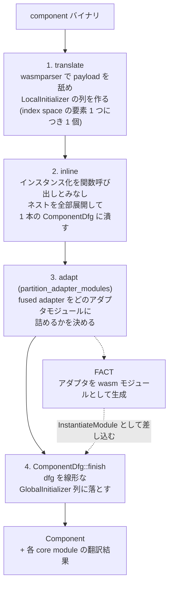

## 4 段階

core wasm のコンパイルは「パース → 検証 → CLIF → 機械語」という素直な流れだった ([Wasm バイナリから実行可能コードまでの 5 段階](../compile-pipeline/))。component ではその前に、component 固有の 4 段階が入る。全体を統括しているのは `Translator::translate` 1 つで、各段の意図がコメントとして本文に書かれている。



```rust title="crates/environ/src/component/translate.rs"
// First up wasmparser is used to actually perform the translation and
// validation of this component. ...
loop {
    let payload = /* ... */;
    match self.translate_payload(payload, component)? { /* ... */ }
}

// ... after translation initially finishes the next pass is performed
// which we're calling "inlining". This will "instantiate" the root
// component, following nested component instantiations, creating a
// global list of initializers along the way. This phase uses the simple
// initializers in each component to track dataflow of host imports and
// internal references to items throughout a component at compile-time.
// The produce initializers in the final `Component` are intended to be
// much simpler than the original component and more efficient for
// Wasmtime to process at runtime as well (e.g. no string lookups as
// most everything is done through indices instead).
let mut component = inline::run(
    self.types.types_mut_for_inlining(),
    &self.result,
    &self.static_modules,
    &self.static_components,
)?;

self.partition_adapter_modules(&mut component);

let translation =
    component.finish(self.types.types_mut_for_inlining(), self.result.types_ref())?;

self.analyze_imports(&translation);

Ok((translation, self.static_modules))
```

[crates/environ/src/component/translate.rs](https://github.com/bytecodealliance/wasmtime/blob/d8a0da6d661605713798c1c9c76be5c28e3159ff/crates/environ/src/component/translate.rs#L499-L555)

返り値が `(ComponentTranslation, PrimaryMap<StaticModuleIndex, ModuleTranslation>)` になっているのは、**component の中から見つかった core module を外に出して並列コンパイルさせるため**だ。component の翻訳自体は単一スレッドだが、その中の core module のコンパイルは既存の並列パイプラインに乗る ([並列コンパイルのエラーを、わざと非効率にして決定論にする](../parallel-determinism/))。

## 1 段目 — index space の要素 1 つにつき 1 initializer

最初の段は `wasmparser` の payload を順に処理して `LocalInitializer` の列を作る。

```rust title="crates/environ/src/component/translate.rs"
// NB: the type information contained in `LocalInitializer` should always point
// to `wasmparser`'s type information, not Wasmtime's. Component types cannot be
// fully determined due to resources until instantiations are known which is
// tracked during the inlining phase.
enum LocalInitializer<'data> {
    Import(ComponentExternName<'data>, ComponentEntityType),
    Lower { func: ComponentFuncIndex, lower_ty: ComponentFuncTypeId, options: LocalCanonicalOptions },
    Lift(ComponentFuncTypeId, FuncIndex, LocalCanonicalOptions),
    Resource(AliasableResourceId, WasmValType, Option<FuncIndex>),
    // ...
    AliasModule(ClosedOverModule),
    AliasComponent(ClosedOverComponent),
    Export(ComponentItem),
}
```

[crates/environ/src/component/translate.rs](https://github.com/bytecodealliance/wasmtime/blob/d8a0da6d661605713798c1c9c76be5c28e3159ff/crates/environ/src/component/translate.rs#L172-L379)

**この段階では型情報が Wasmtime のものではなく `wasmparser` のものを指す**という注意書きが冒頭に付いている。理由は resource で、「component の型は resource のせいでインスタンス化が判明するまで完全には決まらない」。同じ WIT の `resource bar` でも、どの component インスタンスがそれを定義するかで実行時の型が変わる。だから型の確定は次の inline 段まで持ち越される。

## ネストと outer alias

component は任意にネストでき、内側の component は外側の module や component を `alias outer` で参照できる。この解決は 1 段目で行われ、`LexicalScope` のスタックで管理される。

```rust title="crates/environ/src/component/translate.rs"
/// (component $A (core module $M) (component $B (component $C
///     (alias outer $A $M (core module)) )))
///
/// here the `C` component is closing over `M` located in the root component
/// `A`. When `C` is being translated the `lexical_scopes` field will look like
/// `[A, B]`. When the alias is encountered (for module index 0) this will
/// place a `ClosedOverModule::Local(0)` entry into the `closure_args` field of
/// `A`'s frame. This will in turn give a `ModuleUpvarIndex` which is then
/// inserted into `closure_args` in `B`'s frame. This produces yet another
/// `ModuleUpvarIndex` which is finally inserted into `C`'s module index space
/// via `LocalInitializer::AliasModuleUpvar` with the last index.
///
/// Effectively the scopes are managed hierarchically where a reference to an
/// outer variable automatically injects references into all parents up to
/// where the reference is.
struct LexicalScope<'data> {
    parser: Parser,
    translation: Translation<'data>,
    closure_args: ClosedOverVars,
}
```

[crates/environ/src/component/translate.rs](https://github.com/bytecodealliance/wasmtime/blob/d8a0da6d661605713798c1c9c76be5c28e3159ff/crates/environ/src/component/translate.rs#L90-L131)

`ClosedOverModule` は `Local` と `Upvar` の 2 種類で、**「外側 n 段の参照」を「1 段ずつ親フレームへ注入する」形に分解する**。クロージャの自由変数を捕捉するのと同じ構造だ。そしてこの upvar の解決は全部コンパイル時に済み、実行時には残らない。

## 2 段目 — インライン展開に「ヒューリスティクスがない」

2 段目の `inline` が component 翻訳の中心にある。モジュール冒頭の doc がこの段の考え方を説明している。

```rust title="crates/environ/src/component/translate/inline.rs"
//! The "inlining" portion of the name of this module indicates how the
//! instantiation of a component is interpreted as calling a function. The
//! function's arguments are the imports provided to the instantiation of a
//! component, and further nested function calls happen on a stack when a
//! nested component is instantiated. The inlining then refers to how this
//! stack of instantiations is flattened to one list of `GlobalInitializer`
//! entries to represent the process of instantiating a component graph,
//! similar to how function inlining removes call instructions and creates one
//! giant function for a call graph. Here there are no inlining heuristics or
//! anything like that, we simply inline everything into the root component's
//! list of initializers.
```

[crates/environ/src/component/translate/inline.rs](https://github.com/bytecodealliance/wasmtime/blob/d8a0da6d661605713798c1c9c76be5c28e3159ff/crates/environ/src/component/translate/inline.rs#L1-L46)

**「component のインスタンス化を関数呼び出しとみなす」**というのが鍵だ。インスタンス化に渡す import が引数、ネストした component のインスタンス化がネストした関数呼び出し。それをコンパイル時に「解釈」してスタックを畳み、根の component の 1 本の初期化列にする。

そして **「ここには inlining のヒューリスティクスなどはなく、単に全部インライン展開する」**と明記されている。通常のコンパイラのインライン化はコードサイズと速度のトレードオフを見るが ([モジュールを跨いでインライン化し、呼び出しグラフを層に切る](../inlining-strata/))、ここでは判断の余地がない。component の構造は静的に既知で、インスタンス化は実行時にループしたり分岐したりしないからだ。

この段がもう 1 つやるのがデータフロー解析で、「index space の各要素を、相対インデックスではなくその定義そのもので表す」。これによって「どの関数がどの component から lift され、どの component に lower されるか」が全部判明する。**fused adapter を列挙できるのはこの解析の結果**だ。

## `ComponentDfg` がもう 1 段挟まる理由

`inline` の出力は `Component` ではなく `ComponentDfg` という中間表現になる。なぜ 1 段余分に要るのか。

```rust title="crates/environ/src/component/dfg.rs"
//! Currently fused adapters are represented with a core WebAssembly module
//! which gets "injected" into the final component as-if the component already
//! bundled it. In doing so the adapter modules need to be partitioned and
//! inserted into the final sequence of modules to instantiate. While this is
//! possible to do with a flat `GlobalInitializer` list it gets unwieldy really
//! quickly especially when other translation features are added.
//!
//! This module is largely a duplicate of the `component::info` module in this
//! crate. The hierarchy here uses `*Id` types instead of `*Index` types to
//! represent that they don't have any necessary implicit ordering.
```

[crates/environ/src/component/dfg.rs](https://github.com/bytecodealliance/wasmtime/blob/d8a0da6d661605713798c1c9c76be5c28e3159ff/crates/environ/src/component/dfg.rs#L1-L28)

**融合アダプタを「あたかも元から component に入っていたかのように」注入するには、順序を持った平坦なリストでは扱いにくい。** `ComponentDfg` は `*Index` ではなく `*Id` を使う。この命名の違いが「暗黙の順序を持たない」ことを型レベルで表明していて、リストの途中に要素を挿入しても他の参照が壊れない。最後に `finish` で順序を確定させ、以後は編集しない。

## 3 段目 — アダプタモジュールの分割問題

3 段目 `partition_adapter_modules` は「どの fused adapter をどの wasm モジュールに入れるか」を決める。単純に見えて、両極端がどちらも成立しない。

```rust title="crates/environ/src/component/translate/adapt.rs"
//! The first thing you might reach for is to put all the adapters into the same
//! wasm module. This cannot be done, however, because some adapters may depend
//! on other adapters (transitively) to be created. This means that if
//! everything were in the same module there would be no way to instantiate the
//! module. An example of this dependency is an adapter (A) used to create a
//! core wasm instance (M) whose exported memory is then referenced by another
//! adapter (B). In this situation the adapter B cannot be in the same module
//! as adapter A because B needs the memory of M but M is created with A which
//! would otherwise create a circular dependency.
//!
//! The second possibility of organizing adapter modules would be to place each
//! fused adapter into its own module. Each `canon lower` would effectively
//! become a core wasm module instantiation at that point. While this works it's
//! currently believed to be a bit too fine-grained. For example it would mean
//! that importing a dozen lowered functions into a module could possibly result
//! in up to a dozen different adapter modules. While this possibility could
//! work it has been ruled out as "probably too expensive at runtime".
```

[crates/environ/src/component/translate/adapt.rs](https://github.com/bytecodealliance/wasmtime/blob/d8a0da6d661605713798c1c9c76be5c28e3159ff/crates/environ/src/component/translate/adapt.rs#L64-L116)

**全部 1 モジュールにすると循環依存になる。** アダプタ A がインスタンス M を作り、M のエクスポートしたメモリをアダプタ B が使う、という関係がありうるからだ。**1 アダプタ 1 モジュールにすると実行時コストが高すぎる。** 12 個の lowered function を import すれば 12 個のモジュールインスタンス化が走る。

採用されているのは、その間を取った一パスの貪欲法だ。

```rust title="crates/environ/src/component/translate/adapt.rs"
//! Adapters were identified in-order as part of the inlining phase of
//! translation where we're guaranteed that once an adapter is identified
//! it can't depend on anything identified later. The pass implemented here is
//! to visit all transitive dependencies of an adapter. If one of the
//! dependencies of an adapter is an adapter in the current adapter module
//! being built then the current module is finished and a new adapter module is
//! started.
//!
//! There's probably more general algorithms for this but for now this should be
//! fast enough as it's "just" a linear pass.
```

「アダプタは inline 段で順序付きに発見され、後から見つかったものに依存することはない」という不変条件を使う。**依存を辿って現在のモジュール内のアダプタに当たったら、そこで区切って新しいモジュールを始める。** これで依存関係の連鎖がモジュール境界を跨がなくなる。「もっと一般的なアルゴリズムはあるだろうが、線形パスなので今は十分速い」と自己評価まで書いてある。

## 実行時に処理されるのは 7 種類だけ

4 段目の `finish` が出力する `GlobalInitializer` は、これだけしかない。

```rust title="crates/environ/src/component/info.rs"
/// The variants of this enum are processed during the instantiation phase of a
/// component in-order from front-to-back.
//
// FIXME(#2639) if processing this list is ever a bottleneck we could
// theoretically use cranelift to compile an initialization function which
// performs all of these duties for us and skips the overhead of interpreting
// all of these instructions.
pub enum GlobalInitializer {
    InstantiateModule(InstantiateModule, Option<RuntimeComponentInstanceIndex>),
    LowerImport { index: LoweredIndex, import: RuntimeImportIndex },
    ExtractMemory(ExtractMemory),
    ExtractRealloc(ExtractRealloc),
    ExtractCallback(ExtractCallback),
    ExtractPostReturn(ExtractPostReturn),
    ExtractTable(ExtractTable),
    Resource(Resource),
}
```

[crates/environ/src/component/info.rs](https://github.com/bytecodealliance/wasmtime/blob/d8a0da6d661605713798c1c9c76be5c28e3159ff/crates/environ/src/component/info.rs#L227-L304)

`Extract*` が 5 つあるが、やっていることは同じ「core instance の export から何かを取り出して `VMComponentContext` の指定インデックスに保存する」だ。canonical options が指す memory / realloc / callback / post-return / table がここで埋まる。

`WIT` の interface も nested component も resource 型の階層も、ここには一切残らない。**component という構造は全部コンパイル時に消え、残るのは「core module をインスタンス化して、そこから物を取り出して、表に書く」という手続きだけ**になる。

ランタイム側はこれを前から順に解釈する。

```rust title="crates/wasmtime/src/runtime/component/instance.rs"
for initializer in env_component.initializers.iter() {
    match initializer {
        GlobalInitializer::InstantiateModule(m, component_instance) => {
            let imports = match m {
                // Since upvars are statically know we know that the
                // `args` list is already in the right order.
                InstantiateModule::Static(idx, args) => { /* ... */ }
                // With imports, unlike upvars, we need to do runtime
                // lookups with strings to determine the order of the
                // imports since it's whatever the actual module requires.
                InstantiateModule::Import(idx, args) => { /* ... */ }
            };
            let i = unsafe {
                crate::Instance::new_started(store, module, imports.as_ref(), asyncness).await?
            };
            self.instance_mut(store.0).push_instance_id(i.id())?;
        }
        GlobalInitializer::LowerImport { import, index } => { /* ... */ }
        GlobalInitializer::ExtractMemory(mem) => self.extract_memory(store.0, mem),
        // ...
        GlobalInitializer::Resource(r) => self.resource(store.0, r)?,
    }
}
```

[crates/wasmtime/src/runtime/component/instance.rs](https://github.com/bytecodealliance/wasmtime/blob/d8a0da6d661605713798c1c9c76be5c28e3159ff/crates/wasmtime/src/runtime/component/instance.rs#L787-L882)

`InstantiateModule::Static` と `::Import` の違いが、[core module だけでは足りない理由](../why-component/) で見た「文字列探索をコンパイル時に倒す」の実物だ。**component の中に静的に入っているモジュールなら import の順序が既に確定していて、文字列照合が要らない。** ホストから渡されたモジュールのときだけ、実行時に文字列で引く。

そして冒頭の FIXME が「この解釈がボトルネックになるなら Cranelift で初期化関数をコンパイルすればよい」と書いている。**インタプリタ方式のコストを認識した上で、測って遅くなるまでやらないと決めている**わけで、issue 番号 (#2639) 付きで放置されている。

## `VMComponentContext` — core wasm の `VMContext` に対応するもの

初期化列が書き込む先が `VMComponentContext` だ。

```rust title="crates/wasmtime/src/runtime/vm/component.rs"
//! Currently this runtime support includes a `VMComponentContext` which is
//! similar in purpose to `VMContext`. The context is read from
//! cranelift-generated trampolines when entering the host from a wasm module.
//! Eventually it's intended that module-to-module calls, which would be
//! cranelift-compiled adapters, will use this `VMComponentContext` as well.
```

[crates/wasmtime/src/runtime/vm/component.rs](https://github.com/bytecodealliance/wasmtime/blob/d8a0da6d661605713798c1c9c76be5c28e3159ff/crates/wasmtime/src/runtime/vm/component.rs#L1-L7)

役割は `VMContext` と同じで、**生成コードが固定オフセットで触る構造体**だ ([VMContext — JIT コードが固定オフセットで触る構造体](../vmcontext/))。先頭に `VMCOMPONENT_MAGIC` (`b"comp"`) が置かれ、`from_opaque` で照合される。オフセット計算も `VMContext` と同じ仕組みに乗っている。

```rust title="crates/environ/src/component/vmcomponent_offsets.rs"
//! Offsets of the fields within a `VMComponentContext`.
//!
//! The layout itself is not defined here: it is defined once, alongside
//! `VMContext`'s, in `for_each_vmctx_type!`. Everything in this module is either
//! generated from that definition or is an offset that is not simply the offset
//! of one of the layout's fields.
```

[crates/environ/src/component/vmcomponent_offsets.rs](https://github.com/bytecodealliance/wasmtime/blob/d8a0da6d661605713798c1c9c76be5c28e3159ff/crates/environ/src/component/vmcomponent_offsets.rs#L1-L60)

**レイアウトの単一定義源が core wasm と共有されている** ([レイアウトの単一定義源をマクロで作る](../layout-macro/))。`VMComponentOffsets` が持つのは `num_lowerings` / `num_runtime_memories` / `num_runtime_reallocs` などの個数と、そこから計算された各フィールドのオフセットだけだ。

## `may_leave` は wasm の global 1 本

`VMComponentContext` の中に、component インスタンスごとに `may_leave` フラグが置かれる。

```rust title="crates/wasmtime/src/runtime/vm/component.rs"
#[repr(transparent)]
pub struct InstanceFlags(SendSyncPtr<VMGlobalDefinition>);

impl InstanceFlags {
    #[inline]
    pub unsafe fn may_leave(&self) -> bool {
        unsafe { *self.as_raw().as_ref().as_i32() != 0 }
    }

    #[inline]
    pub unsafe fn set_may_leave(&mut self, val: bool) {
        unsafe { *self.as_raw().as_mut().as_i32_mut() = val as i32; }
    }
}
```

[crates/wasmtime/src/runtime/vm/component.rs](https://github.com/bytecodealliance/wasmtime/blob/d8a0da6d661605713798c1c9c76be5c28e3159ff/crates/wasmtime/src/runtime/vm/component.rs#L1048-L1079)

型が `VMGlobalDefinition` であること、つまり **これは「wasm の i32 global 1 本」として実装されている**のが要点だ。だから FACT が生成するアダプタも、Cranelift が生成するトランポリンも、普通の `global.get` / `global.set` でこれを読み書きできる。初期値は `1` (= 許可) で、`ComponentInstance` の初期化時に全インスタンス分が `true` にセットされる。

lowering と post-return の間だけこれを落とすことで、ABI の途中で import を呼ばれることを防ぐ ([lifting と lowering、realloc と post-return](../lifting-lowering/))。**「フラグ 1 本をホストとゲストの両方が同じ表現で読める場所に置く」というのが、この手の相互排他を安く実装する定石になっている。**

再入の側 (`may_enter`) はホスト側の状態として持たれ、こちらは呼び出しスタックを辿ってトップレベルインスタンスの ID を比較する。「仕様上ホストはトップレベルインスタンスへの再帰的な進入を許されない」ので、**ゲスト間のアダプタでは実行時チェックを省ける**、と実装コメントが説明している。

## semver 対応の名前解決

最後に、実行時に残る唯一の文字列照合 — ホストからの import 解決 — を見ておく。`Linker` は名前を semver 込みで扱う。

```rust title="crates/wasmtime/src/runtime/component/linker.rs"
/// Specifically though when names are looked up within a linker, for example
/// during instantiation, semver-compatible names are automatically consulted.
/// This means that if you define `a:b/c@0.2.1` in a [`Linker`] but a component
/// imports `a:b/c@0.2.0` then that import will resolve to the `0.2.1` version.
///
/// This lookup behavior relies on hosts being well-behaved when using Semver,
/// specifically that interfaces once defined are never changed. This reflects
/// how Semver works at the Component Model layer, and it's assumed that if
/// versions are present then hosts are respecting this.
///
/// Note that this behavior goes the other direction, too. If a component
/// imports `a:b/c@0.2.1` and the host has provided `a:b/c@0.2.0` then that
/// will also resolve correctly. This is because if an API was defined at 0.2.0
/// and 0.2.1 then it must be the same API.
```

[crates/wasmtime/src/runtime/component/linker.rs](https://github.com/bytecodealliance/wasmtime/blob/d8a0da6d661605713798c1c9c76be5c28e3159ff/crates/wasmtime/src/runtime/component/linker.rs#L26-L59)

**この解決はホストが semver を正しく運用していることに全面的に依存していて、破られたときの検出手段はない。** 「インターフェースは一度定義されたら変更されない」という前提が明文で書かれている。実際 `a:b/c@0.2.0` と `a:b/c@0.2.1` の中身が違っていても、Wasmtime はそれを検査せず結び付ける。**依存を「信頼の仮定」として文書に書き出しているのが誠実な点**で、これがないと「なぜか古いバージョンの import が通ってしまう」という現象の原因が追えない。

実装は `NameMap` の 2 段引きだ。

```rust title="crates/environ/src/component/names.rs"
pub struct NameMap<K, V> {
    /// A map of keys to the value that they define.
    ///
    /// Note that this map is "exact" ... This map is always consulted first during lookups.
    definitions: TryIndexMap<K, V>,

    /// An auxiliary map tracking semver-compatible names. This is a map from
    /// "semver compatible alternate name" to a name present in `definitions`
    /// and the semver version it was registered at.
    ///
    /// An example map would be:
    ///     "a:b/c@0.2": ("a:b/c@0.2.1", 0.2.1),
    ///     "a:b/c@2": ("a:b/c@2.0.0+abc", 2.0.0+abc),
    ///
    /// The `Version` here is tracked to ensure that when multiple versions on
    /// one track are defined that only the maximal version here is retained.
    alternate_lookups: TryIndexMap<K, (K, TryVersion)>,
}
```

[crates/environ/src/component/names.rs](https://github.com/bytecodealliance/wasmtime/blob/d8a0da6d661605713798c1c9c76be5c28e3159ff/crates/environ/src/component/names.rs#L10-L53)

まず完全一致の `definitions` を引き、なければ「バージョンを丸めたキー」で `alternate_lookups` を引いて実名に辿り着く。丸め方は semver の互換性トラックに従い (`0.2.x` は `0.2` に、`2.x.y` は `2` に)、同じトラックに複数登録されたら最大バージョンだけを残す。`Version` を一緒に持っているのはこの「最大だけ残す」判定のためだ。

`multiversion/root.wit` が `my:dep/a@0.1.0` と `my:dep/a@0.2.0` を同時に import できるのは、この 2 つが別のトラックに落ちるからだ ([WIT を読む — world・interface・resource](../wit/))。

## 持ち帰り

このパイプラインの設計は一貫して **「実行時にやることを減らすためにコンパイル時にやり切る」** で貫かれている。ネストは展開し、upvar は解決し、文字列照合は潰し、型は確定させ、残るのは 7 種類の命令の平坦な列だけ。その代償が [core module だけでは足りない理由](../why-component/) で見た「component を import / export できない」という限界で、**得たものと失ったものが同じコメントに並記されている**のがこのコードベースの特徴だ。
