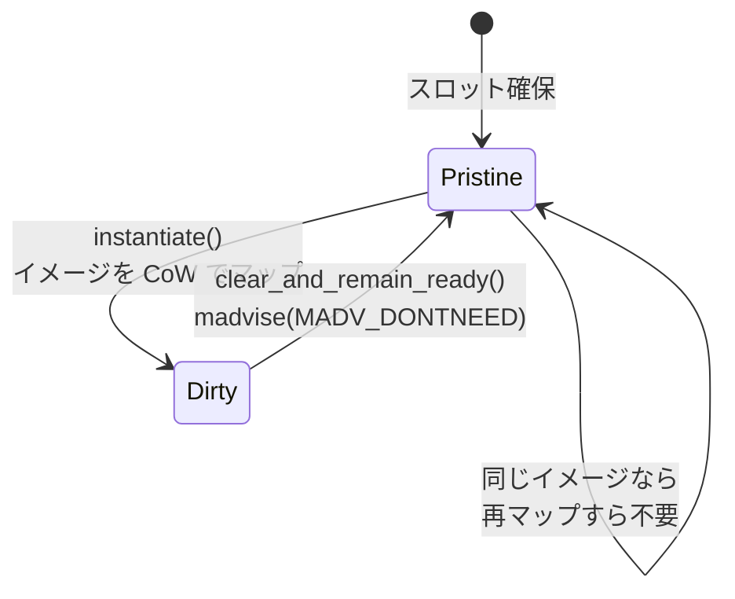

wasm モジュールは、線形メモリの初期内容を data セグメントとして持つ。インスタンス化するたびにこれをメモリへ書き写していると、**起動コストが初期データのサイズに比例する**。同じモジュールを何千回もインスタンス化するなら、この memcpy が支配的になる。

Wasmtime はこれを copy-on-write のマッピングに置き換える。線形メモリの該当範囲を、初期データを持つファイル（あるいは匿名の memfd）に `MAP_PRIVATE` でマップしておく。**読むだけなら物理ページは共有され、コピーは 1 バイトも起きない。** 書き込んだページだけがカーネルによって複製される。

## イメージの出どころは 2 つ

初期データの実体を表すのが `MemoryImage` だ。

```rust title="crates/wasmtime/src/runtime/vm/cow.rs"
/// One backing image for one memory.
pub struct MemoryImage {
    /// The platform-specific source of this image.
    ///
    /// This might be a mapped `*.cwasm` file or on Unix it could also be a
    /// `Memfd` as an anonymous file in memory on Linux. In either case this is
    /// used as the backing-source for the CoW image.
    source: MemoryImageSource,

    /// Length of image, in bytes.
    ///
    /// Note that initial memory size may be larger; leading and trailing zeroes
    /// are truncated (handled by backing fd).
    ///
    /// Must be a multiple of the system page size.
    len: HostAlignedByteCount,

    /// Image starts this many bytes into `source`.
    ///
    /// This is 0 for anonymous-backed memfd files and is the offset of the
    /// data section in a `*.cwasm` file for `*.cwasm`-backed images.
    source_offset: u64,
    // ...
```

[crates/wasmtime/src/runtime/vm/cow.rs](https://github.com/bytecodealliance/wasmtime/blob/d8a0da6d661605713798c1c9c76be5c28e3159ff/crates/wasmtime/src/runtime/vm/cow.rs)

**元が `.cwasm` ファイルなら、そのファイルをそのままマップできる。** [.cwasm は ELF そのものである](../cwasm/) で見たとおり成果物はファイルとして mmap されているので、データセクションの該当オフセットを線形メモリにマップし直すだけでよい。追加のメモリを一切使わない。

ファイルとしての実体がない場合（`Module::new` でバイト列からコンパイルした場合など）は、Linux では `memfd_create` で匿名のファイルを作る。ただしこれは無料ではない。`ModuleInner` が `memory_images` を `OnceLock` で遅延生成しているのは、**`memfd_create` が高価なので、実際に CoW が必要になるまで作らない**ためだ。

先頭と末尾のゼロは切り詰められる。初期データが「先頭 4KiB がゼロ、次の 1KiB にデータ、あとは全部ゼロ」なら、イメージにするのは中央の 1KiB だけでよい。残りは匿名のゼロページで足りる。

## ページ整列できなければ使えない

CoW マッピングはページ単位でしか設定できない。だから data セグメントが**ホストのページ境界に揃った形に畳めるか**が前提条件になる。この判定はコンパイル時に行われ、`finalize_memory_init` が data セグメントをページ整列したイメージに変換しようとする ([Wasm バイナリから実行可能コードまでの 5 段階](../compile-pipeline/))。

問題は、セグメントが飛び飛びに配置されている場合だ。オフセット 0 に 1 バイト、オフセット 1GB に 1 バイト、という極端なモジュールを素直にイメージ化すると、1GB のイメージができてしまう。

そこで判定にヒューリスティックが入る。イメージのサイズが元のデータサイズの 2 倍未満なら「密」とみなして採用する。あるいはイメージが 1MB 未満なら、比率にかかわらず許す。前者に付いたコメントは率直で、**「今のところ『たぶん大丈夫』と仮定しているが、時間とともに調整が要るだろう」**と書かれている。

密でなければ CoW を諦め、従来どおりインスタンス化のたびにセグメントを書き込む方式に落ちる。**最適化が効くかどうかが、モジュールの形に依存する。**

## スロットの状態機械

pooling allocator を使う場合、線形メモリはあらかじめ確保された巨大なスラブのスロットとして貸し出される ([インスタンスアロケータ — 毎回 mmap するか、スロットを貸すか](../instance-allocator/))。そのスロット 1 個分を管理するのが `MemoryImageSlot` で、レイアウトが図で書かれている。

```text title="crates/wasmtime/src/runtime/vm/cow.rs"
///   +--------------------+-------------------+--------------+--------------+
///   |   anonymous        |      optional     |   anonymous  |    PROT_NONE |
///   |     zero           |       memory      |     zero     |     memory   |
///   |    memory          |       image       |    memory    |              |
///   +--------------------+-------------------+--------------+--------------+
///   |                     <------+---------->
///   |<-----+------------>         \
///   |      \                   image.len
///   |       \
///   |  image.linear_memory_offset
///   |
///   \
///  self.base is this virtual address
///
///    <------------------+------------------------------------------------>
///                        \
///                      static_size
///
///    <------------------+---------------------------------->
///                        \
///                      accessible
```

スロットの中央にイメージが CoW でマップされ、その前後は匿名のゼロメモリ、`accessible` の外は `PROT_NONE` になる。

そしてスロットは `dirty` フラグを持つ 2 状態の機械になっている。

```rust title="crates/wasmtime/src/runtime/vm/cow.rs"
    /// Invariant: if !dirty, then this memory slot contains a clean
    /// CoW mapping of `image`, if `Some(..)`, and anonymous-zero
    /// memory beyond the image up to `static_size`. The addresses
    /// from offset 0 to `self.accessible` are R+W and set to zero or the
    /// initial image content, as appropriate. Everything between
    /// `self.accessible` and `self.static_size` is inaccessible.
    dirty: bool,
```

**不変条件が言葉で明示されている。** `dirty` でないスロットは、イメージのきれいな CoW マッピングと、その先の匿名ゼロメモリだけを含む。この状態からしかインスタンス化できない。



スロットの再利用で興味深いのは、**同じモジュールが同じスロットに戻ってきた場合に何も起きない**ことだ。イメージが同じなら、マッピングを張り替える必要がない。これが pooling allocator のスロット affinity が効く理由になっている。

イメージが変わる場合は、古いイメージを匿名ゼロメモリで上書きしてから、新しいイメージをマップし直す。

## MPK との相互作用

`MemoryImageSlot` は保護キーを持つ。

```rust title="crates/wasmtime/src/runtime/vm/cow.rs"
    /// The MPK protection key that this slot's stripe was colored with, if the
    /// pooling allocator is striping memory with protection keys.
    ///
    /// This must be re-applied after every `mmap` performed on this slot, since
    /// `mmap` resets the affected pages back to the default key 0 which is
    /// accessible from every stripe.
    pkey: Option<ProtectionKey>,
```

**`mmap` は保護キーをリセットするが、`mprotect` はしない。** この非対称性が落とし穴になっていて、「mmap のあとは必ずキーを塗り直せ」という規約が呼び出し側に課されている。[メモリ保護キーでガード領域を削る](../mpk/) で見る仕組みは、この規約が守られていることに依存している。

こういう「API の組み合わせに潜む非対称性」は、片方だけをテストしても見つからない。コメントとして残すか、型で表すかしかない。ここではコメントが選ばれている。

## どう活かすか

CoW によるインスタンス化は、**「コピーしない」ではなく「コピーを OS に委ねる」**という発想だ。ページフォルトのハンドリングという既にあるカーネルの機能に、初期化のコストを載せ替えている。

同じ発想は他にも使える。プロセスの fork、コンテナのイメージレイヤ、データベースのスナップショット。共通するのは「多くの読者がいて、書き込むのは一部だけ」という状況だ。

そして Wasmtime の実装が示しているのは、**この最適化が常に効くわけではない**ということでもある。ページ整列できるか、密かどうか、OS が `madvise` で元のマッピングを復元してくれるか ([スロットの状態機械と、madvise が元の CoW を復元すること](../memory-image-slot/))。前提が崩れる場所を特定して、そこでは素直な方式に落とす。その分岐を持つことまで含めて設計になっている。
