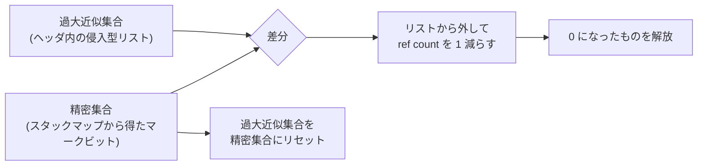

Wasmtime には GC コレクタが 3 つある。DRC (deferred reference counting)、Null、Copying だ。このうち DRC だけが**参照カウント方式なのに `Store::gc` という「GC を走らせる」API を持つ**。ここに「遅延」の意味がある。

そして DRC だけが GC バリアを必要とする。Null と Copying は「バリアが要らない」と冒頭に明記されている。なぜ DRC だけなのか、を最後に見る。

## 最初に断ってあること

ファイルの 2 行目がこれになる。

```rust title="crates/wasmtime/src/runtime/vm/gc/enabled/drc.rs"
//! The deferred reference-counting (DRC) collector.
//!
//! Warning: this ref-counting collector does not have a tracing cycle
//! collector, and therefore cannot collect cycles between GC objects!
```

[crates/wasmtime/src/runtime/vm/gc/enabled/drc.rs](https://github.com/bytecodealliance/wasmtime/blob/d8a0da6d661605713798c1c9c76be5c28e3159ff/crates/wasmtime/src/runtime/vm/gc/enabled/drc.rs#L1-L46)

**参照カウントの古典的な弱点を、隠さず一番目立つ場所に書いてある**。GC オブジェクト同士で循環を作るとリークする。Wasm GC の struct と array は互いを参照できるので、ゲストが `(struct.new $node ...)` を 2 つ作って互いに指させるだけで循環ができる。それは回収されない。

これは実装の手抜きではなく、選択の結果だ。`Config::collector` の doc に 3 コレクタの性質が表で整理されていて、DRC は「ガベージを回収する。ただしサイクルは除く」「レイテンシは良い」「スループットは悪い」となっている。Copying は「サイクルを含めて回収する」代わりに「レイテンシが悪い」。**サイクルを諦める見返りが、停止時間の短さ**という取引になっている。

## ホスト側は素直、wasm 側は遅延

DRC の仕組みは 2 つの世界に分かれる。

ホスト側 (Rust) は普通の参照カウントだ。しかも Rust の所有権のおかげでコストが低い。「`VMGcRef` をムーブしてもその参照カウントは変わらず、借用してもカウントの増加を回避するか、`VMGcRef` がクローンされる時点まで遅延できる。これによって、参照カウントの性能を通常悩ませるスタック上の増減操作の多くを避けられる」。[`VMGcRef` が `Clone` を実装しない](../vmgcref/) のはここに効いていて、複製が必ず明示的な呼び出しになるので、暗黙の増加が発生しない。

問題は wasm 側だ。

```rust title="crates/wasmtime/src/runtime/vm/gc/enabled/drc.rs"
//! When passing a `VMGcRef` into compiled Wasm code, we don't want to do
//! reference count mutations for every compiled `local.{get,set}`, nor for
//! every function call. Therefore, we use a variation of **deferred reference
//! counting**, where we only mutate reference counts when storing `VMGcRef`s
//! somewhere that outlives the Wasm activation: into a global or
//! table. Simultaneously, we over-approximate the set of `VMGcRef`s that are
//! inside Wasm function activations. Periodically, we walk the stack at GC safe
//! points, and use stack map information to precisely identify the set of
//! `VMGcRef`s inside Wasm activations. Then we take the difference between this
//! precise set and our over-approximation, and decrement the reference count
//! for each of the `VMGcRef`s that are in our over-approximation but not in the
//! precise set. Finally, the over-approximation is reset to the precise set.
```

**`local.get` は wasm でもっとも頻繁に実行される命令のひとつだ**。ここに参照カウントの増減を入れると、値をスタックに積むだけの操作がメモリへの読み書きに化ける。関数呼び出しも同じで、引数として参照を渡すたびに増やして、抜けるときに減らすことになる。

だから wasm の activation の中ではカウントを触らないと決める。代わりに **「wasm の activation が参照しているかもしれないものの集合」を過大近似で保持する**。過大近似なので、実際にはもう参照されていないものが入っていてもよい。入っている限りカウントが 1 余分に立っているので、誤って回収されることはない。

そして定期的に、スタックマップから正確な集合を求め、差を取って余分な分だけデクリメントする。



**これが `Store::gc` の正体だ**。`docs/contributing-architecture.md` も同じことを言っている。「参照カウントであるにもかかわらず `Store::gc` メソッドが存在する。これは wasm コードの実行中に参照カウントをどう管理するかの実装詳細である。(中略) `Store::gc` メソッドは、過大に保守的かもしれないリストを、スタック上で実際に使われている値の精密なリストへと強制的に変える」。

つまり `Store::gc` は「ゴミを集める」というより、**「保守的にしておいた記録を、精密なものに作り直す」**操作になっている。

## 集合が 2 つともオブジェクトヘッダの中にある

実装上おもしろいのは、この 2 つの集合が別の配列やハッシュ集合ではなく、**オブジェクトのヘッダの中**にあることだ。

```rust title="crates/wasmtime/src/runtime/vm/gc/enabled/drc.rs"
//! An intrusive, singly-linked list in the object header implements the
//! over-approximated set of `VMGcRef`s referenced by Wasm activations. Calling
//! a Wasm function and passing it a `VMGcRef` inserts the `VMGcRef` into that
//! list if it is not already present, and the compiled Wasm function logically
//! "borrows" the `VMGcRef` from the list. Similarly, `global.get` and
//! `table.get` operations logically clone the gotten `VMGcRef` into that list
//! and then "borrow" the reference out of the list.
```

過大近似集合は**ヘッダ内の侵入型単方向リスト**、精密集合は**ヘッダ内のマークビット**。どちらも [`VMGcHeader` が空けている 26bit の自由領域](../vmgcref/) と、DRC が追加した自前のヘッダフィールドに収まる。追加のメモリ確保が要らないので、リストへの挿入がアロケーションを起こさない。

リストの先頭は `VMDrcHeapDataInner` にあり、これには制約が付いている。

```rust title="crates/wasmtime/src/runtime/vm/gc/enabled/drc.rs"
/// The head of the over-approximated-stack-roots list.
///
/// Note that this is exposed directly to compiled Wasm code through the
/// vmctx, so must not move.
vmctx_data: Box<VMDrcHeapData>,
```

[crates/wasmtime/src/runtime/vm/gc/enabled/drc.rs](https://github.com/bytecodealliance/wasmtime/blob/d8a0da6d661605713798c1c9c76be5c28e3159ff/crates/wasmtime/src/runtime/vm/gc/enabled/drc.rs#L100-L200)

**JIT コードから [vmctx](../vmcontext/) 経由で直接触られるので、動かしてはいけない**。だから `Box` で固定されている。`table.get` のような命令が生成コードの中でこのリストの先頭を読み書きするので、Rust 側の都合で再配置できない。フィールドのオフセットが `wasmtime_environ` 側の定数と一致しているかは、テストで `offset_of!` と突き合わせて確認されている。

差分を取る `sweep` のコメントが、この 2 つの表現をどう照合するかを説明している。

```rust title="crates/wasmtime/src/runtime/vm/gc/enabled/drc.rs"
// * If the mark bit is set, then it is in the precise-stack-roots set
//   and is still on the stack, so we keep it in the
//   over-approximated-stack-roots list and do not modify its ref count.
//
// * If the mark bit is not set, then it is not in the
//   precise-stack-roots set and is no longer on the stack, so we remove
//   it from the over-approximated-stack-roots set and decrement its ref
//   count.
//
// We also clear the mark bits as we do this traversal.
```

**リストを 1 回歩くだけで、差分の計算とリストの更新とマークビットのクリアが同時に終わる**。集合演算のために一時的なハッシュ集合を作る必要がない (デバッグビルドでは整合性検査のために作るが、それは検証用だ)。

同じコメントの末尾に、参照カウントの減少が任意のユーザコードを走らせうるという注意もある。`Drop` の実装が呼ばれるからだ。それでも安全なのは、「このヒープへの `&mut` 借用 (元を辿れば `&mut Store`) を持っているので、再入的にこのヒープに触ったり、このストアで wasm を実行したりするものは何もないと保証されている」から。**Rust の借用が、GC の途中で再入されないことの証明になっている**。

## なぜ DRC だけバリアが要るのか

残る 2 つのコレクタの説明は短い。

```rust title="crates/wasmtime/src/runtime/vm/gc/enabled/null.rs"
//! The null collector.
//!
//! The null collector bump allocates objects until it runs out of space, at
//! which point it returns an out-of-memory error. It never collects garbage.
//! It does not require any GC barriers.
```

```rust title="crates/wasmtime/src/runtime/vm/gc/enabled/copying.rs"
//! The copying (semi-space) garbage collector.
//!
//! This implements a Cheney-style semi-space copying collector. The GC heap is
//! divided into two halves: the "active" semi-space where new objects are
//! allocated, and the "idle" semi-space. During collection, live objects are
//! copied from the idle space (which was the previous active space) to the new
//! active space, and all roots are updated to point to the new locations.
//!
//! Allocation is a simple bump pointer within the active semi-space.
//!
//! This collector does not require any read or write barriers.
```

[crates/wasmtime/src/runtime/vm/gc/enabled/null.rs](https://github.com/bytecodealliance/wasmtime/blob/d8a0da6d661605713798c1c9c76be5c28e3159ff/crates/wasmtime/src/runtime/vm/gc/enabled/null.rs#L1-L38) /
[crates/wasmtime/src/runtime/vm/gc/enabled/copying.rs](https://github.com/bytecodealliance/wasmtime/blob/d8a0da6d661605713798c1c9c76be5c28e3159ff/crates/wasmtime/src/runtime/vm/gc/enabled/copying.rs#L1-L49)

**両方とも「バリアが要らない」で締めくくられている**。理由は簡単で、この 2 つは**参照を書いた瞬間には何も記録する必要がない**からだ。

Null は回収しないので、そもそも生死を追う必要がない。バンプポインタを進めて、尽きたら OOM を返す。Copying は「GC の瞬間にルートから辿って生きているものを全部コピーする」という停止型のトレーシングなので、参照が書かれたことをその場で知る必要がない。GC の時点でスタックとルートを走査すれば、生存集合は全部分かる。

DRC が違うのは、**生存の判定を「その時点までに記録した数」に依存させている**からだ。カウントは書き込みのたびに正しく更新されていなければならず、1 回でも取りこぼすと早すぎる解放か永久のリークになる。だからグローバルやテーブルへの格納には必ずバリアが要る。「activation より長生きする場所に `VMGcRef` を格納するときだけカウントを変える」という DRC の方針は、裏返せば「その格納は絶対に見逃せない」ということだ。

3 者を並べると、性質の割り振りが見える。

|         | ガベージ回収 | サイクル     | バリア | 割り当て       |
| ------- | ------------ | ------------ | ------ | -------------- |
| Null    | しない       | —            | 不要   | バンプポインタ |
| DRC     | する         | 回収できない | 必要   | フリーリスト   |
| Copying | する         | 回収できる   | 不要   | バンプポインタ |

`Collector::Auto` は、コンパイル時の feature を見て `gc-copying` → `gc-drc` → `gc-null` の順に選ぶ。`wasmtime` クレートの既定 feature は 3 つとも有効なので、**既定の構成では Copying が選ばれる**。DRC を使いたいなら `Config::collector(Collector::DeferredReferenceCounting)` を明示する。

## どう活かすか

DRC の設計を一般化すると、**「正確さが必要な頻度」と「更新の頻度」がずれているときは、更新をやめて過大近似を持てばよい**という話になる。参照カウントが正確でなければならないのは「解放してよいか判断する瞬間」だけであって、`local.get` のたびではない。だから頻度の高い側では何もせず、判断する瞬間に精密化する。

この形が成立する条件は 2 つある。近似が必ず**安全側**であること (余分に生きていることにするので、早すぎる解放は起きない)。そして、精密な情報を後から復元する手段があること (ここではスタックマップ)。復元手段がなければ近似は近似のまま固定されてしまうので、Cranelift がスタックマップを出せることが DRC の前提になっている。

もう 1 点。**回収できないものがあるなら、ファイルの先頭に書く**。DRC がサイクルをリークすることは、使う側にとって挙動の一部だ。埋め込み側で `ExternRef` の循環を作れば漏れると知っていれば設計を変えられるが、知らなければ「なぜかメモリが増える」というバグとして遭遇する。
