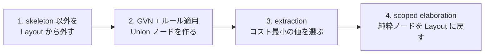
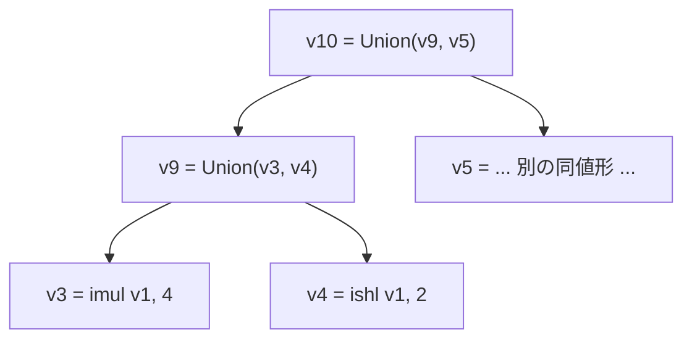

Cranelift のミッドエンド最適化は、パスの列ではなく **1 つのパス**だ。GVN も、定数畳み込みも、代数簡約も、LICM も、リマテリアライズも、`EgraphPass` という単一のパスの中で起きる。それを可能にしているのが **ægraph** (acyclic e-graph) という構造で、これは教科書的な e-graph に「向き」を持ち込んだものだ。

## 4 つのフェーズ

`EgraphPass` の doc コメントが、このパスがやることを 4 つに分けて書いている。

```rust title="cranelift/codegen/src/egraph/mod.rs"
/// Pass over a Function that does the whole aegraph thing.
///
/// - Removes non-skeleton nodes from the Layout.
/// - Performs a GVN-and-rule-application pass over all Values
///   reachable from the skeleton, potentially creating new Union
///   nodes (i.e., an aegraph) so that some values have multiple
///   representations.
/// - Does "extraction" on the aegraph: selects the best value out of
///   the tree-of-Union nodes for each used value.
/// - Does "scoped elaboration" on the aegraph: chooses one or more
///   locations for pure nodes to become instructions again in the
///   layout, as forced by the skeleton.
///
/// At the beginning and end of this pass, the CLIF should be in a
/// state that passes the verifier and, additionally, has no Union
/// nodes. During the pass, Union nodes may exist, and instructions in
/// the layout may refer to results of instructions that are not
/// placed in the layout.
pub struct EgraphPass<'a> {
```

[cranelift/codegen/src/egraph/mod.rs](https://github.com/bytecodealliance/wasmtime/blob/d8a0da6d661605713798c1c9c76be5c28e3159ff/cranelift/codegen/src/egraph/mod.rs#L79-L96)

最後の 2 文が重要だ。**Union ノードはこのパスの内側にしか存在しない。** 入る前も出た後も CLIF は通常の CLIF で、検証器を通る。ægraph は永続的な IR ではなく、1 つのパスの中で立ち上げて畳む作業用の構造である。



実際には 1 と 2 は同じ走査で行われる。`remove_pure_and_optimize` が支配木の順に全ブロックを歩き、純粋な命令に出会ったら eclass に入れて `cursor.remove_inst_and_step_back()` で Layout から抜く、という 1 パスになっている。

## skeleton と純粋ノード

この設計の根っこにあるのが、命令を **skeleton** と **純粋ノード**の 2 種類に分ける発想だ。

skeleton は副作用のある命令と制御フローで、これは Layout (ブロックと命令の並び順) に残る。純粋ノードは `iadd` や `iconst` のように「どこで計算しても同じ値になる」命令で、これは Layout から外れる。外れた純粋ノードは、どのブロックにも属さない「浮いた」状態で `DataFlowGraph` の中に存在し、skeleton の命令から `Value` で参照されるだけになる。

何が純粋かは `is_pure_for_egraph` が決める。doc コメントによれば「自明に純粋なノード (ビット演算など)」と「`readonly`・`notrap`・`can_move` フラグが立ったロード」だけだ ([inst_predicates.rs#L44-L49](https://github.com/bytecodealliance/wasmtime/blob/d8a0da6d661605713798c1c9c76be5c28e3159ff/cranelift/codegen/src/inst_predicates.rs#L44-L49))。結果が 2 個以上の命令、結果が 0 個の命令はどちらも純粋にならない。前者は「egraph のインフラと相性が悪い」ため、後者は「副作用のためだけに存在する」ためだ。

## eclass は Union ノードの二分木

一般的な e-graph 実装は eclass を独立したデータ構造 (union-find + ノード集合) として持つ。Cranelift はそうしない。**eclass は `Value` そのもので、`ValueDef::Union` という定義形が二分木を作る。**

```rust title="cranelift/codegen/src/ir/dfg.rs"
pub enum ValueDef {
    /// Value is the n'th result of an instruction.
    Result(Inst, usize),
    /// Value is the n'th parameter to a block.
    Param(Block, usize),
    /// Value is a union of two other values.
    Union(Value, Value),
}
```

[cranelift/codegen/src/ir/dfg.rs](https://github.com/bytecodealliance/wasmtime/blob/d8a0da6d661605713798c1c9c76be5c28e3159ff/cranelift/codegen/src/ir/dfg.rs#L646-L654)

`dfg.union(x, y)` は新しい `Value` を 1 つ作るだけだ。`x + 0` が `x` に簡約されたとき、`union(v_add, v_x)` という新しい値が生まれ、以降その式を参照する箇所はこの union 値を指す。



木であって環にならないのは、書き換えの際に「今この時点で存在している eclass の部分集合」しか参照しないからだ。`remove_pure_and_optimize` の doc がこの点をはっきり書いている。

```text title="cranelift/codegen/src/egraph/mod.rs"
(We need to do this as part of this pass, and not later using a finished map,
because the eclass can continue to be updated and we need to only refer to its
subset that exists at this stage, to maintain acyclicity.)
```

[cranelift/codegen/src/egraph/mod.rs](https://github.com/bytecodealliance/wasmtime/blob/d8a0da6d661605713798c1c9c76be5c28e3159ff/cranelift/codegen/src/egraph/mod.rs#L848-L852)

非循環であることが何を買うのかは、次のページ ([書き換え規則の掟 4 か条と、爆発を止める 4 つの上限](../egraph-rules/)) で扱う。ここでは「無向な等価関係ではなく、有向な『こちらのほうが良い』の集まりとして eclass を持っている」とだけ押さえておけばよい。

## GVN は支配木のスコープ付きハッシュマップ

ノードを eclass に入れる入口が `insert_pure_enode` で、ここで最初にやるのが GVN のルックアップだ。キーは `(Type, InstructionData)`、つまり「制御型変数と命令データ」の組で、同じキーが既にあれば新しい命令は作らずに既存の `Value` を返す。

問題は、このマップを単純なハッシュマップにできないことだ。純粋ノードには位置がないので概念的にはグローバルでよいが、副作用のある命令のうち冪等なもの (トラップ命令など) も同じマップに入れており、そちらは「今いる位置がその命令に支配されているか」を気にしなければならない。そこで `ScopedHashMap` を使い、**支配木の pre-order でブロックを訪れながらスコープを push/pop する**。

```rust title="cranelift/codegen/src/egraph/mod.rs"
/// The `ScopedHashMap` used for GVN requires that we visit dominator-tree
/// ancestors before their descendants, and that we can "pop" scopes as we
/// backtrack up the dominator tree. This is a DFS pre-order traversal of the
/// dominator tree: we process every dominator before the blocks it dominates,
/// and the scope stack always mirrors the dominator-tree path from the root to
/// the current block.
struct EgraphBlockIter<'a> {
```

[cranelift/codegen/src/egraph/mod.rs](https://github.com/bytecodealliance/wasmtime/blob/d8a0da6d661605713798c1c9c76be5c28e3159ff/cranelift/codegen/src/egraph/mod.rs#L30-L42)

ここに 1 つ工夫がある。**マップへの挿入は「今いる深さ」ではなく「引数が揃うブロックの深さ」に行う。**

```rust title="cranelift/codegen/src/egraph/mod.rs"
// Insert at level implied by args. This enables merging
// in LICM cases like:
//
// while (...) {
//   if (...) {
//     let x = loop_invariant_expr;
//   }
//   if (...) {
//     let x = loop_invariant_expr;
//   }
// }
//
// where the two instances of the expression otherwise
// wouldn't merge because each would be in a separate
// subscope of the scoped hashmap during traversal.
let depth = self.depth_of_block_in_gvn_map(self.available_block[opt_value]);
self.gvn_map.insert_with_depth(
    &gvn_context,
    (ty, self.func.dfg.insts[inst]),
    Some(opt_value),
    depth,
);
```

[cranelift/codegen/src/egraph/mod.rs](https://github.com/bytecodealliance/wasmtime/blob/d8a0da6d661605713798c1c9c76be5c28e3159ff/cranelift/codegen/src/egraph/mod.rs#L264-L288)

`available_block` は「その値の全引数が使えるようになる、支配木で根に最も近いブロック」で、`get_available_block` が引数の available_block のうち支配木で最も深いものを取ることで求めている。ループ本体の 2 つの兄弟ブロックに同じ不変式が書かれていた場合、素朴に「今いる深さ」に挿入すると別々のサブスコープに入って一致しない。引数が揃う深さ (この場合ループの外) に挿入することで、両者が同じエントリを共有する。**GVN の段階で既に LICM の前段をやっている**と言ってよい。

## extraction — どの enode を選ぶか

eclass の中には複数の表現があるので、最終的にどれをコードにするかを決めなければならない。これが extraction で、`compute_best_values` が値を DFG のトポロジカル順に走査して、各 `Value` について `(コスト, 値番号)` の最小を求める。

コスト関数は `egraph/cost.rs` にある。単位は完全に恣意的だ。

```rust title="cranelift/codegen/src/egraph/cost.rs"
/// Costs are measured in an arbitrary union that we represent in a
/// `u32`. The ordering is meant to be meaningful, but the value of a
/// single unit is arbitrary (and "not to scale"). We use a collection
/// of heuristics to try to make this approximation at least usable.
///
/// Arithmetic on costs is always saturating: we don't want to wrap
/// around and return to a tiny cost when adding the costs of two very
/// expensive operations. It is better to approximate and lose some
/// precision than to lose the ordering by wrapping.
///
/// Finally, we reserve the highest value, `u32::MAX`, as a sentinel
/// that means "infinite".
```

[cranelift/codegen/src/egraph/cost.rs](https://github.com/bytecodealliance/wasmtime/blob/d8a0da6d661605713798c1c9c76be5c28e3159ff/cranelift/codegen/src/egraph/cost.rs#L5-L32)

具体値は `iconst` と型変換が 1、`iadd`/`isub`/`band`/`ishl` などの「単純な算術」が 3、`imul` が 10、それ以外は基本 4 で、トラップしうるか他の副作用があれば +10、ロードなら +20、ストアなら +50。命令のコストは自分の opcode のコストと全引数のコストの和で、加算は常に飽和する。飽和は `u32::MAX` の 1 つ手前で止まるので、無限は算術では到達できない番兵として保たれる。

コストが飽和して無限になることは実際に起きる。`compute_best_values` の末尾に長いコメントがあり、その理由と、それでも問題ない理由が書かれている。

```text title="cranelift/codegen/src/egraph/elaborate.rs"
Such a chain can cause cost to saturate to infinity. How do we choose which
e-node is best when there are multiple that have saturated to infinity? It
doesn't matter. As long as invariant (2) for optimization rules is upheld by
our rule set (see `cranelift/codegen/src/opts/README.md`) it is safe to choose
*any* e-node in the e-class. At worst we will produce suboptimal code, but
never an incorrectness.
```

[cranelift/codegen/src/egraph/elaborate.rs](https://github.com/bytecodealliance/wasmtime/blob/d8a0da6d661605713798c1c9c76be5c28e3159ff/cranelift/codegen/src/egraph/elaborate.rs#L363-L389)

コスト関数はデータフローの共有を見ておらず、単に引数コストを足すだけなので、`v1 = iadd v0, v0` を重ねるだけでコストは指数的に伸びる。だがそれは正しさに影響しない。**eclass の中身はどれを選んでも意味的に等価である、という不変条件が規則の側で守られているから、コスト関数はいくらでもいい加減でよい。**

同点になったときのタイブレークが面白い。

```rust title="cranelift/codegen/src/egraph/elaborate.rs"
impl Ord for BestEntry {
    #[inline]
    fn cmp(&self, other: &Self) -> core::cmp::Ordering {
        self.0.cmp(&other.0).then_with(|| {
            // Note that this comparison is reversed. When costs are equal,
            // prefer the value with the bigger index. This is a heuristic that
            // prefers results of rewrites to the original value, since we
            // expect that our rewrites are generally improvements.
            self.1.cmp(&other.1).reverse()
        })
    }
}
```

[cranelift/codegen/src/egraph/elaborate.rs](https://github.com/bytecodealliance/wasmtime/blob/d8a0da6d661605713798c1c9c76be5c28e3159ff/cranelift/codegen/src/egraph/elaborate.rs#L82-L93)

`Value` は生成順に番号が振られるので、番号が大きいほうが後から作られた = 書き換え結果だ。そして規則には「右辺は左辺以上に良くなければならない」という掟がある。**コスト関数が区別できない場合は、規則の掟のほうを信じる。** ここは有向な ægraph だからこそ成り立つタイブレークで、無向な e-graph には「どちらが元でどちらが書き換え結果か」という情報がそもそもない。

## elaboration と、そこに組み込まれた LICM

extraction で各 eclass の代表が決まったら、最後に純粋ノードを Layout に戻す。これが elaboration で、`Elaborator` が支配木を降りながら「skeleton の命令がこの値を要求しているから、ここに置く」という形で命令を配置していく。

配置先は原則として使用箇所のブロックだが、ここでループの扱いが入る。`Elaborator` は `loop_stack` を持ち、ループヘッダに入るたびに `LoopStackEntry` を積む。その `hoist_block` の doc がこう説明している。

```rust title="cranelift/codegen/src/egraph/elaborate.rs"
    /// The hoist point: a block that immediately dominates this
    /// loop. May not be an immediate predecessor, but will be a valid
    /// point to place all loop-invariant ops: they must depend only
    /// on inputs that dominate the loop, so are available at (the end
    /// of) this block.
    hoist_block: Block,
```

[cranelift/codegen/src/egraph/elaborate.rs](https://github.com/bytecodealliance/wasmtime/blob/d8a0da6d661605713798c1c9c76be5c28e3159ff/cranelift/codegen/src/egraph/elaborate.rs#L102-L113)

命令を置く直前に、全引数について「その値の定義ブロックが所属しない、最も外側のループレベル」を求め、その最大値を `loop_hoist_level` とする。それが現在のループ深さより浅ければ、その `hoist_block` の末尾に命令を置く。

```rust title="cranelift/codegen/src/egraph/elaborate.rs"
let (scope_depth, before, insert_block) = if loop_hoist_level == self.loop_stack.len() {
    // Depends on some value at the current
    // loop depth, or remat forces it here:
    // place it at the current location.
    (self.value_to_elaborated_value.depth(), before,
     self.func.layout.inst_block(before).unwrap())
} else {
    // Does not depend on any args at current
    // loop depth: hoist out of loop.
    self.stats.elaborate_licm_hoist += 1;
    let data = &self.loop_stack[loop_hoist_level];
    let before = self.func.layout.last_inst(data.hoist_block).unwrap();
    (data.scope_depth as usize, before, data.hoist_block)
};
```

[cranelift/codegen/src/egraph/elaborate.rs](https://github.com/bytecodealliance/wasmtime/blob/d8a0da6d661605713798c1c9c76be5c28e3159ff/cranelift/codegen/src/egraph/elaborate.rs#L598-L622)

**LICM が独立したパスとして存在しない**のがこの設計の要点だ。純粋ノードは Layout から外れて「どこにも置かれていない」状態になっているので、置き直すときに好きな場所を選べる。ループの外に出すのは、コード移動ではなく単に配置先の選択でしかない。

逆向きの操作もある。規則が `remat` を指示した値 (即値など、計算し直すほうが安いもの) は、使われるブロックごとに複製される (`maybe_remat_arg`)。同じ「置き直し」の機構が、片方ではループ外への巻き上げに、もう片方ではブロックごとの複製に使われている。

## パスの順番

`EgraphPass` を呼ぶまでに何が済んでいるかも見ておく。

```rust title="cranelift/codegen/src/context.rs"
if isa.flags().enable_nan_canonicalization() {
    self.canonicalize_nans(isa)?;
}
self.verify_if(isa)?;
self.compute_cfg();
self.compute_domtree();
self.eliminate_unreachable_code(isa)?;
self.remove_constant_phis(isa)?;
self.func.dfg.resolve_all_aliases();

if opt_level != OptLevel::None {
    self.egraph_pass(isa, ctrl_plane)?;
}
```

[cranelift/codegen/src/context.rs](https://github.com/bytecodealliance/wasmtime/blob/d8a0da6d661605713798c1c9c76be5c28e3159ff/cranelift/codegen/src/context.rs#L181-L196)

NaN の正規化、検証、CFG と支配木の構築、到達不能コードの除去、定数 phi の除去、エイリアスの解決。そのあとで、最適化レベルが `None` でなければ ægraph パスが走る。**`opt_level == None` のときはミッドエンドが丸ごと飛ぶ**ので、Cranelift は「最適化なし」を選べばパースから lowering まで一直線になる。`egraph_pass` 自身はループ解析とエイリアス解析を用意し、パスを走らせ、そのあと分岐の簡約で制御フローが変わりうるので CFG と支配木を再計算して検証器にかける。

## どう活かすか

「配置を決めずに済むものは、決めないまま持っておく」という発想は他でも使える。純粋ノードを Layout から外したことで、GVN・LICM・リマテリアライズが「どこに置くか」という同じ 1 つの問いの別の答えになった。従来のコンパイラがこれらを別々のパスとして持ち、パスの順番に悩んでいたのは、命令が最初から位置を持っていたからだ。

もう 1 つは、コスト関数の割り切り方だ。**正しさを不変条件の側で保証しておけば、ヒューリスティックはいくら雑でもよい。** 無限に飽和したコストの扱いに悩まないという判断は、そこがヒューリスティックであると明確に線引きできているからこそできる。
