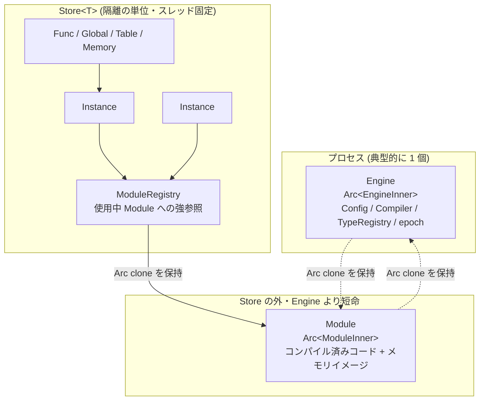

Wasmtime の埋め込み API は `Engine`、`Store`、`Module`、`Instance` の 4 つを中心に組み立てられている。この 4 つは「どういうデータを持つか」よりも **「どういう寿命を持ち、どこに属するか」** で区別したほうが理解しやすい。プロセスに属するもの、Store に属するもの、そしてそのどちらにも属さないもの。



## Engine — プロセスに 1 個、変更にはロックが要る

`Engine` は `Arc<EngineInner>` の薄いラッパで、`clone` はポインタのコピーにすぎない。中身はコンパイル設定と、プロセス全体で共有したいものだ。

```rust title="crates/wasmtime/src/engine.rs"
#[derive(Clone)]
pub struct Engine {
    inner: Arc<EngineInner>,
}

struct EngineInner {
    config: Config,
    features: WasmFeatures,
    tunables: Tunables,
    compiler: Option<Box<dyn wasmtime_environ::Compiler>>,
    allocator: Box<dyn crate::runtime::vm::InstanceAllocator + Send + Sync>,
    gc_runtime: Option<Arc<dyn GcRuntime>>,
    profiler: Box<dyn crate::profiling_agent::ProfilingAgent>,
    signatures: TypeRegistry,
    epoch: AtomicU64,
    // ...
}
```

[crates/wasmtime/src/engine.rs](https://github.com/bytecodealliance/wasmtime/blob/d8a0da6d661605713798c1c9c76be5c28e3159ff/crates/wasmtime/src/engine.rs#L44-L73)

アーキテクチャ文書が `Engine` について強調しているのは 1 点だけだ。

```text title="docs/contributing-architecture.md"
The main thing to remember for `Engine` is that any mutation of its internals
typically involves acquiring a lock, whereas for `Store` below no locks are
necessary.
```

[docs/contributing-architecture.md](https://github.com/bytecodealliance/wasmtime/blob/d8a0da6d661605713798c1c9c76be5c28e3159ff/docs/contributing-architecture.md#L41-L48)

**`Engine` は複数スレッドから同時に触られる前提なので、内部を変えるにはロックが要る。`Store` は 1 スレッドに固定されているのでロックが要らない。** この対比が、どちらに何を置くかの判断基準になっている。

`signatures: TypeRegistry` は Engine に置かれた代表例だ。wasm の関数型を一意な整数 `VMSharedTypeIndex` に潰す表で、`call_indirect` の型検査を整数比較 1 回に落とすために使われる ([call_indirect の型チェックが整数比較 1 回になるまで](../call-indirect-typecheck/))。この表はモジュールを跨いで共有される必要があるので、Store ではなく Engine の持ち物になる。

```rust title="crates/environ/src/types.rs"
/// A canonicalized type index into an engine's shared type registry.
///
/// This is canonicalized/deduped at the level of a whole engine, across all the
/// modules loaded into that engine, not just at the level of a single
/// particular module. This means that `VMSharedTypeIndex` is usable for
/// e.g. checking that function signatures match during an indirect call
/// (potentially to a function defined in a different module) at runtime.
#[repr(transparent)] // Used directly by JIT code.
pub struct VMSharedTypeIndex(u32);
```

[crates/environ/src/types.rs](https://github.com/bytecodealliance/wasmtime/blob/d8a0da6d661605713798c1c9c76be5c28e3159ff/crates/environ/src/types.rs#L1691-L1700)

`epoch: AtomicU64` も Engine にある。実行中の wasm を外から止めるためのカウンタで、`Engine::increment_epoch` は `fetch_add` 1 回しかしない。**別スレッドから安全に叩ける場所は Engine しかない**ので、ここに置かれている ([epoch — なぜ関数の入口にもチェックが要るのか](../epoch/))。

## Store — 隔離の単位で、GC がない

`Store<T>` は wasm 仕様の「store」に対応する。インスタンス、グローバル、メモリ、テーブルが全部ここにぶら下がる。API の doc がこの型の性質を 2 文で言い切っている。

```rust title="crates/wasmtime/src/runtime/store.rs"
/// A [`Store`] is intended to be a short-lived object in a program. No form
/// of GC is implemented at this time so once an instance is created within a
/// [`Store`] it will not be deallocated until the [`Store`] itself is dropped.
/// This makes [`Store`] unsuitable for creating an unbounded number of
/// instances in it because [`Store`] will never release this memory. It's
/// recommended to have a [`Store`] correspond roughly to the lifetime of a
/// "main instance" that an embedding is interested in executing.
pub struct Store<T: 'static> {
    // for comments about `ManuallyDrop`, see `Store::into_data`
    inner: ManuallyDrop<Box<StoreInner<T>>>,
}
```

[crates/wasmtime/src/runtime/store.rs](https://github.com/bytecodealliance/wasmtime/blob/d8a0da6d661605713798c1c9c76be5c28e3159ff/crates/wasmtime/src/runtime/store.rs#L132-L196)

**Store には GC がない。** これは制限というより設計判断だ。Store の中では `Func` や `Instance` が互いを指し合い、`InstanceHandle` が再帰的に Store 自身を指す。この参照グラフを正確に追う代わりに、「Store が死ぬまで何も解放しない」という単純な規則を採った。だから埋め込む側は、Store をリクエスト 1 本やメインインスタンス 1 個の寿命に合わせて作り捨てることになる。

`Store` はスレッドを跨げない。ほとんどのメソッドが `&mut self` を要求するので、これは型で強制される。そして別の Store の `Memory` や `Global` を渡すと **回復可能なエラーではなく panic になる**。

```text title="crates/wasmtime/src/runtime/store.rs"
The `wasmtime` crate will panic if the [`Store`] argument passed in to these
operations is incorrect. In other words it's considered a programmer error
rather than a recoverable error for the wrong [`Store`] to be used when
calling APIs.
```

この判断が具体的にどう実装されているかは [Store が 5 つの型に割れている理由](../store-five-types/) で見る。

## Module — Store の外に生きる数少ないオブジェクト

`Module` は `Arc<ModuleInner>` で、コンパイル済みコードとその周辺情報を持つ。

```rust title="crates/wasmtime/src/runtime/module.rs"
struct ModuleInner {
    engine: Engine,
    /// The compiled artifacts for this module that will be instantiated and
    /// executed.
    module: CompiledModule,
    code: Arc<EngineCode>,

    /// A set of initialization images for memories, if any.
    ///
    /// Note that this is behind a `OnceCell` to lazily create this image. On
    /// Linux where `memfd_create` may be used to create the backing memory
    /// image this is a pretty expensive operation, so by deferring it this
    /// improves memory usage for modules that are created but may not ever be
    /// instantiated.
    memory_images: OnceLock<Option<ModuleMemoryImages>>,

    serializable: bool,
    /// Runtime offset information for `VMContext`.
    offsets: VMOffsets<HostPtr>,
    checksum: WasmChecksum,
}
```

[crates/wasmtime/src/runtime/module.rs](https://github.com/bytecodealliance/wasmtime/blob/d8a0da6d661605713798c1c9c76be5c28e3159ff/crates/wasmtime/src/runtime/module.rs#L128-L163)

アーキテクチャ文書がこの型の位置づけを書いている ——「`wasmtime::Module` は `wasmtime::Store` の外に生きる数少ないオブジェクトの 1 つだ。つまり `Module` の参照カウントがそれ自身のメモリ管理形式になっている」。Store にインスタンス化されると、Store 側が `ModuleRegistry` を通じて強参照を持つ。だから **同じ Module から作った全インスタンスが、同じコンパイル済みコードを共有する。**

`memory_images` が `OnceLock` になっている理由がコメントに書かれている。線形メモリの初期イメージを copy-on-write で貼るために `memfd_create` を使うが、**それが高価な操作なので、インスタンス化されるまで作らない**。コンパイルしたが一度も走らせないモジュールに対して無駄なコストを払わないための遅延だ ([copy-on-write でインスタンス化を速くする](../cow-instantiation/))。

## Instance — 実体は 2 ワード

`Instance` はコピー可能な軽量ハンドルで、中身は Store の ID とその中のインデックスしかない。

```rust title="crates/wasmtime/src/runtime/instance.rs"
#[derive(Copy, Clone, Debug, PartialEq, Eq)]
#[repr(C)]
pub struct Instance {
    pub(crate) id: StoreInstanceId,
}

// Double-check that the C representation in `instance.h` matches our in-Rust
// representation here in terms of size/alignment/etc.
const _: () = {
    #[repr(C)]
    struct C(u64, usize);
    assert!(core::mem::size_of::<C>() == core::mem::size_of::<Instance>());
    assert!(core::mem::align_of::<C>() == core::mem::align_of::<Instance>());
    assert!(core::mem::offset_of!(Instance, id) == 0);
};
```

[crates/wasmtime/src/runtime/instance.rs](https://github.com/bytecodealliance/wasmtime/blob/d8a0da6d661605713798c1c9c76be5c28e3159ff/crates/wasmtime/src/runtime/instance.rs#L34-L47)

`StoreInstanceId` は `(StoreId, InstanceId)` のペアで、doc に「store への _safe な_ インデックス」と書かれている。**Store の外では何もできないので、Store を渡し忘れることが型レベルで防がれる。** そして `assert_belongs_to` で StoreId を突き合わせ、違えば panic する。

`const _: () = { ... assert!(...) }` の塊は、C API のヘッダに書かれた構造体レイアウトと Rust 側の定義が一致していることをコンパイル時に検査するものだ。C API は同じ 2 ワードを `wasmtime_instance_t` として公開しているので、片方だけを変えるとビルドが落ちる。同じパターンは `Func` や `Global` にも付いている。

実際の重い実体は `crates/wasmtime/src/runtime/vm/` 側の `InstanceHandle` にある。Rust が管理するメモリ・テーブルの動的状態が先頭に並び、その直後に `VMContext` が続くという 1 つの確保になっている ([VMContext — JIT コードが固定オフセットで触る構造体](../vmcontext/))。

## 寿命の違いが、コード生成に効いてくる

ここまでの寿命の違いが、生成コードの前提を規定する。アーキテクチャ文書がその帰結を書いている。

```text title="docs/contributing-architecture.md"
Note that the property of sharing a module's compiled code across all
instantiations has interesting implications on what the compiled code can
assume. For example Wasmtime implements a form of type interning, but the
interned types happen at a few different levels. ... This means that if the
same module is instantiated into many stores its same function type may take
on many values, so the compiled code can't assume a particular value for a
function type. ... The general gist though is that compiled code leans
relatively heavily on the `VMContext` for contextual input because the JIT code
is intended to be so widely reusable.
```

[docs/contributing-architecture.md](https://github.com/bytecodealliance/wasmtime/blob/d8a0da6d661605713798c1c9c76be5c28e3159ff/docs/contributing-architecture.md#L189-L199)

この記述は現在の実装より古く、型のインターンは今は Engine 単位で行われている (`EngineInner::signatures`)。同じ Engine の中なら `VMSharedTypeIndex` は安定している。だが結論は変わらない。**AOT コンパイルした `.cwasm` は別プロセスの別 Engine に読み込まれる**し、そのとき同じ関数型がどの整数になるかは、その Engine にそれまで何が登録されたかで決まる。だから `call_indirect` の型検査コードに整数リテラルを埋め込むことはできず、**型 ID は必ず `VMContext` から読む**ことになる。

最後の一文が、この章の後半への橋になっている。**JIT コードが「広く再利用可能であること」を優先した結果、実行時の文脈はすべて `VMContext` 経由で渡される。** 生成コードは自分がどの Store のどのインスタンスとして動いているかを知らず、レジスタに渡された `VMContext` ポインタから固定オフセットで全部を引く。

## どう活かすか

「プロセス寿命 / セッション寿命 / どちらでもない」の 3 分類は、共有リソースを持つライブラリ全般に効く整理だ。Wasmtime の場合、`Engine` に置くか `Store` に置くかの判断基準が **「複数スレッドから触られるか」= 「ロックが要るか」** に一本化されていて、これがそのまま API の形 (`&Engine` で済むか `&mut Store` が要るか) に現れている。持ち物の置き場所を決めるとき、まず同期の要否から決めると迷いが減る。
