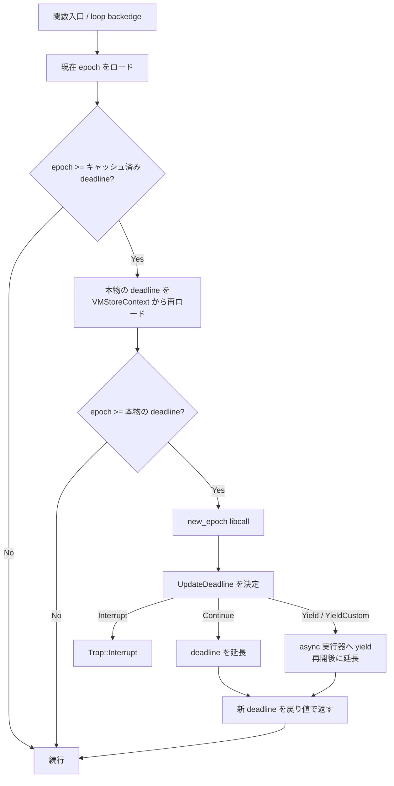

[fuel](../fuel/) が命令を数えて止めるのに対し、epoch は**時間の流れを外から刻む**。エンジンが持つカウンタを埋め込み側が定期的に進め、wasm 側は「そのカウンタが自分の期限に達したか」だけを見る。命令数を数えないので安い代わりに、どこで止まるかは非決定的になる。

この仕組みで一番おもしろいのは、**チェックの置き場所がループの後方枝だけでは足りない**という点だ。その理由がコード中に具体的な攻撃モデルとして書かれている。

## 割り込み側は 1 行しかない

外から wasm を止める操作の全体がこれになる。

```rust title="crates/wasmtime/src/engine.rs"
/// ## Signal Safety
///
/// This method is signal-safe: it does not make any syscalls, and
/// performs only an atomic increment to the epoch value in
/// memory.
#[cfg(target_has_atomic = "64")]
pub fn increment_epoch(&self) {
    self.inner.epoch.fetch_add(1, Ordering::Relaxed);
}
```

[crates/wasmtime/src/engine.rs](https://github.com/bytecodealliance/wasmtime/blob/d8a0da6d661605713798c1c9c76be5c28e3159ff/crates/wasmtime/src/engine.rs#L830-L859)

`Ordering::Relaxed` の `fetch_add` 1 個。**システムコールもロックも確保もないので、シグナルハンドラの中から呼べる**。doc がそれを保証として明記している。タイマシグナルのハンドラでこれを叩けば、他のスレッドで走っている wasm が「そのうち」止まる。

読み出し側も `Relaxed` で、順序の保証は要求していない。カウンタが増えたことがいつ wasm 側に見えるかは決めていないからだ。もともと粒度が粗い割り込みなので、数命令遅れて見えても構わない。

同じ doc に運用上の助言が付いている。別スレッドで epoch を刻むなら `Engine` を直接持たず `Engine::weak` で `EngineWeak` を持ち、tick ごとに `upgrade` しろ、というものだ。**「epoch を刻むスレッドが、その利用者より長く `Engine` を生かしてしまわないように」**。刻む側は付随的な存在なので所有権を持つべきではない、という判断になっている。

`Store` 側は期限を持つ。`set_epoch_deadline(delta)` は現在の epoch に `delta` を足した絶対値を `VMStoreContext.epoch_deadline` に書く。

```rust title="crates/wasmtime/src/runtime/store.rs"
pub(crate) fn set_epoch_deadline(&mut self, delta: u64) {
    // Set a new deadline based on the "epoch deadline delta".
    //
    // Also, note that when this update is performed while Wasm is
    // on the stack, the Wasm will reload the new value once we
    // return into it.
    let current_epoch = self.engine().current_epoch();
    let epoch_deadline = self.vm_store_context.epoch_deadline.get_mut();
    *epoch_deadline = current_epoch + delta;
}
```

fuel と同じく、**既定値は「即トラップ」の側に倒してある**。`Store` は epoch deadline 0 で始まり、0 は常に「既に経過済み」なので、`set_epoch_deadline` を呼ばずに `Config::epoch_interruption` だけ有効にすると wasm は即座にトラップする。

## ループだけでは止められない

チェックを埋める場所は 2 か所ある。ループヘッダ (`translate_loop_header`) と、**関数入口**だ。後者が必要な理由がここに書かれている。

```rust title="crates/cranelift/src/func_environ.rs"
// We must check for an epoch change when entering a
// function. Why? Why aren't checks at loops sufficient to
// bound runtime to O(|static program size|)?
//
// The reason is that one can construct a "zip-bomb-like"
// program with exponential-in-program-size runtime, with no
// backedges (loops), by building a tree of function calls: f0
// calls f1 ten times, f1 calls f2 ten times, etc. E.g., nine
// levels of this yields a billion function calls with no
// backedges. So we can't do checks only at backedges.
//
// In this "call-tree" scenario, and in fact in any program
// that uses calls as a sort of control flow to try to evade
// backedge checks, a check at every function entry is
// sufficient. Then, combined with checks at every backedge
// (loop) the longest runtime between checks is bounded by the
// straightline length of any function body.
```

[crates/cranelift/src/func_environ.rs](https://github.com/bytecodealliance/wasmtime/blob/d8a0da6d661605713798c1c9c76be5c28e3159ff/crates/cranelift/src/func_environ.rs#L740-L757)

`f0` が `f1` を 10 回呼び、`f1` が `f2` を 10 回呼ぶ。**これを 9 段重ねれば、後方枝を 1 つも含まないプログラムで 10 億回の呼び出しが起きる**。プログラムサイズは線形にしか増えないのに実行時間は指数的に伸びる。「ループがなければ有限時間で終わる」という直感がここで壊れる。

そして 2 か所を押さえれば十分だという議論もそのまま書かれている。関数入口と後方枝の両方にチェックがあれば、**チェックとチェックの間の最長実行時間は「どれかの関数本体の直線コードの長さ」で上から抑えられる**。直線コードは有限で静的に決まるので、これで「有界時間内に必ずチェックに到達する」が言える。

例外があって、`memory.copy` のようなバルク命令は開始時に 1 回しかチェックしない。`Config::epoch_interruption` の doc がこれを「悪意あるゲストに対する現在の制約」として認めている。64bit 線形メモリで 128GiB のコピーを発行されると、その命令の内部にはプリエンプションのポイントがない。対策として提示されているのは `ResourceLimiter` でヒープサイズを縛ることだ。ただし定数長で総コストが `SMALL_BULK_OP_COST = 128` 以下と静的に分かるものは、チェック自体を省く最適化が入っている。

## deadline を 2 段階で見る

素朴に実装するなら、チェックのたびに `VMStoreContext.epoch_deadline` をロードして現在の epoch と比べればよい。Wasmtime はそうせず、**deadline をローカル変数 (実質レジスタ) にキャッシュし、超過を検出したときだけ本物を読み直す**。

```rust title="crates/cranelift/src/func_environ.rs"
fn epoch_check(&mut self, builder: &mut FunctionBuilder<'_>) {
    let continuation_block = builder.create_block();

    // Load new epoch and check against the cached deadline.
    let cur_epoch_value = self.epoch_load_current(builder);
    self.epoch_check_cached(builder, cur_epoch_value, continuation_block);

    // At this point we've noticed that the epoch has exceeded our
    // cached deadline. However the real deadline may have been
    // updated (within another yield) during some function that we
    // called in the meantime, so reload the cache and check again.
    self.epoch_check_full(builder, cur_epoch_value, continuation_block);
}
```

[crates/cranelift/src/func_environ.rs](https://github.com/bytecodealliance/wasmtime/blob/d8a0da6d661605713798c1c9c76be5c28e3159ff/crates/cranelift/src/func_environ.rs#L815-L880)

**キャッシュが古くなりうることを前提にした二段構えになっている**。呼び出した関数の中で yield が起き、そこで deadline が延長されているかもしれない。だからキャッシュとの比較で超過が出ても、それだけでは中断を決めない。本物を読み直してもう一度比べる。

超過側のブロックには `builder.set_cold_block(new_epoch_block)` が付いていて、コードレイアウト上も冷たい側に追い出される。通常パスに残るのは「現在 epoch のロード」と「レジスタとの比較」と「分岐」だけだ。これが fuel との差になる。fuel は全命令にコストの加算が乗り、`VMStoreContext` への書き戻しも頻繁に入る。

本物でも超過していれば `new_epoch` ビルトインを呼ぶ。ここにも工夫がある。

```rust title="crates/cranelift/src/func_environ.rs"
let new_epoch = self.builtin_functions.new_epoch(builder.func);
let vmctx = self.vmctx_val(&mut builder.cursor());
// new_epoch() returns the new deadline, so we don't have to
// reload it.
let call = builder.ins().call(new_epoch, &[vmctx]);
let new_deadline = *builder.func.dfg.inst_results(call).first().unwrap();
builder.def_var(self.epoch_deadline_var, new_deadline);
```

**libcall が新しい deadline を戻り値で返す**ので、戻ってきた wasm 側は `VMStoreContext` を読み直さずにキャッシュを更新できる。ロード 1 回の節約だが、libcall のシグネチャに意味を持たせてまで削っているのが特徴的だ。



## 期限が来たときの 4 つの選択肢

`new_epoch` は `Store` に設定されたコールバックを呼び、その戻り値 `UpdateDeadline` に従って分岐する。

```rust title="crates/wasmtime/src/runtime/store.rs"
pub enum UpdateDeadline {
    /// Halt execution of WebAssembly, don't update the epoch deadline, and
    /// raise a trap.
    Interrupt,
    /// Extend the deadline by the specified number of ticks.
    Continue(u64),
    /// Extend the deadline by the specified number of ticks after yielding to
    /// the async executor loop.
    #[cfg(feature = "async")]
    Yield(u64),
    /// ...
    /// The yield will be performed by the future provided; when using `tokio`
    /// it is recommended to provide `tokio::task::yield_now` here.
    #[cfg(feature = "async")]
    YieldCustom(
        u64,
        ::core::pin::Pin<Box<dyn ::core::future::Future<Output = ()> + Send>>,
    ),
}
```

[crates/wasmtime/src/runtime/store.rs](https://github.com/bytecodealliance/wasmtime/blob/d8a0da6d661605713798c1c9c76be5c28e3159ff/crates/wasmtime/src/runtime/store.rs#L385-L417)

コールバックが設定されていなければ `UpdateDeadline::Interrupt` が既定で、`Trap::Interrupt` になる。これが `Store::epoch_deadline_trap` の状態だ (実装は `epoch_deadline_behavior = None`)。後ろ 2 つは async 専用で、同期のエントリポイントから返すとエラーになる。`YieldCustom` が用意されているのは、実行器ごとに「協調的に譲る」方法が違うためで、tokio なら `tokio::task::yield_now` を渡せと書かれている。

`Store::epoch_deadline_async_yield_and_update(delta)` は、この上に乗った 3 行の糖衣でしかない。

```rust title="crates/wasmtime/src/runtime/store/async_.rs"
fn epoch_deadline_async_yield_and_update(&mut self, delta: u64) {
    // All future entrypoints must be async to handle the case that an epoch
    // changes and a yield is required.
    self.set_async_required(Asyncness::Yes);

    self.epoch_deadline_behavior =
        Some(Box::new(move |_store| Ok(UpdateDeadline::Yield(delta))));
}
```

[crates/wasmtime/src/runtime/store/async_.rs](https://github.com/bytecodealliance/wasmtime/blob/d8a0da6d661605713798c1c9c76be5c28e3159ff/crates/wasmtime/src/runtime/store/async_.rs#L170-L180)

これを設定すると、その `Store` は以後 `*_async` のエントリポイントを要求するようになる。yield するには [fiber](../why-fiber/) の上で走っている必要があるからだ。この組み合わせ (別スレッドが定期的に `increment_epoch`、各 `Store` は yield して延長) が、**複数の CPU バウンドな wasm ゲストを 1 つの async 実行器で協調的にタイムスライスする**という想定の使い方で、`epoch_deadline_async_yield_and_update` の doc がそう説明している。[wasmtime serve](../wasmtime-serve/) が採っているのもこの形だ。

## fuel と epoch のどちらを使うか

両者の比較は 2 か所に書かれている。`Config::epoch_interruption` の doc は「一般に epoch のほうが実行が速く、その差は測定によっては 2〜3 倍に達する。グローバルでめったに変わらないカウンタを見るだけで、頻繁に変わるローカルカウンタを保持して期限と比べる必要がないからだ」とする。`docs/examples-interrupting-wasm.md` のほうは epoch 自体のオーバーヘッドを「約 10% の速度低下として測定されている」としている。

逆に fuel を選ぶべき条件も明記されている。**「同じ開始状態からの同じ関数呼び出しが、常に完走するか、あるいは決定的に out-of-fuel でトラップするかのどちらかである」ことが要求されるとき**。epoch は壁時計に基づくので、同じ入力を 1 epoch 分走らせても、1 回目と 2 回目で止まる場所が違いうるし、完走してしまうこともある。

そしてどちらにも共通の限界がある。`Config::epoch_interruption` の doc が「epoch (と fuel) は、ホスト呼び出しでブロックしている WebAssembly コードには効かない」と断っている。`wasi:io/poll.poll` で寝ている wasm は、epoch をいくら刻んでも起きない。**中断機構が見ているのは「wasm が走っていること」であって「時間が経っていること」ではない**。ホスト側でのブロックを打ち切るのは埋め込み側の仕事で、推奨されている解は WASI ホスト関数の async 版を使って `tokio::time::timeout` を被せることだ。

## どう活かすか

epoch の設計で持ち帰れるのは、**割り込み側と被割り込み側でコストの置き場所を非対称にする**という発想だ。割り込む側は「シグナルハンドラから呼べる」ことが要求されるので極限まで削って atomic 1 個にし、代わりに被割り込み側がポーリングする。そのポーリングも、通常パスにはレジスタ比較しか残さず、遅い経路を cold ブロックへ追い出す。

そして「チェックをどこに置けば有界性が言えるか」を、ループだけでなく攻撃モデルから逆算しているのも参考になる。「ループがなければ短時間で終わる」という素朴な仮定を、10 億回の呼び出し木という反例で潰した上で、関数入口を追加している。安全性の議論は、直感ではなく「最悪ケースで何が構成できるか」から始めるべきだという例になっている。
