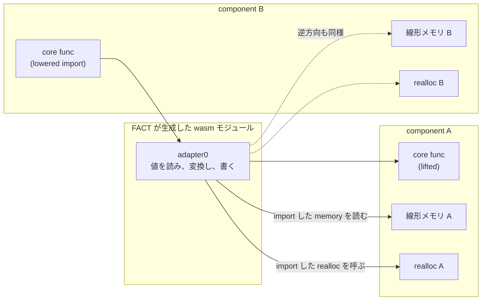

## 融合アダプタとは何か

component A が関数を lift して export し、component B がそれを import して lower する。このとき A の core wasm 関数と B の core wasm 関数の間には、データを詰め替えるコードが必要になる。A のメモリから文字列を読み、B の `realloc` で領域を確保し、B のメモリに B のエンコーディングで書く、といった作業だ ([lifting と lowering、realloc と post-return](../lifting-lowering/))。

Wasmtime はこれを **FACT (Fused Adapter Compiler of Trampolines)** と呼ぶ。

```rust title="crates/environ/src/fact.rs"
//! Wasmtime's Fused Adapter Compiler of Trampolines (FACT)
//!
//! This module contains a compiler which emits trampolines to implement fused
//! adapters for the component model. A fused adapter is when a core wasm
//! function is lifted from one component instance and then lowered into another
//! component instance. This communication between components is well-defined by
//! the spec and ends up creating what's called a "fused adapter".
//!
//! Adapters are currently implemented with WebAssembly modules. This submodule
//! will generate a core wasm binary which contains the adapters specified
//! during compilation. The actual wasm is then later processed by standard
//! paths in Wasmtime to create native machine code and runtime representations
//! of modules.
```

[crates/environ/src/fact.rs](https://github.com/bytecodealliance/wasmtime/blob/d8a0da6d661605713798c1c9c76be5c28e3159ff/crates/environ/src/fact.rs#L1-L19)

**アダプタは WebAssembly モジュールとして生成される。** 生成された wasm はその後、Wasmtime の通常のコンパイル経路を通って機械語になる。



アダプタモジュールは A のメモリと realloc、B のメモリと realloc を **import として受け取る**。だから A と B は互いのメモリを直接見ることはなく、アダプタだけが両方を見る ([core module だけでは足りない理由](../why-component/))。

## なぜ Cranelift ではなく wasm なのか

判断の根拠が 4 点、`translate/adapt.rs` の冒頭に書かれている。**これがこのページの背骨なので全部引用する。**

```rust title="crates/environ/src/component/translate/adapt.rs"
//! Wasmtime's current implementation of fused adapters is designed to reduce
//! complexity elsewhere as much as possible while also being suitable for being
//! used as a polyfill for the component model in JS environments as well. To
//! that end Wasmtime implements a fused adapter with another wasm module that
//! it itself generates on the fly. The usage of WebAssembly for fused adapters
//! has a number of advantages:
//!
//! * There is no need to create a raw Cranelift-based compiler. This is where
//!   majority of "unsafety" lives in Wasmtime so reducing the need to lean on
//!   this or audit another compiler is predicted to weed out a whole class of
//!   bugs in the fused adapter compiler.
//!
//! * As mentioned above generation of WebAssembly modules means that this is
//!   suitable for use in JS environments. For example a hypothetical tool which
//!   polyfills a component onto the web today would need to do something for
//!   adapter modules, and ideally the adapters themselves are speedy. While
//!   this could all be written in JS the adapting process is quite nontrivial
//!   so sharing code with Wasmtime would be ideal.
//!
//! * Using WebAssembly insulates the implementation to bugs to a certain
//!   degree. While logic bugs are still possible it should be much more
//!   difficult to have segfaults or things like that. With adapters exclusively
//!   executing inside a WebAssembly sandbox like everything else the failure
//!   modes to the host at least should be minimized.
//!
//! * Integration into the runtime is relatively simple, the adapter modules are
//!   just another kind of wasm module to instantiate and wire up at runtime.
//!   The goal is that the `GlobalInitializer` list that is processed at runtime
//!   will have all of its `Adapter`-using variants erased by the time it makes
//!   its way all the way up to Wasmtime. This means that the support in
//!   Wasmtime prior to adapter modules is actually the same as the support
//!   after adapter modules are added, keeping the runtime fiddly bits quite
//!   minimal.
//!
//! This isn't to say that this approach isn't without its disadvantages of
//! course. For now though this seems to be a reasonable set of tradeoffs for
//! the development stage of the component model proposal.
```

[crates/environ/src/component/translate/adapt.rs](https://github.com/bytecodealliance/wasmtime/blob/d8a0da6d661605713798c1c9c76be5c28e3159ff/crates/environ/src/component/translate/adapt.rs#L26-L62)

**理由の第一が性能ではなく安全性である**ことが決定的だ。「Cranelift ベースの生アダプタコンパイラを書かずに済む。**そこが Wasmtime の unsafe の大半が住んでいる場所**なので、そこに頼らずに済ませれば、あるいは別のコンパイラを監査せずに済ませれば、融合アダプタコンパイラのバグを丸ごと 1 クラス取り除けると予測される」。

普通の判断なら「機械語を直接吐いたほうが速い」から始まる。ここではそれが 4 番目ですらない。速度の話は「JS 環境で polyfill するときにアダプタが速くあってほしい」という文脈で 2 番目に出てくるだけで、しかもそれは Wasmtime 自身の速度ではなく**コードを他所と共有できることの利点**として語られている。

3 番目が「アダプタもサンドボックスの中でしか動かないので、論理バグはありえてもセグフォルトのようなものは起こりにくく、ホストへの障害モードが最小化される」。**生成器にバグがあっても、その結果は wasm の意味論の内側に閉じる。** これは Wasmtime の脆弱性判断基準 (「サンドボックスを脱出しないバグは脆弱性ではない」) と正確に噛み合う ([なぜ WebAssembly が生まれたのか](../why-wasm/))。

4 番目が実装コストの話で、「アダプタモジュールは単なるもう 1 つの wasm モジュールなので、実行時の対応が不要。アダプタ導入前と同じランタイム実装で動く」。実際 `GlobalInitializer` にアダプタ専用のバリアントは存在せず、`InstantiateModule` として現れるだけだ ([component のコンパイルは 4 段階](../component-pipeline/))。

そして最後に「もちろんこのアプローチに欠点がないわけではない。しかし component model proposal の開発段階においては合理的なトレードオフに見える」と締める。**「今の段階では」という限定を付けている**のも `info.rs` の冒頭コメントと同じ書き方だ。

## 生成されたモジュールは普通の wasm として扱われる

生成後の扱いを見ると、この設計の狙いがよく分かる。

```rust title="crates/environ/src/component/translate/adapt.rs"
for adapter in adapter_module.adapters.iter() {
    let name = format!("adapter{}", adapter.as_u32());
    module.adapt(&name, &component.adapters[*adapter]);
    names.push(name);
}
let wasm = module.encode();
let imports = module.imports().to_vec();
// ...
if log::log_enabled!(log::Level::Trace) {
    match wasmprinter::print_bytes(wasm) {
        Ok(s) => log::trace!("generated adapter module:\n{s}"),
        Err(e) => log::trace!("failed to print adapter module: {e}"),
    }
}

// With the wasm binary this is then pushed through general
// translation, validation, etc. Note that multi-memory is
// specifically enabled here since the adapter module is highly
// likely to use that if anything is actually indirected through
// memory.
self.validator.reset();
let translation = ModuleEnvironment::new(/* ... */)
    .translate(Parser::new(0), wasm)
    .expect("invalid adapter module generated");
```

[crates/environ/src/component/translate/adapt.rs](https://github.com/bytecodealliance/wasmtime/blob/d8a0da6d661605713798c1c9c76be5c28e3159ff/crates/environ/src/component/translate/adapt.rs#L194-L280)

生成したバイナリは **`wasmprinter` で人間が読める形に印字できる** (trace ログで実際にそうしている) し、**通常のバリデータを通る**。`.expect("invalid adapter module generated")` は「自分で生成した wasm が検証を通らなければそれは FACT のバグ」という表明で、ここが panic になるということは、生成器の出力が検証で守られていることを意味する。**機械語を直接吐いていたら、この「自分の出力を既存の検証器にかける」という工程は存在しえない。** これが「バグ種を丸ごと減らせる」の実質だ。

multi-memory を明示的に有効化しているのは、アダプタが 2 つの component のメモリを同時に import するからだ。core wasm の MVP では 1 モジュール 1 メモリだった。

## 燃料 1000 で関数を分割する

生成器の本体 `crates/environ/src/fact/trampoline.rs` は 4687 行ある。型の変換を再帰的に wasm 命令列に落としていく処理で、素朴に書くと関数が指数的に膨らむ。

```rust title="crates/environ/src/fact/trampoline.rs"
/// This value is arbitrarily chosen and should be fine to change at any time,
/// it just seemed like a halfway reasonable starting point.
const INITIAL_FUEL: usize = 1_000;
```

[crates/environ/src/fact/trampoline.rs](https://github.com/bytecodealliance/wasmtime/blob/d8a0da6d661605713798c1c9c76be5c28e3159ff/crates/environ/src/fact/trampoline.rs#L45-L47)

**値の選び方が「適当に選んだ、そこそこ妥当そうな出発点で、いつ変えてもよい」と明記されている。** 目的は正確な閾値ではなく「関数が青天井に大きくならないこと」なので、桁が合っていればよい。Cranelift の e-graph 側にも同種のハードコード定数がいくつも並んでいる ([書き換え規則の掟 4 か条と、爆発を止める 4 つの上限](../egraph-rules/))。

燃料を消費するのは型を 1 段変換するたびで、切れたら残りを別関数に切り出す。

```rust title="crates/environ/src/fact/trampoline.rs"
// The general goal is to avoid creating an exponentially sized function
// for a linearly sized input (the type section). By outlining helper
// functions there will ideally be a constant set of helper functions
// per type (to accommodate in-memory or on-stack transfers as well as
// src/dst options) which means that each function is at most a certain
// size and we have a linear number of functions which should guarantee
// an overall linear size of the output.
//
// To implement this the current heuristic is that each layer of
// translating a type has a cost associated with it and this cost is
// accounted for in `self.fuel`. Some conversions are considered free as
// they generate basically as much code as the `call` to the translation
// function while other are considered proportionally expensive to the
// size of the type. The hope is that some upper layers are of a type's
// translation are all inlined into one function but bottom layers end
// up getting outlined to separate functions. Theoretically, again this
// is built on hopes and dreams, the outlining can be shared amongst
// tightly-intertwined type hierarchies which will reduce the size of
// the output module due to the helpers being used.
//
// This heuristic of how to split functions has changed a few times in
// the past and this isn't necessarily guaranteed to be the final
// iteration.
```

[crates/environ/src/fact/trampoline.rs](https://github.com/bytecodealliance/wasmtime/blob/d8a0da6d661605713798c1c9c76be5c28e3159ff/crates/environ/src/fact/trampoline.rs#L1144-L1172)

**目標は「線形サイズの入力 (型セクション) から指数サイズの関数を作らないこと」。** 型 1 つあたりのヘルパー関数の個数が定数に収まれば、出力全体のサイズは線形になる。

コストの割り当てにも根拠がある。`bool` や `u8` のようなプリミティブは**コスト 0** で、理由は「ロード/ストアの生成コードが、外部関数を呼ぶ `call` 命令 1 個とほぼ同じ大きさだから」。切り出しても縮まないなら切り出す意味がない。一方 `record` や `variant` はフィールド数・ケース数に比例したコストを持つ。

そして「hopes and dreams の上に立っている」「この分割ヒューリスティクスは過去に何度か変わっているし、これが最終形とは限らない」と自己申告している。切り出しの効果が実際に共有として効くかどうかは型の絡み方次第で、保証はできない。

## トラップの順序を規定しない、という判断

もう 1 つ、意識的な割り切りが明記されている。

```rust title="crates/environ/src/fact/trampoline.rs"
//! ## Traps and their ordering
//!
//! Currently this compiler is pretty "loose" about the ordering of precisely
//! what trap happens where. The main reason for this is that to core wasm all
//! traps are the same and for fused adapters if a trap happens no intermediate
//! side effects are visible (as designed by the canonical ABI itself). For this
//! it's important to note that some of the precise choices of control flow here
//! can be somewhat arbitrary, an intentional decision.
```

[crates/environ/src/fact/trampoline.rs](https://github.com/bytecodealliance/wasmtime/blob/d8a0da6d661605713798c1c9c76be5c28e3159ff/crates/environ/src/fact/trampoline.rs#L9-L16)

論拠は 2 段構えだ。**core wasm から見ればトラップは全部同じもの**で、「文字列の長さが不正だった」と「realloc が範囲外を返した」を区別する手段がない。そして **canonical ABI がそもそも「トラップしたときに中間の副作用は観測されない」ように設計されている**ので、どこまで書き込んでからトラップしたかは誰にも見えない。

この 2 つが成り立つなら、「引数を左から検証するか右からか」「メモリに書く前にチェックするか後か」といった制御フローの選択は**外から区別できない**。だから生成器は都合のよい順序を選んでよい。それを「恣意的でありうるが、意図的な判断である」と明言してある。

**「観測できない差異について自由度を宣言しておく」**のは、後で最適化する余地を先に確保する行為でもある。書いておかないと、たまたま今の実装が持っている順序に誰かが依存し、変えられなくなる。

## 生成されたアダプタもインライン化の対象になる

FACT の出力は普通の wasm モジュールなので、Wasmtime の最適化パイプラインをそのまま通る。ここで効いてくるのが**モジュールを跨いだインライン化**だ。

アダプタは定義上「A の関数を呼ぶだけの薄いラッパ」で、その本体は引数の詰め替えしかしない。呼び出しが 1 段増えるだけでも、細かい import が多い component では積み上がる。そこで [モジュールを跨いでインライン化し、呼び出しグラフを層に切る](../inlining-strata/) のインライン化が、アダプタを呼び出し元に埋め込む。**Wasmtime にモジュール間インライン化が必要になった動機の一部が component model にある**、という関係になっている。

つまり「アダプタを wasm で生成する」という判断のコストは、「wasm を速くする既存の仕組みで回収する」という形で埋め合わされている。Cranelift でアダプタを直接生成していたら、そのコードは Wasmtime の最適化パイプラインの外にあり、個別に最適化を書く必要があった。

## 持ち帰り

FACT の設計は、**「コード生成器を書くとき、出力先の言語を何にするか」という選択が安全性の問題でもある**ことを示している。機械語を出せば速いが、その生成器のバグはメモリ安全性のバグになる。既存のサンドボックス言語を出せば、生成器のバグはその言語の意味論の内側に閉じ、しかも既存の検証器・印字器・最適化器を全部そのまま使える。

**中間表現に「既にある、検証可能な言語」を選ぶと、周辺のツールが丸ごとついてくる。** これは component model に限らず、DSL のコンパイラやクエリプランナを書くときにそのまま当てはまる判断軸だ。
