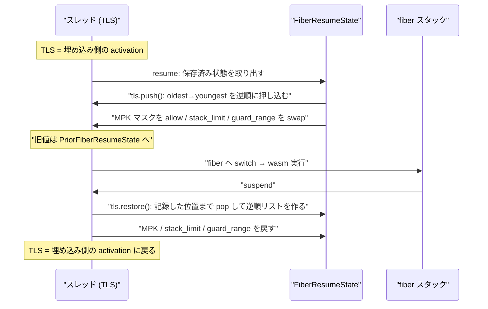

[fiber でスタックを切り替える](../why-fiber/)と決めた瞬間から、「そのスタックに紐づいていた暗黙の状態」を自分で管理する義務が発生する。何が紐づいていたかは、実際に退避しているものの一覧を見るのが早い。

**そこにはスレッドローカル変数だけでなく、CPU のレジスタ (メモリ保護キーのマスク) まで入っている**。

## 退避されるものの一覧

型の名前がそのまま説明になっている。

```rust title="crates/wasmtime/src/runtime/fiber.rs"
/// State of the world when a fiber last suspended.
///
/// This structure represents global state that a fiber clobbers during its
/// execution. For example TLS variables are updated, system resources like MPK
/// masks are updated, etc. The purpose of this structure is to track all of
/// this state and appropriately save/restore it around fiber suspension points.
struct FiberResumeState {
    /// Saved list of `CallThreadState` activations that are stored on a fiber
    /// stack.
    tls: crate::runtime::vm::AsyncWasmCallState,

    /// Saved MPK protection mask, if enabled.
    mpk: Option<ProtectionMask>,

    /// The current wasm stack limit, if in use.
    ///
    /// This field stores the old of `VMStoreContext::stack_limit` that this
    /// fiber should be using during its execution. This is saved/restored when
    /// a fiber is suspended/resumed to ensure that when there are multiple
    /// fibers within the store they all maintain an appropriate fiber-relative
    /// stack limit.
    stack_limit: usize,

    /// The executor (e.g. the Pulley interpreter state) belonging to this
    /// fiber.
    executor: Executor,
}
```

[crates/wasmtime/src/runtime/fiber.rs](https://github.com/bytecodealliance/wasmtime/blob/d8a0da6d661605713798c1c9c76be5c28e3159ff/crates/wasmtime/src/runtime/fiber.rs#L561-L603)

**「fiber が実行中にクロバーするグローバルな状態」**という定義が的確だ。この 4 つに、切り替え時に追加で入れ替えられるものが 3 つ加わる。

```rust title="crates/wasmtime/src/runtime/fiber.rs"
unsafe fn replace(
    self,
    store: &mut StoreOpaque,
    fiber: &mut StoreFiber<'_>,
) -> PriorFiberResumeState {
    let tls = unsafe { self.tls.push() };
    let mpk = swap_mpk_states(self.mpk);
    let async_guard_range = fiber
        .fiber()
        .unwrap()
        .stack()
        .guard_range()
        .unwrap_or(ptr::null_mut()..ptr::null_mut());
    let mut executor = self.executor;
    store.swap_executor(&mut executor);
    PriorFiberResumeState {
        tls,
        mpk,
        executor,
        stack_limit: store.replace_stack_limit(self.stack_limit),
        async_guard_range: store.replace_async_guard_range(async_guard_range),

        // The current suspend/future_cx are always null upon resumption, so
        // insert null. Save the old values through to get preserved across
        // this resume/suspend.
        current_suspend: store.replace_current_suspend(None),
        current_future_cx: store.replace_current_future_cx(None),
    }
}
```

`async_guard_range` はこの fiber のスタック底のガードページ範囲で、シグナルハンドラが [「wasm 由来でないフォルト」を判定した後](../is-this-wasm/) にこれと突き合わせて「fiber のスタックオーバーフローだ」と判断する。走っている fiber が変われば有効なガード範囲も変わるので、切り替えのたびに入れ替わる必要がある。`current_suspend` と `current_future_cx` は [why-fiber](../why-fiber/) で見た「wasm のフレームを跨いで運ぶポインタ」で、こちらは再開時に必ず null になる (再開直後は suspend 中でも poll 中でもないため) ので、null を入れて古い値を保存するだけになっている。

戻す側は `PriorFiberResumeState::replace` で、全部逆向きに `mem::replace` するだけだ。**保存と復元が同じ「swap」という 1 つの操作で書かれている**ので、片方だけ更新して非対称になるという事故が起きにくい。

## MPK のマスクは CPU のレジスタである

一覧の中で異質なのが `mpk: Option<ProtectionMask>` だ。

```rust title="crates/wasmtime/src/runtime/fiber.rs"
/// Saved MPK protection mask, if enabled.
///
/// When MPK is enabled then executing WebAssembly will modify the
/// processor's current mask of addressable protection keys. This means that
/// our current state may get clobbered when a fiber suspends. To ensure
/// that this function preserves context it will, when MPK is enabled, save
/// the current mask when this function is called and then restore the mask
/// when the function returns (aka the fiber suspends).
mpk: Option<ProtectionMask>,
```

実体はこれだけの関数になる。

```rust title="crates/wasmtime/src/runtime/fiber.rs"
fn swap_mpk_states(mask: Option<ProtectionMask>) -> Option<ProtectionMask> {
    mask.map(|mask| {
        let current = mpk::current_mask();
        mpk::allow(mask);
        current
    })
}
```

[メモリ保護キー](../mpk/) を有効にすると、どのプロテクションキーの領域に触れるかが x86 の PKRU レジスタで決まる。これはページテーブルではなく**スレッドの現在の CPU 状態**なので、「どのインスタンスのメモリに触れてよいか」が fiber ごとに違うなら、切り替えのたびに書き換えなければならない。

ここが「スタックを切り替える」という操作の射程を示している。**切り替わるのはスタックポインタとレジスタセットだけではない。TLS も、OS が管理する権限状態も、そのスタックの文脈の一部だった**。fiber を導入すると、それまで「スレッドに 1 つあればよかった」ものが全部「スタックに 1 つ」に格上げされる。

## 連結リストの向きが逆になる

一番技巧的なのが TLS の扱いだ。Wasmtime は [`CallThreadState`](../call-thread-state/) をスタック上に置き、TLS ポインタ 1 個を先頭とする連結リストで繋いでいる。fiber が suspend すると、その fiber のスタック上にあるノードは「今のスレッドのリスト」から外れなければならない。

```text title="crates/wasmtime/src/runtime/vm/traphandlers.rs"
* The `AsyncWasmCallState` structure represents the state of a suspended
  fiber. This is a linked list, in reverse order, from oldest activation on
  the fiber to youngest activation on the fiber.

* The `PreviousAsyncWasmCallState` structure represents a pointer within our
  thread's TLS linked list of activations when a fiber was resumed. This
  pointer is used during fiber suspension to know when to stop popping
  activations from the thread's linked list.

Note that this means that the directionality of linked list links is
opposite when stored in TLS vs when stored for a suspended fiber. The
thread's current list pointed to by TLS is youngest-to-oldest links, while a
suspended fiber stores oldest-to-youngest links.
```

[crates/wasmtime/src/runtime/vm/traphandlers.rs](https://github.com/bytecodealliance/wasmtime/blob/d8a0da6d661605713798c1c9c76be5c28e3159ff/crates/wasmtime/src/runtime/vm/traphandlers.rs#L1091-L1120)

**スレッド側は youngest→oldest、suspend 中の fiber 側は oldest→youngest**。向きが逆になっている理由は、両方の操作を素直に書くとそうなるからだ。

suspend するときは、スレッドのリストの先頭 (youngest) から順に pop する。pop した順に自分のリストへ繋いでいけば、自然に youngest が末尾、oldest が先頭の並びになる。どこまで pop するかは、resume 時に記録しておいたポインタ (`PreviousAsyncWasmCallState`) と一致した時点で止める。

resume するときは、その逆順の並びを先頭から順に push する。oldest から順に押し込めば、TLS 側では youngest が先頭に来る。**リストを走査しながら向きを反転させることで、追加の一時領域もソートも要らずに移し替えている**。

さらにその上に、もう一段の工夫がある。

```rust title="crates/wasmtime/src/runtime/vm/traphandlers.rs"
// The oldest activation, if present, has various `VMStoreContext`
// fields saved within it. These fields were the state for the
// *youngest* activation when a suspension previously happened. By
// swapping them back into the store this is an O(1) way of
// restoring the state of a store's metadata fields at the time of
// the suspension.
//
// The store's previous values before this function will all get
// saved in the oldest activation's state on the stack. The store's
// current state then describes the youngest activation which is
// restored via the loop below.
unsafe {
    if let Some(state) = self.state.as_ref() {
        state.swap();
    }
}
```

[crates/wasmtime/src/runtime/vm/traphandlers.rs](https://github.com/bytecodealliance/wasmtime/blob/d8a0da6d661605713798c1c9c76be5c28e3159ff/crates/wasmtime/src/runtime/vm/traphandlers.rs#L1260-L1292)

`CallThreadState` は生成時に `VMStoreContext` の一部フィールド (`last_wasm_exit_pc`、`last_wasm_entry_fp`、`last_wasm_entry_sp` など) を `EntryStoreContext` に退避している。これはもともと、ホスト → wasm → ホスト → wasm と入れ子になったときに [バックトレース](../backtrace-and-platforms/) の区間情報を復元するための仕組みだ。

fiber の suspend/resume は、これを流用している。**最古のアクティベーションが持つ退避領域に「suspend 時点での最新の状態」を押し込んでおき、resume 時にそれを 1 回 swap するだけでストア全体のメタデータが復元される**。suspend 側のコメントは、この裏返しの構造を自分でも「やや直感に反する」と認めている。「最も若いアクティベーションの状態が、最も古いアクティベーションの『古い』状態として保存される」。

アクティベーションが何段あっても swap は 1 回で済むので O(1) になる。`CallThreadState` を「TLS ポインタ 1 個 + スタック上のノード」という最小の形に絞ってあることが、ここで効いてくる。ノードがヒープ上の別構造だったら、こんな移し替えはできない。



TLS アクセスそのものにも fiber 由来の制約が入っている。TLS の読み書き関数は async 機能が有効なときだけ `#[inline(never)]` が付く。「Wasmtime の async サポートはスタック切り替えを使うので、異なる OS スレッドで実行が再開されうる。**つまり TLS ポインタへの借用がアクセスを跨いで生きていてはならない**。さもないとアクセスが 2 つのスレッドに分割されて不健全になる」からだ。インライン化されると、コンパイラが「同じスレッドだから TLS アドレスを使い回せる」と判断してしまう可能性がある。

## wasm の言語機能としてのスタック切り替え

ここまでは「Wasmtime が async を実装するための都合」で、wasm から見えない。これとは別に、**wasm 自身の機能としてのスタック切り替え** (stack switching proposal) の実装がある。同じ「スタックを切り替える」でも層が違う。

継続へのハンドルはポインタではなく、ポインタとリビジョンのペアになっている。

```rust title="crates/wasmtime/src/runtime/vm/stack_switching.rs"
/// A continuation object is a handle to a continuation reference
/// (i.e. an actual stack). A continuation object only be consumed
/// once. The linearity is checked dynamically in the generated code
/// by comparing the revision witness embedded in the pointer to the
/// actual revision counter on the continuation reference.
#[repr(C)]
#[derive(Debug, Clone, Copy)]
pub struct VMContObj {
    pub contref: NonNull<VMContRef>,
    pub revision: usize,
}
```

[crates/wasmtime/src/runtime/vm/stack_switching.rs](https://github.com/bytecodealliance/wasmtime/blob/d8a0da6d661605713798c1c9c76be5c28e3159ff/crates/wasmtime/src/runtime/vm/stack_switching.rs#L20-L56)

継続は 1 回しか消費できない (線形である) 必要があるが、wasm の型システムはそれを静的に保証しない。そこで **`VMContRef` 側にリビジョンカウンタを置き、ハンドルに埋め込んだリビジョン witness と比較して実行時に動的検査する**。使用済みのハンドルを再度 resume しようとすると、カウンタが進んでいるので不一致になる。線形性を「型で守れないなら、世代番号で守る」という解き方だ。

スタックの親子関係は `VMStackChain` という連結リストで表される。`Absent` / `InitialStack` / `Continuation` の 3 値で、ストアが持つチェーンは「0 個以上の `Continuation` の後に必ず `InitialStack` で終わる」。そして各ノードに `VMStackLimits` が付いていて、`VMStoreContext` のうち `stack_limit`・`last_wasm_entry_fp`・`last_wasm_entry_sp`・`last_wasm_entry_trap_handler` の 4 つを保持する。

不変条件も明文化されている。**現在実行中のスタックについては、対応する `VMStackLimits` の中身は陳腐化していて意味を持たない。生きた値は常に `VMStoreContext` の側にある**。祖先のスタックについては `VMStackLimits` が有効で、suspend 中の継続については `stack_limit` と entry 系だけが有効で exit 系は不定。

`FiberResumeState` がやっていることと構造的には同じ (実行中のスタックの状態は `VMStoreContext` に置き、切り替えのときに退避する) だが、こちらは JIT コードから直接触られる `#[repr(C)]` の構造体で、wasm の `resume` / `suspend` 命令がその管理者になる。**同じ問題を、ホストの都合で解いた版と、wasm の言語機能として解いた版が並んでいる**。

## どう活かすか

コルーチンやグリーンスレッドを自作するときに真似できるのは、**「クロバーされる状態」を 1 つの構造体に列挙して名前を付ける**という点だ。`FiberResumeState` の doc コメントが「fiber が実行中にクロバーするグローバルな状態」と定義しているので、新しいグローバル状態を足す人は「これも入れるべきか」を必ず考えることになる。列挙せずに個別の save/restore を散らすと、1 つ足し忘れたときに「たまに動く」バグになる。

もう 1 つは、保存と復元を `mem::replace` の対で書くこと。片方が「保存」でもう片方が「復元」という非対称な API にすると、順序や漏れの検証が難しくなる。swap で書けば、往復が自明に釣り合う。
