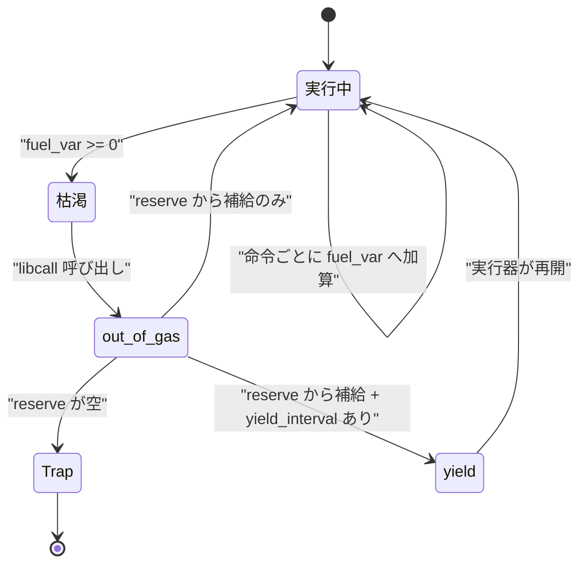

無限ループする wasm を止める手段が Wasmtime には 2 つある。fuel と [epoch](../epoch/) で、fuel のほうは**命令を数える**。同じプログラムを同じ fuel 量で走らせれば必ず同じ場所で止まるという決定性が最大の価値で、その代わりに全命令にカウンタ操作が付いてくる。

この決定性は「命令数を正確に数えている」という意味ではない。**Wasmtime は fuel の消費量を意図的に不正確にしている**。ただしその不正確さがコンパイル時に固定されるので、実行のたびに同じ場所で止まる。この 2 つは両立する。

## 数え方が逆さまになっている

`Store::set_fuel` に `1000` を渡したとき、VM が持つカウンタは `1000` にはならない。`-1000` になる。

```rust title="crates/environ/src/vmtypes.rs"
/// Indicator of how much fuel has been consumed and is remaining to
/// WebAssembly.
///
/// This field is typically negative and increments towards positive. Upon
/// turning positive a wasm trap will be generated. This field is only
/// modified if wasm is configured to consume fuel.
pub fuel_consumed: UnsafeCell<i64>,
```

[crates/environ/src/vmtypes.rs](https://github.com/bytecodealliance/wasmtime/blob/d8a0da6d661605713798c1c9c76be5c28e3159ff/crates/environ/src/vmtypes.rs#L306-L314)

この符号の反転は `Store` 側で行われる。

```rust title="crates/wasmtime/src/runtime/store.rs"
fn set_fuel(
    injected_fuel: &mut i64,
    fuel_reserve: &mut u64,
    yield_interval: Option<NonZeroU64>,
    new_fuel_amount: u64,
) {
    let interval = yield_interval.unwrap_or(NonZeroU64::MAX).get();
    // If we're yielding periodically we only store the "active" amount of fuel into consumed_ptr
    // for the VM to use.
    let injected = core::cmp::min(interval, new_fuel_amount);
    // Fuel in the VM is stored as an i64, so we have to cap the amount of fuel we inject into the
    // VM at once to be i64 range.
    let injected = core::cmp::min(injected, i64::MAX as u64);
    // Add whatever is left over after injection to the reserve for later use.
    *fuel_reserve = new_fuel_amount - injected;
    // Within the VM we increment to count fuel, so inject a negative amount. The VM will halt when
    // this counter is positive.
    *injected_fuel = -(injected as i64);
}
```

[crates/wasmtime/src/runtime/store.rs](https://github.com/bytecodealliance/wasmtime/blob/d8a0da6d661605713798c1c9c76be5c28e3159ff/crates/wasmtime/src/runtime/store.rs#L1497-L1516)

**VM 内ではカウンタを加算するので、残量を負の値として注入する**。命令を実行するたびにコストを足していき、0 以上になった時点で枯渇している。生成コードの側で見ると、「残量から引いて負になったか」を見るのも「消費量に足して閾値を超えたか」を見るのも命令数は同じだが、後者なら閾値がゼロになるので比較のオペランドが `iconst 0` で済む。実際の判定はこう出る。

```rust title="crates/cranelift/src/func_environ.rs"
// Note that our fuel is encoded as adding positive values to a
// negative number. Whenever the negative number goes positive that
// means we ran out of fuel.
//
// Compare to see if our fuel is positive, and if so we ran out of gas.
// Otherwise we can continue on like usual.
let zero = builder.ins().iconst(ir::types::I64, 0);
let fuel = builder.use_var(self.fuel_var);
let cmp = builder
    .ins()
    .icmp(IntCC::SignedGreaterThanOrEqual, fuel, zero);
builder
    .ins()
    .brif(cmp, out_of_gas_block, &[], continuation_block, &[]);
```

[crates/cranelift/src/func_environ.rs](https://github.com/bytecodealliance/wasmtime/blob/d8a0da6d661605713798c1c9c76be5c28e3159ff/crates/cranelift/src/func_environ.rs#L686-L728)

ホストから残量を問い合わせる `get_fuel` は、この符号を戻して `fuel_reserve` と足す。

```rust title="crates/wasmtime/src/runtime/store.rs"
fn get_fuel(injected_fuel: i64, fuel_reserve: u64) -> u64 {
    fuel_reserve.saturating_add_signed(-injected_fuel)
}
```

なお `Store` の初期 fuel は 0 で、`Config::consume_fuel` を有効にしただけでは wasm は 1 命令も進めない。`set_fuel` の doc に「デフォルトで `Store` は wasm が実行するための fuel を 0 で開始する (つまり即座にトラップする)」と明記されている。

## カウンタをメモリに置きっぱなしにしない

fuel の計装は「全命令の直前に `VMStoreContext.fuel_consumed` をインクリメント」ではない。それでは命令ごとにロードとストアが 1 組ずつ増える。代わりに、**関数入口でカウンタを Cranelift のローカル変数に読み込み、そこで数える**。

```rust title="crates/cranelift/src/func_environ.rs"
fn fuel_function_entry(&mut self, builder: &mut FunctionBuilder<'_>) {
    // On function entry we load the amount of fuel into a function-local
    // `self.fuel_var` to make fuel modifications fast locally. This cache
    // is then periodically flushed to the Store-defined location in
    // `VMStoreContext` later.
    debug_assert!(self.fuel_var.is_reserved_value());
    self.fuel_var = builder.declare_var(ir::types::I64);
    self.fuel_load_into_var(builder);
    self.fuel_check(builder);
}
```

[crates/cranelift/src/func_environ.rs](https://github.com/bytecodealliance/wasmtime/blob/d8a0da6d661605713798c1c9c76be5c28e3159ff/crates/cranelift/src/func_environ.rs#L532-L548)

ローカル変数にしておけば SSA の値になり、レジスタ割り当ての対象になる。しかも `self.fuel_consumed` というコンパイラ側のカウンタにコストを溜め込み、まとめて 1 回の `iadd_imm_s` にする。直線的なコードが 20 命令続けば、出るのは加算 1 個だけだ。

書き戻しと更新のタイミングは 3 段に分かれている。

- **`VMStoreContext` へストアするのは** `call` / `call_indirect` / `return` / `return_call` 系 / `unreachable` / `throw` の直前。制御が今の関数から出ていくので、他の場所が残量を読むかもしれない。
- **ローカル変数だけ更新するのは** `loop` / `if` / `br` 系 / `end` / `else`。基本ブロックが切れるので、そこまでに溜めた分を確定させる必要がある。
- **それ以外は溜めるだけ。**

`block` がわざわざ除外されているのが芸が細かい。「`block` への制御流入は無条件なので、実質的には直線コードを実行しているのと同じ。ブロックを抜けるときにカウンタを更新するので、入るときにはその必要がない」というコメントが付いている。

呼び出しの**後**には逆にリロードが入る (`fuel_after_op`)。呼ばれた関数がカウンタを進めているからだ。

## 「正確でなくてよい」と明示的に決めている

このページの中心はここにある。トラップしうる命令 (境界外のロード、ゼロ除算) は、実行の途中でブロックを抜けてしまう。その場合、ローカル変数に溜めた分は `VMStoreContext` に書き戻されない。設計者はそれを承知の上で無視している。

```rust title="crates/cranelift/src/func_environ.rs"
// This is a normal instruction where the fuel is buffered to later
// get added to `self.fuel_var`.
//
// Note that we generally ignore instructions which may trap and
// therefore result in exiting a block early. Current usage of fuel
// means that it's not too important to account for a precise amount
// of fuel consumed but rather "close to the actual amount" is good
// enough. For 100% precise counting, however, we'd probably need to
// not only increment but also save the fuel amount more often
// around trapping instructions. (see the `unreachable` instruction
// case above)
```

[crates/cranelift/src/func_environ.rs](https://github.com/bytecodealliance/wasmtime/blob/d8a0da6d661605713798c1c9c76be5c28e3159ff/crates/cranelift/src/func_environ.rs#L616-L635)

**「今の fuel の用途では、正確な消費量よりも『実際の量に近い』で十分」**。100% 正確に数えるなら、トラップしうる命令の周りでもっと頻繁に保存する必要があるだろう、とまで書いてある。つまり精度とオーバーヘッドのトレードオフを、精度を捨てる側に倒したという判断が明示されている。

これで失われるのは「トラップした瞬間の残量の正確さ」であって、「同じ入力なら同じ場所で止まる」という決定性ではない。計装の形はコンパイル時に決まるので、何度走らせても同じ命令列で同じだけカウンタが進む。fuel が欲しがられている性質は後者なので、前者は捨ててよい、という整理になっている。

命令ごとのコストは `OperatorCostStrategy` で決まる。既定は `Nop` / `Drop` と `block` / `loop` / `unreachable` / `return` / `else` / `end` が 0、それ以外がすべて 1 という単純な表で、`OperatorCostStrategy::table` に自前のコスト表を渡せば置き換えられる ([crates/environ/src/tunables.rs](https://github.com/bytecodealliance/wasmtime/blob/d8a0da6d661605713798c1c9c76be5c28e3159ff/crates/environ/src/tunables.rs#L515-L550))。`if` が 0 に入っていないのは「条件チェックのコストがかかるから」と注記されている。

## 枯渇したときに何が起きるか

チェックが枯渇を検出すると `out_of_gas` ビルトインが呼ばれる。これはトラップではなく、まず**補給を試みる**。

```rust title="crates/wasmtime/src/runtime/vm/libcalls.rs"
fn out_of_gas(store: &mut dyn VMStore, _instance: InstanceId) -> Result<()> {
    block_on!(store, async |store, _| {
        if !store.refuel() {
            return Err(Trap::OutOfFuel.into());
        }
        #[cfg(feature = "async")]
        if store.fuel_yield_interval.is_some() {
            store.yield_now().await;
        }
        Ok(())
    })?
}
```

[crates/wasmtime/src/runtime/vm/libcalls.rs](https://github.com/bytecodealliance/wasmtime/blob/d8a0da6d661605713798c1c9c76be5c28e3159ff/crates/wasmtime/src/runtime/vm/libcalls.rs#L676-L688)

`refuel` が効いてくるのが `Store::fuel_async_yield_interval` を設定したときだ。この API は「fuel を `interval` 単位消費するごとに async の実行器へ制御を返す」というもので、実装は fuel の分割で行われる。`set_fuel` が総量のうち `interval` 分だけを VM に注入し、**残りを `fuel_reserve` に置く**。VM 側は `interval` 分で枯渇するので `out_of_gas` に落ち、そこで `refuel` が予備から次の `interval` 分を注入し直し、`yield_now().await` で一度スレッドを手放す。予備も空なら `refuel` が `false` を返し、`Trap::OutOfFuel` になる。

**「定期的に yield する」を「定期的に枯渇させる」に翻訳している**わけで、生成コードには yield 専用の分岐が一切増えない。既にある枯渇チェックを再利用している。



## epoch との使い分け

Wasmtime の `docs/examples-interrupting-wasm.md` が両者を正面から比較している。fuel は「完全に決定的で、同じプログラムを同じ fuel 量で走らせれば常に同じ場所で中断される」。欠点は「epoch よりも実行時オーバーヘッドが大きく、wasm プログラムを遅くする」。epoch は逆で、実測で約 10% の速度低下と書かれている一方、非決定的で「同じ入力で同じ 1 epoch 分走らせても、1 回目と 2 回目で中断位置が違いうるし、完走してしまうこともある」。

判断基準は素直で、**「何回目の命令で止まったか」を再現したいなら fuel、「一定時間で止めたい」だけなら epoch** になる。前者が要るのは、たとえば同じ計算を複数ノードで走らせて結果を突き合わせるような用途だ。単に暴走を止めたいだけの Web サーバなら epoch でよく、実際 [wasmtime serve](../wasmtime-serve/) は epoch を使う。

なお `fuel_async_yield_interval` を呼ぶと、その `Store` は以後 `*_async` のエントリポイントを要求するようになる (`set_async_required(Asyncness::Yes)`)。yield するには fiber の上で走っている必要があるからで、その理由は [async に fiber が要る理由](../why-fiber/) にある。

## どう活かすか

「カウンタをホットパスからどけて、境界でだけ同期する」という形は、fuel に限らず使える。ポイントは 3 つある。**キャッシュする場所** (ここではレジスタに載るローカル変数)、**フラッシュしなければならない境界の同定** (制御が自分の外に出る瞬間)、そして**どこまで不正確でよいかの明文化**だ。3 つ目を曖昧にしたまま最適化すると、後から読んだ人が「これはバグでは」と直しにかかる。Wasmtime はコメントで「近ければ十分」と書き切ることでそれを防いでいる。
