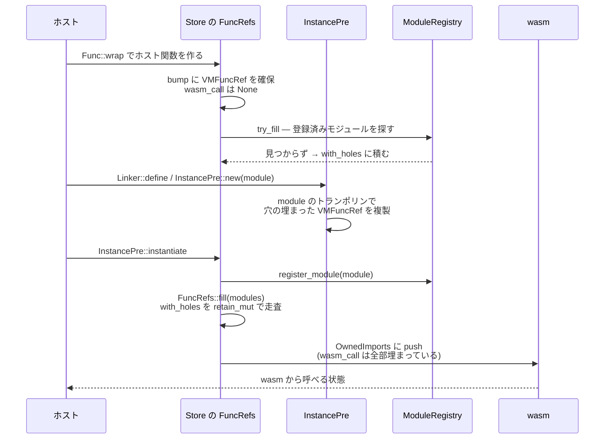

`wasmtime::Func` の実体は 2 ワードだ。所属する Store の ID と、`VMFuncRef` への生ポインタしかない。

```rust title="crates/wasmtime/src/runtime/func.rs"
#[derive(Copy, Clone, Debug)]
#[repr(C)] // here for the C API
pub struct Func {
    /// The store that the below pointer belongs to.
    ///
    /// It's only safe to look at the contents of the pointer below when the
    /// `StoreOpaque` matching this id is in-scope.
    store: StoreId,

    /// The raw `VMFuncRef`, whose lifetime is bound to the store this func
    /// belongs to.
    ///
    /// Note that this field has an `unsafe_*` prefix to discourage use of it.
    /// This is only safe to read/use if `self.store` is validated to belong to
    /// an ambiently provided `StoreOpaque` or similar. Use the
    /// `self.vm_func_ref()` method instead of this field to perform this check.
    unsafe_func_ref: SendSyncPtr<VMFuncRef>,
}

// Double-check that the C representation in `extern.h` matches our in-Rust
// representation here in terms of size/alignment/etc.
const _: () = {
    #[repr(C)]
    struct C(u64, *mut u8);
    assert!(core::mem::size_of::<C>() == core::mem::size_of::<Func>());
    assert!(core::mem::align_of::<C>() == core::mem::align_of::<Func>());
    assert!(core::mem::offset_of!(Func, store) == 0);
};
```

[crates/wasmtime/src/runtime/func.rs](https://github.com/bytecodealliance/wasmtime/blob/d8a0da6d661605713798c1c9c76be5c28e3159ff/crates/wasmtime/src/runtime/func.rs#L263-L292)

**フィールド名の `unsafe_` プレフィックスは、コンパイラでは強制できない規約を名前で表明したものだ。** 正しい経路は `vm_func_ref(store)` で、そこで `StoreId` の一致を検査してからポインタを返す。

```rust title="crates/wasmtime/src/runtime/func.rs"
    #[inline]
    pub(crate) fn vm_func_ref(&self, store: &StoreOpaque) -> NonNull<VMFuncRef> {
        self.store.assert_belongs_to(store.id());
        self.unsafe_func_ref.as_non_null()
    }
```

同じ `const _: () = { ... }` によるレイアウト検査は `Instance` や `Global` にも付いていて、C API のヘッダに書かれた構造体と Rust 側の定義がずれるとビルドが落ちる。

## 以前は Store 内のテーブルへのインデックスだった

この表現は最初からこうだったわけではない。2025 年 6 月のコミット `4fcfe17a1098592e696969f1d178145ec7037857` "Refactor the representation of `Func` (#10897)" より前の定義はこうだった。

```rust title="crates/wasmtime/src/runtime/func.rs (4fcfe17a10 より前)"
#[derive(Copy, Clone, Debug)]
#[repr(transparent)] // here for the C API
pub struct Func(Stored<FuncData>);

pub(crate) struct FuncData {
    kind: FuncKind,
    in_store_func_ref: Option<SendSyncPtr<VMFuncRef>>,

    // This is somewhat expensive to load from the `Engine` and in most
    // optimized use cases (e.g. `TypedFunc`) it's not actually needed or it's
    // only needed rarely. To handle that this is an optionally-contained field
    // which is lazily loaded into as part of `Func::call`.
    ty: Option<Box<FuncType>>,
}

enum FuncKind {
    StoreOwned { export: ExportFunction },
    SharedHost(Arc<HostFunc>),
    Host(Box<HostFunc>),
    RootedHost(RootedHostFunc),
}
```

`Stored<FuncData>` は Store の中のテーブルへのインデックスで、`Func` を作るには **Store への可変アクセスが必要**だった。そして `FuncKind` という 4 通りの所有形態を、`Func` を触るたびに match する必要があった。

新しい表現ではこれが全部消えている。`Func` はただの store タグ付き `NonNull<VMFuncRef>` なので、Store のテーブルに登録しなくても作れる。コミットメッセージが冒頭でそれを書いている ——「`Stored` 型はもう使われず、`wasmtime::Func` をいつでも自由に作れるようになった」。

## 代償が明記されている

このコミットのメッセージには、**得たものだけでなく失ったものが書かれている**。

```text title="git show 4fcfe17a1098592e696969f1d178145ec7037857"
* To implement this commit a previous optimization for the `Func` API was
  removed as well, namely `Func::call` will become slower after this
  commit. The `Func::call` API is a dynamically-typed API which requires
  run-time type-checking of arguments. Previously a `FuncType` was loaded
  into a cache once-per-`Func` which helped amortize the cost of using
  `Func::call` repeatedly. Now, though, there's no natural place to put
  such a cache since `Func` no longer has dedicated storage within a
  `Store`. Historically this optimization was added for the C API before
  the `*_call_unchecked` APIs existed, but nowadays the `*_call_unchecked`
  APIs should suffice for performance-critical applications where needed.
  In the future it might also be possible to have a hash map in the
  `Store` of a `VMSharedTypeIndex` to `FuncType` which is lazily populated
  based on calls to `Func::call`, but that feels a bit overkill nowadays
  for a possibly rarely-used map.
```

論理はこうだ。`Func::call` は動的型付けなので、呼び出しのたびに引数を実際の関数型と突き合わせる必要がある。旧表現では `FuncData::ty: Option<Box<FuncType>>` に型を 1 回だけキャッシュしていた。**新表現では `Func` が Store 内に専用の置き場所を持たないので、キャッシュを置く自然な場所がない。**

そして「そのキャッシュは元々 C API のために入れたものだった。今は `*_call_unchecked` API があるので、性能が要る場面はそちらで足りるはずだ」と、なぜその劣化を受け入れられるかまで書いてある。将来の代案 (`VMSharedTypeIndex → FuncType` のハッシュマップを Store に持つ) にも触れた上で、「めったに使わないかもしれないマップのために、それはやりすぎに感じる」と却下している。

**API の柔軟性のために、既存の最適化を意識的に外す。しかもそれを記録に残す。** 性能改善のコミットは山ほどあるが、「この変更で遅くなります」と明記されたコミットは珍しい。

キャッシュを失った先は現在のコードに残っている。

```rust title="crates/wasmtime/src/runtime/func.rs"
    /// Forcibly loads the type of this function from the `Engine`.
    ///
    /// Note that this is a somewhat expensive method since it requires taking a
    /// lock as well as cloning a type.
    pub(crate) fn load_ty(&self, store: &StoreOpaque) -> FuncType {
        FuncType::from_shared_type_index(store.engine(), self.type_index(store))
    }
```

[crates/wasmtime/src/runtime/func.rs](https://github.com/bytecodealliance/wasmtime/blob/d8a0da6d661605713798c1c9c76be5c28e3159ff/crates/wasmtime/src/runtime/func.rs#L876-L882)

型は Engine の `TypeRegistry` にあり、そこはスレッド共有なのでロックが要る ([Engine・Store・Module・Instance の役割分担](../engine-store-module-instance/))。**「Engine を触るならロック」という原則の請求書が、ここに届いている。**

## `VMFuncRef` を store が所有する

`Func` がただのポインタになった結果、その指し先を誰かが所有しなければならない。それが `StoreOpaque::func_refs: FuncRefs` だ。

```rust title="crates/wasmtime/src/runtime/store/func_refs.rs"
/// An arena of `VMFuncRef`s.
///
/// Allows a store to pin and own funcrefs so that it can patch in trampolines
/// for `VMFuncRef`s that are missing a `wasm_call` trampoline and
/// need Wasm to supply it.
#[derive(Default)]
pub struct FuncRefs {
    /// A bump allocation arena where we allocate `VMFuncRef`s such
    /// that they are pinned and owned.
    bump: AlwaysMut<bumpalo::Bump>,

    /// Pointers into `self.bump` for entries that need `wasm_call` field filled
    /// in.
    with_holes: TryVec<SendSyncPtr<VMFuncRef>>,

    /// General-purpose storage of "function things" that need to live as long
    /// as the entire store.
    storage: TryVec<Storage>,
}
```

[crates/wasmtime/src/runtime/store/func_refs.rs](https://github.com/bytecodealliance/wasmtime/blob/d8a0da6d661605713798c1c9c76be5c28e3159ff/crates/wasmtime/src/runtime/store/func_refs.rs#L13-L31)

**bump アロケータが選ばれているのは、確保した `VMFuncRef` のアドレスが動いてはいけないから**だ。`Vec` だと再確保でアドレスが変わり、既存の `Func` のポインタが無効になる。`bumpalo::Bump` は一度確保したものを二度と動かさない。

`storage` は旧 `FuncKind` の 4 バリアントが移住した先だ。`Box<HostFunc>` / `Arc<HostFunc>` / `InstancePre` の定義リスト / `InstancePre` の funcref リストという 4 種類を、**「Store が死ぬまで生かしておくためだけに」**保持する。フィールドには全部 `#[expect(dead_code, reason = "only here to keep the original value alive")]` が付いていて、読まれないことが明示されている。`Func` から所有情報が消えたぶん、所有は Store 側に一元化された。

## `wasm_call` の「穴」は、後から埋まる

`with_holes` が指しているのは、`VMFuncRef::wasm_call` が空の funcref だ。ホスト関数は「wasm の呼び出し規約で呼ばれるためのトランポリン」を自分では持てない。そのトランポリンはモジュールをコンパイルするときに一緒に生成されるので、**ホスト関数とモジュールが出会うまで埋められない** ([VMFuncRef と、wasm_call が Option である理由](../vmfuncref/))。

埋める処理はこれだけだ。

```rust title="crates/wasmtime/src/runtime/store/func_refs.rs"
    /// Patch any `VMFuncRef::wasm_call`s that need filling in.
    pub fn fill(&mut self, modules: &ModuleRegistry) {
        self.with_holes
            .retain_mut(|f| unsafe { !try_fill(f.as_mut(), modules) });
    }

// ...

unsafe fn try_fill(func_ref: &mut VMFuncRef, modules: &ModuleRegistry) -> bool {
    debug_assert!(func_ref.wasm_call.is_none());
    // ...
    func_ref.wasm_call = modules
        .wasm_to_array_trampoline(func_ref.type_index)
        .map(|f| f.into());
    func_ref.wasm_call.is_some()
}
```

[crates/wasmtime/src/runtime/store/func_refs.rs](https://github.com/bytecodealliance/wasmtime/blob/d8a0da6d661605713798c1c9c76be5c28e3159ff/crates/wasmtime/src/runtime/store/func_refs.rs#L111-L208)

`retain_mut` を使っているので、埋まったものはリストから消え、埋まらなかったものだけが残る。呼び出し元はインスタンス化の直前だ。

```rust title="crates/wasmtime/src/runtime/instance.rs"
        // When pushing functions into `OwnedImports` it's required that their
        // `wasm_call` fields are all filled out. This `module` is guaranteed
        // to have any trampolines necessary for functions so register the
        // module with the store and then attempt to fill out any outstanding
        // holes.
        //
        // Note that under normal operation this shouldn't do much as the list
        // of funcs-with-holes should generally be empty.
        let (modules, engine, breakpoints) = store.modules_and_engine_and_breakpoints_mut();
        modules.register_module(module, engine, breakpoints)?;
        let (funcrefs, modules) = store.func_refs_and_modules();
        funcrefs.fill(modules);
```

[crates/wasmtime/src/runtime/instance.rs](https://github.com/bytecodealliance/wasmtime/blob/d8a0da6d661605713798c1c9c76be5c28e3159ff/crates/wasmtime/src/runtime/instance.rs#L227-L239)

順番が重要だ。**まずモジュールを `ModuleRegistry` に登録し、それから `fill` する。** 登録前だとトランポリンが見つからない。

`Linker` 経由なら `InstancePre::new` の時点でさらに前倒しされる。ここでは Store すら関与せず、`InstancePre` 自身の中に穴の埋まった `VMFuncRef` のコピーを作っておく。

```rust title="crates/wasmtime/src/runtime/instance.rs"
                Definition::HostFunc(f) => {
                    host_funcs += 1;
                    if f.func_ref().wasm_call.is_none() {
                        func_refs.push(VMFuncRef {
                            wasm_call: module
                                .wasm_to_array_trampoline(f.sig_index())
                                .map(|f| f.into()),
                            ..*f.func_ref()
                        })?;
                    }
                    asyncness = asyncness | f.asyncness();
                }
```

[crates/wasmtime/src/runtime/instance.rs](https://github.com/bytecodealliance/wasmtime/blob/d8a0da6d661605713798c1c9c76be5c28e3159ff/crates/wasmtime/src/runtime/instance.rs#L838-L863)

同じ `InstancePre` を何度もインスタンス化するなら、このパッチ作業は 1 回で済む ([Linker と、インスタンス化の「後戻りできない点」](../linker-and-instantiation/))。



## 「決してトリップしない unwrap」

穴が全部埋まっていることに依存する箇所が 1 つある。`Func::vmimport` で、`VMFunctionImport` を作るところだ。ここには 25 行のコメントが付いている。

```rust title="crates/wasmtime/src/runtime/func.rs"
    pub(crate) fn vmimport(&self, store: &StoreOpaque) -> VMFunctionImport {
        let func_ref = unsafe { self.vm_func_ref(store).as_ref() };

        // Note that this is a load-bearing `unwrap` here, but is never expected
        // to trip at runtime. The general problem is that host functions do not
        // have a `wasm_call` function so the `VMFuncRef` type has an optional
        // pointer there. This is only able to be filled out when a function is
        // "paired" with a module where trampolines are present to fill out
        // `wasm_call` pointers.
        //
        // This pairing of modules doesn't happen explicitly but is instead
        // managed lazily throughout Wasmtime. Specifically the way this works
        // is one of:
        //
        // * When a host function is created the store's list of modules are
        //   searched for a wasm trampoline. If not found the `wasm_call` field
        //   is left blank.
        //
        // * When a module instantiation happens, which uses this function, the
        //   module will be used to fill any outstanding holes that it has
        //   trampolines for.
        //
        // This means that by the time we get to this point any relevant holes
        // should be filled out. Thus if this panic actually triggers then it's
        // indicative of a missing `fill` call somewhere else.
        let func_import = func_ref.as_vm_function_import().unwrap();

        func_import.clone()
    }
```

[crates/wasmtime/src/runtime/func.rs](https://github.com/bytecodealliance/wasmtime/blob/d8a0da6d661605713798c1c9c76be5c28e3159ff/crates/wasmtime/src/runtime/func.rs#L1215-L1245)

「この対応付けは明示的には起きず、Wasmtime 全体で遅延的に管理される」という自認と、**「もしこの panic が実際に起きたら、それはどこかで `fill` の呼び出しが漏れていることを示す」**という診断が書いてある。前述のコミットメッセージも「以前の `Func::vmimport` のロジックは、今や『なぜこの unwrap が panic しないか』を大量のコメントで説明した `.unwrap()` だけになった」と述べている。

不変条件をコードで表現できないとき、**その不変条件が破れたときに何を疑えばいいかをコメントに書いておく**。ここではそれが選ばれている。

## どう活かすか

このページの中心は、コミットメッセージの書き方そのものだ。「何を良くしたか」だけでなく **「何を犠牲にしたか」「なぜその犠牲を許容できるか」「代案を検討した上でなぜ採らなかったか」** の 3 点が揃っている。半年後にプロファイルを取って `Func::call` が遅いと気付いた人は、`git log -S` でこのコミットに辿り着き、それが事故ではなく判断だったこと、そして代案が既に検討済みであることを 1 分で知れる。

もう 1 つは `unsafe_func_ref` という命名だ。Rust の型システムでは「この生ポインタは事前検査を通してから使え」を表現できない。`unsafe_` を付けた `pub(crate)` フィールドは、レビューと grep で守る規約に翻訳される。前ページの `data_no_provenance` と同じ手口で、**Wasmtime は「型で守れないものは名前で守る」という方針を一貫して使っている**。
