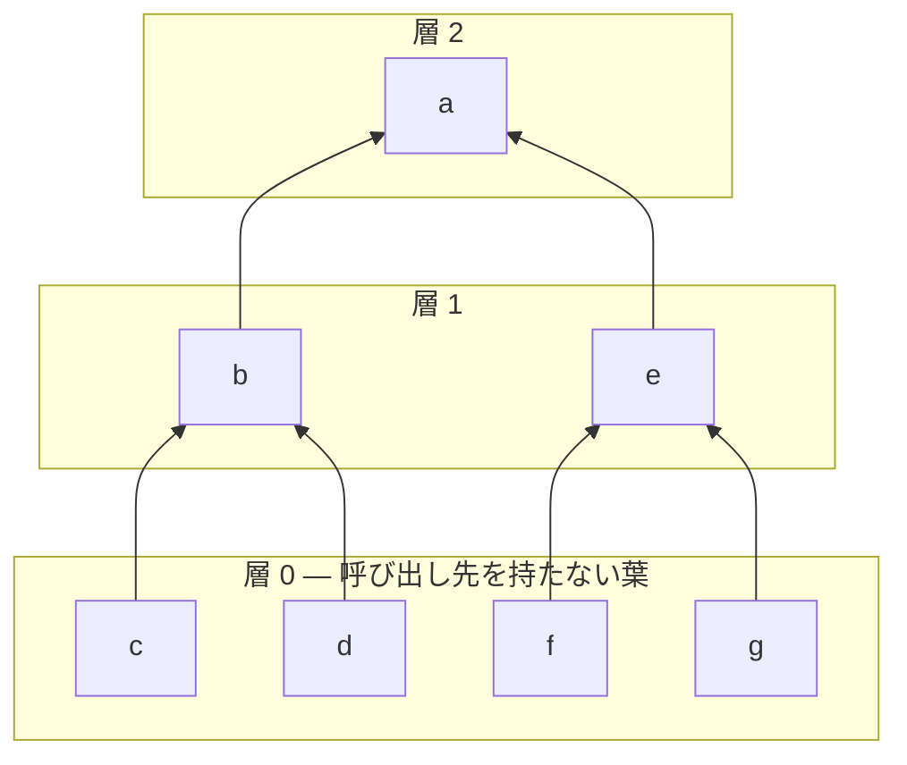

Wasmtime は関数インライン化を行う。**そのために `Compiler::compile_function` は機械語を返さなくなり、代わりに「まだ機械語になっていない何か」を返すようになった。** そして関数単位の素朴な並列化は使えなくなり、呼び出しグラフを強連結成分に分解して層ごとに処理する仕組みに置き換わっている。1 つの最適化の追加が、パイプラインの形をどう変えたかを追う。

## トレイトが 2 段に割れた

`Compiler` トレイトの doc コメントに、この変化がそのまま ASCII 図として残っている。

```text title="crates/environ/src/compile/mod.rs"
///                     +------+
///                     | Wasm |
///                     +------+
///                        |
///           Compiler::compile_function()
///                        |
///                        V
///             +----------------------+
///             | CompiledFunctionBody |
///             +----------------------+
///               |                  |
///               |                When
///               |       Compiler::inlining_compiler()
///               |               is some
///             When                 |
/// Compiler::inlining_compiler()    |-----------------.
///             is none              |                 |
///               |           Optionally call          |
///               |        InliningCompiler::inline()  |
///               |                  |                 |
///               |                  |-----------------'
///               |                  V
///               |     InliningCompiler::finish_compiling()
///               |------------------'
///               |
///   Compiler::append_code()
///               V
///           +--------+
///           | Object |
///           +--------+
```

[crates/environ/src/compile/mod.rs#L180-L227](https://github.com/bytecodealliance/wasmtime/blob/d8a0da6d661605713798c1c9c76be5c28e3159ff/crates/environ/src/compile/mod.rs#L180-L227)

`compile_function` が返す `CompiledFunctionBody` の中身は `Box<dyn Any + Send + Sync>` で、**何が入っているかはコンパイラ実装の自由**になっている。そしてトレイトの doc に、利用側への強い要求が書かれている。

```rust title="crates/environ/src/compile/mod.rs"
/// Consumers of this trait **must** check for when when this method returns
/// `Some(_)`, and **must** call `InliningCompiler::finish_compiling` on all
/// `CompiledFunctionBody`s produced by this compiler in that case before
/// passing the the compiled functions to `Compiler::append_code`, even if
/// the consumer does not actually intend to do any inlining. ...
fn inlining_compiler(&self) -> Option<&dyn InliningCompiler>;
```

[mod.rs#L231-L243](https://github.com/bytecodealliance/wasmtime/blob/d8a0da6d661605713798c1c9c76be5c28e3159ff/crates/environ/src/compile/mod.rs#L231-L243)

**「インライン化するつもりがなくても `finish_compiling` を必ず呼べ」** という一見奇妙な要求の理由は、Cranelift の実装を見ると分かる。`compile_function` の最後は、`CompilerContext` (`ir::Function` を含む codegen コンテキスト) をそのまま `Box<dyn Any>` に詰めて返している。

```rust title="crates/cranelift/src/compiler.rs"
Ok(CompiledFunctionBody {
    code: box_dyn_any_compiler_context(Some(compiler.cx)),
    needs_gc_heap,
})
```

[crates/cranelift/src/compiler.rs#L604-L607](https://github.com/bytecodealliance/wasmtime/blob/d8a0da6d661605713798c1c9c76be5c28e3159ff/crates/cranelift/src/compiler.rs#L604-L607)

そして `finish_compiling` が、その `Any` を `Option<CompilerContext>` に downcast し、取り出して、そこで初めて機械語に落とし、`Box<dyn Any>` の中身を `CompiledFunction` に差し替える。

```rust title="crates/cranelift/src/compiler.rs"
fn finish_compiling(&self, func_body: &mut CompiledFunctionBody, input: ..., symbol: &str) -> Result<()> {
    debug_assert!(!func_body.code.is::<CompiledFunction>());
    debug_assert!(func_body.code.is::<Option<CompilerContext>>());
    let cx = func_body.code.downcast_mut::<Option<CompilerContext>>().unwrap().take().unwrap();
    let compiler = FunctionCompiler { compiler: self, cx };
    // ...
    let compiled_func = if let Some(input) = input {
        compiler.finish_with_info(Some((&input, &self.tunables)), &symbol)?
    } else {
        compiler.finish(&symbol)?
    };
    // ...
    func_body.code = box_dyn_any_compiled_function(compiled_func);
    Ok(())
}
```

[compiler.rs#L1064-L1100](https://github.com/bytecodealliance/wasmtime/blob/d8a0da6d661605713798c1c9c76be5c28e3159ff/crates/cranelift/src/compiler.rs#L1064-L1100)

**`Box<dyn Any>` の中身が段階によって変わる**という、型で守れていない不変条件がここにある。だから `debug_assert!(!func_body.code.is::<CompiledFunction>())` のような主張がコードのあちこちに散らばっている。トレイトが「何が入っているか」を規定していない代償だ。

インライン化に参加する `InliningCompiler` 側は 4 つのメソッドしか持たない。`calls` (呼び出し先の `FuncKey` を列挙)、`size` (Cranelift では `func.dfg.values().len()`、つまり CLIF の値の個数)、`inline`、`finish_compiling`。**呼び出しグラフの構築とスケジューリングは `wasmtime` 側が持ち、Cranelift 側は「聞かれたら答える」だけ**という分業になっている。

## 呼び出しグラフを層に切る

インライン化はボトムアップに行う。呼び出し先を先に最適化してから呼び出し元に埋め込むほうが、結果が良くなるからだ。だが再帰があるとボトムアップの順序は定義できない。`stratify` モジュールがこの問題を扱う。

```text title="crates/wasmtime/src/compile/stratify.rs"
//! For example, when given the following tree-like call graph:
//!
//! +---+   +---+   +---+
//! | a |-->| b |-->| c |
//! +---+   +---+   +---+
//!   |       |
//!   |       |     +---+
//!   |       '---->| d |
//!   |             +---+
//!   |     +---+   +---+
//!   '---->| e |-->| f |
//!         +---+   +---+
//!           |     +---+
//!           '---->| g |
//!                 +---+
//!
//! then stratification will produce these layers:
//!
//! [
//!     {c, d, f, g},
//!     {b, e},
//!     {a},
//! ]
```

[crates/wasmtime/src/compile/stratify.rs#L1-L50](https://github.com/bytecodealliance/wasmtime/blob/d8a0da6d661605713798c1c9c76be5c28e3159ff/crates/wasmtime/src/compile/stratify.rs#L1-L50)

やり方は「呼び出しグラフの強連結成分 (SCC) を求め、その縮約グラフ (DAG) の葉を剥がす」の繰り返しだ。剥がした葉の集合が第 1 層になり、それを取り除いた後の新しい葉が第 2 層になる。実装は実際にグラフを変形するのではなく、各成分の「未処理の依存の数」を数えて 0 になったものを層に入れる。



層を跨ぐ順序は守り、層の中は並列に処理する。

```rust title="crates/wasmtime/src/compile.rs"
// Stratify the call graph into a sequence of layers. We process each
// layer in order, but process functions within a layer in parallel
// (because they either do not call each other or are part of a
// mutual-recursion cycle; either way we won't inline members of the
// same layer into each other).
let strata = stratify::Strata::<OutputIndex>::new(&call_graph.filter_nodes(...));
```

[crates/wasmtime/src/compile.rs#L728-L734](https://github.com/bytecodealliance/wasmtime/blob/d8a0da6d661605713798c1c9c76be5c28e3159ff/crates/wasmtime/src/compile.rs#L728-L734)

同じ層のメンバー同士をインライン化しないのは、**同じ層にいる = 同じ SCC にいる = 相互再帰しているかもしれない**からだ。相互再帰する関数を互いに展開すれば無限に膨らむ。この禁止を実装しているのは型でもフラグでもなく、**「処理中の層のメンバーだけ `outputs` から一時的に `take()` して抜いてある」**という状態だ。

```rust title="crates/wasmtime/src/compile.rs"
inlining_compiler.inline(caller, &mut |callee_key: FuncKey| {
    let callee_output_index: OutputIndex = key_to_output[&callee_key];

    // NB: If the callee is not inside `outputs`, then it is
    // in the same `Strata` layer as the caller (and
    // therefore is in the same strongly-connected component
    // as the caller, and they mutually recursive). In this
    // case, we do not do any inlining; communicate this
    // command via `?`-propagation.
    let callee_output = outputs[callee_output_index].as_ref()?;
    // ...
})
```

[compile.rs#L757-L771](https://github.com/bytecodealliance/wasmtime/blob/d8a0da6d661605713798c1c9c76be5c28e3159ff/crates/wasmtime/src/compile.rs#L757-L771)

`Option` の `?` が「この呼び先はインライン化しない」を意味する。取り出せないものは取り出せない、というのが規則の実装そのものになっている。同時に、これは Rust の借用検査を満たすための構造でもある。層のメンバーは `&mut` で書き換えたい (呼び先を埋め込む) が、同時に他のメンバーは `&` で読みたい (埋め込む中身を取る) からだ。

## トランポリンはインライン化に参加しない

インライン化の対象から外れる種類がある。理由が 2 か所に明記されている。

```rust title="crates/wasmtime/src/compile.rs"
// Construct the call graph for inlining.
//
// We only inline Wasm functions, not trampolines, because we rely on
// trampolines being in their own stack frame when we save the entry and
// exit SP, FP, and PC for backtraces in trampolines.
```

```rust title="crates/wasmtime/src/compile.rs"
// Trampolines cannot participate in inlining since our
// unwinding and exceptions infrastructure relies on them being
// in their own call frames.
FuncKey::ArrayToWasmTrampoline(..)
| FuncKey::WasmToArrayTrampoline(..)
| FuncKey::WasmToBuiltinTrampoline(..)
| FuncKey::PatchableToBuiltinTrampoline(..)
| FuncKey::ModuleStartup(..) => false,
```

[compile.rs#L692-L696](https://github.com/bytecodealliance/wasmtime/blob/d8a0da6d661605713798c1c9c76be5c28e3159ff/crates/wasmtime/src/compile.rs#L692-L696) / [compile.rs#L960-L970](https://github.com/bytecodealliance/wasmtime/blob/d8a0da6d661605713798c1c9c76be5c28e3159ff/crates/wasmtime/src/compile.rs#L960-L970)

**バックトレースの要求が、最適化の適用範囲を制限している。** host → wasm の境界を跨ぐとき、Wasmtime はトランポリンの中で SP・FP・PC を保存し、それを起点にスタックを歩く ([CallThreadState — スタック上に置くアクティベーションの連結リスト](../call-thread-state/))。トランポリンが呼び出し元にインライン化されて独立したスタックフレームを持たなくなると、この起点が消えてしまう。

同じ制約はヒューリスティクスの側にも現れている。

```rust title="crates/wasmtime/src/compile.rs"
// Skip inlining into array-abi functions which are entry
// trampolines into wasm. ABI-wise it's required that these have a
// single `try_call` into the module and it doesn't work if multiple
// get inlined or if the `try_call` goes away. Prevent all inlining
// to guarantee the structure of entry trampolines.
if caller_key.abi() == Abi::Array {
    return false;
}
```

[compile.rs#L879-L887](https://github.com/bytecodealliance/wasmtime/blob/d8a0da6d661605713798c1c9c76be5c28e3159ff/crates/wasmtime/src/compile.rs#L879-L887)

**下層 (スタックの歩き方、例外の捕まえ方) の要求が、上層 (最適化パス) の適用範囲を決めている。** 層を跨いだ制約が明示的にコード化されている例として読み応えがある。

## 主なターゲットは module 境界を跨ぐ呼び出し

インライン化の既定値は `Inlining::No` で、**そもそも既定では何もしない** ([tunables.rs#L274](https://github.com/bytecodealliance/wasmtime/blob/d8a0da6d661605713798c1c9c76be5c28e3159ff/crates/environ/src/tunables.rs#L274))。有効にした場合も、`Inlining` は 5 段階の enum になっていて、**モジュール内 (intra-module) のインライン化はほとんどの設定で抑制される**。理由がヒューリスティクスの中に書かれている。

```rust title="crates/wasmtime/src/compile.rs"
// Consider whether this is an intra-module call.
//
// Inlining within a single core module has most often already been done
// by the toolchain that produced the module, e.g. LLVM, and any extant
// function calls to small callees were presumably annotated with the
// equivalent of `#[inline(never)]` or `#[cold]` but we don't have that
// information anymore.
match (caller_key, callee_key) {
    (FuncKey::DefinedWasmFunction(caller_module, _), FuncKey::DefinedWasmFunction(callee_module, _)) =>
        match tunables.inlining {
            Inlining::Yes => {}
            Inlining::InterModuleAndIntraGc => {
                if caller_module == callee_module && !caller_needs_gc_heap { return false; }
            }
            Inlining::InterModule => {
                if caller_module == callee_module { return false; }
            }
            Inlining::Intrinsics => return false,
            Inlining::No => unreachable!(),
        },
    _ => {}
}
```

[compile.rs#L889-L925](https://github.com/bytecodealliance/wasmtime/blob/d8a0da6d661605713798c1c9c76be5c28e3159ff/crates/wasmtime/src/compile.rs#L889-L925)

**「単一の core module 内のインライン化は、そのモジュールを作ったツールチェイン (LLVM など) がすでに済ませていることが多い」**、そして残っている呼び出しには `#[inline(never)]` や `#[cold]` に相当する注釈が付いていたはずなのに、**Wasm になった時点でその情報は失われている**。だから同じモジュール内で追加でインライン化しても、得られるものは少なく、判断材料もない。

では何のためのパスなのか。答えは、Wasm レベルのツールチェインが決して越えられない境界 — **モジュールの境界**だ。Component Model では、1 つの component が複数の core module から構成され、モジュール間の呼び出しは融合アダプタを通る ([FACT — 融合アダプタを wasm で生成するという判断](../fact/))。アダプタは小さな関数の連なりで、しかも別モジュールにあるから LLVM の目には入らない。ここを跨いでインライン化できるのは Wasmtime だけだ。**Component Model が持ち込んだコストを回収するために必要になった最適化**であり、`Inlining::Intrinsics` (Wasmtime 自身の intrinsic だけをインライン化する最小設定) の存在もその文脈にある ([component のコンパイルは 4 段階](../component-pipeline/))。

残る 2 つの閾値は素朴だ。呼び出し元と呼び出し先のサイズの和が `inlining_sum_size_threshold` (既定 2000) を超えたら諦め、呼び出し先が `inlining_small_callee_size` (既定 50) 以下なら呼び出し元のサイズに関係なくインライン化する。`should_inline` の doc コメントには **「決定木ではなく、推定利得の式と閾値の比較に置き換えるべきだ」**という TODO が付いている。

## エイリアス領域の重複排除

インライン化には副作用がある。呼び出し先の CLIF を呼び出し元に貼り付けるとき、両者が持つエイリアス領域 (「このロードはどのメモリ領域を触るか」の注釈) が別々の実体として重複してしまう。これを防ぐため、領域には安定した `user_id` が振られている。

```rust title="crates/cranelift/src/alias_region.rs"
/// A key that uniquely identifies an alias region across an entire compilation.
///
/// This is used to assign stable `user_id`s to `AliasRegionData` entries so
/// that alias regions can be deduplicated during inlining.
///
/// The key encodes into a single `u32` with the following layout:
/// `[ kind: 6 bits | data: 26 bits ]`
enum AliasRegionKey {
    Vm { ty: VmType, offset: u32 },
    PublicMemory,
    // ...
}
```

[crates/cranelift/src/alias_region.rs#L60-L70](https://github.com/bytecodealliance/wasmtime/blob/d8a0da6d661605713798c1c9c76be5c28e3159ff/crates/cranelift/src/alias_region.rs#L60-L70)

6bit の kind で 30 種類以上の領域 (`VMContext`、`VMStoreContext`、定義済みメモリ、公開メモリ、GC ヒープ、スタックスロット、要素セグメント…) を区別し、残り 26bit にモジュールインデックスやフィールドオフセットを詰める。**識別子を数値にエンコードしておけば、比較 1 回で重複が判定できる。** [コンパイル対象は「関数」だけではない](../compile-inputs/) の `FuncKey` とまったく同じ発想が、別の場所で繰り返されている。

そして、この「精密な領域」と「保守的な公開領域」が混在するとインライン化で不正になる、という問題が翻訳フェーズにまで波及していることは [パースと検証をインターリーブし、関数本体だけ遅延する](../interleaved-validation/) で見た `known_imported_globals` の doc に書かれているとおりだ。

## どう活かすか

このページで一番持ち帰る価値があるのは、**「あとから最適化パスを足すと、パイプラインの型が変わる」**という一点だ。Wasmtime は `compile_function` の返り値を「機械語」から「機械語かもしれない何か」に緩めることで対応した。緩めた代償として `Box<dyn Any>` と `debug_assert!` が増えた。設計として綺麗ではないが、`Compiler` の実装が Cranelift と Winch の 2 つあり (Winch はトランポリン生成を `NoInlineCompiler` でくるんだ Cranelift に委譲している)、インライン化に対応するのが Cranelift だけである以上、トレイトの側に段階を持ち込むのは妥当な折衷になっている。
