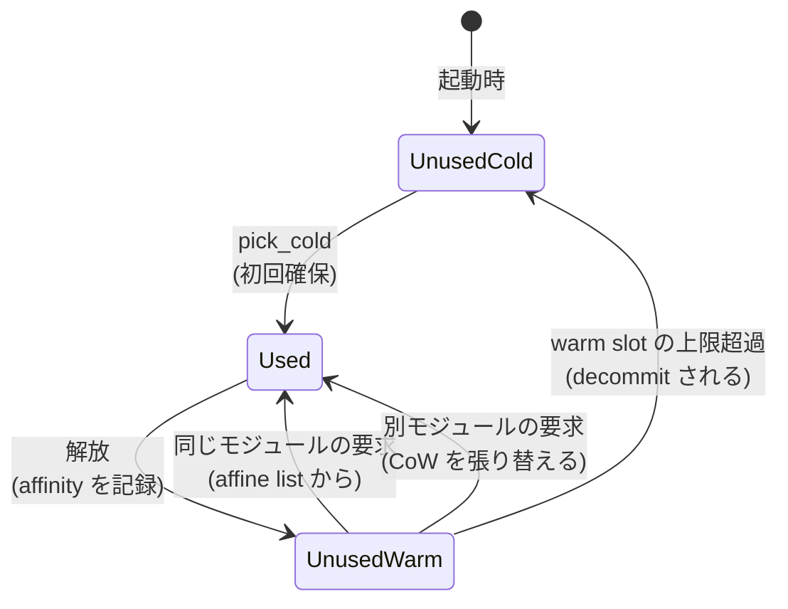

`Instance` を 1 つ作るには、線形メモリとテーブルと (async なら) fiber スタックと (GC を使うなら) GC ヒープが要る。どれも大きな mmap を伴う。この確保を抽象化しているのが `InstanceAllocator` トレイトで、**実装が 2 つあり、選択は `Config` で行う**。

```rust title="crates/wasmtime/src/runtime/vm/instance/allocator.rs"
/// Trait that represents the hooks needed to implement an instance allocator.
///
/// # Safety
///
/// This trait is unsafe as it requires knowledge of Wasmtime's runtime
/// internals to implement correctly.
pub unsafe trait InstanceAllocator: Send + Sync {
    fn validate_module(&self, module: &Module, offsets: &VMOffsets<HostPtr>) -> Result<()>;

    fn increment_core_instance_count(&self) -> Result<()>;
    fn decrement_core_instance_count(&self);

    fn allocate_memory<'a, 'b: 'a, 'c: 'a>(/* ... */)
        -> Pin<Box<dyn Future<Output = Result<(MemoryAllocationIndex, Memory)>> + Send + 'a>>;
    unsafe fn deallocate_memory(/* ... */);

    fn allocate_table<'a, 'b: 'a, 'c: 'a>(/* ... */)
        -> Pin<Box<dyn Future<Output = Result<(TableAllocationIndex, Table)>> + Send + 'a>>;
    unsafe fn deallocate_table(/* ... */);

    #[cfg(feature = "async")]
    fn allocate_fiber_stack(&self) -> Result<wasmtime_fiber::FiberStack>;
    #[cfg(feature = "async")]
    unsafe fn deallocate_fiber_stack(&self, stack: wasmtime_fiber::FiberStack);

    #[cfg(feature = "gc")]
    fn allocate_gc_heap(/* ... */) -> Result<(GcHeapAllocationIndex, Box<dyn GcHeap>)>;

    /// Primarily present for the pooling allocator to remove mappings of
    /// this module from slots in linear memory.
    fn purge_module(&self, module: CompiledModuleId);

    fn next_available_pkey(&self) -> Option<ProtectionKey>;
    fn restrict_to_pkey(&self, pkey: ProtectionKey);
    fn allow_all_pkeys(&self);
}
```

[crates/wasmtime/src/runtime/vm/instance/allocator.rs#L117-L298](https://github.com/bytecodealliance/wasmtime/blob/d8a0da6d661605713798c1c9c76be5c28e3159ff/crates/wasmtime/src/runtime/vm/instance/allocator.rs#L117-L298)

`unsafe trait` になっているのは、実装が Wasmtime のランタイム内部の不変条件 (例えば「返すメモリは `memory_reservation` バイトの予約を持つ」) を守る責任を負うからだ。トレイトの形は「インスタンス 1 つを丸ごと確保する」ではなく、**資源の種類ごとに確保と解放のフックを並べた集合**になっている。`Instance::new` 側がこれらを呼び集めて 1 つの `InstanceHandle` に織り上げる。`purge_module` や `next_available_pkey` のように、明らかに pooling のためだけにあるメソッドがトレイトに混ざっているのも特徴で、on-demand 側はこれらを no-op や `None` で実装している。

## on-demand — 毎回 mmap する

既定の実装はこちらだ。

```rust title="crates/wasmtime/src/runtime/vm/instance/allocator/on_demand.rs"
/// Represents the on-demand instance allocator.
#[derive(Clone)]
pub struct OnDemandInstanceAllocator {
    mem_creator: Option<Arc<dyn RuntimeMemoryCreator>>,
    #[cfg(feature = "async")]
    stack_creator: Option<Arc<dyn RuntimeFiberStackCreator>>,
    #[cfg(feature = "async")]
    stack_size: usize,
    #[cfg(feature = "async")]
    stack_zeroing: bool,
}
```

[crates/wasmtime/src/runtime/vm/instance/allocator/on_demand.rs#L29-L64](https://github.com/bytecodealliance/wasmtime/blob/d8a0da6d661605713798c1c9c76be5c28e3159ff/crates/wasmtime/src/runtime/vm/instance/allocator/on_demand.rs#L29-L64)

状態がほとんどない。インスタンス化のたびに線形メモリ分の mmap を発行し、破棄時に munmap する。64bit ホストでは 1 メモリあたり 8GiB の予約が走る ([4GiB 予約と 32MiB ガードの配置](../memory-layout/))。

注目すべきは 2 つのフィールドが `Option<Arc<dyn ...>>` になっていることだ。埋め込み側が `MemoryCreator` / `StackCreator` を差し込めば、mmap の代わりに自前の確保器を使える。**pooling には存在しない拡張点**で、これは pooling がスラブ全体を自分で管理する以上、外から確保方法を差し替える余地がないからだ。

## pooling — 起動時に確保してスロットを貸す

pooling は起動時に上限分をまとめて mmap し、以後はスロットを貸し借りする。

```text title="crates/wasmtime/src/runtime/vm/instance/allocator/pooling.rs"
//! The pooling instance allocator maps memory in advance and allocates
//! instances, memories, tables, and stacks from a pool of available resources.
//! Using the pooling instance allocator can speed up module instantiation when
//! modules can be constrained based on configurable limits
//! ([`InstanceLimits`]). Each new instance is stored in a "slot"; as instances
//! are allocated and freed, these slots are either filled or emptied:
//!
//! ┌──────┬──────┬──────┬──────┬──────┐
//! │Slot 0│Slot 1│Slot 2│Slot 3│......│
//! └──────┴──────┴──────┴──────┴──────┘
```

[crates/wasmtime/src/runtime/vm/instance/allocator/pooling.rs#L1-L19](https://github.com/bytecodealliance/wasmtime/blob/d8a0da6d661605713798c1c9c76be5c28e3159ff/crates/wasmtime/src/runtime/vm/instance/allocator/pooling.rs#L1-L19)

資源の種類ごとに別のプールを持つ (`MemoryPool` / `TablePool` / `StackPool` / `GcHeapPool`) のが `PoolingInstanceAllocator` の構造で、スロット ID の割り当ては共通の `index_allocator` が行う。

線形メモリのスラブ配置はこうなっている。

```text
     pre_slab_guard_bytes                                    post_slab_guard_bytes
     ◄──────────┬────────►                                   ◄──────────┬────────►
     ┌──────────────────┬────────────┬────────────┬─────┬────────────┬──────────────┐
     │    PROT_NONE     │  slot 0    │  slot 1    │ ... │  slot n-1  │  PROT_NONE   │
     └──────────────────┴────────────┴────────────┴─────┴────────────┴──────────────┘
                        ◄────┬───────►
                          slot_bytes
                        ┌────────────┬──────────────────────┐
   1 スロットの内訳:     │ max_memory │  guard (PROT_NONE)   │
                        │   _bytes   │                      │
                        └────────────┴──────────────────────┘
                        ◄─────┬──────►
                     ここだけが wasm から見えうる領域
```

`max_memory_bytes` は `InstanceLimits::max_memory_size` をページ境界に切り上げたもの、`slot_bytes` は「メモリ + その後ろのガード」の合計だ。そして `slot_bytes` の下限を決めているのがコード生成側の前提になっている。

```rust title="crates/wasmtime/src/runtime/vm/instance/allocator/pooling/memory_pool.rs"
// `memory_reservation` is the configured number of bytes for a
// static memory slot (see `Config::memory_reservation`); even
// if the memory never grows to this size (e.g., it has a lower memory
// maximum), codegen will assume that this unused memory is mapped
// `PROT_NONE`. Typically `memory_reservation` is 4GiB which helps
// elide most bounds checks. `MemoryPool` must respect this bound,
// though not explicitly: if we can achieve the same effect via
// MPK-protected stripes, the slot size can be lower than the
// `memory_reservation`.
let expected_slot_bytes =
    HostAlignedByteCount::new_rounded_up_u64(tunables.memory_reservation)
        .context("memory reservation is too large")?;
```

[crates/wasmtime/src/runtime/vm/instance/allocator/pooling/memory_pool.rs#L724-L742](https://github.com/bytecodealliance/wasmtime/blob/d8a0da6d661605713798c1c9c76be5c28e3159ff/crates/wasmtime/src/runtime/vm/instance/allocator/pooling/memory_pool.rs#L724-L742)

**スラブは 1 回確保したら伸ばせない**ので、`memory_reservation` × スロット数が起動時に予約される仮想アドレス空間になる。`total_memories` を大きくすると、この掛け算が効いてくる。そしてここに書かれている「MPK で同じ効果を達成できるならスロットサイズを `memory_reservation` より小さくできる」という逃げ道が、次のページの主題になる ([メモリ保護キーでガード領域を削る](../mpk/))。

## pooling が速い理由は 3 つある

### (a) インスタンス化時にカーネルを呼ばない

スラブは起動時に 1 回 mmap されている。インスタンス化のときにやることは、スロットの先頭 N ページを `PROT_READ | PROT_WRITE` にすることと、CoW イメージがあればそれを mmap し直すことだけになる ([copy-on-write でインスタンス化を速くする](../cow-instantiation/))。on-demand なら毎回発行される「8GiB の `PROT_NONE` 予約」が消える。

### (b) スロットにモジュール affinity がある

さらに、同じモジュールが同じスロットに戻ってくれば、CoW マッピングの張り替えすら要らない。これを狙って、スロットの割り当て器が「そのスロットが最後にどのモジュールのどのメモリに使われたか」を覚えている。

```rust title="crates/wasmtime/src/runtime/vm/instance/allocator/pooling/index_allocator.rs"
/// An index allocator that has configurable affinity between slots and modules
/// so that slots are often reused for the same module again.
#[derive(Debug)]
pub struct ModuleAffinityIndexAllocator {
    shards: Box<[super::CachePadded<Mutex<Inner>>]>,
    slots_per_shard: u32,
}

#[derive(Clone, Debug)]
enum SlotState {
    /// This slot is currently in use and is affine to the specified module's memory.
    Used(Option<MemoryInModule>),

    /// This slot is not currently used, and has never been used.
    UnusedCold,

    /// This slot is not currently used, but was previously allocated.
    UnusedWarm(Unused),
}
```

[crates/wasmtime/src/runtime/vm/instance/allocator/pooling/index_allocator.rs#L88-L180](https://github.com/bytecodealliance/wasmtime/blob/d8a0da6d661605713798c1c9c76be5c28e3159ff/crates/wasmtime/src/runtime/vm/instance/allocator/pooling/index_allocator.rs#L88-L180)



未使用スロットには「一度も使われていない (cold)」と「使われて解放された (warm)」の 2 状態があり、warm なスロットは `module_affine` というハッシュマップの中でモジュールごとのリストに繋がれる。同じモジュールの要求が来たら、まずそのリストの末尾から取る。**取れれば、そのスロットにはまだ前回の CoW マッピングが残っている**ので、mmap をやり直さずに済む。

warm なスロットを残しておくことは「メモリを解放せずに抱えている」ことでもあるので、`max_unused_warm_slots` で上限が付いている。この上限を超えると、warm スロットは decommit されて cold に戻る。速度とメモリ使用量のつまみが 1 つ用意されている、という構図だ。

### (c) decommit をバッチ化する

解放のたびに `madvise(MADV_DONTNEED)` を呼ぶのではなく、キューに積んでまとめて処理する。

```text title="crates/wasmtime/src/runtime/vm/instance/allocator/pooling/decommit_queue.rs"
//! A queue for batching decommits together.
//!
//! We don't immediately decommit a Wasm table/memory/stack/etc... eagerly, but
//! instead batch them up to be decommitted together. This module implements
//! that queuing and batching.
//!
//! Even when batching is "disabled" we still use this queue. Batching is
//! disabled by specifying a batch size of one, in which case, this queue will
//! immediately get flushed every time we push onto it.
```

[crates/wasmtime/src/runtime/vm/instance/allocator/pooling/decommit_queue.rs#L1-L9](https://github.com/bytecodealliance/wasmtime/blob/d8a0da6d661605713798c1c9c76be5c28e3159ff/crates/wasmtime/src/runtime/vm/instance/allocator/pooling/decommit_queue.rs#L1-L9)

**バッチを無効にした場合も同じキューを通る**、というのが設計として綺麗だ。バッチサイズ 1 は「積んだ直後に flush する」だけなので、経路が 1 本で済む。設定で分岐が増えない。

キューが持っているのは `iovec` の配列で、これはそのまま Linux の `process_madvise` に渡せる形をしている。

```rust title="crates/wasmtime/src/runtime/vm/sys/unix/vm.rs"
pub unsafe fn decommit_pages(iov: &[iovec]) -> io::Result<()> {
    // Attempt to use `process_madvise` as it batches everything into a singl
    // syscall instead of requiring `madvise`-per-rgion like below. This is only
    // supported on Linux with (as of the time of this writing) a relatively
    // recent kernel.
    #[cfg(target_os = "linux")]
    unsafe {
        if iov.len() > 1 && process_madvise::run_self(iov, libc::MADV_DONTNEED, 0)? {
            return Ok(());
        }
    }
    for iov in iov { /* madvise を 1 領域ずつ */ }
}
```

[crates/wasmtime/src/runtime/vm/sys/unix/vm.rs#L49-L60](https://github.com/bytecodealliance/wasmtime/blob/d8a0da6d661605713798c1c9c76be5c28e3159ff/crates/wasmtime/src/runtime/vm/sys/unix/vm.rs#L49-L60)

バッチ化が効く理由は syscall 回数だけではない。

```text title="crates/wasmtime/src/runtime/vm/sys/unix/vm.rs"
/// With `process_madvise` it's possible to inform the kernel all-at-once of a
/// list of regions to `MADV_DONTNEED`. This primarily empowers the kernel to
/// issue a single IPI for invalidating page tables on other cores as part of
/// this syscall. This is in contrast to a syscall-per-region to madvise which
/// requires an IPI-per-region. For the pooling allocator it can be much more
/// beneficial to issue a batched syscall with one IPI overhead.
```

[crates/wasmtime/src/runtime/vm/sys/unix/vm.rs#L203-L221](https://github.com/bytecodealliance/wasmtime/blob/d8a0da6d661605713798c1c9c76be5c28e3159ff/crates/wasmtime/src/runtime/vm/sys/unix/vm.rs#L203-L221)

**本当のコストは TLB shootdown の IPI** で、領域ごとに madvise すると領域ごとに他コアへの割り込みが飛ぶ。1 回の syscall にまとめれば IPI も 1 回になる。カーネル要件は厳しく、`MADV_DONTNEED` を自プロセスに対して使えるのが Linux 6.13+、`PIDFD_SELF` が 6.14+ で、使えなければ静かに従来経路に落ちる。

## シャーディング

複数スレッドが同時にインスタンス化すると、スロット割り当てとdecommit キューが競合する。両方が CPU 数でシャーディングされている。

```rust title="crates/wasmtime/src/runtime/vm/instance/allocator/pooling.rs"
/// The number of shards used for the pooling allocator's sharded data
/// structures: one per available CPU, capped to 16.
///
/// The cap bounds worst-case probing when pools run near-full, the
/// dilution of per-shard warm-slot budgets, and per-shard memory
/// overhead, while still being enough shards to make lock collisions
/// rare given the very short critical sections involved.
pub(crate) fn default_shard_count() -> u32 {
    let n = std::thread::available_parallelism()
        .map(|n| n.get())
        .unwrap_or(1)
        .min(16);
    u32::try_from(n).unwrap()
}

/// Pick this thread's shard (used for both the sharded decommit queue and
/// the sharded index allocators): assigned round-robin at first use per
/// thread, cached in a thread-local.
pub(crate) fn thread_shard(nshards: usize) -> ShardId {
    static NEXT_SHARD: AtomicUsize = AtomicUsize::new(0);
    std::thread_local! {
        static SHARD: usize = NEXT_SHARD.fetch_add(1, Ordering::Relaxed);
    }
    ShardId::from_index(SHARD.with(|s| *s) % nshards)
}
```

[crates/wasmtime/src/runtime/vm/instance/allocator/pooling.rs#L80-L131](https://github.com/bytecodealliance/wasmtime/blob/d8a0da6d661605713798c1c9c76be5c28e3159ff/crates/wasmtime/src/runtime/vm/instance/allocator/pooling.rs#L80-L131)

スレッドは初回使用時にラウンドロビンで「ホームシャード」を割り当てられ、以後そこから確保・解放する。定常状態ではスレッド間のロック競合が起きない。ホームシャードが空なら他のシャードを順に探し、**全シャードを見た後で初めてプール枯渇を報告する**。

上限 16 の根拠が 3 つ明記されているのがこの箇所の見どころだ。シャードを増やしすぎると、(1) プールが埋まってきたときのプローブ回数が増え、(2) `max_unused_warm_slots` の予算が薄まってwarm スロットを持てないシャードが出て、(3) シャードごとのメモリ overhead が積む。`ShardLayout::new` にはさらに「affinity dilution」— 別のスレッドのシャードには適合するスロットがあるのに、要求を処理するスレッドのシャードにはないので遅い経路に落ちる — という 4 つ目の理由が書かれ、**容量 128 未満のプールはそもそもシャーディングしない**という判断まで入っている ([crates/wasmtime/src/runtime/vm/instance/allocator/pooling/index_allocator.rs#L212-L250](https://github.com/bytecodealliance/wasmtime/blob/d8a0da6d661605713798c1c9c76be5c28e3159ff/crates/wasmtime/src/runtime/vm/instance/allocator/pooling/index_allocator.rs#L212-L250))。

「CPU 数だけシャードを作る」という一見自明な最適化に、はっきりしたデメリットが 4 つ挙がっていて、その全部に対して上限 16 が答えになっている。

## ホストのメモリは「フランケンシュタインインスタンス」

`wasmtime::Memory::new` でホスト側からメモリを作ると、それも `Instance` になる。Wasm オブジェクトは必ずインスタンスに属さなければならないからだ。

```rust title="crates/wasmtime/src/runtime/trampoline/memory.rs"
/// Create a "frankenstein" instance with a single memory.
///
/// This separate instance is necessary because Wasm objects in Wasmtime must be
/// attached to instances (versus the store, e.g.) and some objects exist
/// outside: a host-provided memory import, shared memory.
pub async fn create_memory(/* ... */) -> Result<InstanceId> {
    let mut module = Module::new(StaticModuleIndex::from_u32(0));
    let memory_id = module.memories.push(*memory_ty.wasmtime_memory())?;
    // ...
    // We create an instance in the on-demand allocator when creating handles
    // associated with external objects. The configured instance allocator
    // should only be used when creating module instances as we don't want host
    // objects to count towards instance limits.
    let allocator = SingleMemoryInstance {
        preallocation,
        ondemand: OnDemandInstanceAllocator::default(),
    };
    // ...
}
```

[crates/wasmtime/src/runtime/trampoline/memory.rs#L22-L68](https://github.com/bytecodealliance/wasmtime/blob/d8a0da6d661605713798c1c9c76be5c28e3159ff/crates/wasmtime/src/runtime/trampoline/memory.rs#L22-L68)

「メモリを 1 個だけ export する架空のモジュール」をその場で組み立て、それをインスタンス化する。名前の由来がコメントにそのまま書いてあるのが良い。

そして **pooling を設定していても、ここでは常に on-demand を使う**。理由は明記されていて、「ホストオブジェクトをインスタンス上限に数えたくない」から。`Config::pooling_allocation_strategy` で `total_memories: 100` と設定した利用者が期待しているのは「wasm インスタンスを 100 個」であって、`Memory::new` を呼んだ回数を含めた合計ではない。

`SingleMemoryInstance` 自身も `InstanceAllocator` の実装だが、大半のメソッドは `unreachable!()` になっている。

```rust title="crates/wasmtime/src/runtime/trampoline/memory.rs"
unsafe impl InstanceAllocator for SingleMemoryInstance<'_> {
    #[cfg(feature = "component-model")]
    fn validate_component<'a>(/* ... */) -> Result<()> {
        unreachable!("`SingleMemoryInstance` allocator never used with components")
    }

    fn validate_module(&self, module: &Module, offsets: &VMOffsets<HostPtr>) -> Result<()> {
        crate::ensure!(
            module.memories.len() == 1,
            "`SingleMemoryInstance` allocator can only be used for modules with a single memory"
        );
        self.ondemand.validate_module(module, offsets)?;
        Ok(())
    }
    // ...
}
```

[crates/wasmtime/src/runtime/trampoline/memory.rs#L126-L278](https://github.com/bytecodealliance/wasmtime/blob/d8a0da6d661605713798c1c9c76be5c28e3159ff/crates/wasmtime/src/runtime/trampoline/memory.rs#L126-L278)

「1 メモリだけを扱うアロケータ」という極端に狭い用途に特化した実装で、テーブルの確保などは呼ばれるはずがないので `unreachable!()`。トレイトの実装が広すぎるとこうなる、という例でもあるが、`validate_module` で「メモリが 1 個であること」を実際に検査してから `unreachable!()` に依存しているので、前提は実行時にも確認されている。

## どう活かすか

pooling を選ぶ判断は「速いから」だけでは足りない。**インスタンス化のコストのうち何が支配的か**によって、効く理由が変わる。mmap の syscall が支配的なら (a) が、CoW イメージの張り替えが支配的なら (b) が、破棄側の TLB shootdown が支配的なら (c) が効く。逆にモジュールの種類が多くて affinity が当たらない使い方では (b) は効かない。

そして pooling の代償は仮想アドレス空間の予約量で、これはスロット数 × `memory_reservation` の掛け算になる。同時実行数を上げたいときにここが天井になる、というのが次のページの出発点になる。
