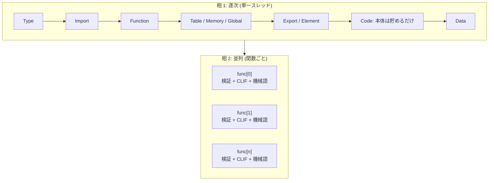

Wasmtime の検証は 2 相に分かれている。**セクションレベルは逐次かつパースと同時**、**関数本体だけは遅延して、コード生成と同時に関数ごとに並列**。この分け方は最適化の余地があってそう選ばれたのではなく、Wasm のバイナリフォーマットの構造からほぼ一意に決まる。

## セクションは「読む・検証する・記録する」が同時に起きる

翻訳の本体は `ModuleEnvironment::translate` で、`wasmparser::Parser` が吐く `Payload` を 1 つずつ `translate_payload` に流すだけだ。

```rust title="crates/environ/src/compile/module_environ.rs"
pub fn translate(mut self, parser: Parser, data: &'data [u8]) -> Result<ModuleTranslation<'data>> {
    self.result.wasm = data;

    for payload in parser.parse_all(data) {
        self.translate_payload(payload?)?;
    }

    Ok(self.result)
}
```

[crates/environ/src/compile/module_environ.rs#L438-L450](https://github.com/bytecodealliance/wasmtime/blob/d8a0da6d661605713798c1c9c76be5c28e3159ff/crates/environ/src/compile/module_environ.rs#L438-L450)

そして `translate_payload` の各アームは、**必ず冒頭で対応する `validator` のメソッドを呼ぶ**。`version` (:460)、`type_section` (:493)、`import_section` (:547)、`function_section` (:596)、`table_section` (:610)、`memory_section` (:638)、`tag_section` (:650)、`global_section` (:664)、`export_section` (:698)、`start_section` (:722)、`element_section` (:734)、`data_section` (:865)、`data_count_section` (:902)、`end` (:470)。例外なく全アームがこの形をしている。

```rust title="crates/environ/src/compile/module_environ.rs"
Payload::FunctionSection(functions) => {
    self.validator.function_section(&functions)?;

    let cnt = usize::try_from(functions.count()).unwrap();
    self.result.module.functions.reserve_exact(cnt)?;

    for entry in functions {
        let sigindex = entry?;
        let ty = TypeIndex::from_u32(sigindex);
        let interned_index = self.result.module.types[ty];
        self.result.module.push_function(interned_index);
    }
}
```

[module_environ.rs#L595-L607](https://github.com/bytecodealliance/wasmtime/blob/d8a0da6d661605713798c1c9c76be5c28e3159ff/crates/environ/src/compile/module_environ.rs#L595-L607)

つまり 1 つのセクションについて、**パース・検証・Wasmtime の構造体への記録が 1 か所でインターリーブされる**。`docs/contributing-architecture.md` の言い方では "Validation is interleaved with parsing, validating parsed values before using them" となる。

## なぜセクションを遅延できないのか

上のコードの `self.result.module.types[ty]` が答えになっている。Function セクションは「関数 `i` の型は型インデックス `ty`」としか書いておらず、それを解決するには **Type セクションを処理し終えている必要がある**。同じ依存が連鎖している。

- Import セクションは `self.result.module.types[index]` を引く (Type セクションに依存)
- Code セクションのエントリは `self.result.module.functions[func_index]` を引く (Function セクションに依存)
- Element セクションの `ref.func` はどの関数が escaping かの記録を更新する (Function/Import セクションに依存)

**後のセクションの解釈が、前のセクションで作った索引空間に依存する。** だからセクション単位の処理は逐次でしかありえないし、そもそも Wasm のセクションは順序が仕様で固定されているので (詳細は [Wasm バイナリは 12 のセクションでできている](../binary-format/))、1 パスで前から舐めれば依存は自然に満たされる。並列化する意味も余地もない。

## Code セクションだけは検証しない

例外は Code セクションだ。ここだけは本体をまったく読まずに、検証器と生バイトを貯めるだけで先に進む。

```rust title="crates/environ/src/compile/module_environ.rs"
Payload::CodeSectionEntry(body) => {
    let validator = self.validator.code_section_entry(&body)?;
    let func_index = self.result.code_index + self.result.module.num_imported_funcs as u32;
    let func_index = FuncIndex::from_u32(func_index);
    // ... (debug_native / debug_guest の場合の追加処理)
    self.result
        .function_body_inputs
        .push(FunctionBodyData { validator, body });
    self.result.code_index += 1;
}
```

[module_environ.rs#L826-L861](https://github.com/bytecodealliance/wasmtime/blob/d8a0da6d661605713798c1c9c76be5c28e3159ff/crates/environ/src/compile/module_environ.rs#L826-L861)

`code_section_entry` が返すのは検証結果ではなく `FuncToValidate<ValidatorResources>` という **「これから検証するための道具一式」**で、その中には検証に必要なモジュールの型情報のスナップショットが入っている。`FunctionBodyData` はそれと未読の `FunctionBody` を組にしただけの型だ。

```rust title="crates/environ/src/compile/module_environ.rs"
/// Contains function data: byte code and its offset in the module.
pub struct FunctionBodyData<'a> {
    /// The body of the function, containing code and locals.
    pub body: FunctionBody<'a>,
    /// Validator for the function body
    pub validator: FuncToValidate<ValidatorResources>,
}
```

[module_environ.rs#L364-L370](https://github.com/bytecodealliance/wasmtime/blob/d8a0da6d661605713798c1c9c76be5c28e3159ff/crates/environ/src/compile/module_environ.rs#L364-L370)

関数本体を遅延できるのは、**本体の検証結果が誰の索引空間も更新しないから**だ。関数 `i` の中身が何であれ、関数 `j` の型も、グローバルの数も、テーブルの中身も変わらない。本体の検証に必要な情報 (型テーブル、関数シグネチャ、テーブル・メモリ・グローバルの型) は Code セクションの手前で全部揃っていて、それをスナップショットとして持ち出せば、後はどの順序で・どのスレッドで検証しても同じ結果になる。

## 検証はコード生成と同じループで走る

貯めた `FunctionBodyData` は `CompileInputs` に積まれ、Cranelift の `compile_function` の中で消費される。ここで初めて本体が検証される。

```rust title="crates/cranelift/src/compiler.rs"
let mut validator =
    validator.into_validator(mem::take(&mut compiler.cx.validator_allocations));
compiler.cx.func_translator.translate_body(
    &mut validator,
    body.clone(),
    &mut context.func,
    &mut func_env,
)?;
```

[crates/cranelift/src/compiler.rs#L585-L591](https://github.com/bytecodealliance/wasmtime/blob/d8a0da6d661605713798c1c9c76be5c28e3159ff/crates/cranelift/src/compiler.rs#L585-L591)

`translate_body` は最終的に `parse_function_body` に落ち、そこがオペレータ単位のループになっている。

```rust title="crates/cranelift/src/translate/func_translator.rs"
while !reader.eof() {
    let pos = reader.original_position();
    builder.set_srcloc(cur_srcloc(&reader.get_binary_reader()));

    let op = reader.read()?;
    environ.next_srcloc = cur_srcloc(&reader.get_binary_reader());
    let operand_types =
        validate_op_and_get_operand_types(validator, environ, &mut operand_types, &op, pos)?;

    environ.before_translate_operator(&op, operand_types, builder)?;
    translate_operator(validator, &op, operand_types, builder, environ)?;
    environ.after_translate_operator(&op, validator, builder)?;
}
```

[crates/cranelift/src/translate/func_translator.rs#L300-L316](https://github.com/bytecodealliance/wasmtime/blob/d8a0da6d661605713798c1c9c76be5c28e3159ff/crates/cranelift/src/translate/func_translator.rs#L300-L316)

**1 命令読む → 検証する → CLIF を生成する、を 1 命令ごとに繰り返す。** セクションレベルでやっていたインターリーブが、関数の内側では命令レベルで再現される。しかも検証器が計算したオペランド型 (`operand_types`) がそのまま `translate_operator` に渡される。CLIF を作るには「このスタックトップは `i32` か `i64` か」を知る必要があり、それは検証器が同じことを計算した結果だ。**2 回計算せず、検証器の副産物を IR 生成に使い回している**。バイト列を 2 回読まないという点も含めて、遅延の恩恵は「並列にできる」だけではない。

図にすると次のようになる。



## コード生成なしで検証だけしたいとき

`Module::validate` は、同じ 2 相構造をコード生成抜きで回す。

```rust title="crates/wasmtime/src/runtime/module.rs"
let mut functions = Vec::new();
for payload in Parser::new(0).parse_all(binary) {
    let payload = payload?;
    if let ValidPayload::Func(a, b) = validator.payload(&payload)? {
        functions.push((a, b));
    }
    // ... component が来たら bail
}

engine.run_maybe_parallel(functions, |(validator, body)| {
    // FIXME: it would be best here to use a rayon-specific parallel
    // iterator that maintains state-per-thread to share the function
    // validator allocations (`Default::default` here) across multiple
    // functions.
    validator.into_validator(Default::default()).validate(&body)
})?;
```

[crates/wasmtime/src/runtime/module.rs#L584-L607](https://github.com/bytecodealliance/wasmtime/blob/d8a0da6d661605713798c1c9c76be5c28e3159ff/crates/wasmtime/src/runtime/module.rs#L584-L607)

`ModuleEnvironment` を通さない分だけ薄いが、「セクションは逐次、関数は `run_maybe_parallel`」という骨格は同じだ。FIXME が指摘しているのは、コンパイル経路の側では `Compiler` が `Mutex<Vec<CompilerContext>>` の形で `FuncValidatorAllocations` をスレッド跨ぎで使い回している ([compiler.rs#L1295-L1310](https://github.com/bytecodealliance/wasmtime/blob/d8a0da6d661605713798c1c9c76be5c28e3159ff/crates/cranelift/src/compiler.rs#L1295-L1310)) のに、`validate` 側は毎回 `Default::default()` で作り直しているという非対称だ。検証だけなら十分速いのでまだ手が付いていない。

## 記録される「モジュールの構造」

相 1 が作るのは `ModuleTranslation` で、`module` (実行時に必要な `Module`)、`function_body_inputs` (相 2 への引き継ぎ)、`debuginfo`、そして各種の初期化子を持つ ([module_environ.rs#L106-L280](https://github.com/bytecodealliance/wasmtime/blob/d8a0da6d661605713798c1c9c76be5c28e3159ff/crates/environ/src/compile/module_environ.rs#L106-L280))。

この中に `known_imported_functions` / `known_imported_globals` / `known_imported_memories` / `known_imported_tables` という一群のフィールドがある。「このインポートを常に満たす、静的に分かっている定義済みエンティティ」の記録で、関数の場合は「インポートテーブル経由の間接呼び出しになるはずのものを直接呼び出しに落とす」ために使う。単体のモジュールでは埋まらず、component の中でモジュール同士が繋がっているときに効く ([component のコンパイルは 4 段階](../component-pipeline/))。

面白いのはグローバル・メモリ・テーブル側の doc コメントで、**設計上の負債を自白している**。

```rust title="crates/environ/src/compile/module_environ.rs"
/// XXX: Being "known" requires more here than it does for functions: it is
/// not enough that *this* module's import is always the same entity,
/// *every* module that may import that entity must also always import that
/// same entity. ...
///
/// This extra condition is an artifact of this implementation, and how we
/// consume this data to choose the alias region for loads and stores to a
/// global/memory/table, not something inherent to knowing exactly which
/// entity satisfies a particular import. Really, there are two independent
/// axes here:
///
/// 1. Is this import always satisfied by the same defined entity?
///
/// 2. Is that entity's identity additionally known to *every* other module
///    that may import it?
///
/// Only alias regions need (2), but other theoretical optimizations could
/// be perfectly happy with just (1). ...
///
/// TODO(#14164): Actually record (1) and (2) in separate maps, enabling
/// optimizations that rely on just (1) but not (2), instead of folding them
/// into this same map.
pub known_imported_globals: SecondaryMap<GlobalIndex, Option<KnownGlobal>>,
```

[module_environ.rs#L143-L179](https://github.com/bytecodealliance/wasmtime/blob/d8a0da6d661605713798c1c9c76be5c28e3159ff/crates/environ/src/compile/module_environ.rs#L143-L179)

**本来独立した 2 つの性質を、今の唯一の利用者 (エイリアス領域の選択) の都合で 1 つのマップに混ぜてしまっている**、と issue 番号付きで書いてある。(2) が要るのは、精密なエイリアス領域でアクセスするコードと保守的な領域でアクセスするコードがインライン化で隣り合うと不正になるからで、これは [モジュールを跨いでインライン化し、呼び出しグラフを層に切る](../inlining-strata/) の制約が翻訳フェーズのデータ構造にまで染み出している例でもある。

## どう活かすか

「パースと検証を分けるべきか」は、フォーマットを読むコードを書くたびに出てくる問いだ。Wasmtime の答えは **「索引空間を更新する部分は逐次で 1 パス、更新しない部分だけ遅延する」** で、これは Wasm 固有ではなく一般に使える切り分けになっている。遅延する側には「後で検証を再開するのに必要な文脈」をスナップショットとして持たせる (`FuncToValidate<ValidatorResources>`)。そこさえ用意できれば、並列化は落ちてくる。
