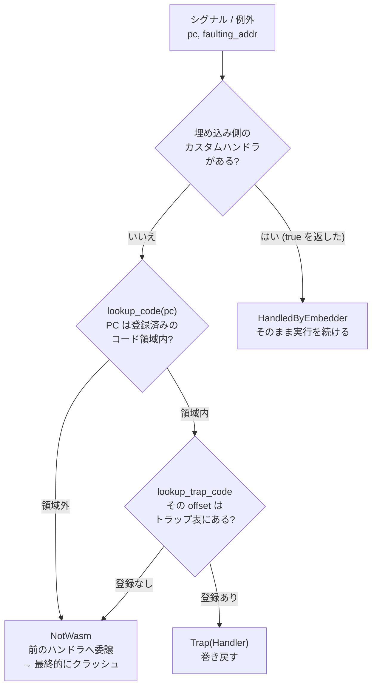

SIGSEGV がハンドラに届いた。この SIGSEGV は wasm の境界外アクセスかもしれないし、ホストの Rust コードが踏んだ本物のヌルポインタ参照かもしれない。前者なら巻き戻して `Err` を返し、後者なら委譲してプロセスを落とさなければならない。

Wasmtime はこれを 3 段階で判定する。そして **3 段目で「判定がつかない」ときに、握り潰さず落とす側を選んでいる**。



## 判定の本体

判定は `CallThreadState::test_if_trap` にある。プラットフォーム固有のコード (Unix のシグナルハンドラ、Windows の例外ハンドラ、macOS の mach ports 用スレッド) は、レジスタを取り出してここへ渡すだけだ。

```rust title="crates/wasmtime/src/runtime/vm/traphandlers.rs"
pub(crate) fn test_if_trap(
    &self,
    regs: TrapRegisters,
    faulting_addr: Option<usize>,
    call_handler: impl FnOnce(&SignalHandler) -> bool,
) -> TrapTest {
    // First up see if any instance registered has a custom trap handler,
    // in which case run them all. If anything handles the trap then we
    // return that the trap was handled.
    let _ = &call_handler;
    #[cfg(all(has_native_signals, not(miri)))]
    if let Some(handler) = self.signal_handler {
        if unsafe { call_handler(&*handler) } {
            return TrapTest::HandledByEmbedder;
        }
    }

    // If this fault wasn't in wasm code, then it's not our problem
    let Some((code, text_offset)) = lookup_code(regs.pc) else {
        return TrapTest::NotWasm;
    };

    // If the fault was at a location that was not marked as potentially
    // trapping, then that's a bug in Cranelift/Winch/etc. Don't try to
    // catch the trap and pretend this isn't wasm so the program likely
    // aborts.
    let Some(trap) = code.lookup_trap_code(text_offset) else {
        return TrapTest::NotWasm;
    };

    // If all that passed then this is indeed a wasm trap, so return the
    // `Handler` setup in the original wasm frame.
    self.set_jit_trap(regs, faulting_addr, trap);
    let entry_handler = self.entry_trap_handler();
    TrapTest::Trap(entry_handler)
}
```

[crates/wasmtime/src/runtime/vm/traphandlers.rs](https://github.com/bytecodealliance/wasmtime/blob/d8a0da6d661605713798c1c9c76be5c28e3159ff/crates/wasmtime/src/runtime/vm/traphandlers.rs#L976-L1011)

**1 段目**は埋め込み側の逃げ道だ。`Store` にカスタムのシグナルハンドラが設定されていれば、Wasmtime より先にそれを呼ぶ。`true` を返せば `HandledByEmbedder` になり、Wasmtime は何もしない。ハンドラが実行を継続できる状態に直したという前提で、そのまま return する。

**2 段目**は PC がそもそも JIT コードの中かどうか。`lookup_code` はプロセスグローバルな BTreeMap を引く。

```rust title="crates/wasmtime/src/runtime/module/registry.rs"
type GlobalRegistry = TryBTreeMap<usize, (usize, Arc<CodeMemory>)>;

/// Find which registered region of code contains the given program counter, and
/// what offset that PC is within that module's code.
pub fn lookup_code(pc: usize) -> Option<(Arc<CodeMemory>, usize)> {
    let all_modules = global_code().read();
    let (_end, (start, module)) = all_modules.range(pc..).next()?;
    let text_offset = pc.checked_sub(*start)?;
    Some((module.clone(), text_offset))
}
```

[crates/wasmtime/src/runtime/module/registry.rs](https://github.com/bytecodealliance/wasmtime/blob/d8a0da6d661605713798c1c9c76be5c28e3159ff/crates/wasmtime/src/runtime/module/registry.rs#L406-L415)

キーが領域の終端アドレスで、値が `(開始アドレス, CodeMemory)` になっている。`range(pc..).next()` で「終端が `pc` 以上の最初のエントリ」を得て、そこから開始アドレスを引いてテキストセクション内のオフセットに直す。ホスト側のコードで起きたフォルトは、当然ここに引っかからず `NotWasm` になる。

なぜこのマップが**グローバル**なのかには理由が書かれている。

```rust title="crates/wasmtime/src/runtime/module/registry.rs"
// The purpose of this map is to be called from signal handlers to determine
// whether a program counter is a wasm trap or not. Specifically macOS has
// no contextual information about the thread available, hence the necessity
// for global state rather than using thread local state.
```

[crates/wasmtime/src/runtime/module/registry.rs](https://github.com/bytecodealliance/wasmtime/blob/d8a0da6d661605713798c1c9c76be5c28e3159ff/crates/wasmtime/src/runtime/module/registry.rs#L390-L399)

macOS の mach ports 実装では、フォルトしたスレッドは停止し、別のハンドラスレッドがメッセージを読んで処理する。ハンドラスレッドの TLS はフォルトしたスレッドの TLS ではないので、**「この PC は wasm か」という問いをスレッドローカルな情報で答えられない**。この 1 点のためにグローバルなマップが存在している ([バックトレースの作り方と、macOS・Windows の事情](../backtrace-and-platforms/))。

**3 段目**が本題だ。PC が JIT コード内であることまでは分かった。しかし、JIT コードの中の**どの命令でも**フォルトしうるわけではない。

## トラップ表 — どこがトラップしうるかの記録

コンパイル時、Cranelift や Winch は「この命令はトラップしうる」という情報を出力する。それが `.wasmtime.traps` セクションに詰められる。

```rust title="crates/environ/src/obj.rs"
/// A custom binary-encoded section of wasmtime compilation artifacts which
/// encodes the ability to map an offset in the text section to the trap code
/// that it corresponds to.
///
/// This section is used at runtime to determine what flavor of trap happened
/// to ensure that embedders and debuggers know the reason for the wasm trap.
pub const ELF_WASMTIME_TRAPS: &str = ".wasmtime.traps";
```

[crates/environ/src/obj.rs](https://github.com/bytecodealliance/wasmtime/blob/d8a0da6d661605713798c1c9c76be5c28e3159ff/crates/environ/src/obj.rs#L55-L66)

このセクションは `(text_offset, trap_code)` の並びだが、素直な配列にはなっていない。全モジュールに無条件で付く情報なので、圧縮されている。

```text title="crates/environ/src/compile/trap_encoding.rs"
┌───────────────────────────────────┐
│ entry_count: u32                  │
│ block_count: u32                  │
├───────────────────────────────────┤
│ block index                       │
│ ┌───────────────────────────────┐ │
│ │ first_offset: u32             │ │  one pair per block, sorted by
│ │ data_pos: u32                 │ │  `first_offset`; `data_pos` is
│ ├───────────────────────────────┤ │  relative to the start of the
│ │ ...                           │ │  block bodies area below
│ └───────────────────────────────┘ │
├───────────────────────────────────┤
│ block bodies                      │
│ ┌───────────────────────────────┐ │
│ │ default_code: u8              │ │
│ ├───────────────────────────────┤ │
│ │ entry: uleb token             │ │  one entry per trap in the
│ │ [trap_code: u8]               │ │  block, `TRAP_BLOCK_SIZE` max
│ ├───────────────────────────────┤ │
│ │ ...                           │ │
│ └───────────────────────────────┘ │
└───────────────────────────────────┘
```

[crates/environ/src/compile/trap_encoding.rs](https://github.com/bytecodealliance/wasmtime/blob/d8a0da6d661605713798c1c9c76be5c28e3159ff/crates/environ/src/compile/trap_encoding.rs#L17-L92)

エントリは 128 個 (`TRAP_BLOCK_SIZE`) ごとのブロックに切られ、先頭に固定幅のインデックスが置かれる。各ブロックの本体は先頭に `default_code` を持ち、以降のエントリは uleb の 1 トークン `(pc_delta << 1) | code_differs` で表される。トラップコードが `default_code` と同じなら 1 バイトも足さない。

**この符号化が効く根拠がドキュメントに明記されている。**

```text title="crates/environ/src/compile/trap_encoding.rs"
/// This encoding leans on two properties of trap metadata: consecutive trap
/// sites are generally close together (pc deltas almost always fit in a
/// single-byte leb) and most entries share one trap code (typically
/// `MemoryOutOfBounds` for gc-less wasm), making explicit code bytes rare. This
/// is all in service of shrinking the minimum 5 bytes per entry (u32 offset, u8
/// code), to a bit more than one byte per entry in practice.
```

素朴に書けば 1 エントリ 5 バイト (u32 のオフセット + u8 のコード) のところが、実際には 1 バイト強で収まる。ルックアップは固定幅のインデックスを二分探索してブロックを特定し、そのブロック内を最大 128 エントリぶん線形に復号する。

```rust title="crates/environ/src/trap_encoding.rs"
pub fn lookup_trap_code(section: &[u8], offset: usize) -> Option<CompiledTrap> {
    let section = parse(section)?;
    let offset = u32::try_from(offset).ok()?;

    // Find the last block whose first pc is `<= offset`; only that block can
    // contain `offset`. Note that this is a precise search because trap pcs
    // should always be precise as well as our metadata about them, which means
    // we expect an exact match to correspond to a trap opcode.
    let block = section
        .block_index
        .partition_point(|[first_offset, _]| first_offset.get(LittleEndian) <= offset)
        .checked_sub(1)?;

    for (pc, byte) in section.block_entries(block)? {
        if pc == offset {
            let trap = CompiledTrap::from_u8(byte);
            debug_assert!(trap.is_some(), "missing mapping for {byte}");
            return trap;
        }
        if pc > offset {
            break;
        }
    }
    None
}
```

[crates/environ/src/trap_encoding.rs](https://github.com/bytecodealliance/wasmtime/blob/d8a0da6d661605713798c1c9c76be5c28e3159ff/crates/environ/src/trap_encoding.rs#L304-L328)

ブロックサイズ 128 の選び方にも根拠が付いている。ブロックあたり 8 バイトの固定インデックス費用と、ブロック内の線形復号のコストの釣り合いを取った数字だ。

なお、この検索は**完全一致**であることに注意がいる。「トラップしうる命令の範囲内」ではなく「トラップしうる命令の先頭アドレスちょうど」でなければ一致しない。ここがずれると次節の判断が発動する。

## 見分けがつかないときに握り潰さない

3 段目のコメントが、このページで一番重要な箇所だ。

```rust title="crates/wasmtime/src/runtime/vm/traphandlers.rs"
// If the fault was at a location that was not marked as potentially
// trapping, then that's a bug in Cranelift/Winch/etc. Don't try to
// catch the trap and pretend this isn't wasm so the program likely
// aborts.
let Some(trap) = code.lookup_trap_code(text_offset) else {
    return TrapTest::NotWasm;
};
```

[crates/wasmtime/src/runtime/vm/traphandlers.rs](https://github.com/bytecodealliance/wasmtime/blob/d8a0da6d661605713798c1c9c76be5c28e3159ff/crates/wasmtime/src/runtime/vm/traphandlers.rs#L997-L1002)

状況を整理する。PC は確かに JIT が生成したコードの中を指している。そこでフォルトが起きた。しかしトラップ表にはその PC が載っていない。つまり **「トラップするはずのない命令がトラップした」**。

これはコード生成器のバグとしか考えられない。境界チェックの計算が間違っていたか、レジスタにゴミが入ったか、`VMContext` からのロード連鎖のオフセットがずれたか。いずれにせよ、サンドボックスの前提が崩れている可能性を示す事象だ。

ここで Wasmtime が「よく分からないが JIT コードの中だから wasm のトラップということにしよう」と判断したらどうなるか。埋め込み側には `Err(Trap::MemoryOutOfBounds)` のような普通のエラーが返る。アプリケーションはそれをログに書いて次のリクエストを処理する。**コード生成器のバグは何ごともなかったかのように隠され、そのバグが実際にサンドボックスを破っていたとしても誰も気づかない**。

だから `NotWasm` を返す。前のハンドラへ委譲され、多くの場合は誰も処理せずプロセスが SIGSEGV で落ちる。サービスは止まり、コアダンプが残り、誰かが調べることになる。

**安全性のためにあえて可用性を捨てている**、という判断だ。「疑わしきは落とす」という方針を、コードの分岐 1 つとコメント 4 行で表明している。

Wasmtime のセキュリティ文書はサンドボックス脱出とホスト側のメモリ安全性違反を常に脆弱性として扱うと定めていて、この分岐はその方針をランタイムの側で担保する仕掛けになっている。トラップ表は「トラップの理由を埋め込み側に伝えるための表」であると同時に、**「ここ以外でフォルトしたら異常である」という契約表**でもある。

## どう活かすか

エラーハンドリングを設計するとき、「想定外の状態に落ちたら、握り潰すのと落とすのとどちらが安全か」を明示的に選ぶ価値がある。多くのコードは無意識に「握り潰して継続」を選ぶが、それは**異常の証拠を消す**選択でもある。

判断の分かれ目は「その異常が、より深刻な問題の兆候でありうるか」だ。Wasmtime の場合、未登録の PC でのフォルトは「サンドボックスが壊れているかもしれない」の兆候なので、継続は選べない。逆に、単なる入力の不備であれば握り潰して継続する方が正しい。同じ `Result` の `Err` でも、この 2 つは扱いを変えるべき別のものだ。
