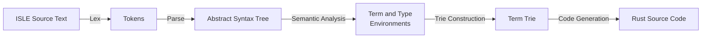
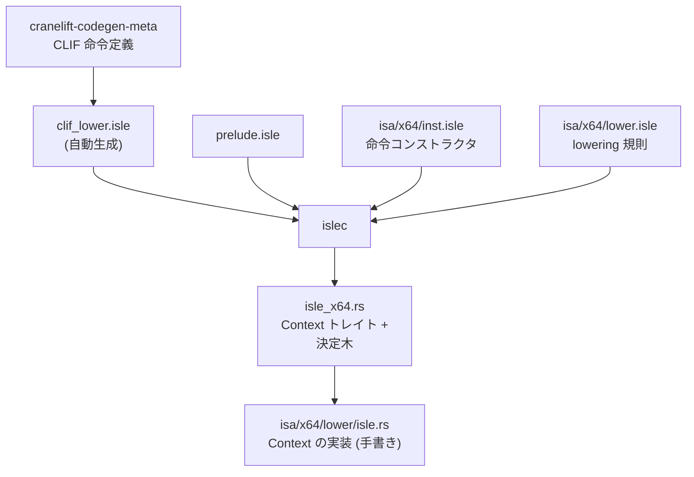

Cranelift の命令選択規則は Rust で書かれていない。**ISLE (Instruction Selection/Lowering Expressions) という項書き換え DSL** で書かれ、ビルド時に Rust の決定木へコンパイルされる。同じ DSL がミッドエンドの最適化規則にも使われ ([書き換え規則の掟 4 か条と、爆発を止める 4 つの上限](../egraph-rules/))、x64 バックエンドには形式検証用の仕様注釈まで付いている。

## 何のための言語か

ISLE の README が、この言語の位置づけを 2 段落で説明している。

```text title="cranelift/isle/README.md"
ISLE is a DSL that allows one to write instruction-lowering rules for a
compiler backend. It is based on a "term-rewriting" paradigm in which the input
-- some sort of compiler IR -- is, conceptually, a tree of terms, and we have a
set of rewrite rules that turn this into another tree of terms.

This repository contains a prototype meta-compiler that compiles ISLE rules
down to an instruction selector implementation in generated Rust code. The
generated code operates efficiently in a single pass over the input, and merges
all rules into a decision tree, sharing work where possible, while respecting
user-configurable priorities on each rule.

The ISLE language is designed so that the rules can both be compiled into an
efficient compiler backend and can be used in formal reasoning about the
compiler.
```

[cranelift/isle/README.md](https://github.com/bytecodealliance/wasmtime/blob/d8a0da6d661605713798c1c9c76be5c28e3159ff/cranelift/isle/README.md#L14-L33)

ここに DSL にした理由が 3 つ入っている。

1 つ目は、**独立して書いた規則を 1 つの決定木に自動で畳めること**だ。命令選択を手で書くと、巨大な `match` の入れ子になり、「32 ビットの `iadd` で片方が sinkable なロードの場合」のようなケースを足すたびに、既存の分岐のどこに挿し込むかを人間が考えなければならない。ISLE では規則を並べて書くだけで、コンパイラが共通する検査を括り出した決定木を作る。"sharing work where possible" がそれだ。

2 つ目は、**優先度を規則ごとに宣言できること**。複数の規則がマッチしうるとき、どれを選ぶかを規則本体から切り離して数値で書ける。

3 つ目が "can be used in formal reasoning about the compiler" で、これが最も遠くを見ている。規則を「2 つの言語の値の間の等価性」として読めるように言語を設計しておけば、そのまま論理的な仕様として扱える。README はこの用途を当時 future work としていたが、後述するとおり x64 の `lower.isle` には既に仕様注釈が入っている。

## islec のパイプライン

ISLE コンパイラ `islec` は 5 段構成だ。



[cranelift/isle/README.md](https://github.com/bytecodealliance/wasmtime/blob/d8a0da6d661605713798c1c9c76be5c28e3159ff/cranelift/isle/README.md#L436-L496)

レキサは pull ベースで、トークン列を先に全部作らない。パーサは手書きの再帰下降。意味解析 (`sema.rs`) が型検査を行い、どの規則がどの項に適用されるかを決める。

肝は 4 段目の trie construction だ。各規則の左辺パターンを線形化して trie に挿入する。この trie が生成される決定木の骨格になる。`trie_again.rs` の冒頭がこの表現の狙いを書いている。

```text title="cranelift/isle/isle/src/trie_again.rs"
A strongly-normalizing intermediate representation for ISLE rules. This
representation is chosen to closely reflect the operations we can implement in
Rust, to make code generation easy.
```

[cranelift/isle/isle/src/trie_again.rs](https://github.com/bytecodealliance/wasmtime/blob/d8a0da6d661605713798c1c9c76be5c28e3159ff/cranelift/isle/isle/src/trie_again.rs#L1-L2)

同じ段階で重なり検出も走る。複数の規則が同じ入力にマッチしうるのに優先度で順序が決まっていない場合、それはエラーになる。エラーの出し方に工夫がある。

```rust title="cranelift/isle/isle/src/overlap.rs"
/// Condense the overlap information down into individual errors. We iteratively remove the
/// nodes from the graph with the highest degree, reporting errors for them and their direct
/// connections. The goal with reporting errors this way is to prefer reporting rules that
/// overlap with many others first, and then report other more targeted overlaps later.
fn report(mut self) -> Vec<Error> {
```

[cranelift/isle/isle/src/overlap.rs](https://github.com/bytecodealliance/wasmtime/blob/d8a0da6d661605713798c1c9c76be5c28e3159ff/cranelift/isle/isle/src/overlap.rs#L34-L38)

重なりを無向グラフとして持ち、**次数が最も高いノードから順に取り除いてエラーにする**。1 つの規則が広すぎて 20 個の規則と衝突している場合、20 個の個別エラーではなく「この 1 つの規則が問題だ」というエラーが先に出る。エラーメッセージの設計としてそのまま真似できる発想だ。

## 4 種類のファイルの役割分担

ISLE のコードは 1 か所にまとまっていない。`cranelift/docs/isle-integration.md` が置き場所と役割を列挙している。要点だけ拾うと、

- `cranelift/codegen/src/prelude.isle` — 共通の定義と宣言。すべての ISLE コンパイルに含まれる。
- `target/.../out/clif_lower.isle` — **自動生成**。CLIF を ISLE から扱うための宣言とヘルパ。lowering 用。ミッドエンド用には `clif_opt.isle` が別に生成される。
- `cranelift/codegen/src/isa/<arch>/inst.isle` — ISA 固有のヘルパ。各命令のコンストラクタ、特定レジスタを取るヘルパなど。
- `cranelift/codegen/src/isa/<arch>/lower.isle` — 命令選択規則の本体。
- `cranelift/codegen/src/isa/<arch>/lower/isle.rs` — 生成された Rust を残りのバックエンドに繋ぐ手書きの糊。ISA 固有の `extern` ヘルパの実装が入る。

`clif_lower.isle` と `clif_opt.isle` が自動生成であることが重要だ。CLIF の命令定義は `cranelift-codegen-meta` クレートが持っていて、`meta/src/gen_inst.rs` がそこから ISLE の `extern` 宣言を吐く。**CLIF に命令を足すと、ISLE 側でその命令にマッチする書き方が自動で生えてくる。** 命令定義の単一定義源が meta クレートにあり、Rust 側の `InstructionData` も ISLE 側の宣言も両方そこから生成される。

生成された Rust は `Context` トレイトに対してジェネリックになっている。ISLE で `extern` として宣言したヘルパ 1 つがトレイトメソッド 1 つに対応し、その実装が `lower/isle.rs` に手書きで置かれる。



ビルド統合は `cranelift/codegen/build.rs` にある。ISLE コンパイラは build-dependency として組み込まれ、ビルドスクリプトから呼ばれる。`isle-integration.md` の言い方では "the ISLE compiler behaves as an additional compile step, and ISLE source is rebuilt just like any Rust source would be. Nothing special needs to be done when editing ISLE."

生成コードを覗きたいときのための逃げ道も用意されている。

```rust title="cranelift/codegen/build.rs"
println!("cargo:rerun-if-env-changed=ISLE_SOURCE_DIR");

let isle_dir = if let Ok(path) = std::env::var("ISLE_SOURCE_DIR") {
    // This will canonicalize any relative path in terms of the
    // crate root, and will take any absolute path as overriding the
    // `crate_dir`.
    crate_dir.join(&path)
} else {
    out_dir.into()
};
```

[cranelift/codegen/build.rs](https://github.com/bytecodealliance/wasmtime/blob/d8a0da6d661605713798c1c9c76be5c28e3159ff/cranelift/codegen/build.rs#L66-L75)

既定では `target/` の中に出るが、`ISLE_SOURCE_DIR` を指定すれば任意のディレクトリに出せる。ドキュメントが挙げている用途は "you can inspect it, debug by setting breakpoints in it, etc." で、**生成コードにブレークポイントを張れるようにする**ためだ。DSL を導入するとデバッグ体験が悪化しがちなので、この逃げ道は最初から用意されている。同じ趣旨で、詳細なエラーが欲しければ `--features isle-errors` を付ける。

## 規則の書き方と優先度

x64 の `lower.isle` を実際に見る。`iconst` の規則が 2 本ある。

```lisp title="cranelift/codegen/src/isa/x64/lower.isle"
;; `i64` and smaller.
(rule (lower (iconst (fits_in_64 ty) (u64_from_imm64 x)))
      (imm ty x))

;; `i128`
(rule 1 (lower (iconst $I128 (u64_from_imm64 x)))
      (value_regs (imm $I64 x)
                  (imm $I64 0)))
```

[cranelift/codegen/src/isa/x64/lower.isle](https://github.com/bytecodealliance/wasmtime/blob/d8a0da6d661605713798c1c9c76be5c28e3159ff/cranelift/codegen/src/isa/x64/lower.isle#L45-L53)

`rule` の直後の数字が優先度で、省略時は 0。`i128` の規則が優先度 1 なので先に試される。**特殊ケースを優先度で持ち上げるだけで、規則の記述順にも `match` の並び順にも依存しない。**

`iadd` はもっと段が多い。

```lisp title="cranelift/codegen/src/isa/x64/lower.isle"
;; Base case for 8 and 16-bit types
(rule -6 (lower (iadd (fits_in_16 ty) x y))
      (x64_add ty x y))

;; Base case for 32 and 64-bit types which might end up using the `lea`
;; instruction to fold multiple operations into one.
(rule iadd_base_case_32_or_64_lea -5 (lower (iadd (ty_32_or_64 ty) x y))
      (x64_lea ty (to_amode_add (mem_flags_trusted_data) x y (zero_offset))))

;; Higher-priority cases than the previous two where a load can be sunk into
;; the add instruction itself. Note that both operands are tested for
;; sink-ability since addition is commutative
(rule -4 (lower (iadd (fits_in_64 ty) x (sinkable_load y)))
      (x64_add ty x y))
(rule -3 (lower (iadd (fits_in_64 ty) (sinkable_load x) y))
      (x64_add ty y x))
```

[cranelift/codegen/src/isa/x64/lower.isle](https://github.com/bytecodealliance/wasmtime/blob/d8a0da6d661605713798c1c9c76be5c28e3159ff/cranelift/codegen/src/isa/x64/lower.isle#L80-L102)

基本形が優先度 -6 と -5 で最下層にあり、ロードを畳み込める場合が -4 と -3 でその上に載る。さらに `$I128` の規則が優先度 1〜3 にいる。負の優先度を基本形に振り、特殊化を 0 に近づけていくという書き方だ。

「加算は可換なので両方のオペランドを sink 可能かどうか試す」というコメントは、ミッドエンドの掟 3 (交換則を書くな、同じ規則を 2 回書け) と同じ方針が lowering 側でも取られていることを示している。

## lowering 規則は常に純粋で SSA

ISLE の規則にはもう 1 つ厳しい規律がある。

```text title="cranelift/docs/isle-integration.md"
The lowering rules themselves, defined in
`cranelift/codegen/src/isa/<arch>/lower.isle`, must always be a pure mapping
from a CLIF instruction to the target ISA's `MachInst`.

Examples of things that the lowering rules themselves shouldn't deal with or
talk about:

* Registers that are modified (both read and written to, violating SSA)
* Implicit uses of registers
* Maintaining use counts for each CLIF value or virtual register
```

[cranelift/docs/isle-integration.md](https://github.com/bytecodealliance/wasmtime/blob/d8a0da6d661605713798c1c9c76be5c28e3159ff/cranelift/docs/isle-integration.md#L95-L107)

問題は、実機の命令が SSA ではないことだ。x86 の `add` は第 1 オペランドを読んで書く。

```text title="cranelift/docs/isle-integration.md"
    add a, b    ==    a = a + b

So we present an SSA facade where `add` operates on three registers, instead of
two, and defines one of them, while reading the other two and leaving them
unmodified:

    add a, b, c    ==    a = b + c

Then, as an implementation detail of the facade, we emit moves as necessary:

    add a, b, c    ==>    mov a, b; add b, c
```

**3 レジスタの SSA ファサードを `inst.isle` の層で被せ、`mov` への legalize は ISLE の規則の外で行う。** x86 のように破壊的な命令が多い ISA では `MachInst` のメソッドとして、aarch64 のように稀な ISA では `inst.isle` の層で処理する。どちらにせよ lowering 規則は純粋なままだ。挿入された `mov` の多くは、レジスタ割り当ての move coalescing が消してくれる。

副作用の扱いも規律化されている。**抽出子 (規則の左辺のマッチャ) は決して副作用を持ってはならない。** 左辺を評価している時点では、その規則の右辺を採用すると決まっていないからだ。ドキュメントの言葉では "we could get deeply confusing action-at-a-distance bugs where rules we never fully match pull the rug out from under our feet"。

具体例がロードの sinking だ。`add` のオペランドにロードを畳み込んだら、元の CLIF の `load` は「もう lowering 済み」と記録しなければならない。これは副作用なので抽出子ではできない。そこで抽出子 `sinkable_load` は「畳み込みに必要な情報一式」を `SinkableLoad` という型に詰めて返すだけにし、実際に記録するのは右辺で呼ばれるコンストラクタ `sink_load` の役目になっている。**副作用を「記述」と「実行」に割り、実行を右辺側に寄せる。**

## 形式検証用の仕様注釈

x64 の `lower.isle` の先頭には、`lower` という項そのものに対する仕様が書かれている。

```lisp title="cranelift/codegen/src/isa/x64/lower.isle"
(spec (lower arg)
      (provide
            ; On successful execution, computation results match.
            (if (not clif_trap)
                  ; Results agree.
                  (= result arg)
                  ; If we expect a CLIF trap, it should happen in execution
                  ; also.
                  exec_trap)

            ; Should trap on both sides, or neither.
            (= clif_trap exec_trap)

            ; Load effects
            ; Either both active, or both not.
            (= (:active clif_load) (:active isa_load))
            ; If active, their parameters must match.
            (=> (:active clif_load) (= clif_load isa_load))

            ; Store effects
            (= (:active clif_store) (:active isa_store))
            (=> (:active clif_store)
                  (and
                        (= (:size_bits clif_store) (:size_bits isa_store))
                        (= (:addr clif_store) (:addr isa_store))
                        (=
                              (conv_to (:size_bits clif_store) (:value clif_store))
                              (conv_to (:size_bits clif_store) (:value isa_store)))))))
(decl partial lower (Inst) InstOutput)
```

[cranelift/codegen/src/isa/x64/lower.isle](https://github.com/bytecodealliance/wasmtime/blob/d8a0da6d661605713798c1c9c76be5c28e3159ff/cranelift/codegen/src/isa/x64/lower.isle#L5-L37)

これが「lowering が正しい」の定義だ。読むと 4 条件になっている。トラップしないなら結果の値が一致すること。**CLIF がトラップするなら実装もトラップし、逆も成り立つこと**。ロードの副作用が「あるかないか」と「そのパラメータ」の両方で一致すること。ストアについても同様で、こちらはサイズ・アドレス・値をサイズで切り詰めたうえで比較する。

仕様は `spec` フィーチャを有効にしたときだけビルドに入り (`cranelift/codegen/meta/src/isle.rs` の `spec_inputs`)、通常のコード生成からは除かれる。README が "future work and outside the scope of this prototype" と書いていた形式検証は、少なくとも仕様の記述という形で本体に入っている。

**規則を DSL で書いたことの見返りがここに出ている。** 手書きの Rust で命令選択を書いていたら、「この関数が何を保証するか」を機械可読な形で並べる場所がない。項書き換え規則なら、規則 1 本が「入力の項と出力の項が等価である」という主張そのものなので、検証器に渡せる形になる。

## どう活かすか

ISLE から持ち帰れるのは、**「宣言的に書ける部分」と「副作用を持つ部分」を言語レベルで分離する**という判断だ。抽出子は副作用を持てない、lowering 規則は純粋で SSA、破壊的命令のファサードは別の層。この 3 つの線引きが、規則を人間にとって読みやすく、コンパイラにとって畳みやすく、検証器にとって扱いやすい形に同時に保っている。

もう 1 つは、DSL を入れるときの逃げ道の用意の仕方だ。生成コードを任意の場所に出せる環境変数、詳細エラー用のフィーチャフラグ、重なり検出の「次数の高い順に報告する」ヒューリスティック。**DSL の導入コストの大半は、うまくいかなかったときのデバッグ体験に現れる**という理解が、これらの仕掛けの背後にある。
