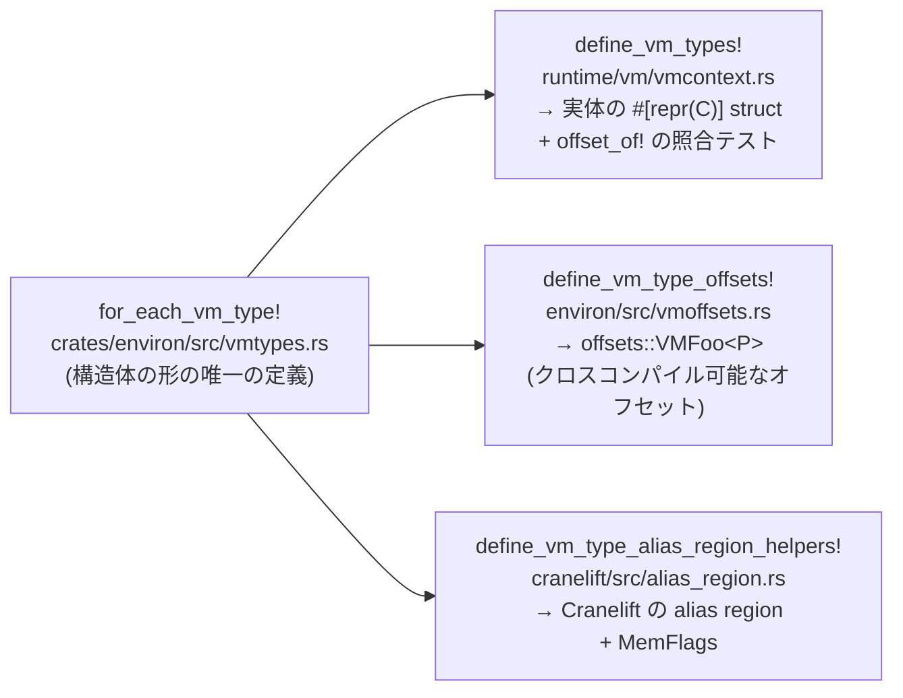

`VMMemoryDefinition` の `base` フィールドは、オフセット 0 にある。この事実を知っている必要があるのは 2 か所だ。ランタイムの Rust コードは `def.base` と書いてアクセスし、Cranelift は `load.i64 vmctx+0` という命令を吐く。**両者がずれたら、wasm は他人のメモリを読む。**

Wasmtime はこの 2 つを別々に書かない。構造体の形を `crates/environ/src/vmtypes.rs` の 1 か所に書き、そこから全部生成する。

```rust title="crates/environ/src/vmtypes.rs"
//! Centralized definitions of the various `VM*` types whose layout is shared
//! between the runtime (which uses the actual structures) and the compiler
//! (which uses the types' offsets and has per-type alias regions).
//!
//! To keep these in sync, the shape of each type is defined exactly once here,
//! via the higher-order [`for_each_vm_type!`] macro, and each consumer
//! generates its view of the type from that single source of truth.
```

[crates/environ/src/vmtypes.rs#L1-L7](https://github.com/bytecodealliance/wasmtime/blob/d8a0da6d661605713798c1c9c76be5c28e3159ff/crates/environ/src/vmtypes.rs#L1-L7)

## 高階マクロ

`for_each_vm_type!` は単一の規則しか持たない。引数に受け取ったマクロ名 `$mac` を、構造体定義の並びに対して 1 回だけ呼ぶ。

```rust title="crates/environ/src/vmtypes.rs"
#[macro_export]
macro_rules! for_each_vm_type {
    ($mac:ident) => {
        $mac! {
            /// The fields compiled code needs to access to utilize a WebAssembly linear
            /// memory defined within the instance, namely the start address and the
            /// size in bytes.
            #[derive(Debug)]
            #[repr(C)]
            #[snake_name = vm_memory_definition]
            pub struct VMMemoryDefinition {
                /// The start address.
                pub base: VmPtr<u8>,

                /// The current logical size of this linear memory in bytes.
                pub current_length: AtomicUsize,
            }

            // ... VMTableDefinition, VMGlobalDefinition, VMTagDefinition, VMFuncRef,
            //     VMFunctionImport, VMMemoryImport, VMTableImport, VMGlobalImport,
            //     VMTagImport, VMStoreContext, ...
        }
    };
}
```

[crates/environ/src/vmtypes.rs#L42-L62](https://github.com/bytecodealliance/wasmtime/blob/d8a0da6d661605713798c1c9c76be5c28e3159ff/crates/environ/src/vmtypes.rs#L42-L62)

書かれているのは Rust の構造体定義そのままの見た目だが、これは Rust のコードではない。**マクロへの入力トークン列**であって、`#[snake_name = ...]` という Rust には存在しない属性が混ざっている。消費側がそれぞれ好きな形に読み替える。



## 3 つの消費者

**ランタイムの実体**は `define_vm_types!` が作る。属性を落として素の `struct` を吐くだけの、ほぼ恒等変換に近いマクロだ ([crates/wasmtime/src/runtime/vm/vmcontext.rs#L197-L272](https://github.com/bytecodealliance/wasmtime/blob/d8a0da6d661605713798c1c9c76be5c28e3159ff/crates/wasmtime/src/runtime/vm/vmcontext.rs#L197-L272))。

**コンパイラ側のオフセット**は `define_vm_type_offsets!` が作る。こちらは `struct` を作らず、`offsets::VMMemoryDefinition<P>` のような「ポインタ幅 `P` でパラメタ化された、フィールド名と同名のメソッドを持つ型」を生成する。クロスコンパイルのために、ホストの `size_of` ではなくターゲットのポインタ幅からオフセットを計算する必要があるからだ。型からサイズへの分類はマクロの規則として書いてある。

```rust title="crates/environ/src/vmoffsets.rs"
(@size ($p:expr) VmPtr < $g:ty >) => { u32::from($p) };
(@size ($p:expr) Option < VmPtr < $g:ty >>) => { u32::from($p) };
(@size ($p:expr) AtomicUsize) => { u32::from($p) };
(@size ($p:expr) usize) => { u32::from($p) };
(@size ($p:expr) i64) => { 8u32 };
// ...
// NB: 64-bit integers are assumed to be 8-aligned, which holds everywhere except
// `i686-unknown-linux-gnu`, and the pointer size alone can't tell those apart. Types
// with 64-bit fields must therefore put them first and force their own alignment with
// `#[repr(C, align(8))]`, as `VMStoreContext` does.
```

[crates/environ/src/vmoffsets.rs#L37-L97](https://github.com/bytecodealliance/wasmtime/blob/d8a0da6d661605713798c1c9c76be5c28e3159ff/crates/environ/src/vmoffsets.rs#L37-L97)

**Cranelift の alias region** は `define_vm_type_alias_region_helpers!` が作る ([crates/cranelift/src/alias_region.rs#L736](https://github.com/bytecodealliance/wasmtime/blob/d8a0da6d661605713798c1c9c76be5c28e3159ff/crates/cranelift/src/alias_region.rs#L736))。生成されるのは `alias_regions.vm_memory_definition().base()` のようなアクセサで、返ってくる `Field` はオフセットと Cranelift の型と `MemFlags` を全部束ねている。「`VMMemoryDefinition` のオフセット 0 への load」という同一の領域を指す複数のロードは、同じ alias region に属するとエイリアス解析に伝わる。

## ずれたら CI が落ちる

生成物が 3 つに分かれた以上、それらが本当に一致している保証が要る。`define_vm_types!` は `struct` と一緒にテストモジュールを吐く。

```rust title="crates/wasmtime/src/runtime/vm/vmcontext.rs"
#[cfg(test)]
mod test_vm_type_layouts {
    use super::{ $( $Name, )* };
    use core::mem::{align_of, offset_of, size_of};
    use wasmtime_environ::{HostPtr, PtrSize};

    $(
        #[test]
        fn $snake() {
            let host = HostPtr;
            let offsets = host.$snake();

            let expected = usize::from(offsets.size());
            let actual = size_of::<$Name>();
            assert_eq!(expected, actual, /* ... */);

            let expected = usize::from(offsets.align());
            let actual = align_of::<$Name>();
            assert_eq!(expected, actual, /* ... */);

            $(
                let expected = usize::from(offsets.$fname());
                let actual = offset_of!($Name, $fname);
                assert_eq!(expected, actual, /* ... */);
            )*
        }
    )*
}
```

[crates/wasmtime/src/runtime/vm/vmcontext.rs#L226-L271](https://github.com/bytecodealliance/wasmtime/blob/d8a0da6d661605713798c1c9c76be5c28e3159ff/crates/wasmtime/src/runtime/vm/vmcontext.rs#L226-L271)

**rustc が計算した `offset_of!` と、`VMOffsets` が計算したオフセットを、全フィールド分突き合わせる。** サイズとアラインメントも同様。型を 1 つ足せばテストも 1 つ増えるし、フィールドを 1 つ足せばアサーションが 1 つ増える。書き忘れようがない。

## マーカー属性が最適化の可否を決める

フィールドには 3 種のマーカーが付く。`#[aggregate]` は「単一スカラーではないので Cranelift の型が 1 つに決まらない」ことを表し、alias region のアクセサが生成されない (オフセットは生成される。内部へのアクセスがそこを基準に計算されるため)。残る 2 つは、そのまま Cranelift の `MemFlags` になる。

```rust title="crates/cranelift/src/alias_region.rs"
(@apply_attr $flags:expr, [readonly]) => { $flags.with_readonly() };
(@apply_attr $flags:expr, [can_move]) => { $flags.with_can_move() };
```

`can_move` の意味は Cranelift 側に書かれている。「データ依存さえ満たしていれば、ブロックや条件分岐を跨いで任意の場所に動かしてよいか」だ。`false` の場合は「この操作の安全性が、オペランドに現れていない不変条件に依存している」ことを意味する ([cranelift/codegen/src/ir/memflags.rs#L294-L311](https://github.com/bytecodealliance/wasmtime/blob/d8a0da6d661605713798c1c9c76be5c28e3159ff/cranelift/codegen/src/ir/memflags.rs#L294-L311))。

ここで面白いのが、**`#[readonly]` は付いているが `#[can_move]` は付いていない**という組み合わせが実在することだ。`VMFuncRef` の 3 フィールドがそうなっている。

```rust title="crates/environ/src/vmtypes.rs"
/// Once a `VMFuncRef` is exposed to compiled code this field
/// never changes again, so accesses of it are `readonly`. It is
/// not `can_move`, however: the load may be the one that traps
/// on a null funcref, and moving it would move that trap.
#[readonly]
pub wasm_call: Option<VmPtr<VMWasmCallFunction>>,
```

[crates/environ/src/vmtypes.rs#L129-L134](https://github.com/bytecodealliance/wasmtime/blob/d8a0da6d661605713798c1c9c76be5c28e3159ff/crates/environ/src/vmtypes.rs#L129-L134)

値は 2 度と変わらないのでロードは何度やっても同じ結果になる (`readonly`)。しかし **null な funcref を `call_ref` したときにトラップを起こすのはこのロード自身**なので、ロードを動かすとトラップの発生位置が動く。wasm のトラップは「どこで起きたか」まで観測可能だから、これは意味論の変更になる。

同じフィールドに対して「値の同一性」と「副作用の位置」を別々に宣言できる、という設計になっている。片方だけを表す 1 つのフラグでは足りない。

## vmctx 用にもう 1 段

固定サイズの `VM*` 型は `for_each_vm_type!` が扱うが、可変長の `VMContext` / `VMComponentContext` は扱えない。そちらは `for_each_vmctx_type!` という別のマクロが持っていて、`align { ptr }` / `field { ... }` / `array { name[count; Index]: Ty }` / `optional { name[if flag]: Ty }` という独自のエントリ語彙を持つ ([VMContext — JIT コードが固定オフセットで触る構造体](../vmcontext/))。

そして、その入力文法についての判断が明記されている。

```text title="crates/environ/src/vmctxtypes.rs"
/// The layout below is written in exactly the same grammar that it is handed to
/// `$mac` in: this macro has a single rule, and that rule does nothing but
/// forward those tokens along. Writing the layout in the grammar that consumers
/// match makes it more verbose than a bespoke input syntax would be, but in
/// exchange there is no normalization pass in between, so what a consumer matches
/// is exactly what a reader of the layout sees.
```

[crates/environ/src/vmctxtypes.rs#L20-L27](https://github.com/bytecodealliance/wasmtime/blob/d8a0da6d661605713798c1c9c76be5c28e3159ff/crates/environ/src/vmctxtypes.rs#L20-L27)

**入力用に簡潔な独自構文を作って、それを正規化して消費側に渡す、という設計を意図的に避けている。** 冗長になる代わりに、レイアウトを読む人が見ている文字列と、消費側のマクロがマッチする文字列が完全に同じになる。マクロの生成規則を追うとき、途中に変換が挟まっていないというのは大きい。

アラインメントを型から推論せず必ず `align { ... }` エントリで明示させるのも、同じ発想だ。「レイアウトが実際には持っていないパディングを挿入すると、以降のオフセットが全部静かに壊れる」という理由が付いている。

## 共有するポインタを型で縛る

レイアウトを揃えるだけでは足りない。`VMContext` の中に置くポインタが、Rust の側から見て正しい provenance を持っている必要がある。Wasmtime はこれを 1 つの型と 1 つのマーカートレイトで縛っている。

`VmPtr<T>` は `NonZeroUsize` を包んだ `#[repr(transparent)]` の型で、生成時に元のポインタの provenance を「露出」させ、読み出し時に `with_exposed_provenance_mut` で取り戻す。そして `VmSafe` という unsafe なマーカートレイトがあり、**`VmSafe` を実装するポインタ型は `VmPtr<T>` だけ**になっている。

```rust title="crates/wasmtime/src/runtime/vm/provenance.rs"
/// * For types which contain pointers the pointer's provenance is guaranteed to
///   have been exposed when the type is constructed. This is satisfied where
///   the only pointer that implements this trait is `VmPtr<T>` above which is
///   explicitly used to indicate exposed provenance. Notably `*mut T` and
///   `NonNull<T>` do not implement this trait, and intentionally so.
pub unsafe trait VmSafe {}
```

[crates/wasmtime/src/runtime/vm/provenance.rs#L210-L248](https://github.com/bytecodealliance/wasmtime/blob/d8a0da6d661605713798c1c9c76be5c28e3159ff/crates/wasmtime/src/runtime/vm/provenance.rs#L210-L248)

`vmctx_plus_offset_mut` のようなコンパイル済みコードとの共有点に `T: VmSafe` の境界が付いているので、`*mut T` を素で書き込もうとすると型エラーになる。生ポインタを 1 つ置き忘れる、という間違いが型検査で止まる。

そもそも Wasmtime が strict provenance を守れない理由も同じファイルの先頭に書かれている。Cranelift IR にポインタ型がないので、wasm のロードで「ホストの基底アドレス + wasm アドレス」を足すとき、どちらがポインタか分からない。加算のオペランドは可換に入れ替わりうる。だから exposed provenance を選び、その結果 CHERI とは非互換であることまで明記されている。

## どう活かすか

一般化すると、**同じ事実を 2 か所以上に書くと必ずずれる**という話への対処だ。Wasmtime の答えは 3 段構えになっている。(1) 事実を 1 か所に書く、(2) 消費者はそこから生成する、(3) それでも生成物どうしの一致をテストで固定する。3 番目があるのが重要で、`offset_of!` と `VMOffsets` は同じ入力から生成されるが計算経路が別なので、経路のどちらかにバグがあれば検出される。

このリポジトリには同型の解法が他にもある。Pulley のオペコード定義は `for_each_op!` 1 つからデコーダ・エンコーダ・インタプリタ・逆アセンブラを生成し ([Pulley — JIT できない場所のためのバイトコード VM](../pulley/))、`Tunables` の互換性判定は全フィールドを分割代入することで「フィールドを足したのに判定を書き忘れる」をコンパイルエラーにし ([Tunables を全フィールド分割代入して、互換性の判断漏れを防ぐ](../tunables-compat/))、Winch は `def_unsupported!` で未実装命令の網羅を保証している ([Winch — 単一パスで、見れば分かるコードを吐く](../winch/))。

いずれも「網羅を人間の注意力に任せない」という同じ形をしている。マクロが読みにくくなるコストは、レイアウトが 1 バイトずれてサンドボックスが破れるコストに比べれば安い。
