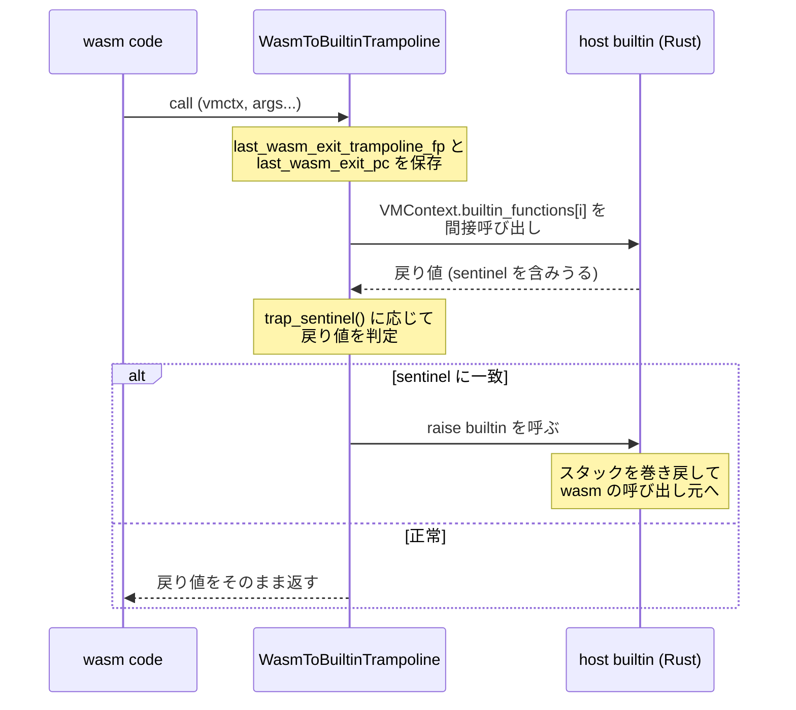

`i32.add` は 1 命令になるが、`memory.grow` はならない。`mmap` を呼び直し、リソースリミッタに問い合わせ、場合によっては中身をコピーする必要がある。こういう命令は Wasmtime では **builtin (libcall)** と呼ばれるホスト側の Rust 関数として実装され、生成コードからはトランポリンを経由して呼ばれる。

このページで見るのは、そのトランポリンが何をしているかと、**トラップを「例外」ではなく「戻り値の sentinel」で伝えている**理由だ。

## トランポリンの 3 つの仕事

`compile_wasm_to_builtin` が生成する関数は短く、やることが 3 つしかない。



コードで見るとこうなる。

```rust title="crates/cranelift/src/compiler.rs"
// Debug-assert that this is the right kind of vmctx, and then
// additionally perform the "routine of the exit trampoline" of saving
// fp/pc/etc.
self.debug_assert_vmctx_kind(&mut builder, &mut alias_regions, vmctx, VMCONTEXT_MAGIC);
let vm_store_context = alias_regions
    .vmctx()
    .store_context()
    .load(&mut builder.cursor(), vmctx);
save_last_wasm_exit_fp_and_pc(&mut builder, pointer_type, &mut alias_regions, vm_store_context);

// Now it's time to delegate to the actual builtin. Forward all our own
// arguments to the libcall itself.
let args = builder.block_params(block0).to_vec();
let call = self.call_builtin(
    &mut builder, &mut alias_regions, vmctx, &args, builtin_func_index, host_sig,
);
let results = builder.func.dfg.inst_results(call).to_vec();
```

[crates/cranelift/src/compiler.rs](https://github.com/bytecodealliance/wasmtime/blob/d8a0da6d661605713798c1c9c76be5c28e3159ff/crates/cranelift/src/compiler.rs#L318-L432)

保存されるのは、このトランポリン自身のフレームポインタと、wasm へ戻るときのリターンアドレスだ。

```rust title="crates/cranelift/src/compiler.rs"
// Save the trampoline FP to the limits. Exception unwind needs
// this so that it can know the SP (bottom of frame) for the very
// last Wasm frame.
let trampoline_fp = builder.ins().get_frame_pointer(pointer_type);
// ... store ...
// Finally save the Wasm return address to the limits.
let wasm_pc = builder.ins().get_return_address(pointer_type);
```

ホスト側の Rust コードにいる間は、スタックを歩いても Rust のフレームしか見えない。**wasm のスタックへ戻る継ぎ目の座標を、抜ける瞬間に記録しておく**ことで、[バックトレース](../backtrace-and-platforms/) の生成と例外の巻き戻しが可能になる。これは libcall だけでなく、wasm からホストへ出るすべての境界に共通する規約だ。

呼び出しは直接呼び出しではなく間接呼び出しになる。

```rust title="crates/cranelift/src/compiler.rs"
// Builtins are stored in an array in all `VMContext`s. First load the
// base pointer of the array...
let array_addr = alias_regions
    .vmctx()
    .builtin_functions()
    .load(&mut builder.cursor(), vmctx);
// ... and then load the entry in the array that corresponds to this
// builtin.
let func_addr = alias_regions.builtin_functions_array_element(
    &mut builder.cursor(), array_addr, builtin,
);
```

`VMContext` の固定オフセットに、builtin 関数ポインタの配列へのポインタが入っている。

```rust title="crates/environ/src/vmctxtypes.rs"
field { #[readonly] #[can_move] builtin_functions: VmPtr<VMBuiltinFunctionsArray> }
```

[crates/environ/src/vmctxtypes.rs](https://github.com/bytecodealliance/wasmtime/blob/d8a0da6d661605713798c1c9c76be5c28e3159ff/crates/environ/src/vmctxtypes.rs#L117-L135)

なぜ間接呼び出しなのか。生成コードは ELF オブジェクトとして [.cwasm ファイル](../cwasm/) に保存され、後から別のプロセスでロードされる。そのときホストの `memory_grow` がどのアドレスにいるかは分からない。**関数ポインタをランタイムがテーブルに書き込み、生成コードはテーブルを引く**という間接化で、コードそのものはアドレス非依存に保たれる。

## sentinel でトラップを伝える

トランポリンの 3 つ目の仕事が、この設計の核心だ。

```rust title="crates/cranelift/src/compiler.rs"
// Libcalls do not explicitly jump/raise on traps but instead return a
// code indicating whether they trapped or not. This means that it's the
// responsibility of the trampoline to check for an trapping return
// value and raise a trap as appropriate. With the `results` above check
// what `index` is and for each libcall that has a trapping return value
// process it here.
match builtin_func_index.trap_sentinel() {
    Some(TrapSentinel::Falsy) => {
        self.raise_if_host_trapped(&mut builder, &mut alias_regions, vmctx, results[0]);
    }
    Some(TrapSentinel::NegativeTwo) => {
        let ty = builder.func.dfg.value_type(results[0]);
        let trapped = builder.ins().iconst(ty, -2);
        let succeeded = builder.ins().icmp(IntCC::NotEqual, results[0], trapped);
        self.raise_if_host_trapped(&mut builder, &mut alias_regions, vmctx, succeeded);
    }
    // ... Negative / NegativeOne も同様 ...
    None => {}
}
```

**libcall は自分でトラップを起こさない。** 起こしたことを戻り値で報告し、トランポリンがそれを見て `raise` builtin を呼ぶ。`raise_if_host_trapped` が作る分岐はコールドブロックに指定されていて、失敗パスがホットな経路を汚さないようになっている。

どの builtin がどの sentinel を使うかは、`BuiltinFunctionIndex::trap_sentinel` の中のマクロで一覧になっている。

```rust title="crates/environ/src/builtin.rs"
// Growth-related functions return -2 as a sentinel.
(@get memory_grow pointer) => (TrapSentinel::NegativeTwo);
(@get table_grow pointer) => (TrapSentinel::NegativeTwo);

// Atomics-related functions return a negative value to indicate a trap.
(@get memory_atomic_notify u64) => (TrapSentinel::Negative);
(@get memory_atomic_wait32 u64) => (TrapSentinel::Negative);

// GC allocation functions return a u32 which is zero to indicate a
// trap.
(@get gc_alloc_raw u32) => (TrapSentinel::Falsy);

// The final epoch represents a trap
(@get new_epoch u64) => (TrapSentinel::NegativeOne);

// These libcalls can't trap
(@get ref_func pointer) => (return None);
(@get is_subtype u32) => (return None);
(@get ceil_f32 f32) => (return None);

// Bool-returning functions use `false` as an indicator of a trap.
(@get $name:ident bool) => (TrapSentinel::Falsy);

(@get $name:ident $ret:ident) => (
    compile_error!(concat!("no trap sentinel registered for ", stringify!($name)))
)
```

[crates/environ/src/builtin.rs](https://github.com/bytecodealliance/wasmtime/blob/d8a0da6d661605713798c1c9c76be5c28e3159ff/crates/environ/src/builtin.rs)

最後のフォールバックが `compile_error!` になっているのが効いている。**新しい builtin を追加したのに sentinel を決め忘れると、ビルドが通らない**。`memory.copy` や `memory.fill` のように `bool` を返すものは一律 `Falsy`、`memory.grow` は `-2` という具合に、返り値の型に応じた既定と個別指定を組み合わせている。

`memory.grow` が `-2` を選ぶ理由も書かれている。

```rust title="crates/wasmtime/src/runtime/vm/libcalls.rs"
/// The failure case returns -1 (or `usize::MAX` as an unsigned integer) and the
/// successful case returns the `val` itself. Note that -2 (`usize::MAX - 1`
/// when unsigned) is unwind as a sentinel to indicate an unwind as no valid
/// allocation can be that large.
unsafe impl HostResultHasUnwindSentinel for Option<AllocationSize> {
    type Abi = *mut u8;
    const SENTINEL: *mut u8 = (usize::MAX - 1) as *mut u8;
```

`memory.grow` の返り値は「拡張前のページ数」で、失敗したときは Wasm の仕様が `-1` を返すことを要求している。つまり `-1` は既に「トラップではない失敗」として使われている。そこでトラップにはもう 1 つ内側の値 `-2` を割り当てる。**「ホストのアドレス空間全部を割り当てるサイズなど存在しえない」から安全に sentinel にできる**、という論拠まで書かれている。

## libcall を書くときの 3 つの規約

なぜこんな回りくどい伝え方をするのか。答えは `libcalls.rs` の冒頭にある。

```rust title="crates/wasmtime/src/runtime/vm/libcalls.rs"
//! These functions are called by compiled Wasm code, and therefore must take
//! certain care about some things:
//!
//! * They must only contain basic, raw i32/i64/f32/f64/pointer parameters that
//!   are safe to pass across the system ABI.
//!
//! * If any nested function propagates an `Err(trap)` out to the library
//!   function frame, we need to raise it. This involves some nasty and quite
//!   unsafe code under the covers! Notably, after raising the trap, drops
//!   **will not** be run for local variables! This can lead to things like
//!   leaking `InstanceHandle`s which leads to never deallocating JIT code,
//!   instances, and modules if we are not careful!
//!
//! * The libcall must be entered via a Wasm-to-libcall trampoline that saves
//!   the last Wasm FP and PC for stack walking purposes. (For more details, see
//!   `crates/wasmtime/src/runtime/vm/backtrace.rs`.)
```

[crates/wasmtime/src/runtime/vm/libcalls.rs](https://github.com/bytecodealliance/wasmtime/blob/d8a0da6d661605713798c1c9c76be5c28e3159ff/crates/wasmtime/src/runtime/vm/libcalls.rs#L1-L56)

2 つ目が決定的だ。**トラップを起こすと、その関数のローカル変数の `Drop` は走らない**。[巻き戻しは ucontext を書き換えて呼び出し元へ飛ぶ](../unwind-via-ucontext/) 実装なので、Rust の通常のスタック巻き戻しを経由しない。だから libcall の中で `Err(trap)` を raise してしまうと、その時点で生きているすべてのローカルがリークする。`InstanceHandle` をリークすれば JIT コードもインスタンスもモジュールも永久に解放されない。

だから **raise する場所を、Rust のローカル変数を何も持っていない場所まで押し出す**。それがトランポリンだ。libcall 本体は普通の Rust 関数として `Result` を返し、Rust のセマンティクスで綺麗に return する。sentinel への変換は境界のマクロがやり、raise は機械語のトランポリンがやる。**「安全でない操作を、安全でなくても構わない 1 箇所に集める」**という構図になっている。

そして「これらを正しく扱いやすくするため、**すべての** libcall は `libcall!` ヘルパーマクロで定義しなければならない」と続く。実際、マクロは全 builtin を舐めて `extern "C"` の入口を生成し、`Instance::enter_host_from_wasm` で包む。個別に手書きさせない。

## リロケーションを残さないという制約

もう 1 つ、この仕組みを規定している制約がある。ロード時の検査に、こう書かれている。

```rust title="crates/wasmtime/src/runtime/code_memory.rs"
// Check that we don't have any relocations, which would make
// loading precompiled Wasm modules slower and also force them to
// get paged into memory from disk.
//
// We avoid using things like Cranelift's `floor`, `ceil`,
// etc... operators in the Wasm-to-CLIF translator specifically to
// avoid having to do any relocations here. This also ensures that
// all builtins use the same trampoline mechanism.
//
// We do, however, allow relocations in `.debug_*` DWARF sections.
```

[crates/wasmtime/src/runtime/code_memory.rs](https://github.com/bytecodealliance/wasmtime/blob/d8a0da6d661605713798c1c9c76be5c28e3159ff/crates/wasmtime/src/runtime/code_memory.rs#L177-L193)

リロケーションが残っていると、ロード時にコードページを書き換えなければならない。書き換えるということはページを実際にディスクから読み込ませ、CoW を破って private なページにするということだ。**リロケーションが 1 つあるだけで、そのページの遅延ロードが効かなくなる。**

そこから逆算された結論が驚きだ。Cranelift には `floor` や `ceil` といった浮動小数点の丸め命令があり、CPU に対応する命令がなければ libm への呼び出しに lowering される。それはリロケーションを生む。だから **Wasm → CLIF の翻訳器では、これらの CLIF 命令を使わない**。代わりに `ceil_f32` などを builtin として定義し、他の libcall とまったく同じトランポリン + `VMContext` 経由の間接呼び出しで呼ぶ。実際、先ほどの `trap_sentinel` の一覧に `ceil_f32` や `floor_f64` が「トラップしない libcall」として並んでいたのはそのためだ。

```rust title="crates/environ/src/builtin.rs"
(@get ceil_f32 f32) => (return None);
(@get floor_f32 f32) => (return None);
(@get nearest_f64 f64) => (return None);
```

**ELF のロード時性能という要求が、IR 生成の段階で使ってよい命令の選択にまで遡って効いている**。層をまたいだ制約の伝播として、これはかなり極端な例だ。しかもコメントは副産物まで挙げていて、「これによってすべての builtin が同じトランポリン機構を使うことも保証される」。1 種類の呼び出し規約しかなければ、FP/PC の保存や sentinel 判定の実装も 1 箇所で済む。

## libcall の実体はごく普通の Rust

トランポリン側がこれだけの規約を吸収してくれるので、libcall 本体は素直に書ける。

```rust title="crates/wasmtime/src/runtime/vm/libcalls.rs"
fn memory_grow(
    store: &mut dyn VMStore,
    instance: InstanceId,
    delta: u64,
    memory_index: u32,
) -> Result<Option<AllocationSize>> {
    let memory_index = DefinedMemoryIndex::from_u32(memory_index);
    let (mut limiter, store) = store.resource_limiter_and_store_opaque();
    let limiter = limiter.as_mut();
    block_on!(store, async |store, _| {
        // ... page_size_log2 を引いて ...
        let result = instance
            .memory_grow(limiter, memory_index, delta)
            .await?
            .map(|size_in_bytes| AllocationSize(size_in_bytes >> page_size_log2));
        Ok(result)
    })?
}
```

`Result` を返し、`?` で早期 return し、`async` すら使う。sentinel も raise もここには現れない。`Option<AllocationSize>` という Rust の型が、`HostResultHasUnwindSentinel` の実装を通じて `*mut u8` の ABI に変換されるだけだ。**型システムの上に載せた変換で、ABI の細部をアプリケーションコードから隔離している**。

## どう活かすか

**危険な操作を「起こす場所」ではなく「起こしてよい場所」まで押し出す**のが、この設計の骨だ。トラップは概念的には libcall の内部で発生するが、実際に raise するのは Rust のローカルを持たないトランポリンにする。そして規約を守り忘れたらコンパイルが通らないようにする — sentinel の一覧を macro の match にして、未登録なら `compile_error!` に落とす。ドキュメントに「必ず sentinel を決めること」と書くより確実だ。

そしていちばん覚えておきたいのが、**下流の制約を上流の設計判断に持ち込む**こと。「.cwasm をロードするときにページを触りたくない」という要求から「Wasm → CLIF 翻訳で `ceil` を使わない」が導かれている。普通なら別々の担当が別々に決めそうな 2 つが、コメント 1 つで結び付けられている。この因果が読める形で残っていることが、そもそもこのコードベースの読みどころだ。
