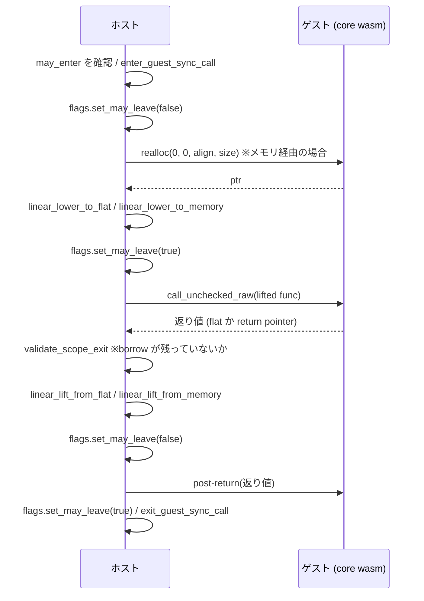

## 4 つのメソッド

canonical ABI の操作は 4 つある。ホスト側の値をゲストに渡す **lowering** が 2 つ (flat な引数として書き込むか、線形メモリに書き込むか)、ゲスト側の値をホストが受け取る **lifting** が 2 つ (flat な返り値から読むか、線形メモリから読むか)。[Canonical ABI — 16 個までは引数、それ以上はメモリ](../canonical-abi-flatten/) で見た「16 個 / 1 個」の閾値が、この 2 × 2 の分岐そのものだ。

Wasmtime はこれを `Lower` と `Lift` という 2 つのトレイトに割り当てている。

```rust title="crates/wasmtime/src/runtime/component/func/typed.rs"
pub unsafe trait Lower: ComponentType {
    /// Performs the "lower" function in the linear memory version of the
    /// canonical ABI.
    fn linear_lower_to_flat<T>(&self, cx: &mut LowerContext<'_, T>, ty: InterfaceType,
        dst: &mut MaybeUninit<Self::Lower>) -> Result<()>;

    /// Performs the "store" operation in the linear memory version of the
    /// canonical ABI.
    fn linear_lower_to_memory<T>(&self, cx: &mut LowerContext<'_, T>, ty: InterfaceType,
        offset: usize) -> Result<()>;
}

pub unsafe trait Lift: Sized + ComponentType {
    fn linear_lift_from_flat(cx: &mut LiftContext<'_>, ty: InterfaceType,
        src: &Self::Lower) -> Result<Self>;

    fn linear_lift_from_memory(cx: &mut LiftContext<'_>, ty: InterfaceType,
        bytes: &[u8]) -> Result<Self>;
}
```

[crates/wasmtime/src/runtime/component/func/typed.rs](https://github.com/bytecodealliance/wasmtime/blob/d8a0da6d661605713798c1c9c76be5c28e3159ff/crates/wasmtime/src/runtime/component/func/typed.rs#L569-L712)

名前が `linear_` で始まるのは、canonical ABI に線形メモリ版と GC 版があるからだ (`CanonicalOptionsDataModel` が `LinearMemory` と `Gc` に分岐する)。

`Lower` は `&self` を取り、`Lift` は関連関数として `Self` を返す。**非対称なのは方向が非対称だから**で、lower は「既にホストに存在する値」を書き出す操作、lift は「ゲストのバイト列」から値を作る操作になる。

## なぜ `unsafe trait` なのか

`ComponentType` と `Lower` / `Lift` はすべて `unsafe trait` で、その理由が doc に列挙されている。

```rust title="crates/wasmtime/src/runtime/component/func/typed.rs"
/// # Safety
///
/// Note that this is an `unsafe` trait as `TypedFunc`'s safety heavily relies on
/// the correctness of the implementations of this trait. Some ways in which this
/// trait must be correct to be safe are:
///
/// * The `Lower` associated type must be a `ValRaw` sequence. It doesn't have to
///   literally be `[ValRaw; N]` but when laid out in memory it must be adjacent
///   `ValRaw` values and have a multiple of the size of `ValRaw` and the same
///   alignment.
///
/// * The `lower` function must initialize the bits within `Lower` that are going
///   to be read by the trampoline that's used to enter core wasm. A trampoline
///   is passed `*mut Lower` and will read the canonical abi arguments in
///   sequence, so all of the bits must be correctly initialized.
///
/// * The `size` and `align` functions must be correct for this value stored in
///   the canonical ABI. ...
///
/// There are likely some other correctness issues which aren't documented as
/// well, this isn't currently an exhaustive list. It suffices to say, though,
/// that correctness bugs in this trait implementation are highly likely to
/// lead to security bugs, which again leads to the `unsafe` in the trait.
```

[crates/wasmtime/src/runtime/component/func/typed.rs](https://github.com/bytecodealliance/wasmtime/blob/d8a0da6d661605713798c1c9c76be5c28e3159ff/crates/wasmtime/src/runtime/component/func/typed.rs#L442-L468)

要点は、**`Lower` 関連型のメモリレイアウトが `ValRaw` の連続であることと、`lower` が読まれるビットを全部初期化すること**が、呼び出し側で `MaybeUninit` を `assume_init_ref()` する根拠になっていることだ。`call_raw` は `MaybeUninit<Union<LowerParams, LowerReturn>>` を確保し、それを `[ValRaw]` として core wasm のトランポリンに渡す ([array-call ABI — 全関数が同じ Rust シグネチャになる](../array-call-abi/))。ここで初期化漏れがあれば未初期化メモリを wasm に渡すことになる。

そして「網羅的なリストではない」と正直に断った上で、「このトレイトの実装バグはほぼ確実にセキュリティバグになる」と結論している。それでも `sealed` にしていないのは、`bindgen!` が生成する型が `#[derive]` でこれを実装する必要があるからだ。

## コンテキストが運ぶ 4 点セット

lower / lift の各メソッドは `LowerContext` / `LiftContext` を受け取る。中身は「store・canonical options・型情報・インスタンス」の 4 つだ。

```rust title="crates/wasmtime/src/runtime/component/func/options.rs"
pub struct LowerContext<'a, T: 'static> {
    /// Lowering may involve invoking memory allocation functions so part of the
    /// context here is carrying access to the entire store that wasm is
    /// executing within. This store serves as proof-of-ability to actually
    /// execute wasm safely.
    pub store: StoreContextMut<'a, T>,

    /// Lowering always happens into a function that's been `canon lift`'d or
    /// `canon lower`'d, both of which specify a set of options for the
    /// canonical ABI. For example details like string encoding are contained
    /// here along with which memory pointers are relative to or what the memory
    /// allocation function is.
    options: OptionsIndex,

    pub types: &'a ComponentTypes,
    instance: Instance,

    /// Whether to allow `options.realloc` to be used when lowering.
    allow_realloc: bool,
}
```

[crates/wasmtime/src/runtime/component/func/options.rs](https://github.com/bytecodealliance/wasmtime/blob/d8a0da6d661605713798c1c9c76be5c28e3159ff/crates/wasmtime/src/runtime/component/func/options.rs#L21-L52)

**`store` が入っている理由が「wasm を安全に実行できることの証明として」と書かれている**のが目を引く。lowering は途中でゲストのアロケータを呼ぶかもしれないので、それはゲストの実行そのものであり、`&mut Store` を握っていない限りやってはいけない。

`allow_realloc` という 5 つ目のフィールドがあり、`new_without_realloc` という別のコンストラクタでのみ `false` になる。

```rust title="crates/wasmtime/src/runtime/component/func/options.rs"
/// Like `new`, except disallows use of `options.realloc`.
///
/// The returned object will panic if its `realloc` method is called.
///
/// This is meant for use when lowering "flat" values (i.e. values which
/// require no allocations) into already-allocated memory or into stack
/// slots, in which case the lowering may safely be done outside of a fiber
/// since there is no need to make any guest calls.
pub(crate) fn new_without_realloc(...) -> LowerContext<'a, T> {
```

**「ゲストを呼ばないと分かっている lowering は fiber の外でやってよい」**という保証を型ではなくフィールドで持っている。realloc はゲストの関数呼び出しなので、非同期実行ではブロックしうる。ブロックしうる操作は fiber の上でしか実行できない ([async に fiber が要る理由](../why-fiber/))。だから「アロケーションを伴わない値だけを既存の領域に書く」場面ではその制約を外したい。通常の `new` にはこれを裏返した debug assert が入っている。

## メモリを確保するのはゲストである

lowering がメモリを必要とするとき、ホストは自分で `malloc` しない。**ゲストのエクスポートした `realloc` を呼ぶ。**

```rust title="crates/wasmtime/src/runtime/component/func/options.rs"
pub fn realloc(&mut self, old: usize, old_size: usize, old_align: u32, new_size: usize)
    -> Result<usize>
{
    assert!(self.allow_realloc);
    // ...
    type ReallocFunc = crate::TypedFunc<(u32, u32, u32, u32), u32>;

    // Invoke the wasm malloc function using its raw and statically known
    // signature.
    let result = unsafe {
        ReallocFunc::call_raw(&mut StoreContextMut(store), &realloc_ty, realloc, params)?
    };

    if result % old_align != 0 {
        bail!("realloc return: result not aligned");
    }
    let result = usize::try_from(result)?;

    if self.as_slice_mut().get_mut(result..).and_then(|s| s.get_mut(..new_size)).is_none() {
        bail!("realloc return: beyond end of memory")
    }
    Ok(result)
}
```

[crates/wasmtime/src/runtime/component/func/options.rs](https://github.com/bytecodealliance/wasmtime/blob/d8a0da6d661605713798c1c9c76be5c28e3159ff/crates/wasmtime/src/runtime/component/func/options.rs#L133-L208)

**これが shared-nothing の核心だ。** ホストはゲストのヒープの管理方法を知らないし、知る必要もない。「この大きさとアラインメントの領域をくれ」と頼んで、返ってきたオフセットに書く。返り値は敵性入力なので、**アラインメントと範囲を両方検証する**。ゲストの `realloc` が嘘のポインタを返しても、そこに書き込む前に弾かれる。

同じ構図はゲスト同士でも成立する。component A から component B へ文字列を渡すとき、A のメモリから読んで B の `realloc` で確保して B のメモリに書く、というコードが必要になる。それを生成するのが FACT だ ([FACT — 融合アダプタを wasm で生成するという判断](../fact/))。

## 1 往復の全体

`Func::call_raw` が lowering から post-return までを 1 本で持っている。



lowering の前後で `may_leave` フラグを落として戻しているのが `with_lower_context` だ。

```rust title="crates/wasmtime/src/runtime/component/func.rs"
pub(crate) fn with_lower_context<T>(...) -> Result<()> {
    // Perform the actual lowering, where while this is running the
    // component is forbidden from calling imports.
    unsafe {
        debug_assert!(flags.may_leave());
        flags.set_may_leave(false);
    }
    let mut cx = LowerContext::new(store.as_context_mut(), options, instance);
    let param_ty = InterfaceType::Tuple(cx.types[ty].params);
    let result = lower(&mut cx, param_ty);
    unsafe { flags.set_may_leave(true) };
    result
}
```

[crates/wasmtime/src/runtime/component/func.rs](https://github.com/bytecodealliance/wasmtime/blob/d8a0da6d661605713798c1c9c76be5c28e3159ff/crates/wasmtime/src/runtime/component/func.rs#L688-L694)

lowering の間はゲストの `realloc` を呼ぶが、その `realloc` の中からさらに import を呼ばれると、ABI の途中の状態で外に出ることになる。だから `may_leave = false` にして禁止する。このフラグは wasm の global 1 本として実装され、生成コードが直接見る ([component のコンパイルは 4 段階](../component-pipeline/))。

## post-return は自動で呼ばれるようになった

`post-return` は「lifted 関数が返した後、ホストが返り値を読み終えてから呼ばれるゲストの関数」だ。ゲストが返り値のために確保した領域を解放するために使う。

```rust title="crates/wasmtime/src/runtime/component/func.rs"
pub(crate) unsafe fn call_post_return(mut store: impl AsContextMut,
    func: Option<NonNull<VMFuncRef>>, arg: ValRaw, mut flags: InstanceFlags) -> Result<()>
{
    unsafe {
        // Post return functions are forbidden from calling imports or
        // intrinsics.
        flags.set_may_leave(false);

        // If the function actually had a `post-return` configured in its
        // canonical options that's executed here.
        if let Some(func) = func {
            crate::Func::call_unchecked_raw(&mut store.as_context_mut(), func,
                core::slice::from_ref(&arg).into())?;
        }

        // And finally if everything completed successfully then the "may
        // leave" flags is set to `true` again here which enables further
        // use of the component.
        flags.set_may_leave(true);
    }
    Ok(())
}
```

[crates/wasmtime/src/runtime/component/func.rs](https://github.com/bytecodealliance/wasmtime/blob/d8a0da6d661605713798c1c9c76be5c28e3159ff/crates/wasmtime/src/runtime/component/func.rs#L714-L742)

lowering と同じく `may_leave` を落として実行する。post-return は「後片付け」なので、その途中で外に出られては困る。

注目すべきは **API の履歴**だ。かつては埋め込み側が `func.post_return(&mut store)` を明示的に呼ぶ必要があり、呼ぶまでその component は次の呼び出しを受け付けなかった。今はそれが `call_raw` の中に取り込まれ、旧 API は空実装になっている。

```rust title="crates/wasmtime/src/runtime/component/func.rs"
#[doc(hidden)]
#[deprecated(note = "no longer needs to be called; this function has no effect")]
pub fn post_return(&self, _store: impl AsContextMut) -> Result<()> {
    Ok(())
}
```

[crates/wasmtime/src/runtime/component/func.rs](https://github.com/bytecodealliance/wasmtime/blob/d8a0da6d661605713798c1c9c76be5c28e3159ff/crates/wasmtime/src/runtime/component/func.rs#L561-L572)

`TypedFunc` 側にも同じ deprecated な `post_return` / `post_return_async` がある。**「呼ぶ必要がなくなったが、呼んでも壊れない」という形で API を畳んでいる**わけで、`Ok(())` を返すだけの関数を残すのは互換性維持の定石だ。

同じ位置で `validate_scope_exit()` が呼ばれ、「この呼び出しで貸し出した `borrow` ハンドルが全部返っているか」を検証している ([own は貸出中に消せない、borrow は scope に縛られる](../resources/))。

## コピーしない lift — `WasmStr` と `WasmList`

lift は普通「ゲストのメモリからホストの `String` や `Vec<T>` にコピーする」操作だが、コピーを避ける選択肢もある。

```rust title="crates/wasmtime/src/runtime/component/func/typed.rs"
/// The purpose of this type is to represent a range of
/// validated bytes within a component but does not actually copy the bytes. The
/// primary method, [`WasmStr::to_str`], attempts to return a reference to the
/// string directly located in the component's memory, avoiding a copy into the
/// host if possible.
///
/// The downside of this type, however, is that accessing a string requires a
/// [`Store`](crate::Store) pointer (via [`StoreContext`]). Bindings generated
/// by [`bindgen!`](crate::component::bindgen), for example, do not have access
/// to [`StoreContext`] and thus can't use this type.
///
/// Note that this type represents an in-bounds string in linear memory, but it
/// does not represent a valid string (e.g. valid utf-8). Validation happens
/// when [`WasmStr::to_str`] is called.
///
/// Also note that this type does not implement [`Lower`], it only implements
/// [`Lift`].
pub struct WasmStr {
```

[crates/wasmtime/src/runtime/component/func/typed.rs](https://github.com/bytecodealliance/wasmtime/blob/d8a0da6d661605713798c1c9c76be5c28e3159ff/crates/wasmtime/src/runtime/component/func/typed.rs#L1471-L1501)

`WasmStr` は `Lift` だけを実装し `Lower` は実装しない。**方向が非対称だからだ。** ゲストから受け取るときは「ゲストのメモリの範囲を指す」で足りるが、ゲストに渡すときはホストのバイト列がゲストのメモリの中にはないので、必ずコピーが要る。

そして doc が自分で欠点を書いている。**この型を使うには `StoreContext` が要るが、`bindgen!` が生成するコードはストア参照を持てないので、生成コードからは使えない。** だから `bindgen!` を使う限りは `String` にコピーされる。`WasmStr` は `Linker` に直接関数を定義するような高度な用途向けだと明記されている。

「in-bounds であることは保証するが valid UTF-8 であることは保証しない」という切り分けも重要で、範囲検査は lift 時に、UTF-8 検証は `to_str()` 時に遅延される。`WasmList<T>` も同じ構造をしている。

## 変性のために `PhantomData` の形を変える

`TypedFunc<Params, Return>` は型パラメータを実際には保持しないので `PhantomData` が要るが、その中身の選び方に長いコメントが付いている。

```rust title="crates/wasmtime/src/runtime/component/func/typed.rs"
    // The definition of this field is somewhat subtle and may be surprising.
    // Naively one might expect something like
    //
    //      _marker: marker::PhantomData<fn(Params) -> Return>,
    //
    // Since this is a function pointer after all. The problem with this
    // definition though is that it imposes the wrong variance on `Params` from
    // what we want. Abstractly a `fn(Params)` is able to store `Params` within
    // it meaning you can only give it `Params` that live longer than the
    // function pointer.
    //
    // With a component model function, however, we're always copying data from
    // the host into the guest, so we are never storing pointers to `Params`
    // into the guest outside the duration of a `call`, meaning we can actually
    // accept values in `TypedFunc::call` which live for a shorter duration
    // than the `Params` argument on the struct.
    //
    // This all means that we don't use a phantom function pointer, but instead
    // feign phantom storage here to get the variance desired.
    _marker: marker::PhantomData<(Params, Return)>,
```

[crates/wasmtime/src/runtime/component/func/typed.rs](https://github.com/bytecodealliance/wasmtime/blob/d8a0da6d661605713798c1c9c76be5c28e3159ff/crates/wasmtime/src/runtime/component/func/typed.rs#L36-L57)

`PhantomData<fn(Params) -> Return>` にすると `Params` が反変になり、`TypedFunc<(&'a str,), ()>` に `&'b str` (`'b` は `'a` より短い) を渡せなくなる。しかし **component model の呼び出しは常にホストからゲストへのコピーで、`Params` へのポインタがゲストに残らない**ので、その制約は不要だ。だから `PhantomData<(Params, Return)>` として共変にしている。

**「関数っぽいから `fn` ポインタを書く」という反射を、意味論に照らして意図的に外している。** ライフタイムを含む型を API に載せるとき、変性は「あとで直す」が効かない部分なので、こうして理由付きで残っているのは実用的な参考になる。

## guest → host のコピーにだけ燃料がかかる

lift はゲストのデータをホスト側に確保し直す操作なので、悪意あるゲストが「長さ 4GiB の文字列を返す」だけでホストのメモリを食い潰せる。これを止めるのが hostcall fuel だ。

```rust title="crates/wasmtime/src/runtime/component/store.rs"
/// Default amount of fuel allowed for all guest-to-host calls in the component
/// model.
///
/// This is the maximal amount of data which will be copied from the guest to
/// the host by default. This is set large enough as to not be hit all that
/// often in theory but also small enough such that if left unconfigured on a
/// host doesn't mean that it's automatically susceptible to DoS for example.
const DEFAULT_HOSTCALL_FUEL: usize = 128 << 20;
```

[crates/wasmtime/src/runtime/component/store.rs](https://github.com/bytecodealliance/wasmtime/blob/d8a0da6d661605713798c1c9c76be5c28e3159ff/crates/wasmtime/src/runtime/component/store.rs#L20-L27)

既定 128MiB。`LiftContext` がこれをフィールドとして持ち、文字列やリストを lift するたびにバイト数を引く。

```rust title="crates/wasmtime/src/runtime/component/func/options.rs"
/// Consumes `amt` units of fuel, typically a number of bytes, from this
/// context.
///
/// Returns an error if the fuel is exhausted which will cause a trap in the
/// guest. Note that this is distinct from Wasm's fuel, this is just for
/// keeping track of data flowing from the guest to the host.
pub fn consume_fuel(&mut self, amt: usize) -> Result<()> {
    match self.hostcall_fuel.checked_sub(amt) {
        Some(new) => self.hostcall_fuel = new,
        None => bail!(HostcallFuelExhausted),
    }
    Ok(())
}
```

[crates/wasmtime/src/runtime/component/func/options.rs](https://github.com/bytecodealliance/wasmtime/blob/d8a0da6d661605713798c1c9c76be5c28e3159ff/crates/wasmtime/src/runtime/component/func/options.rs#L507-L529)

名前は「fuel」だが、実行時間を測る wasm の fuel とは別物だと明記されている ([fuel — 決定的だが高価な割り込み](../fuel/))。こちらは**バイト数の予算**だ。`LiftContext::new` が呼ばれるたびにストアの設定値からリセットされるので、「1 回のホスト呼び出しあたり最大 128MiB」という意味になる。

そして **この予算が一方向にしかかからない**ことが公開 API の doc に書かれている。

```rust title="crates/wasmtime/src/runtime/component/store.rs"
/// Fuel is considered distinct for each host call. The host is responsible
/// for ensuring it retains a proper amount of data between host calls if
/// applicable. ...
///
/// Note that data transferred from the host to the guest is not limited
/// because it's already resident on the host itself. Only data from the
/// guest to the host is limited.
///
/// The default value for this is 128 MiB.
pub fn set_hostcall_fuel(&mut self, fuel: usize) {
```

[crates/wasmtime/src/runtime/component/store.rs](https://github.com/bytecodealliance/wasmtime/blob/d8a0da6d661605713798c1c9c76be5c28e3159ff/crates/wasmtime/src/runtime/component/store.rs#L486-L511)

**ホストからゲストへ渡すデータは制限しない。なぜなら、それは既にホスト側のメモリに載っているデータだからだ。** 新たなホスト側の割り当てを生まない方向には DoS の余地がない。制限が要るのは「ゲストが指示した量だけホストが確保する」方向だけ。

また「fuel は各ホスト呼び出しごとに独立で、呼び出しを跨いだ累積はホストの責任」と断っている。10 回の呼び出しでそれぞれ 128MiB 渡してきて、ホストがそれを全部保持していれば 1.28GiB になる。**Wasmtime が止めるのは 1 回のコピー量だけで、蓄積は止めない**という境界の引き方がはっきり書かれている。

## 持ち帰り

このページで出てきた設計判断は 3 つとも「境界を跨ぐときの責任分担」の話だ。**メモリの確保はデータの持ち主側にやらせ、返ってきたポインタは必ず検証する。** **一方向にしか危険がない制限は、危険な方向にだけかける。** **API から要らなくなった手順は、空実装として残して黙って畳む。** 信頼境界を挟む API を設計するときに、そのまま持って行ける形をしている。
