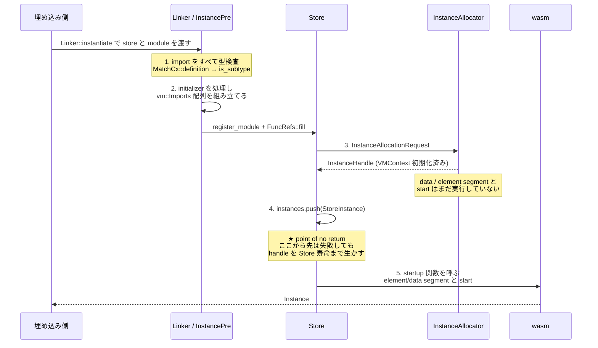

`Instance::new` は import を位置で指定する低レベル API だ。実際に使うのは `Linker` のほうで、こちらは `("host", "double")` のような 2 段の名前で import を解決する。そしてインスタンス化には **「後戻りできない点」** がある。そこから先は初期化に失敗しても、作りかけのインスタンスを Store の中に生かし続けなければならない。

## `Linker<T>` の `T` は「Linker が T を持つ」ではない

```rust title="crates/wasmtime/src/runtime/linker.rs"
pub struct Linker<T> {
    engine: Engine,
    pool: StringPool,
    map: TryHashMap<ImportKey, Definition>,
    allow_shadowing: bool,
    allow_unknown_exports: bool,
    _marker: marker::PhantomData<fn() -> T>,
}

#[derive(Copy, Clone, Hash, PartialEq, Eq)]
struct ImportKey {
    module: Atom,
    name: Atom,
}
```

[crates/wasmtime/src/runtime/linker.rs](https://github.com/bytecodealliance/wasmtime/blob/d8a0da6d661605713798c1c9c76be5c28e3159ff/crates/wasmtime/src/runtime/linker.rs#L85-L118)

`T` は `PhantomData` にしか現れない。doc がその意図を明示している。

```text title="crates/wasmtime/src/runtime/linker.rs"
It's worth pointing out that the type parameter `T` on `Linker<T>` does
not represent that `T` is stored within a `Linker`. Rather the `T` is used
to ensure that linker-defined functions and stores instantiated into all use
the same matching `T` as host state.
```

[crates/wasmtime/src/runtime/linker.rs](https://github.com/bytecodealliance/wasmtime/blob/d8a0da6d661605713798c1c9c76be5c28e3159ff/crates/wasmtime/src/runtime/linker.rs#L51-L57)

`Linker<MyState>` に登録したホスト関数は `Caller<'_, MyState>` を受け取る。それを `Store<OtherState>` にインスタンス化されたら型が合わない。**`T` は「Linker とインスタンス化先の Store が同じホスト状態型を使う」ことを型検査させるためだけに存在する。**

`ImportKey` が `(Atom, Atom)` のペアなのも意図がある。`Atom` は `StringPool` にインターンされた文字列で、`Linker` はキーを `String` として持たない。同じモジュール名が何十回も現れる状況で、ハッシュも比較も整数 1 回で済む。

## 1 個の Linker を全 Store で使い回せる条件

```text title="crates/wasmtime/src/runtime/linker.rs"
Specifically host-defined functions created in `Linker` with `Linker::func_new`,
`Linker::func_wrap`, and their async versions are compatible to instantiate into
any `Store`. This enables programs which want to instantiate lots of modules to
create one `Linker` value at program start up and use that continuously for each
`Store` created over the lifetime of the program.

Note that once `Store`-owned items, such as `Global`, are defined within
a `Linker` then it is no longer compatible with any `Store`. At that
point only the `Store` that owns the `Global` can be used to instantiate
modules.
```

[crates/wasmtime/src/runtime/linker.rs](https://github.com/bytecodealliance/wasmtime/blob/d8a0da6d661605713798c1c9c76be5c28e3159ff/crates/wasmtime/src/runtime/linker.rs#L58-L71)

ホスト関数は Store に属さない。`Func::wrap` で作った `HostFunc` は Engine にだけ紐付いているので、どの Store にも入れられる。これが「起動時に Linker を 1 個作って以降ずっと使い回す」という定番の形を可能にしている。

だが `Global` や `Memory` を `Linker::define` で入れた瞬間、それらは特定の Store の持ち物なので、Linker はその Store 専用になる。**制約が動的に発生する**ので、型では防げず、実行時に `StoreId` の不一致で panic する。

`Engine` を跨ぐほうは、もう少し明示的に検査される。`Linker::new(&engine)` で Engine を握り、別 Engine の `Module` を渡すと「cross-`Engine` instantiation is not currently supported」というエラーになる。

## `DefinitionType` は現在サイズを覚えている

Linker が保持する値の型は `ExternType` ではなく、専用の `DefinitionType` になっている。

```rust title="crates/wasmtime/src/runtime/linker.rs"
/// This is a sort of slimmed down `ExternType` which notably doesn't have a
/// `FuncType`, which is an allocation, and additionally retains the current
/// size of the table/memory.
#[derive(Clone, Copy, Debug)]
pub(crate) enum DefinitionType {
    Func(wasmtime_environ::VMSharedTypeIndex),
    Global(wasmtime_environ::Global),
    // Note that tables and memories store not only the original type
    // information but additionally the current size of the table/memory, as
    // this is used during linking since the min size specified in the type may
    // no longer be the current size of the table/memory.
    Table(wasmtime_environ::Table, u64),
    Memory(wasmtime_environ::Memory, u64),
    Tag(wasmtime_environ::Tag),
}
```

[crates/wasmtime/src/runtime/linker.rs](https://github.com/bytecodealliance/wasmtime/blob/d8a0da6d661605713798c1c9c76be5c28e3159ff/crates/wasmtime/src/runtime/linker.rs#L144-L159)

理由が 2 つ書かれている。1 つ目は **`FuncType` がアロケーションを伴うので持ちたくない**こと。`Copy` な `VMSharedTypeIndex` だけで足りる。2 つ目が本題で、**テーブルとメモリは「型に書かれた min サイズ」ではなく「今の実際のサイズ」を保持する**。

なぜそれが要るのか。wasm の import 型検査は「提供されるメモリの min が、要求される min 以上であること」を見る。だが `memory.grow` で伸びたメモリを import させる場合、型に書かれた min (作った時点の値) はもう実態と違う。リンク時に見るべきなのは現在サイズだ。

```rust title="crates/wasmtime/src/runtime/types/matching.rs"
fn match_limits(
    expected_min: u64,
    expected_max: Option<u64>,
    actual_min: u64,
    actual_max: Option<u64>,
    desc: &str,
) -> Result<()> {
    if expected_min <= actual_min
        && match expected_max {
            Some(expected) => match actual_max {
                Some(actual) => expected >= actual,
                None => false,
            },
            None => true,
        }
    {
        return Ok(());
    }
    // ... エラーメッセージを組み立てる ...
}
```

[crates/wasmtime/src/runtime/types/matching.rs](https://github.com/bytecodealliance/wasmtime/blob/d8a0da6d661605713798c1c9c76be5c28e3159ff/crates/wasmtime/src/runtime/types/matching.rs#L380-L412)

`MatchCx::definition` が `DefinitionType::Memory(actual, cur_size)` から `cur_size` を取り出して `memory_ty(expected, actual, Some(*cur_size))` に渡す。**現在サイズは `DefinitionType` の中を通ってここに届く。**

そして `Linker::instantiate` が store を要求するのも、これが理由だ。

```rust title="crates/wasmtime/src/runtime/linker.rs"
    /// This is split out to optionally take a `store` so that when the
    /// `.instantiate` API is used we can get fresh up-to-date type information
    /// for memories and their current size, if necessary.
    ///
    /// Note that providing a `store` here is not required for correctness
    /// per-se. If one is not provided, such as the with the `instantiate_pre`
    /// API, then the type information used for memories and tables will reflect
    /// their size when inserted into the linker rather than their current size.
    /// This isn't expected to be much of a problem though since
    /// per-store-`Linker` types are likely using `.instantiate(..)` and
    /// per-`Engine` linkers don't have memories/tables in them.
    fn _instantiate_pre(&self, module: &Module, store: Option<&StoreOpaque>)
        -> Result<InstancePre<T>>
    {
        // ...
        let mut imports: TryVec<_> = module.imports()
            .map(|import| Ok(self._get_by_import(&import)?))
            .try_collect::<_, Error>()?;
        if let Some(store) = store {
            for import in imports.iter_mut() {
                import.update_size(store);
            }
        }
        unsafe { InstancePre::new(&self.engine, module, imports) }
    }
```

[crates/wasmtime/src/runtime/linker.rs](https://github.com/bytecodealliance/wasmtime/blob/d8a0da6d661605713798c1c9c76be5c28e3159ff/crates/wasmtime/src/runtime/linker.rs#L1182-L1215)

「正しさのために必須ではない」という但し書きが面白い。**サイズが古いままなら、通るはずのリンクが通らなくなるだけで、通ってはいけないリンクが通ることはない**。安全側に倒れる劣化なので、`instantiate_pre` は store なしで許される。そしてそれで実害が出ない理由まで書いてある ——「Store ごとの Linker はどうせ `.instantiate` を使うし、Engine ごとの Linker にはメモリもテーブルも入っていない」。

## `InstancePre` が前倒しにするもの

```rust title="crates/wasmtime/src/runtime/instance.rs"
pub struct InstancePre<T> {
    module: Module,
    /// The items which this `InstancePre` use to instantiate the `module`
    /// provided, passed to `Instance::new_started_impl`.
    items: Arc<TryVec<Definition>>,
    /// A count of `Definition::HostFunc` entries in `items` above to
    /// preallocate space in a `Store` up front for all entries to be inserted.
    host_funcs: usize,
    /// The `VMFuncRef`s for the functions in `items` that do not
    /// have a `wasm_call` trampoline. We pre-allocate and pre-patch these
    /// `VMFuncRef`s so that we don't have to do it at
    /// instantiation time.
    ///
    /// This is an `Arc` for the same reason as `items`.
    func_refs: Arc<TryVec<VMFuncRef>>,
    asyncness: Asyncness,
    _marker: core::marker::PhantomData<fn() -> T>,
}
```

[crates/wasmtime/src/runtime/instance.rs](https://github.com/bytecodealliance/wasmtime/blob/d8a0da6d661605713798c1c9c76be5c28e3159ff/crates/wasmtime/src/runtime/instance.rs#L767-L800)

前倒しにされるのは 3 つある。**import 名の解決と型検査**、**`wasm_call` トランポリンのパッチ**、そして **Store 側の領域予約**だ。

`items` が `Arc` なのは「個々のアイテムを clone せずに、強参照をまとめて Store に移すため」。ホスト関数が 50 個あっても `Arc::clone` は 1 回で済む ([Func は 2 ワードしかない](../func-two-words/))。`host_funcs: usize` は個数だけを覚えていて、インスタンス化時に `funcrefs.reserve_storage(host_funcs)` で一括予約する。**再確保を 1 回も起こさないためだけの数値**だ。

## インスタンス化の 5 ステップ

アーキテクチャ文書がインスタンス化を 5 段階に分けている。



ステップ 4 の説明が、このページの中心だ。

```text title="docs/contributing-architecture.md"
4. At this point the `InstanceHandle` is stored within the `Store`. This is
   the "point of no return" where the handle must be kept alive for the same
   lifetime as the `Store` itself. If an initialization step fails then the
   instance may still have had its functions, for example, inserted into an
   imported table via an element segment. This means that even if we fail to
   initialize this instance its state could still be visible to other
   instances/objects so we need to keep it alive regardless.
```

[docs/contributing-architecture.md](https://github.com/bytecodealliance/wasmtime/blob/d8a0da6d661605713798c1c9c76be5c28e3159ff/docs/contributing-architecture.md#L257-L296)

論理はこうだ。ステップ 5 の element segment 処理は、**このインスタンスの関数を、import してきた他のインスタンスのテーブルに書き込む**ことがある。3 個目の segment で失敗しても、1 個目と 2 個目はもう書き込まれている。そのテーブルは他人の持ち物なので、こちらの都合で巻き戻せない。

そしてテーブルの中身は `*mut VMFuncRef` で、その指し先はこのインスタンスの `VMContext` の中にある。ここでインスタンスを解放すると、**他のインスタンスのテーブルにダングリングポインタが残る**。だから「初期化に失敗したインスタンス」であっても、Store が死ぬまで生かし続ける。

実装がそのとおりになっている。`StoreOpaque::allocate_instance` はハンドルを受け取ったら即座に `self.instances.push(...)` する。

```rust title="crates/wasmtime/src/runtime/store.rs"
        let handle = unsafe {
            allocator.allocate_module(InstanceAllocationRequest {
                id, runtime_info, imports, store: self, limiter,
            }).await?
        };

        let actual = match kind {
            AllocateInstanceKind::Module(module_id) => {
                self.instances
                    .push(StoreInstance { handle, kind: StoreInstanceKind::Real { module_id } })
                    .expect("capacity was reserved above")
            }
            // ...
        };
```

[crates/wasmtime/src/runtime/store.rs](https://github.com/bytecodealliance/wasmtime/blob/d8a0da6d661605713798c1c9c76be5c28e3159ff/crates/wasmtime/src/runtime/store.rs#L2167-L2228)

`self.instances.reserve(1)?` が確保より前にあり、`push` は `.expect("capacity was reserved above")` になっている。**「Store に入れる」操作を絶対に失敗させないため**に、メモリ確保だけ先に済ませてある。ハンドルを手にした後でメモリ不足になったら、行き場のないハンドルが宙に浮く。

`Instance::new_raw` の最後のコメントも、そこがまだ完成していないことを明示している ——「この時点でインスタンスは作られ Store に格納されているが、まだ完全には使えない。初期化 (active data/element segment) は完了しておらず、`start` 関数も呼ばれていない。それは呼び出し側の責任だ」。

## 「startup 関数」は wasm の `start` だけではない

ステップ 5 の実装は、アーキテクチャ文書が書いている「Wasmtime の内部表現から仕様の要求する挙動へ翻訳する」よりも、現在はもう一段進んでいる。

```rust title="crates/wasmtime/src/runtime/instance.rs"
        // If this instance requires startup, which is a dynamic decision made
        // at this point in conjunction with analysis at compile time, the
        // instance gets started. Note that this isn't just the wasm start
        // function itself, but it's finalization of initialization of this
        // instance, for example for complicated global initialization
        // expressions.
        if instance.id.get_mut(store.0).needs_startup() {
            if asyncness == Asyncness::No {
                instance.start_raw(store)?;
            } else {
                store.on_fiber(|store| instance.start_raw(store)).await??;
            }
        }
```

[crates/wasmtime/src/runtime/instance.rs](https://github.com/bytecodealliance/wasmtime/blob/d8a0da6d661605713798c1c9c76be5c28e3159ff/crates/wasmtime/src/runtime/instance.rs#L251-L282)

`start_raw` が呼ぶのは `get_startup_func` が返す 1 個の関数で、これは **コンパイル時に生成された `[] -> []` 型の wasm 関数**だ。element segment の適用も、複雑なグローバル初期化式も、そして wasm の `start` も、全部この 1 本の中で走る。

```rust title="crates/environ/src/module.rs"
pub enum ModuleStartup {
    /// No startup is necessary.
    None,

    /// Startup is always required, for example to apply active table segments.
    Always(EngineOrModuleTypeIndex),

    /// Startup is only required if some linear memory within this module, at
    /// runtime, says `needs_init() == true`.
    ///
    /// This special mode of startup indicates that the startup function has no
    /// purpose other than to initialize the initial contents of
    /// `MemoryInitialization::Static` linear memories. In this situation if all
    /// memories say `needs_init() == false` then the startup function won't
    /// actually do anything meaning that it can be optimized slightly by
    /// skipping it entirely.
    IfMemoriesNeedInit(EngineOrModuleTypeIndex),
}
```

[crates/environ/src/module.rs](https://github.com/bytecodealliance/wasmtime/blob/d8a0da6d661605713798c1c9c76be5c28e3159ff/crates/environ/src/module.rs#L808-L830)

3 番目のバリアントが効いている。**startup 関数の仕事がメモリの初期内容を書くことだけなら、copy-on-write でイメージを貼れた場合はその関数を呼ぶ必要がない。** コンパイル時に「常に要る / 条件付きで要る / 要らない」の 3 択まで絞り込み、残りの判断を実行時の `memory.needs_init()` に委ねる ([copy-on-write でインスタンス化を速くする](../cow-instantiation/))。コメントの "which is a dynamic decision made at this point in conjunction with analysis at compile time" がその二段構えを指している。

## Command と Reactor

`Linker::module` は、WASI の慣習に沿ってモジュールを 2 種類に分類する。

```rust title="crates/wasmtime/src/runtime/linker.rs"
/// Modules can be interpreted either as Commands or Reactors.
enum ModuleKind {
    /// The instance is a Command, meaning an instance is created for each
    /// exported function and lives for the duration of the function call.
    Command,

    /// The instance is a Reactor, meaning one instance is created which
    /// may live across multiple calls.
    Reactor,
}

impl ModuleKind {
    fn categorize(module: &Module) -> Result<ModuleKind> {
        let command_start = module.get_export("_start");
        let reactor_start = module.get_export("_initialize");
        match (command_start, reactor_start) {
            (Some(command_start), None) => { /* ... */ Ok(ModuleKind::Command) }
            (None, Some(reactor_start)) => { /* ... */ Ok(ModuleKind::Reactor) }
            (None, None) => {
                // Module declares neither of the recognized functions, so treat
                // it as a reactor with no initialization function.
                Ok(ModuleKind::Reactor)
            }
            (Some(_), Some(_)) => {
                // Module declares itself to be both a Command and a Reactor.
                bail!("Program cannot be both a Command and a Reactor")
            }
        }
    }
}
```

[crates/wasmtime/src/runtime/linker.rs](https://github.com/bytecodealliance/wasmtime/blob/d8a0da6d661605713798c1c9c76be5c28e3159ff/crates/wasmtime/src/runtime/linker.rs#L1507-L1549)

判定基準は export 名 2 つだけだ。`_start` があれば Command で、**呼び出しごとに新しいインスタンスを作って捨てる**。`_initialize` があれば Reactor で、1 個のインスタンスが複数の呼び出しを跨いで生きる。どちらもなければ「初期化関数のない Reactor」。両方あればエラー。

この区別が意味を持つのは、[Store が GC を持たない](../engine-store-module-instance/)からだ。Command は 1 回きりの実行なので、インスタンスを作り捨てても Store は太らない。一方 Reactor は状態を持ち続けるので、Store もその寿命に合わせる。**「Store は主要インスタンスの寿命に対応させよ」という推奨が、ここで具体的な 2 パターンになっている。**

## どう活かすか

"point of no return" を文書とコードの両方で明示するのは、副作用のある多段処理を書くときの参考になる。**巻き戻せる区間と巻き戻せない区間を特定し、境界を越える前に「失敗しうる操作」を全部済ませておく。** Wasmtime の場合、`instances.reserve(1)?` を確保より前に置き、境界を越える `push` を `expect` にしているのがそれだ。境界の先で `?` を書かなくて済む形にコードを並べ替えている。

`DefinitionType` が「型に書かれた min」ではなく「現在サイズ」を持つのも、汎用性のある発想だ。宣言時のメタデータと実行時の実態がずれる型 (可変長のもの全般) を扱うとき、**照合に使う値をどちらにするかは、必ず一度考える必要がある**。
