Wasm の「モジュール」はプログラムそのものではない。**プログラムの型紙**だ。線形メモリの初期サイズやグローバルの初期値は書いてあるが、実体はない。実体を持つのは「インスタンス」で、同じモジュールから何個でも作れる。そしてインスタンスの集まりを持つ入れ物が「ストア」であり、**ストアが隔離の単位になる**。

Wasmtime はこの 3 層を、6 つの型で表現している。Wasmtime の contributing ドキュメントが冒頭でこれらを列挙しているので、そこを起点に読む。

## 6 つの型

```mermaid
flowchart TB
    E["wasmtime::Engine<br/>プロセスに 1 つ<br/>スレッド間で共有 (Arc)<br/>設定と型レジストリ"]
    EM["wasmtime_environ::Module<br/>JIT コードを持たない<br/>モジュールの構造の記述"]
    M["wasmtime::Module<br/>コンパイル済みコード<br/>Arc で参照カウント"]
    S["wasmtime::Store&#60;T&#62;<br/>隔離の単位<br/>可変借用が要るので単一スレッド"]
    IH["InstanceHandle<br/>インスタンスの低レベル表現"]
    VM["VMContext<br/>JIT が触る可変長の領域"]
    ME["Memory / Table / Global"]

    E -->|"型を intern"| M
    EM -->|"の一部"| M
    E -.->|"Store は Engine を参照"| S
    M -->|"Store がコードへの<br/>強参照を持つ"| S
    S --> IH
    IH -->|"メモリ上で直後に隣接"| VM
    IH --> ME
```



`Engine` は「グローバルなコンパイル文脈」で、プログラムに 1 つ作って全スレッドで共有する。中身の変更にはロックが要る。

`Store` は逆に、**ほとんどすべての操作が `&mut self` を要求する**ので、同時に複数スレッドから使えない。ロックが一切要らないのはそのためだ。この非対称が Wasmtime の並行モデルを決めている。共有したいもの (コンパイル済みコード、型) は `Engine` に、変わるもの (インスタンスの状態) は `Store` に置く。

`wasmtime_environ::Module` と `wasmtime::Module` が別物であることは押さえておきたい。前者はドキュメントいわく「**JIT コードを一切持たない、wasm モジュールの型と構造の記述**」で、コンパイル過程のごく初期に作られたあと、関数がコンパイルされても変更されない。「ある意味で、検証と型検査の結果と考えてよい」とも書かれている。これが [Wasm バイナリは 12 のセクションでできている](../binary-format/) で見た `Module` そのものだ。

## Store は「関連する wasm オブジェクトの袋」であり、GC を持たない

`Store` の説明が率直で、ここが Wasmtime を使うときの一番の注意点になる。

```text title="docs/contributing-architecture.md"
* `wasmtime::Store` - this is the concept of a "store" in WebAssembly. While
  there's also a formal definition to go off of, it can be thought of as a bag
  of related WebAssembly objects. This includes instances, globals, memories,
  tables, etc. A `Store` does not implement any form of garbage collection of
  the internal items (there is a `gc` function but that's just for `externref`
  values). This means that once you create an `Instance` or a `Table` the memory
  is not actually released until the `Store` itself is deallocated.
```

[docs/contributing-architecture.md](https://github.com/bytecodealliance/wasmtime/blob/d8a0da6d661605713798c1c9c76be5c28e3159ff/docs/contributing-architecture.md#L35-L135)

**インスタンスやテーブルを作ったら、`Store` ごと落とすまでメモリは返ってこない。** `Store::gc` はあるが、それは `externref` (GC ヒープ上のオブジェクト) 用であって、インスタンスや線形メモリを回収しはしない。

公開 API 側の doc はこれを設計指針として言い直している。

```rust title="crates/wasmtime/src/runtime/store.rs"
/// A [`Store`] is intended to be a short-lived object in a program. No form
/// of GC is implemented at this time so once an instance is created within a
/// [`Store`] it will not be deallocated until the [`Store`] itself is dropped.
/// This makes [`Store`] unsuitable for creating an unbounded number of
/// instances in it because [`Store`] will never release this memory. It's
/// recommended to have a [`Store`] correspond roughly to the lifetime of a
/// "main instance" that an embedding is interested in executing.
```

[crates/wasmtime/src/runtime/store.rs](https://github.com/bytecodealliance/wasmtime/blob/d8a0da6d661605713798c1c9c76be5c28e3159ff/crates/wasmtime/src/runtime/store.rs#L132-L145)

**「`Store` は短命なオブジェクトであることを意図している」「1 つの主インスタンスの寿命におおよそ対応させるのがよい」。** サーバでリクエストごとに wasm を実行するなら、リクエストごとに `Store` を作って捨てる。これが Wasmtime の想定する使い方だ。

なぜ GC を実装しないのかは書かれていないが、構造を見れば理由が透ける。ドキュメントは「`Store` はインスタンスハンドルを持ち、そのハンドルは再帰的に `Store` を指し返すので、`Store` 内部ではポインタのエイリアシングがかなり起きる」と述べている。JIT コードが `VMContext` を通じて他のインスタンスのメモリやテーブルを直接指しているのだから、個別のインスタンスだけを回収するには、それを指しているすべてのポインタを追跡しなければならない。**「まとめて捨てる」ことにすれば、その追跡が丸ごと不要になる。**

## Store をまたいでオブジェクトは行き来できない

隔離の単位という言い方の意味はここだ。

```text title="docs/contributing-architecture.md"
  The important thing for
  now, though, is to know that `Store` is a unit of isolation. WebAssembly
  objects are always entirely contained within a `Store`, and at this time
  nothing can cross between stores (except scalars if you manually hook it up).
  In other words, wasm objects from different stores cannot interact with each
  other.
```

`Store` A のインスタンスの関数を `Store` B のテーブルに入れることはできない。`Func` や `Memory` は `Store` の中のインデックスでしかなく、別の `Store` に渡すと実行時エラーになる ([Func は 2 ワードしかない](../func-two-words/))。

例外は「スカラを手で繋ぐ場合」だけだ。`Store` A から `i32` を取り出して `Store` B の関数に渡すのは、ただの整数のコピーなので何も壊れない。**参照が渡らないから隔離が成立する**という、線形メモリのオフセットと同じ構図がここにも現れている。

同じモジュールを 2 つの `Store` にインスタンス化すれば、線形メモリもグローバルもテーブルも完全に別になる。マルチテナントの分離はこの粒度で行う。

## Module だけが Store の外に生きる

一方で `wasmtime::Module` は `Store` に属さない。ここが 3 層構造の要になっている。

```text title="docs/contributing-architecture.md"
A `wasmtime::Module` is an atomically-reference-counted object where upon
instantiation into a `Store`, the `Store` will hold a strong reference to the
internals of the module. This means that all instances of a `wasmtime::Module`
share the same compiled code. Additionally a `wasmtime::Module` is one of the
few objects that lives outside of a `wasmtime::Store`. This means that
`wasmtime::Module`'s reference counting is its own form of memory management.
```

**すべてのインスタンスが同じコンパイル済みコードを共有する。** 1 万個のインスタンスを作っても機械語は 1 部しかない。これがなければ、インスタンス化のたびにコンパイルが走ることになって、サーバレスのような用途は成立しない。

そしてドキュメントは、この共有が**コンパイル済みコードに課す制約**を続けて指摘している。

```text title="docs/contributing-architecture.md"
Note that the property of sharing a module's compiled code across all
instantiations has interesting implications on what the compiled code can
assume. For example Wasmtime implements a form of type interning, but the
interned types happen at a few different levels. Within a module we deduplicate
function types, but across modules in a `Store` types need to be represented
with the same value. This means that if the same module is instantiated into
many stores its same function type may take on many values, so the compiled
code can't assume a particular value for a function type.
```

同じモジュールが別の `Engine` にロードされれば、同じ関数型に別の `VMSharedTypeIndex` が割り当てられる。**だから機械語は型の値をイミディエイトとして埋め込めない。** `call_indirect` の型検査は、`VMContext` 経由でロードした値と比較する形にしかできない ([型システム — 4 つの独立した型階層](../type-system/)、[call_indirect の型チェックが整数比較 1 回になるまで](../call-indirect-typecheck/))。

ドキュメントの結論も同じだ。「JIT コードが `VMContext` に文脈入力をかなり重く依存しているのは、コードが広く再利用可能であることを意図しているから」。**コードを共有すると決めた瞬間に、インスタンス固有の値は全部間接参照になる。** `VMContext` という設計はこの決定の帰結である ([VMContext — JIT コードが固定オフセットで触る構造体](../vmcontext/))。

## インスタンスの状態は InstanceHandle と VMContext にある

`InstanceHandle` は「wasm インスタンスの低レベル表現」だが、実際にはそれ以上のものを兼ねている。

```text title="docs/contributing-architecture.md"
* `wasmtime::runtime::vm::InstanceHandle` - this is the low-level representation of a
  WebAssembly instance. At the same time this is also used as the representation
  for all host-defined objects. For example if you call `wasmtime::Memory::new`
  it'll create an `InstanceHandle` under the hood.
```

**ホストが単体で作った `Memory` も、内部的には (メモリを 1 つだけ持つ) インスタンスとして表現される。** 理由も書かれている。「ランタイムの視点からは、互いに通信する wasm モジュールのグラフが、単に `InstanceHandle` 同士の会話に還元されるので単純になる」。

`VMContext` は `InstanceHandle` の割り当ての**直後にメモリ上で隣接して**置かれる。Rust の型としてはサイズ 0 で、実際のレイアウトはモジュールごとに動的に決まる。グローバルが 0 個のモジュールなら、グローバル用の配列は 1 バイトも確保されない。

つまり **wasm 仕様が言う「インスタンス」の状態は、ほぼそのまま `VMContext` の中身である**。グローバルの値、線形メモリへのポインタ、テーブルへのポインタ、import された関数へのポインタ。JIT コードが実行時に触るものは全部ここに集められている。

## インスタンス化の 5 ステップと「後戻りできない点」

モジュールからインスタンスを作る手順は 5 段階だ。

1. **import の型検査。** 渡された import のリストを `wasmtime_environ::Module` が記録した import のリストと突き合わせ、コア仕様の型一致規則に従って検証する。
2. **initializer の実行。** `wasmtime_environ::Module` が持つ initializer のリストを処理し、`Imports` 配列を組み立てる。ここで import は「実体への生ポインタ + 提供元インスタンスの `VMContext`」という形になる。
3. **`InstanceHandle` の確保。** アロケータ (on-demand なら malloc、pooling ならスラブ) から確保し、`VMContext` の全フィールドを初期化する。**この時点ではまだ data セグメントも element セグメントも `start` 関数も処理しない。**
4. **`Store` への格納。** ドキュメントがここを "the point of no return" と呼んでいる。
5. **wasm 仕様上のインスタンス化。** element セグメント、data セグメント、`start` 関数を処理する。

4 番目の理由が重要だ。

```text title="docs/contributing-architecture.md"
4. At this point the `InstanceHandle` is stored within the `Store`. This is
   the "point of no return" where the handle must be kept alive for the same
   lifetime as the `Store` itself. If an initialization step fails then the
   instance may still have had its functions, for example, inserted into an
   imported table via an element segment. This means that even if we fail to
   initialize this instance its state could still be visible to other
   instances/objects so we need to keep it alive regardless.
```

**ステップ 5 が途中で失敗しても、インスタンスを解放できない。** element セグメントの処理は import されたテーブルに自分の関数を書き込むかもしれず、その書き込みはロールバックできない。他のインスタンスから見えてしまった以上、その関数が指すインスタンスは生きていなければならない。

これは「失敗したら元に戻す」が原理的に成立しない場面の実例だ。段階的に外部から見える状態を作っていく処理では、どこかに「ここを過ぎたら前に進むしかない」点が必ずある。**Wasmtime はその点を明示し、そこから先は失敗しても資源を保持し続けるという方針にした。** 詳細は [Linker と、インスタンス化の「後戻りできない点」](../linker-and-instantiation/) で扱う。

## どう活かすか

3 層に割る意味を整理しておく。**Engine は「不変で共有できるもの」、Module は「コンパイル結果という高価だが不変なもの」、Store は「可変で隔離したいもの」**。ロックが要るのは 1 番目だけ、参照カウントで済むのが 2 番目、単一所有で `&mut` を要求するのが 3 番目。

この分け方は wasm に限らない。高価な準備結果を共有し、実行ごとの可変状態を分離し、隔離の境界を可変状態の側に引く。そして「隔離の単位はまとめて捨てる」と決めれば、内部で好き放題にポインタをエイリアスしても安全になる。Wasmtime が `Store` に GC を実装していないのは手抜きではなく、この設計から必然的に出てくる帰結だ。

次はこの章の最後の 2 ページに入る。まず Wasm 自体がどう拡張されているかを見る ([proposal の地図 — Wasm は今も動いている](../proposals/))。
