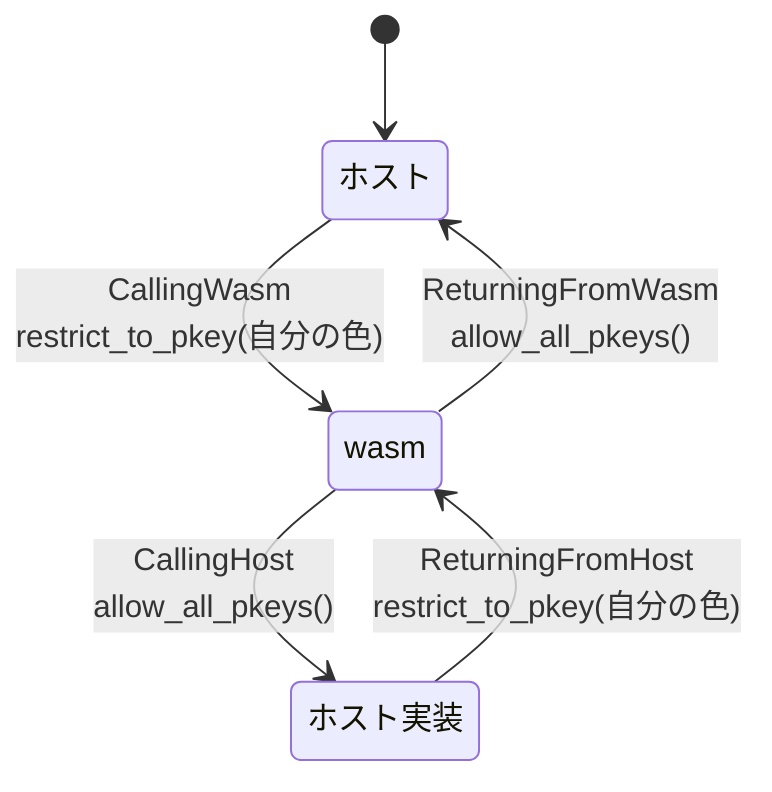

pooling allocator のスラブは、1 スロットあたり `memory_reservation` (既定 4GiB) + ガードを予約する ([インスタンスアロケータ — 毎回 mmap するか、スロットを貸すか](../instance-allocator/))。64bit の仮想アドレス空間は広いが無限ではなく、1 インスタンスあたり 6〜8GiB を消費すれば、同時に持てるインスタンス数はそこで頭打ちになる。

**ガード領域は「触ったら SIGSEGV になる」という性質さえあればよく、必ずしも `PROT_NONE` の空白である必要はない。** ここに目を付けたのがメモリ保護キー (MPK) の利用だ。

```text title="crates/wasmtime/src/runtime/vm/mpk/mod.rs"
//! MPK is an x86 feature available on relatively recent versions of Intel and
//! AMD CPUs. In Linux, this feature is named `pku` (protection keys userspace)
//! and consists of three new system calls: `pkey_alloc`, `pkey_free`, and
//! `pkey_mprotect` (see the [Linux documentation]). This crate provides an
//! abstraction, [`ProtectionKey`], that the [pooling allocator] applies to
//! contiguous memory allocations, allowing it to avoid guard pages in some
//! cases and more efficiently use memory. This technique was first presented in
//! a 2022 paper: [Segue and ColorGuard: Optimizing SFI Performance and
//! Scalability on Modern x86][colorguard].
```

[crates/wasmtime/src/runtime/vm/mpk/mod.rs#L1-L17](https://github.com/bytecodealliance/wasmtime/blob/d8a0da6d661605713798c1c9c76be5c28e3159ff/crates/wasmtime/src/runtime/vm/mpk/mod.rs#L1-L17)

出典が [ColorGuard の論文](https://plas2022.github.io/files/pdf/SegueColorGuard.pdf)であることまで書かれている。x86_64 Linux 以外では、同じインターフェースの no-op 実装に差し替わる。

## 保護キーとは何か

各ページには、通常の `PROT_READ` / `PROT_WRITE` とは別に 4bit の「キー」を付けられる。`pkey_mprotect` で塗り、`PKRU` というレジスタで「今どのキーにアクセスを許すか」を切り替える。

```text title="crates/wasmtime/src/runtime/vm/mpk/pkru.rs"
//! As documented in the Intel Software Development Manual, vol 3a, section 2.7,
//! the 32 bits of the `PKRU` register laid out as follows (note the
//! little-endianness):
//!
//! ┌───┬───┬───┬───┬───┬───┐
//! │...│AD2│WD1│AD1│WD0│AD0│
//! └───┴───┴───┴───┴───┴───┘
//!
//! - `ADn = 1` means "access disable key `n`"--no reads or writes allowed to
//!   pages marked with key `n`.
//! - `WDn = 1` means "write disable key `n`"--only reads are prevented to pages
//!   marked with key `n`
```

[crates/wasmtime/src/runtime/vm/mpk/pkru.rs#L1-L30](https://github.com/bytecodealliance/wasmtime/blob/d8a0da6d661605713798c1c9c76be5c28e3159ff/crates/wasmtime/src/runtime/vm/mpk/pkru.rs#L1-L30)

キー 1 つにつき 2bit なので、32bit のレジスタで 16 個のキーを表現する。読み書きは `rdpkru` / `wrpkru` 命令 1 個で、**syscall ではない**。これが決定的に重要で、切り替えコストがほぼゼロだからこそ、wasm への出入りごとに切り替えるという使い方ができる。

Wasmtime が使えるのは 15 個だ。キー 0 はカーネルが予約している。

```rust title="crates/wasmtime/src/runtime/vm/mpk/enabled.rs"
/// Allocate up to `max` protection keys.
///
/// This asks the kernel for all available keys up to `max` in a thread-safe way
/// (we can expect 1-15; 0 is kernel-reserved). ...
///
/// TODO: this is not the best-possible design. This creates global state that
/// would prevent any other code in the process from using protection keys; the
/// `KEYS` are never deallocated from the system with `pkey_dealloc`.
pub fn keys(max: usize) -> &'static [ProtectionKey] {
    // ...
}
```

[crates/wasmtime/src/runtime/vm/mpk/enabled.rs#L11-L45](https://github.com/bytecodealliance/wasmtime/blob/d8a0da6d661605713798c1c9c76be5c28e3159ff/crates/wasmtime/src/runtime/vm/mpk/enabled.rs#L11-L45)

プロセス全体で 1 回だけ確保し、二度と解放しない。同じプロセスの他のコードが保護キーを使おうとすると衝突する、という設計上の負債が TODO として明記されている。

## ストライプ配置

15 個のキーで、どうやってガード領域を代替するのか。**隣り合うスロットに違うキーを割り当てる**のが答えだ。

```text title="crates/wasmtime/src/runtime/vm/instance/allocator/pooling/memory_pool.rs"
//! But we can be more efficient about guard regions: with memory protection
//! keys (MPK) enabled, the interleaved guard regions can be smaller. If we
//! surround a memory with memories from other instances and each instance is
//! protected by different protection keys, the guard region can be smaller AND
//! the pool will still raise a signal on an OOB access. This complicates how we
//! lay out memory slots: we must store memories from the same instance in the
//! same "stripe". Each stripe is protected by a different protection key.
```

[crates/wasmtime/src/runtime/vm/instance/allocator/pooling/memory_pool.rs#L20-L52](https://github.com/bytecodealliance/wasmtime/blob/d8a0da6d661605713798c1c9c76be5c28e3159ff/crates/wasmtime/src/runtime/vm/instance/allocator/pooling/memory_pool.rs#L20-L52)

MPK なしのスラブは、こう並ぶ。

```text
  MPK なし: ガードを実体として挟む
  ┌─────┬─────┬─────┬─────┬─────┬─────┬─────┬─────┐
  │Guard│Mem 0│Guard│Mem 1│Guard│Mem 2│.....│Guard│
  └─────┴─────┴─────┴─────┴─────┴─────┴─────┴─────┘
   PROT_NONE の領域が、メモリと同じ数だけ要る
```

MPK ありなら、隣のスロットそのものがガードとして働く。

```text
  MPK あり: 隣のスロットを別の色で塗る
  ┌─────┬─────┬─────┬─────┬────────────────┬─────┬─────┬─────┐
  │.....│I0:M1│.....│.....│.<enough slots>.│I0:M2│.....│.....│
  ├─────┼─────┼─────┼─────┼────────────────┼─────┼─────┼─────┤
  │.....│key 1│key 2│key 3│..<more keys>...│key 1│key 2│.....│
  └─────┴─────┴─────┴─────┴────────────────┴─────┴─────┴─────┘
         ◄────────────── stripe 1 の次のスロットまで ────────►
              この間は全部「今の PKRU では触れないページ」
```

インスタンス 0 が 2 つのメモリ (`M1` と `M2`) を持つとき、両方が同じ key 1 のスロットに置かれる。その間には key 2、key 3 …… のスロットが並ぶが、インスタンス 0 が走っている間、`PKRU` は key 1 しか許していない。つまり **key 2 のスロットに手を伸ばした瞬間に SIGSEGV になる**。ガード領域と同じ働きをしながら、その領域は別のインスタンスが現に使っている。

## 距離の計算

ここで守らなければならない不変条件がある。コード生成は「メモリの先頭から `faulting_region_bytes` (= `memory_reservation` + ガード) までは必ずフォルトする」という前提で境界チェックを省いている ([境界チェックを「消す」ための条件を数式で追う](../bounds-check-elision/))。ストライプで代替する以上、**同じキーが次に現れるまでの距離が、その `faulting_region_bytes` 以上でなければならない**。

```rust title="crates/wasmtime/src/runtime/vm/instance/allocator/pooling/memory_pool.rs"
// ...but if we can create at least two stripes, we can use another
// stripe (i.e., a different pkey) as this slot's guard region--this
// reduces the guard bytes each slot has to allocate. ...
let needed_num_stripes = faulting_region_bytes
    .checked_div(max_memory_bytes)
    .expect("if condition above implies max_memory_bytes is non-zero")
    + usize::from(
        faulting_region_bytes
            .checked_rem(max_memory_bytes)
            .expect("...") != 0,
    );
let num_stripes = num_pkeys_available.min(needed_num_stripes).min(num_slots);

// Next, we try to reduce the slot size by "overlapping" the stripes: we
// can make slot `n` smaller since we know that slot `n+1` and following
// are in different stripes and will look just like `PROT_NONE` memory.
// Recall that codegen expects a guarantee that at least
// `faulting_region_bytes` will catch OOB accesses via segfaults.
let needed_slot_bytes = faulting_region_bytes
    .byte_count()
    .checked_div(num_stripes)
    .unwrap_or(faulting_region_bytes.byte_count())
    .max(max_memory_bytes.byte_count());
```

[crates/wasmtime/src/runtime/vm/instance/allocator/pooling/memory_pool.rs#L890-L912](https://github.com/bytecodealliance/wasmtime/blob/d8a0da6d661605713798c1c9c76be5c28e3159ff/crates/wasmtime/src/runtime/vm/instance/allocator/pooling/memory_pool.rs#L890-L912)

論理は素直だ。必要なストライプ数は `faulting_region_bytes / max_memory_bytes` の切り上げで、それだけの色があれば「同じ色が次に来るまでの距離」がガードの要求を満たす。実際に使えるストライプ数はそれと利用可能なキー数 (最大 15) とスロット数の最小値になる。そして各スロットのサイズは `faulting_region_bytes / num_stripes` まで縮められる — ただし `max_memory_bytes` を下回ることはできない。

具体的には、既定の `memory_reservation` 4GiB + ガード 32MiB に対して `max_memory_size` が小さければ、スロットあたりの予約が数 GiB から数百 MiB のオーダーまで落ちる。**スラブ全体のサイズが同じなら、その分だけスロット数を増やせる。** 逆に `max_memory_size` を `memory_reservation` と同じにするとストライプ数は 1 にしかならず、MPK は何も削れない。

**キーが 15 個しかないという制約は、そのまま「削れる上限は 1/15」を意味する。** ここは物理的な壁で、ソフトウェア側の工夫では超えられない。

## いつ色を切り替えるか

キーの切り替え (`PKRU` の書き換え) は、Store の call hook の裏で行われる。

```rust title="crates/wasmtime/src/runtime/store.rs"
fn call_hook_slow_path(&mut self, s: CallHook) -> Result<()> {
    if let Some(pkey) = &self.inner.pkey {
        let allocator = self.engine().allocator();
        match s {
            CallHook::CallingWasm | CallHook::ReturningFromHost => {
                allocator.restrict_to_pkey(*pkey)
            }
            CallHook::ReturningFromWasm | CallHook::CallingHost => allocator.allow_all_pkeys(),
        }
    }
    // ...
}
```

[crates/wasmtime/src/runtime/store.rs#L1401-L1421](https://github.com/bytecodealliance/wasmtime/blob/d8a0da6d661605713798c1c9c76be5c28e3159ff/crates/wasmtime/src/runtime/store.rs#L1401-L1421)



**wasm に入るときだけ制限し、ホストに戻るときは全解除する。** ホスト側のコードは自分のストライプ以外のメモリにも正当な理由で触れる (別インスタンスのメモリを `Memory::data` で読む、など) ので、制限を掛けたままにはできない。制限が有効なのは wasm が実際に走っている区間だけだ。

マスクの作り方が `ProtectionMask::zero().or(pkey)` になっているのも読みどころで、`zero()` は「キー 0 だけ許可」を意味する。カーネルが予約しているキー 0 は常にアクセス可能でなければならないので、「何も許さない」ではなく「キー 0 と自分の色だけ」が制限状態になる ([crates/wasmtime/src/runtime/vm/instance/allocator/pooling.rs#L823-L833](https://github.com/bytecodealliance/wasmtime/blob/d8a0da6d661605713798c1c9c76be5c28e3159ff/crates/wasmtime/src/runtime/vm/instance/allocator/pooling.rs#L823-L833))。

なお、この仕組みは 2 つの前提に乗っている。`MemoryPool` の構築時にコメントが付いていて、(1) プールを作った時点の "allow all" 設定が、メモリに触れる前にプロセス既定の状態 (キー 0 のみ) をリセットしていること、(2) ホスト側の他のコードがこのグローバルな MPK 設定を書き換えないこと。**`PKRU` はプロセスではなくスレッドごとの CPU 状態なので、Wasmtime の外でこれを触るライブラリがいると壊れる。**

## mmap は色を落とす

実装上いちばん危険な落とし穴がここだ。

```rust title="crates/wasmtime/src/runtime/vm/mpk/enabled.rs"
/// Re-apply this [`ProtectionKey`] to a region that has just been re-mapped.
///
/// A fresh `mmap` over a region discards that region's protection key,
/// leaving it associated with the default key 0 which is always accessible.
/// Any code that maps over pkey-protected memory must therefore call this
/// afterwards to restore the key, otherwise the memory becomes readable and
/// writable from any stripe.
///
/// Note that `mprotect` (unlike `mmap`) preserves the existing key, so only
/// `mmap` call sites need this.
pub unsafe fn reprotect(&self, addr: usize, len: usize, readwrite: bool) -> Result<()> {
```

[crates/wasmtime/src/runtime/vm/mpk/enabled.rs#L112-L135](https://github.com/bytecodealliance/wasmtime/blob/d8a0da6d661605713798c1c9c76be5c28e3159ff/crates/wasmtime/src/runtime/vm/mpk/enabled.rs#L112-L135)

`mmap` はページの保護キーを既定の 0 に戻す。キー 0 は**どのストライプが有効でもアクセスできる**ので、塗り直しを忘れたページはサンドボックスの外から丸見えになる。しかも `mprotect` は既存のキーを保つので、「権限を変えるだけなら大丈夫、張り替えたときだけ危ない」という非対称な規約になる。

これが効いてくるのは CoW でインスタンス化を速くする経路だ ([copy-on-write でインスタンス化を速くする](../cow-instantiation/))。スロットに初期イメージを `mmap` で貼り直すたびに、塗り直しが必要になる。

```rust title="crates/wasmtime/src/runtime/vm/cow.rs"
/// Re-color `offset..offset + len` within this slot with this slot's MPK
/// protection key, if any.
///
/// This is a no-op unless the pooling allocator is striping memory with
/// protection keys. It must be called after every `mmap` that lands inside
/// this slot: `mmap` associates the pages it replaces with the default key
/// 0, which is accessible regardless of which stripe is currently active,
/// so skipping this would let one instance read and write another
/// instance's memory.
///
/// Note that `mprotect` preserves the existing key, so `set_protection`
/// does not need this treatment.
fn reapply_pkey(
    &self,
    offset: HostAlignedByteCount,
    len: HostAlignedByteCount,
    readwrite: bool,
) -> Result<()> {
```

[crates/wasmtime/src/runtime/vm/cow.rs#L703-L739](https://github.com/bytecodealliance/wasmtime/blob/d8a0da6d661605713798c1c9c76be5c28e3159ff/crates/wasmtime/src/runtime/vm/cow.rs#L703-L739)

**「この関数の後には必ずあれを呼べ」という規約が呼び出し側に課されている**、というのが構造としての弱点だ。Wasmtime はこれを 2 か所の doc コメントで明示し、`MemoryImageSlot` の内部から一律に呼ぶことで守っている ([スロットの状態機械と、madvise が元の CoW を復元すること](../memory-image-slot/))。型で強制できていないので、`mmap` を呼ぶ新しい経路が増えたときに漏れうる。

## fiber も PKRU を持ち運ぶ

`PKRU` はスレッドの CPU 状態なので、async 実行で fiber を切り替えると、前の fiber が設定した値がそのまま残ってしまう。だから fiber の再開状態に含まれている。

```rust title="crates/wasmtime/src/runtime/fiber.rs"
/// Saved MPK protection mask, if enabled.
///
/// When MPK is enabled then executing WebAssembly will modify the
/// processor's current mask of addressable protection keys. This means that
/// our current state may get clobbered when a fiber suspends. To ensure
/// that this function preserves context it will, when MPK is enabled, save
/// the current mask when this function is called and then restore the mask
/// when the function returns (aka the fiber suspends).
mpk: Option<ProtectionMask>,
```

[crates/wasmtime/src/runtime/fiber.rs#L576-L586](https://github.com/bytecodealliance/wasmtime/blob/d8a0da6d661605713798c1c9c76be5c28e3159ff/crates/wasmtime/src/runtime/fiber.rs#L576-L586)

TLS、スタック上限、executor と並んで `swap_mpk_states` で入れ替えられる。fiber の切り替えで save/restore すべきものの一覧に、レジスタ 1 本が加わっている形だ ([fiber を切り替えるとき、何を save/restore するのか](../fiber-state-swap/))。

## 有効化のしかたと前提

`Config::memory_protection_keys` が `Auto` / `Yes` / `No` の 3 値で、`Auto` は「使えるなら使う」、`Yes` は「使えなければエラー」になる ([crates/wasmtime/src/runtime/vm/instance/allocator/pooling/memory_pool.rs#L186-L202](https://github.com/bytecodealliance/wasmtime/blob/d8a0da6d661605713798c1c9c76be5c28e3159ff/crates/wasmtime/src/runtime/vm/instance/allocator/pooling/memory_pool.rs#L186-L202))。動く条件は x86_64 + Linux + カーネルの `pku` 有効化 + `memory-protection-keys` feature で、これを外れると `mpk::disabled` の no-op 実装になり、ストライプ数は 1 になる。使い方の例は [docs/examples-mpk.md](https://github.com/bytecodealliance/wasmtime/blob/d8a0da6d661605713798c1c9c76be5c28e3159ff/docs/examples-mpk.md) にある。

## どう活かすか

この最適化の形は面白い。**守りたい性質 (「境界の外に出たらフォルトする」) は変えずに、その性質を実現する手段だけを差し替えている。** ガード領域という「使えない空白」が、保護キーという「今は見えないだけの他人のデータ」に置き換わった。空白は資源を消費するが、他人のデータは消費しない。

一般化すると、「安全のために確保している空き領域」を見つけたら、**その空き領域が本当に空である必要があるのか**を疑う価値がある。必要なのが「アクセスできないこと」だけなら、ハードウェアが別の方法でそれを保証してくれるかもしれない。

そして代償も明快だ。x86_64 Linux でしか使えず、キーは 15 個しかなく、`mmap` のたびに塗り直す規約が呼び出し側に課され、`PKRU` を触る他のライブラリと共存できない。有効化がプラットフォーム条件付きの `Auto` になっているのは、この代償を織り込んだ結果だ。
