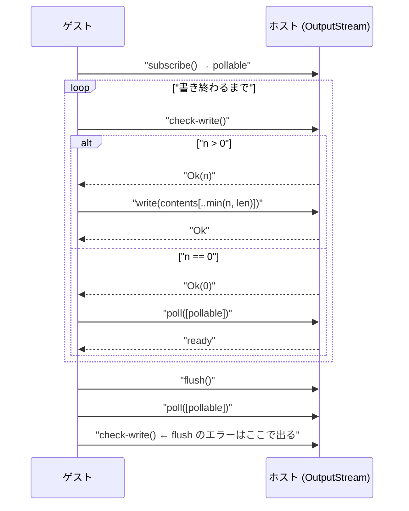

core wasm には非同期の呼び出し規約がない。関数を呼んだら、戻ってくるまで次の命令は実行されない。**それでも「まだ書けないので待つ」を表現しなければならない。** WASI 0.2 の答えが permit モデルで、[pollable は Future ではない](../pollable/) で見た待ち合わせプリミティブと対になっている。

## 書く前に、書ける量を貰う

`output-stream` の中心は `check-write` と `write` の 2 段構えだ。WIT にその契約が全部書いてある。

```wit title="crates/wasi-io/wit/deps/io.wit"
resource output-stream {
    /// Check readiness for writing. This function never blocks.
    ///
    /// Returns the number of bytes permitted for the next call to `write`,
    /// or an error. Calling `write` with more bytes than this function has
    /// permitted will trap.
    ///
    /// When this function returns 0 bytes, the `subscribe` pollable will
    /// become ready when this function will report at least 1 byte, or an
    /// error.
    check-write: func() -> result<u64, stream-error>;

    /// Perform a write. This function never blocks.
    ///
    /// Precondition: check-write gave permit of Ok(n) and contents has a
    /// length of less than or equal to n. Otherwise, this function will trap.
    ///
    /// returns Err(closed) without writing if the stream has closed since
    /// the last call to check-write provided a permit.
    write: func(contents: list<u8>) -> result<_, stream-error>;
```

[crates/wasi-io/wit/deps/io.wit](https://github.com/bytecodealliance/wasmtime/blob/d8a0da6d661605713798c1c9c76be5c28e3159ff/crates/wasi-io/wit/deps/io.wit#L183-L209)

**両方とも「この関数は絶対にブロックしない」と明記されている。** そして `write` には事前条件がある。`check-write` が `Ok(n)` を返し、書く内容が `n` バイト以下であること。それを破れば**エラーではなくトラップ**する。

トラップにしているのは、これがゲストのバグだからだ。`stream-error` は `closed` と `last-operation-failed` の 2 つしかなく、どちらも「環境の都合で書けなかった」を表す。「許可を超えて書いた」は環境の都合ではなく契約違反なので、`result` の `Err` 側に置く理由がない。**回復可能な失敗と、プログラムが間違っている状態を、返り値の型で区別している。**

Rust 側の trait も同じ 3 つを必須メソッドにしている。

```rust title="crates/wasi-io/src/streams.rs"
pub trait OutputStream: Pollable {
    /// Write bytes after obtaining a permit to write those bytes
    ///
    /// Prior to calling [`write`](Self::write) the caller must call
    /// [`check_write`](Self::check_write), which resolves to a non-zero permit
    ///
    /// This method must never block.  The [`check_write`](Self::check_write)
    /// permit indicates the maximum amount of bytes that are permitted to be
    /// written in a single [`write`](Self::write) following the
    /// [`check_write`](Self::check_write) resolution.
    fn write(&mut self, bytes: Bytes) -> StreamResult<()>;

    fn flush(&mut self) -> StreamResult<()>;

    /// Returns the number of bytes that are ready to be written to this stream.
    ///
    /// Zero bytes indicates that this stream is not currently ready for writing
    /// and `ready()` must be awaited first.
    fn check_write(&mut self) -> StreamResult<usize>;
```

[crates/wasi-io/src/streams.rs](https://github.com/bytecodealliance/wasmtime/blob/d8a0da6d661605713798c1c9c76be5c28e3159ff/crates/wasi-io/src/streams.rs#L126-L178)

`check_write` が 0 を返すことが「今は書けない」を意味し、そのときは `pollable` を待つ。**`check-write` の返り値 0 と、`pollable` の未 ready が同じ状態を指している**ので、2 つの API が矛盾しないよう設計されている。

## `flush` の位置づけ

`flush` も「絶対にブロックしない」側で、代わりに完了の観測が `check_write` に寄せられている。

```rust title="crates/wasi-io/src/streams.rs"
/// After this method is called, [`check_write`](Self::check_write) must
/// pend until flush is complete.
///
/// When [`check_write`](Self::check_write) becomes ready after a flush,
/// that guarantees that all prior writes have been flushed from the
/// implementation successfully, or that any error associated with those
/// writes is reported in the return value of [`flush`](Self::flush) or
/// [`check_write`](Self::check_write)
fn flush(&mut self) -> StreamResult<()>;
```

**`flush` は「flush しろ」という指示だけを出して即座に戻り、完了は `check_write` が再び非ゼロを返すことで示される。** 待ち合わせの手段を 1 つに揃えているので、「書ける状態を待つ」も「flush 完了を待つ」も同じ `pollable` で済む。API が増えない。

## ループの形

この permit モデルで実際に書き込むと、こういうループになる。WIT 側にも擬似コードが載っている。



`poll(2)` + `O_NONBLOCK` の経験があると、形はよく似ている。`poll` で待ち、`write` を試し、`EAGAIN` なら待ちに戻る。違いは 2 つある。

**permit モデルは「書ける量」を返す。** POSIX の `write(2)` は「書けるだけ書いて、書けた量を返す」ので、呼び出し側は返り値を見て残りを再送するループを回す。permit モデルは事前に上限を知れるので、**呼び出し側が最初から適切なサイズに切ってから渡せる**。部分書き込みが起きない。Component Model では `list<u8>` の受け渡しにコピーが伴う ([canonical ABI — 型をフラットな引数に潰す](../canonical-abi-flatten/)) ので、「書けなかった分を捨てて再度コピーする」ことを避けられるのは実利がある。

**`EAGAIN` に相当するエラーが存在しない。** WASI の `stream-error` は `closed` と `last-operation-failed` だけだ。「今は書けない」は `check-write` が返す 0 であって、エラーではない。**「一時的に無理」と「壊れた」が、返り値の場所からして違う。**

## `blocking_*` は非ブロッキング操作から導出される

WASI には `blocking-write-and-flush` や `blocking-read` という「待つ版」もある。これらはホスト実装が別途書くものではなく、**トレイトのデフォルト実装として非ブロッキング操作と `ready()` から組み立てられる**。

```rust title="crates/wasi-io/src/streams.rs"
async fn blocking_write_and_flush(&mut self, mut bytes: Bytes) -> StreamResult<()> {
    loop {
        let permit = self.write_ready().await?;
        let len = bytes.len().min(permit);
        let chunk = bytes.split_to(len);
        self.write(chunk)?;
        if bytes.is_empty() {
            break;
        }
    }

    // If the stream encounters an error, return it, but if the stream
    // has become closed, do not.
    match self.flush() {
        Ok(_) => {}
        Err(StreamError::Closed) => {}
        Err(e) => Err(e)?,
    };
    match self.write_ready().await {
        Ok(_) => {}
        Err(StreamError::Closed) => {}
        Err(e) => Err(e)?,
    };

    Ok(())
}
```

[crates/wasi-io/src/streams.rs](https://github.com/bytecodealliance/wasmtime/blob/d8a0da6d661605713798c1c9c76be5c28e3159ff/crates/wasi-io/src/streams.rs#L204-L229)

上の図の擬似コードがそのまま Rust になっている。`InputStream` 側も同じで、`blocking_read` は `ready().await` してから `read` するループ、`blocking_skip` は `blocking_read` の上に載る ([crates/wasi-io/src/streams.rs#L35-L70](https://github.com/bytecodealliance/wasmtime/blob/d8a0da6d661605713798c1c9c76be5c28e3159ff/crates/wasi-io/src/streams.rs#L35-L70))。

**ストリームを実装する人が書くのは、`read` / `write` / `flush` / `check_write` / `ready` の 5 つだけになる。** ブロックする側の関数は 1 つも書かなくてよい。これは実装の手間が減るというだけの話ではなく、**「ブロックする API がブロックしない API と待ち合わせに分解できる」という主張を、コードで示している**ことになる。分解できないなら、デフォルト実装は書けない。

逆向きに見ると、WASI 0.2 が `blocking_*` を仕様に持っている理由も分かる。分解した形は正しいが、ゲストから見ると「1 バイト書くのに 3 回のホスト呼び出し」になる。Component Model のホスト呼び出しは安くはない ([lifting と lowering](../lifting-lowering/))。よくある形をホスト側で 1 回にまとめる短絡路が `blocking_*` で、意味論は分解した形と同じだと保証されている。

## WIT に現れないホスト側の安全弁

`write_ready` の実装には、仕様のどこにも書かれていない防御が入っている。

```rust title="crates/wasi-io/src/streams.rs"
/// `Pollable::ready()` for `InputStream` and `OutputStream` may return
/// prematurely due to `io::ErrorKind::WouldBlock`.
///
/// To ensure that `blocking_` functions return a valid non-empty result,
/// we use a loop with a maximum iteration limit.
///
/// This constant defines the maximum number of loop attempts allowed.
const MAX_BLOCKING_ATTEMPTS: u8 = 10;
```

```rust title="crates/wasi-io/src/streams.rs"
async fn write_ready(&mut self) -> StreamResult<usize> {
    let mut i = 0;
    loop {
        // This `ready` call may return prematurely due to `io::ErrorKind::WouldBlock`.
        self.ready().await;
        let n = self.check_write()?;
        if n > 0 {
            return Ok(n);
        }
        if i >= MAX_BLOCKING_ATTEMPTS {
            return Err(StreamError::trap("max blocking attempts exceeded"));
        }
        i += 1;
    }
}
```

[crates/wasi-io/src/streams.rs](https://github.com/bytecodealliance/wasmtime/blob/d8a0da6d661605713798c1c9c76be5c28e3159ff/crates/wasi-io/src/streams.rs#L6-L13)、[同 L249-L265](https://github.com/bytecodealliance/wasmtime/blob/d8a0da6d661605713798c1c9c76be5c28e3159ff/crates/wasi-io/src/streams.rs#L249-L265)

**`Pollable::ready()` は「早すぎる ready」を返しうる。** OS の readiness 通知は「たぶん書ける」を意味するだけで、実際に `write(2)` してみたら `WouldBlock` が返ることがある。よく知られた現象で、epoll のレベルトリガでも起きる。その場合 `check_write` は 0 を返し、ループは `ready().await` に戻る。

問題は、これが恒常的に起きる実装があった場合だ。ループは永久に回り、`await` は毎回すぐ返るので CPU を焼き続ける。ゲストからは「`blocking-write-and-flush` が返ってこない」ようにしか見えず、`Store` は 1 つのホスト呼び出しの中に閉じ込められたままになる。

だから **10 回試して進捗がなければトラップする**。これは WASI の仕様には現れない、ホスト実装だけが持つ防御だ。仕様は「ready なら書ける」と言っているので、10 回連続で裏切られたなら、それはストリーム実装のバグである。**仕様が保証すると言っていることを、ホストは信じきらずに数える。** 数え上げの上限が 10 というきりのいい定数なのも、これが「起こらないはずのことを起こったときに止める」ための値であることを示している。

同じ考え方は `write_zeroes` にもある。`check_write` の許可より多く書こうとしたら、`write` に渡す前にトラップさせる ([crates/wasi-io/src/streams.rs#L235-L247](https://github.com/bytecodealliance/wasmtime/blob/d8a0da6d661605713798c1c9c76be5c28e3159ff/crates/wasi-io/src/streams.rs#L235-L247))。ホスト側の便利関数であっても、契約は同じように検査される。

## なぜこの形なのか

permit モデルが必要になった理由は、突き詰めると 1 行で言える。**core wasm には非同期の呼び出し規約がないから**だ。

ホスト関数を呼んだゲストは、その関数が返るまで何もできない。ホスト側が `.await` して他のことをすることは可能だが ([なぜファイバなのか](../why-fiber/))、ゲストのスタックはそこで止まっている。「ゲストが待っている間に、同じインスタンスの別の処理を進める」ことは原理的にできない。

だから「待つ」を「待たない操作」と「待ち合わせプリミティブ」に分解し、**待ち合わせを 1 か所 (`poll`) に集約する**。ゲストは自分でイベントループを書き、複数のストリームを 1 回の `poll` で待つ。これは POSIX が `select`/`poll`/`epoll` でやってきたことと同じで、**同期呼び出ししか持たない環境で並行性を得る唯一の形**でもある。

そしてこの分解は、決して無料ではない。1 回の書き込みが `check-write` → `write` の 2 回になり、待つなら `subscribe` → `poll` が加わる。`blocking_*` はその緩和策だが、根本的には「言語に非同期がないので、ライブラリで作っている」状態だ。

この重さが Component Model 側の言語機能で解消される見込みであることは、`wasi:io` の WIT 自身が予告している。それが章の最後の話になる ([WASI 0.3 で wasi:io が消える](../wasi-03/))。

## どう活かすか

**「書ける量を先に返す」という API 形状**は、wasm に限らず使える。バックプレッシャを返り値ではなく事前問い合わせで伝えると、呼び出し側は無駄なバッファを用意せずに済み、部分成功の処理が消える。キューへの投入、レートリミット、バッチ送信のいずれでも同じ形が作れる。

もうひとつは **「仕様上あり得ないループに上限を置く」**という守り方だ。`MAX_BLOCKING_ATTEMPTS` は本来到達しない定数で、到達したら他人の実装のバグを意味する。それでも置いておくと、無限ループという最悪の失敗が、明示的なトラップという診断可能な失敗に変わる。**仕様を信じて書いたコードほど、信じた箇所に数え上げを 1 つ置いておく価値がある。**
