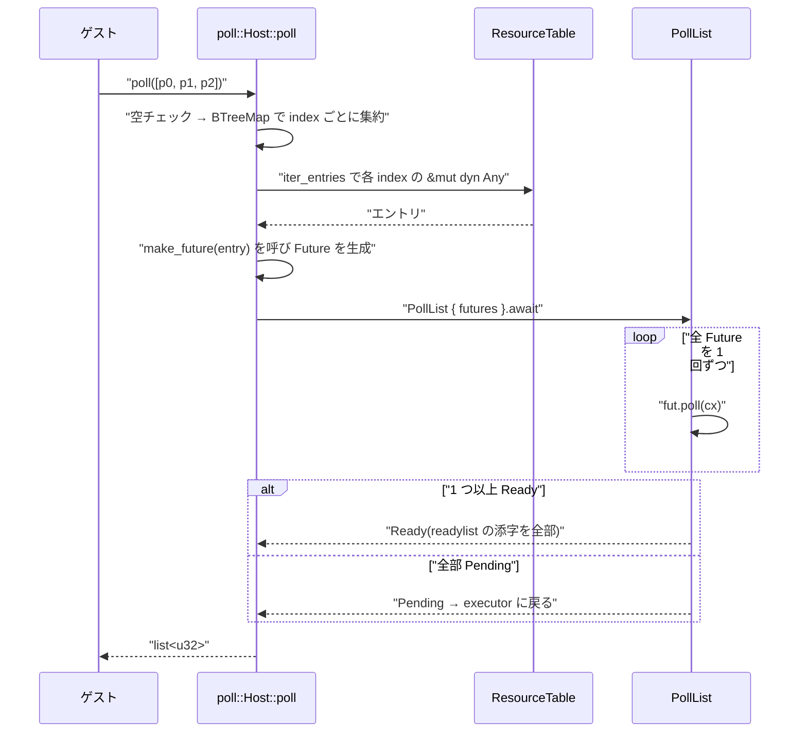

`wasi:io/poll` の `pollable` は「準備完了を待つオブジェクト」で、Rust に写すなら `Future` に見える。だが wasmtime のホスト実装は `Future` を持っていない。**持っているのは「`Future` を作る関数ポインタ」**だ。そうなっている理由が型定義のすぐ上に書いてある。

```rust title="crates/wasi-io/src/poll.rs"
pub type DynFuture<'a> = Pin<Box<dyn Future<Output = ()> + Send + 'a>>;
pub type MakeFuture = for<'a> fn(&'a mut dyn Any) -> DynFuture<'a>;

/// The host representation of the `wasi:io/poll.pollable` resource.
///
/// A pollable is not the same thing as a Rust Future: the same pollable may be used to
/// repeatedly check for readiness of a given condition, e.g. if a stream is readable
/// or writable. So, rather than containing a Future, which can only become Ready once, a
/// `DynPollable` contains a way to create a Future in each call to `poll`.
pub struct DynPollable {
    pub(crate) index: u32,
    pub(crate) make_future: MakeFuture,
    pub(crate) remove_index_on_delete: Option<fn(&mut ResourceTable, u32) -> Result<()>>,
}
```

[crates/wasi-io/src/poll.rs](https://github.com/bytecodealliance/wasmtime/blob/d8a0da6d661605713798c1c9c76be5c28e3159ff/crates/wasi-io/src/poll.rs#L8-L21)

**「同じ pollable が readiness 検査に繰り返し使われうるので、一度しか Ready にならない Future を持つのではなく、`poll` のたびに Future を作る手段を持つ」**。Rust の `Future` は消費されるものだ。`await` すれば終わり、二度目はない。だがゲストは同じストリームに対して何度も poll する。1 回で消費される `Future` を pollable の中身にすると、ゲストが `poll` を呼ぶたびにホスト側でリソースを作り直すことになる。

`DynPollable` はそのかわりに、**リソース表の index と、そこから `Future` を生やす関数**を持つ。生成側は `subscribe` で、`T: Pollable` という具体型を関数ポインタの中に閉じ込める。

```rust title="crates/wasi-io/src/poll.rs"
pub fn subscribe<T>(
    table: &mut ResourceTable,
    resource: Resource<T>,
) -> Result<Resource<DynPollable>>
where
    T: Pollable,
{
    fn make_future<'a, T>(stream: &'a mut dyn Any) -> DynFuture<'a>
    where
        T: Pollable,
    {
        stream.downcast_mut::<T>().unwrap().ready()
    }

    let pollable = DynPollable {
        index: resource.rep(),
        remove_index_on_delete: if resource.owned() { /* ... */ } else { None },
        make_future: make_future::<T>,
    };

    Ok(table.push_child(pollable, &resource)?)
}
```

[crates/wasi-io/src/poll.rs](https://github.com/bytecodealliance/wasmtime/blob/d8a0da6d661605713798c1c9c76be5c28e3159ff/crates/wasi-io/src/poll.rs#L90-L119)

`make_future::<T>` はジェネリック関数を単相化した関数ポインタで、`&mut dyn Any` を `T` に downcast して `ready()` を呼ぶ。**pollable 自体は型消去されているが、作られた瞬間に「どの型として蘇らせるか」が関数ポインタとして焼き込まれている。** `Box<dyn Pollable>` を持つ代わりにこの形にしているのは、待ち合わせ対象の実体 (ストリームやソケット) がリソース表に別途あり、pollable がそれを二重に所有できないからだ。

`push_child` にも意味がある。`subscribe` の doc が親子関係を説明している。

```rust title="crates/wasi-io/src/poll.rs"
/// If `resource` is an owned resource then it will be deleted when the returned
/// resource is deleted. Otherwise the returned resource is considered a "child"
/// of the given `resource` which means that the given resource cannot be
/// deleted while the `pollable` is still alive.
```

**pollable が生きている間、待ち合わせ対象は消せない。** `index` はリソース表の生の添字なので、対象が消えて別のリソースに再利用されると、pollable が無関係なオブジェクトを待つことになる。それを親子関係で防いでいる。

`Pollable` トレイト側の約束も 1 つある。

```rust title="crates/wasi-io/src/poll.rs"
/// Note that this method does not return an error. Returning an error
/// should be done through accessors on the object that this `pollable` is
/// connected to. The call to `wasi:io/poll` itself does not return errors,
/// only a list of ready objects.
async fn ready(&mut self);
```

[crates/wasi-io/src/poll.rs](https://github.com/bytecodealliance/wasmtime/blob/d8a0da6d661605713798c1c9c76be5c28e3159ff/crates/wasi-io/src/poll.rs#L66-L81)

**`ready()` はエラーを返さない。** WIT 側の `poll` にも「この関数は `result` を返さない。poll そのものは I/O をしないので失敗しない。I/O 源にエラーがあれば、その源を『準備完了』と印すことで示す」と書かれている。エラーは待ち合わせではなく、その後の `read` や `check-write` が返す。**「待つ」と「結果を得る」を完全に分けている**ので、待ち合わせ側にエラー経路が要らない。

## `poll` は `select_all` ではない

`poll` は複数の pollable を同時に待って、準備できたものの添字を返す。futures crate の `select_all` で書けそうに見えるが、実装は手書きの `Future` になっている。

```rust title="crates/wasi-io/src/impls.rs"
impl poll::Host for ResourceTable {
    async fn poll(&mut self, pollables: Vec<Resource<DynPollable>>) -> Result<Vec<u32>> {
        type ReadylistIndex = u32;

        if pollables.is_empty() {
            return Err(format_err!("empty poll list"));
        }

        let mut table_futures: BTreeMap<u32, (MakeFuture, Vec<ReadylistIndex>)> = BTreeMap::new();

        for (ix, p) in pollables.iter().enumerate() {
            let ix: u32 = ix.try_into()?;

            let pollable = self.get(p)?;
            let (_, list) = table_futures
                .entry(pollable.index)
                .or_insert((pollable.make_future, Vec::new()));
            list.push(ix);
        }

        let mut futures: Vec<(DynFuture<'_>, Vec<ReadylistIndex>)> = Vec::new();
        for (entry, (make_future, readylist_indices)) in self.iter_entries(table_futures) {
            let entry = entry?;
            futures.push((make_future(entry), readylist_indices));
        }
        // ... PollList ...
    }
}
```

[crates/wasi-io/src/impls.rs](https://github.com/bytecodealliance/wasmtime/blob/d8a0da6d661605713798c1c9c76be5c28e3159ff/crates/wasi-io/src/impls.rs#L14-L38)

ここで起きていることが 4 つある。

**空リストはトラップする。** WIT の doc も「リストが空、またはリストの要素数が `u32` で添字付けできないほど多い場合、この関数はトラップする」と書いている。空の `poll` は永久にブロックするしかなく、それはほぼ確実にゲストのバグだからだ。エラーを返す代わりに落とす。

**同じ対象を指す複数の pollable が `BTreeMap` で重複排除される。** ゲストは同じストリームに `subscribe` を 2 回呼んで、2 つの pollable を同じ `poll` のリストに入れられる。だが `make_future` は `&mut dyn Any` を要求するので、**同じリソースへの可変参照を 2 本取ることはできない**。だから `pollable.index` をキーにまとめる。そのぶん「1 つの Future が複数の添字に対応する」ことになるので、値が `Vec<ReadylistIndex>` になっている。ready を報告するときは、その添字を全部返す必要がある。

**全 Future を 1 回ずつ poll して、ready なもの「全部」を返す。**

```rust title="crates/wasi-io/src/impls.rs"
impl<'a> Future for PollList<'a> {
    type Output = Vec<u32>;

    fn poll(mut self: Pin<&mut Self>, cx: &mut Context<'_>) -> Poll<Self::Output> {
        let mut any_ready = false;
        let mut results = Vec::new();
        for (fut, readylist_indices) in self.futures.iter_mut() {
            match fut.as_mut().poll(cx) {
                Poll::Ready(()) => {
                    results.extend_from_slice(readylist_indices);
                    any_ready = true;
                }
                Poll::Pending => {}
            }
        }
        if any_ready {
            Poll::Ready(results)
        } else {
            Poll::Pending
        }
    }
}
```

[crates/wasi-io/src/impls.rs](https://github.com/bytecodealliance/wasmtime/blob/d8a0da6d661605713798c1c9c76be5c28e3159ff/crates/wasi-io/src/impls.rs#L40-L64)

`select_all` は「最初に完了した 1 本」を返して残りを捨てるが、`poll(2)` の意味論は「準備できたもの全部を返す」だ。1 本ずつ返していたら、n 個のイベントに n 回の poll が要る。全部を舐めて `Poll::Ready` になったものを集めるほうが、素直かつ回数が少ない。

**タスクを spawn しない。** `PollList` はその場のタスク上で全 Future を直接 poll するだけで、`tokio::spawn` は登場しない。ゲストの poll がホスト側のタスクを増やさないので、`Store` の外にゲスト由来の実行単位が漏れない。ホスト関数の中で完結する ([Store が 5 つの型に割れている理由](../store-five-types/) が言う「ストアは同時に 1 つの主体しか触らない」という前提が保たれる)。



## 「常に ready な pollable」で mio が餓死する

`poll` に「タイムアウト 0」を渡す方法は WASI には無い。**ゼロ長のタイマ pollable をリストに混ぜる**のがその代用になる。ここに厄介な問題が潜んでいて、対処が `Deadline` という型に残っている。

```rust title="crates/wasi/src/p2/host/clocks.rs"
enum Deadline {
    Past { yielded: bool },
    Instant(tokio::time::Instant),
    Never,
}

#[async_trait::async_trait]
impl Pollable for Deadline {
    async fn ready(&mut self) {
        match self {
            Deadline::Past { yielded: true } => {}
            Deadline::Past { yielded } => {
                // It is important we yield to Tokio here; otherwise we risk
                // starving `mio` such that it is unable to signal readiness for
                // other pollables (e.g. TCP sockets) when the guest is polling
                // in a busy loop.
                //
                // This is somewhat of a hack ... It relies on the guest
                // using the most natural approach to making a non-blocking call
                // to `wasi:io/poll#poll`, which is to include a zero-duration
                // `monotonic_clock::subscribe_{instant,duration}` in the list
                // of pollables.  That's what `wasi-libc`'s `poll(2)`
                // implementation does as of this writing, for example.
                *yielded = true;
                tokio::task::yield_now().await
            }
            Deadline::Instant(instant) => tokio::time::sleep_until(*instant).await,
            Deadline::Never => std::future::pending().await,
        }
    }
}
```

[crates/wasi/src/p2/host/clocks.rs](https://github.com/bytecodealliance/wasmtime/blob/d8a0da6d661605713798c1c9c76be5c28e3159ff/crates/wasi/src/p2/host/clocks.rs#L117-L152)

問題はこうだ。ゲストがゼロタイムアウトの `poll` をビジーループで回すと、そのゼロ長タイマは常に即 ready を返す。`PollList` は 1 つでも ready があれば `Poll::Ready` を返すので、**tokio の executor に一度も制御が戻らない**。`mio` は executor のタスクとして OS の readiness を集めているので、制御が戻らなければソケットの準備完了を誰も報告できない。ゲストは「TCP はいつまでも準備できない」と観測し、ループが永遠に終わらなくなる。

対処は「ゼロ長 sleep のとき、意図的に `yield_now().await` する」。制御が一度 executor に戻れば `mio` が動く。

そのうえで、**「一度 yield したら二度目はしない」ために `Deadline::Past { yielded: bool }` という状態を持つ**。これがないと、その pollable が永久に「1 回 yield してから ready」になり、ready の報告が毎回 1 タスク切り替え分遅れる。`ready()` は `&mut self` なので状態を書ける。**pollable が `Future` ではなく「対象そのものへの可変参照から Future を作る仕組み」であることが、ここで効いてくる。** 毎回作り直される `Future` は状態を持てないが、対象は持てる。

コメントは自分でこれをハックだと認めていて、依存している前提も明示している。**「ゲストがノンブロッキング poll をする最も自然な方法、つまりゼロ長の `monotonic_clock::subscribe_*` をリストに入れるやり方に依存している。現時点の `wasi-libc` の `poll(2)` 実装はそう書いている」**。そして「常に即 ready な pollable を作る方法は理論上ほかにもあり、このハックはそれをカバーしないが、今はこれで十分と考える」と締める。

**仕様上は正しく振る舞っているゲストが、ホストの実装都合で他の pollable を餓死させうる**という、抽象の境界をまたいだ問題だ。仕様のどこにも「poll は時々 executor に譲れ」とは書けない。譲る相手はホストの実装詳細だからだ。だから対処もホスト側の、特定のゲスト実装の書き癖に賭けたハックになる。

## どう活かすか

このページの核心は、**「1 回で消費される抽象」と「何度でも問い直せる抽象」は別物だ**という点にある。Rust の `Future` は前者で、`poll(2)` の対象は後者だ。前者で後者を表現しようとすると、毎回作り直しが必要になり、作り直しのコストと状態の置き場所が問題になる。

wasmtime の答えは「作り直しを型に埋め込む」。`Box<dyn Future>` ではなく `fn(&mut dyn Any) -> Future` を持ち、状態は待ち合わせ対象の側に置く。**再利用可能なハンドルが欲しいなら、値ではなくファクトリを持つ。** そして状態が必要になったときに置く場所は、ファクトリの外側にある。

次は、この pollable と対になる書き込み側の約束を見る ([permit モデル — check-write してから write する](../permit-model/))。
