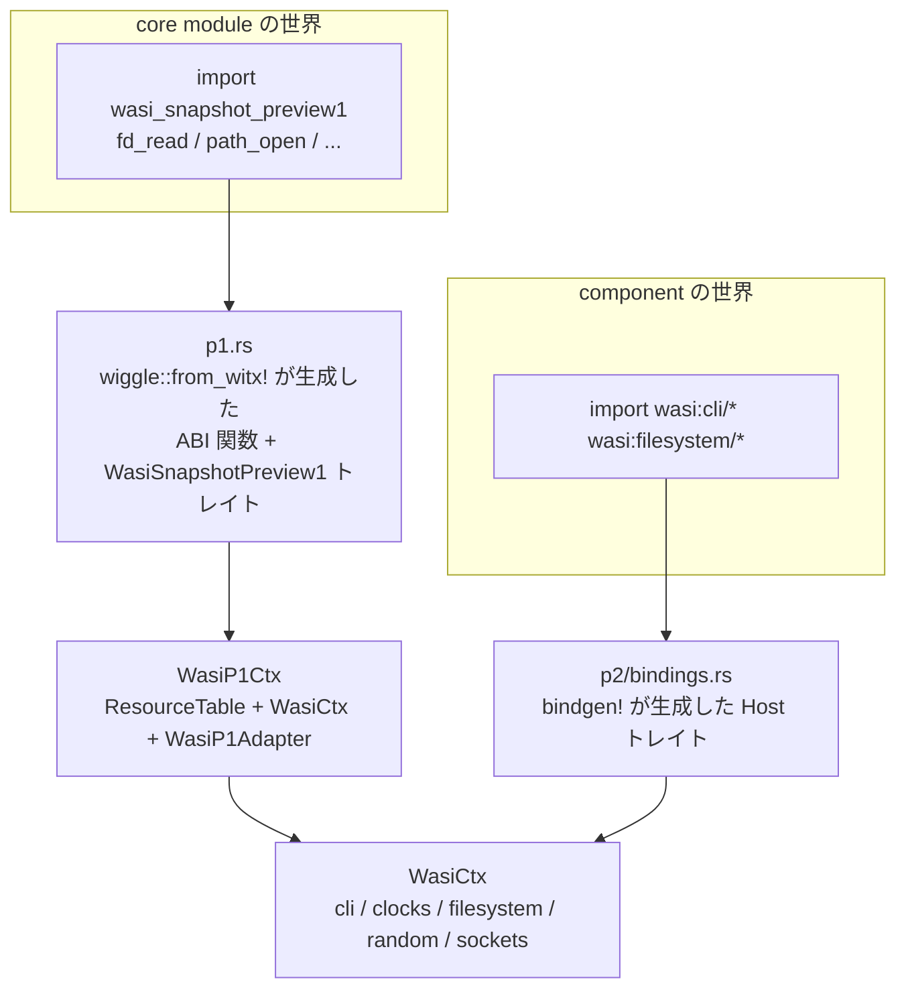

WASI Preview 1 (`wasi_snapshot_preview1`) は core module 向けの旧 API で、`fd_read` や `path_open` といった POSIX 風の関数が 40 個ほど並んでいる。Preview 2 とは形が違う。core wasm の import なので resource もハンドルもなく、すべてが `i32` の fd 番号と線形メモリへのポインタでやり取りされる。

にもかかわらず、**wasmtime の Preview 1 実装は Preview 2 の上に載っている**。`crates/wasi/src/p1.rs` という 2700 行のファイル 1 枚がその全部だ。

```rust title="crates/wasi/src/p1.rs"
//! Bindings for WASIp1 aka Preview 1 aka `wasi_snapshot_preview1`.
//!
//! This module contains runtime support for configuring and executing
//! WASIp1-using core WebAssembly modules. Support for WASIp1 is built on top of
//! support for WASIp2 available at [the crate root](crate), but that's just an
//! internal implementation detail.
```

[crates/wasi/src/p1.rs](https://github.com/bytecodealliance/wasmtime/blob/d8a0da6d661605713798c1c9c76be5c28e3159ff/crates/wasi/src/p1.rs#L1-L19)

**「WASIp2 のサポートの上に構築されているが、それは内部実装の詳細にすぎない」**。この関係は Cargo のフィーチャにも現れている。

```toml title="crates/wasi/Cargo.toml"
[features]
default = ["p1", "p2", "p3"]
p0 = ["p1"]
p1 = ["dep:wiggle", "p2"]
p2 = ["wasmtime/component-model", "wasmtime/async"]
```

[crates/wasi/Cargo.toml](https://github.com/bytecodealliance/wasmtime/blob/d8a0da6d661605713798c1c9c76be5c28e3159ff/crates/wasi/Cargo.toml#L63-L71)

**`p1` を有効にすると必ず `p2` が付いてくる。** 古い API のためだけに component model 一式を引き込むのは一見奇妙だが、実装が本当にそうなっているので選択の余地がない。さらに `p0` (`wasi_unstable`) は `p1` の上に載る。**3 世代が積み重なった塔**になっている。



## `WasiP1Ctx` — 番号とハンドルの対応表

Preview 1 の状態は 4 フィールドしかない。

```rust title="crates/wasi/src/p1.rs"
pub struct WasiP1Ctx {
    table: ResourceTable,
    wasi: WasiCtx,
    adapter: WasiP1Adapter,
    hostcall_fuel: usize,
}

impl WasiView for WasiP1Ctx {
    fn ctx(&mut self) -> WasiCtxView<'_> {
        WasiCtxView {
            ctx: &mut self.wasi,
            table: &mut self.table,
        }
    }
}
```

[crates/wasi/src/p1.rs](https://github.com/bytecodealliance/wasmtime/blob/d8a0da6d661605713798c1c9c76be5c28e3159ff/crates/wasi/src/p1.rs#L142-L147)、[同 L234-L241](https://github.com/bytecodealliance/wasmtime/blob/d8a0da6d661605713798c1c9c76be5c28e3159ff/crates/wasi/src/p1.rs#L234-L241)

`WasiCtx` と `ResourceTable` は [wasi:cli の world と、WasiCtx の切り方](../wasi-worlds/) で見たものそのままで、`WasiP1Ctx` はそれに `WasiView` を実装している。**p1 のホスト関数は、p2 のホスト関数を普通に呼べる。**

固有の状態は `WasiP1Adapter` だけで、中身は fd 番号の表だ。

```rust title="crates/wasi/src/p1.rs"
#[derive(Debug, Default)]
struct WasiP1Adapter {
    descriptors: Option<Descriptors>,
}

#[derive(Debug, Default)]
struct Descriptors {
    used: BTreeMap<u32, Descriptor>,
    free: BTreeSet<u32>,
}
```

[crates/wasi/src/p1.rs](https://github.com/bytecodealliance/wasmtime/blob/d8a0da6d661605713798c1c9c76be5c28e3159ff/crates/wasi/src/p1.rs#L345-L354)

`used` が「fd 番号 → 何か」、`free` が再利用可能な番号の集合。POSIX の「常に最小の空き番号を返す」規則を再現するために `BTreeSet` を使っている。そして `Descriptor::File` の中身が、p2 との橋渡しの核心になっている。

```rust title="crates/wasi/src/p1.rs"
#[derive(Debug)]
struct File {
    /// The handle to the preview2 descriptor of type [`crate::filesystem::Descriptor::File`].
    fd: Resource<filesystem::Descriptor>,

    /// The current-position pointer.
    position: Arc<AtomicU64>,

    /// In append mode, all writes append to the file.
    append: bool,

    blocking_mode: BlockingMode,
}
```

[crates/wasi/src/p1.rs](https://github.com/bytecodealliance/wasmtime/blob/d8a0da6d661605713798c1c9c76be5c28e3159ff/crates/wasi/src/p1.rs#L242-L256)

**`fd` は p2 のリソースハンドルそのもの。** p1 の `i32` から p2 の `Resource<Descriptor>` への写像がここにある。

そして **`position` が `Arc<AtomicU64>` になっている**のが、この移植で一番効いている一点だ。Preview 2 の `wasi:filesystem` にはシーク位置がない。`read` も `write` も必ずオフセットを引数に取る、いわゆる `pread`/`pwrite` の形しかない。**「ファイルハンドルが暗黙のカーソルを持つ」という POSIX の性質が、p2 では意図的に落とされている**からだ。カーソルがなければ、同じハンドルを 2 か所から使っても互いに干渉しない。

だが Preview 1 の `fd_read` にはオフセット引数がない。だから **p2 に無い状態を p1 側が自前で持つ**。`fd_seek` はその値を読み書きするだけの関数になる。

```rust title="crates/wasi/src/p1.rs"
async fn fd_seek(
    &mut self,
    _memory: &mut GuestMemory<'_>,
    fd: types::Fd,
    offset: types::Filedelta,
    whence: types::Whence,
) -> Result<types::Filesize, types::Error> {
    let t = self.transact()?;
    let File { fd, position, .. } = t.get_seekable(fd)?;
    let fd = fd.borrowed();
    let position = position.clone();
    drop(t);
    let pos = match whence {
        types::Whence::Set if offset >= 0 => offset.try_into().map_err(|_| types::Errno::Inval)?,
        types::Whence::Cur => position
            .load(Ordering::Relaxed)
            .checked_add_signed(offset)
            .ok_or(types::Errno::Inval)?,
        types::Whence::End => {
            let filesystem::DescriptorStat { size, .. } = self.filesystem().stat(fd).await?;
            size.checked_add_signed(offset).ok_or(types::Errno::Inval)?
        }
        _ => return Err(types::Errno::Inval.into()),
    };
    position.store(pos, Ordering::Relaxed);
    Ok(pos)
}
```

[crates/wasi/src/p1.rs](https://github.com/bytecodealliance/wasmtime/blob/d8a0da6d661605713798c1c9c76be5c28e3159ff/crates/wasi/src/p1.rs#L1889-L1917)

`SEEK_END` のときだけ p2 の `stat` を呼び、それ以外は自前のカウンタで完結する。`self.filesystem()` は `WasiView` のブランケット実装から生えたドメイン別ビューで、**p1 の関数が p2 のホスト実装を直接呼んでいる**のがそのまま見える。

`Arc` なのは、`Transact` という一時的な借用オブジェクトを `drop` してから非同期の p2 呼び出しに入るためだ。表の借用を保持したまま `.await` すると、`&mut self` が二重に必要になる。**位置だけを表から独立した参照カウント付きセルにしておくと、表を離してから使える。**

## `wiggle` — witx から ABI 関数を生成する

Preview 1 のインタフェース定義は WIT ではなく **witx** という古い形式で書かれている。これを Rust に落とすのが `wiggle` で、マクロの doc が生成物を 4 つに整理している。

```rust title="crates/wiggle/macro/src/lib.rs"
/// This macro expands to a set of `pub` Rust modules:
///
/// * The `types` module contains definitions for each `typename` declared in
///   the witx document. ...
///
/// * For each `module` defined in the witx document, a Rust module is defined
///   ...
///     * For each `@interface func` defined in a witx module, an abi-level
///       function is generated which takes ABI-level arguments, along with
///       a ref that impls the module trait, and a `GuestMemory` implementation.
///     * A public "module trait" is defined (called the module name, in
///       SnakeCase) which has a `&self` method for each function in the
///       module. These methods takes idiomatic Rust types for each argument
///       and return `Result<($return_types),$error_type>`
///     * When the `wiggle` crate is built with the `wasmtime_integration`
///       feature, each module contains an `add_to_linker` function to add it to
///       a `wasmtime::Linker`.
```

[crates/wiggle/macro/src/lib.rs](https://github.com/bytecodealliance/wasmtime/blob/d8a0da6d661605713798c1c9c76be5c28e3159ff/crates/wiggle/macro/src/lib.rs#L5-L46)

**型・ABI 関数・トレイト・`add_to_linker` の 4 点セット。** 人間が書くのはトレイトの実装だけで、`i32` のポインタを Rust の型に直す層は生成される。`p1.rs` の 1185 行目から 2700 行目までが、その `impl wasi_snapshot_preview1::WasiSnapshotPreview1 for WasiP1Ctx` になっている。

ABI 関数の生成が面白い形をしていて、witx crate が提供する `Bindgen` トレイト (スタックマシン風の命令列を吐くビジター) を実装し、各命令を `quote!` の Rust トークン列に変換する。

```rust title="crates/wiggle/generate/src/funcs.rs"
impl witx::Bindgen for Rust<'_> {
    type Operand = TokenStream;

    fn push_block(&mut self) { /* ... */ }
    fn finish_block(&mut self, operand: Option<TokenStream>) { /* ... */ }

    fn emit(
        &mut self,
        inst: &Instruction<'_>,
        operands: &mut Vec<TokenStream>,
        results: &mut Vec<TokenStream>,
    ) {
        // ...
        match inst {
            Instruction::GetArg { nth } => {
                let param = &self.params[*nth];
                results.push(quote!(#param));
            }
            // ... 以下、命令ごとに Rust コードを積む
        }
    }
}
```

[crates/wiggle/generate/src/funcs.rs](https://github.com/bytecodealliance/wasmtime/blob/d8a0da6d661605713798c1c9c76be5c28e3159ff/crates/wiggle/generate/src/funcs.rs#L160-L433)

`Operand` が `TokenStream` なので、**「値」ではなく「その値を計算する Rust 式」をスタックに積んでいく**。抽象インタプリタの構造をそのままコード生成器に流用する形で、Component Model 側の canonical ABI 生成 ([canonical ABI — 型をフラットな引数に潰す](../canonical-abi-flatten/)) と発想が共通している。

## `GuestMemory` はトレイトではなく enum

ゲストの線形メモリを表す型が、抽象化されずに 2 択の enum になっている。

```rust title="crates/wiggle/src/lib.rs"
/// Guest memory is represented as an array of bytes. Memories are either
/// "unshared" or "shared". Unshared means that the host has exclusive access to
/// the entire array of memory. This allows safe borrows into wasm linear
/// memory. Shared memories can be modified at any time and are represented as
/// an array of `UnsafeCell<u8>`.
pub enum GuestMemory<'a> {
    Unshared(&'a mut [u8]),
    Shared(&'a [UnsafeCell<u8>]),
}
```

[crates/wiggle/src/lib.rs](https://github.com/bytecodealliance/wasmtime/blob/d8a0da6d661605713798c1c9c76be5c28e3159ff/crates/wiggle/src/lib.rs#L34-L46)

**shared か unshared かの分岐が、型の形で強制される。** unshared なら `&mut [u8]` を持てるので、Rust の借用検査がそのまま働く。shared (threads proposal の共有メモリ) なら他スレッドがいつでも書き換えうるので `UnsafeCell` を経由するしかなく、安全な借用は作れない。トレイトで抽象化すると「実装によってはどちらでもありうる」ことになり、呼び出し側は常に最悪を仮定せざるを得なくなる。**2 択だと分かっているものは、2 択として書くほうが情報が多い。**

ポインタのほうは徹底して無保証だと宣言されている。

```rust title="crates/wiggle/src/lib.rs"
/// Presence of a [`GuestPtr`] does not imply any form of validity. Pointers can
/// be out-of-bounds, misaligned, etc. It is safe to construct a `GuestPtr` with
/// any offset at any time. Consider a `GuestPtr<T>` roughly equivalent to `*mut
/// T`.
```

[crates/wiggle/src/lib.rs](https://github.com/bytecodealliance/wasmtime/blob/d8a0da6d661605713798c1c9c76be5c28e3159ff/crates/wiggle/src/lib.rs#L309-L319)

**`GuestPtr` は「ゲストが渡してきた数値」以上のものではない。** 検査は `GuestMemory` のメソッドを通るときに毎回行われる。ゲストの値を型で信用しない、という [なぜ WebAssembly が生まれたのか](../why-wasm/) の原則がそのまま出ている。

## ランタイム借用チェッカが全廃された理由

`wiggle` にはかつて**実行時の借用チェッカ**があった。ゲストが渡してきた複数のポインタが重なっていないかを、実行時に区間で管理して検証するものだ。これは 2024 年に丸ごと削除されている。削除の動機が珍しい。

```text title="git log f1411653f6720c48d06114673f0338356e299c96"
Remove the borrow checking from `wiggle` entirely

Originally `wiggle` had a full-blown runtime borrow checker which
verified that borrows were disjoint when appropriate. In #8277 this was
removed in favor of a more coarse "either all shared or all mutable"
guarantee. It turns out that this exactly matches what the Rust type
system guarantees at compile time as well.

This commit removes all runtime borrow checking in favor of compile-time
borrow checking instead. This means that there is no longer the
possibility of a runtime error arising from borrowing errors. Current
bindings in Wasmtime needed no restructuring to work with this new API.
```

**保証を粗くしたら、Rust の型システムが与えるものとちょうど一致することが判明した。** 「全部共有か、全部可変か」まで落とせば、それは `&[T]` と `&mut [T]` そのものだ。だから実行時に持つ必要がなくなる。

普通、機能の削除は「使われていない」「壊れている」「置き換えた」のいずれかを理由にする。これは**「粗い近似に落としたら、既存の言語機能と同型になった」**という理由で、しかも結果として **「借用エラーという実行時の失敗モードが消滅した」**。動的検査を静的検査に移したのではなく、動的検査が不要になるところまで仕様を単純化して、静的検査だけで足りる形に着地している。

コミットは「Wasmtime の既存バインディングは、この新 API に合わせるための再構成を一切必要としなかった」とも書いている。粗くして失うものが実際には無かった、という裏付けだ。

## 同じ witx を 2 回食わせる

`p1.rs` の末尾には、マクロ呼び出しが 2 つ並んでいる。

```rust title="crates/wasi/src/p1.rs"
wiggle::from_witx!({
    witx: ["witx/p1/wasi_snapshot_preview1.witx"],
    async: {
        wasi_snapshot_preview1::{
            fd_advise, fd_close, fd_datasync, fd_fdstat_get, fd_filestat_get, fd_filestat_set_size,
            fd_filestat_set_times, fd_read, fd_pread, fd_seek, fd_sync, fd_readdir, fd_write,
            fd_pwrite, poll_oneoff, path_create_directory, path_filestat_get,
            path_filestat_set_times, path_link, path_open, path_readlink, path_remove_directory,
            path_rename, path_symlink, path_unlink_file, fd_renumber
        }
    },
    errors: { errno => trappable Error },
});

pub(crate) mod sync {
    wiggle::wasmtime_integration!({
        witx: ["witx/p1/wasi_snapshot_preview1.witx"],
        target: super,
        block_on[in_tokio]: {
            wasi_snapshot_preview1::{
                fd_advise, fd_close, fd_datasync, fd_fdstat_get, fd_filestat_get, fd_filestat_set_size,
                // ... 上と完全に同じ 26 個 ...
            }
        },
        errors: { errno => trappable Error },
    });
}
```

[crates/wasi/src/p1.rs](https://github.com/bytecodealliance/wasmtime/blob/d8a0da6d661605713798c1c9c76be5c28e3159ff/crates/wasi/src/p1.rs#L858-L896)

**26 個の関数名リストが 2 か所に完全重複している。** 上は「これらを `async fn` としてトレイトに生成せよ」、下は「これらは `in_tokio` で `block_on` してリンカに登録せよ」。片方だけ編集すると、非同期な実装を同期リンカから呼ぶことになって壊れる。マクロが 2 つに分かれているのは、トレイト定義と wasmtime 統合が別 crate 由来の別マクロだからだ。[sync と async で bindgen が 2 回走る](../wasi-worlds/) のと同じ構図が、witx 側にもある。

## "NOTE: legacy implementation ..." の散らばり

移植で一番むずかしいのは、仕様に書かれていない挙動を再現することだ。`p1.rs` にはその痕跡が点在している。

```rust title="crates/wasi/src/p1.rs"
fn fd_prestat_get(
    &mut self,
    _memory: &mut GuestMemory<'_>,
    fd: types::Fd,
) -> Result<types::Prestat, types::Error> {
    if let Descriptor::Directory {
        preopen_path: Some(p),
        ..
    } = self.transact()?.get_descriptor(fd)?
    {
        let pr_name_len = p.len().try_into()?;
        return Ok(types::Prestat::Dir(types::PrestatDir { pr_name_len }));
    }
    Err(types::Errno::Badf.into()) // NOTE: legacy implementation returns BADF here
}
```

[crates/wasi/src/p1.rs](https://github.com/bytecodealliance/wasmtime/blob/d8a0da6d661605713798c1c9c76be5c28e3159ff/crates/wasi/src/p1.rs#L1816-L1830)

preopen でない fd に `fd_prestat_get` を呼んだとき、`EBADF` を返す理由は **「レガシー実装がそう返していたから」だけ**だ。意味的には「不正な fd」ではない (fd 自体は有効で、ただ preopen ではない) が、`wasi-libc` は preopen の一覧を作るときに fd 0 から順に `fd_prestat_get` を呼び、`EBADF` が返った時点で打ち切る。**エラーコードが制御フローとして使われている**ので、変えると libc が壊れる。

同種の注記が `fd_prestat_dir_name` の `NOTDIR`、`fd_seek` 系の `SPIPE`、`path_*` の `Inval` などに散らばっている ([`grep "NOTE: legacy implementation"`](https://github.com/bytecodealliance/wasmtime/blob/d8a0da6d661605713798c1c9c76be5c28e3159ff/crates/wasi/src/p1.rs) で 5 か所)。**旧実装との互換性は仕様ではなく観測から来ていて、その出所をコメントで明示している**のが誠実なところだ。「なぜこのエラーコードなのか」に「仕様にそう書いてある」と答えられない箇所を、黙って書かずに印を付けている。

## どう活かすか

このページの構図は、レガシー API を抱えたどのシステムにも当てはまる。**新しい API を先に作り、古い API をその上の薄いアダプタとして再実装する。** そうすると実装が 1 つになり、機能追加もバグ修正も 1 か所で済む。`WasiP1Ctx` が `WasiView` を実装しているだけで p2 の全機能を呼べるのは、新 API 側がきちんと分解されていたからだ。

そのうえで、**新 API に無い概念 (シーク位置) は、アダプタ層が自分で持てばよい**。新 API の側にそれを足し戻す誘惑があるが、足すと新 API が古い API の制約を引きずる。p2 が `pread` 形しか持たないのは意図的な単純化で、その単純さは守られている。

そして「削除の理由」の教訓がひとつ。**動的検査を減らす最善の方法は、検査を静的に移すことではなく、検査が要らないところまで保証を粗くすること**かもしれない。`wiggle` の借用チェッカは「粗くしたら言語機能と一致した」という理由で消えた。自分のコードにある実行時アサーションも、保証を一段粗くしたら型で書けるものがあるかもしれない。

次は、この Preview 1 を component に変換するアダプタを見る。**それ自体が極端な制約下で書かれた wasm モジュール**になっている ([libc もアロケータもパニックもない wasm を書く](../preview1-adapter/))。
