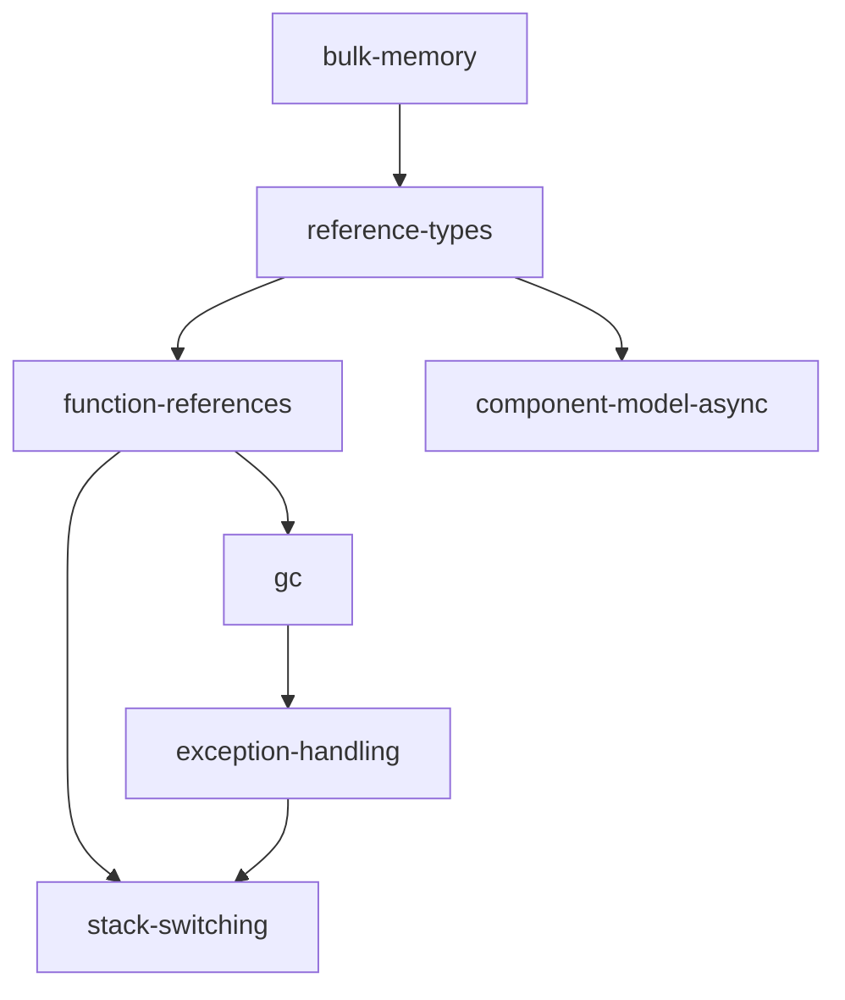

「Wasm には GC がない」「Wasm は 4GiB までしか使えない」「Wasm には例外がない」。どれも 2020 年頃には正しかったが、いまは違う。**GC も、memory64 も、例外処理も、Wasmtime では既定で有効な tier 1 の proposal である。**

Wasm の仕様は proposal という単位で拡張され続けている。そしてランタイム側は「どの proposal を受け入れるか」を実行時に切り替えられなければならない。Wasmtime のその機構が `Config::features()` で、ここを読むと **Wasm がいまどこまで来ているかの地図が 1 関数に収まっている**。

## feature 集合は 5 段階で決まる

```rust title="crates/wasmtime/src/config.rs"
fn features(&self) -> WasmFeatures {
    // Start with an empty set of wasm features. This notably decouples
    // features in Wasmtime from features in wasmparser as the two are
    // generally on different timelines.
    let mut features = WasmFeatures::empty();

    // Note that the first entry here, `WASM3`, is a fixed feature set that
    // won't change over time in wasmparser which represents the union of
    // all on-by-default features in Wasmtime.
    features |= WasmFeatures::WASM3;

    features |= WasmFeatures::WIDE_ARITHMETIC;

    // Next configure some features further based on compile-time features
    // of the wasmtime crate itself.
    features.set(WasmFeatures::GC_TYPES, cfg!(feature = "gc"));
    features.set(WasmFeatures::EXCEPTIONS, cfg!(feature = "gc"));
    features.set(WasmFeatures::THREADS, cfg!(feature = "threads"));
    // ...

    // Next disable any features which the current compiler/target do not
    // support.
    features = features & !self.compiler_panicking_wasm_features();

    // And, finally, process all explicitly enabled/disabled features on
    // behalf of the embedder's frobbing `Config::wasm_*`. These have the
    // highest priority since they were explicitly requested.
    features &= !self.disabled_features;
    features |= self.enabled_features;

    features
}
```

[crates/wasmtime/src/config.rs](https://github.com/bytecodealliance/wasmtime/blob/d8a0da6d661605713798c1c9c76be5c28e3159ff/crates/wasmtime/src/config.rs#L2519-L2582)

出発点が `WasmFeatures::empty()` であることに注目したい。**Wasmtime は wasmparser の既定値を継承しない。** 理由がコメントに書かれている。「これは Wasmtime の feature を wasmparser の feature から切り離す。両者は一般に別のタイムラインで動いているので」。上流の crate を更新した瞬間に、意図せず新しい proposal が有効になる、という事故を構造的に防いでいる。

`WASM3` は wasmparser 側で固定された名前付きの feature 集合で、**時間とともに変わらない**とコメントが明記している。これが「Wasmtime が既定で有効にするものの和集合」に一致するように選ばれている。名前のとおり、MVP (WASM1) と 2.0 (WASM2) に続く「3.0 相当」だ。

そして最後の段階、埋め込み側の `Config::wasm_*` がもっとも優先度が高い。

## Config::wasm_* はその場では何も検証しない

`Config::wasm_tail_call(true)` を呼んでも、その時点では何も起きない。ビットを立てるだけだ。

```rust title="crates/wasmtime/src/config.rs"
/// Note: this is a low-level method that does not necessarily imply that
/// wasmtime _supports_ a feature. It should only be used to _disable_
/// features that callers want to be rejected by the parser or _enable_
/// features callers are certain that the current configuration of wasmtime
/// supports.
///
/// Feature validation is deferred until an engine is being built, thus by
/// enabling features here a caller may cause
/// [`Engine::new`] to fail later, if the feature
/// configuration isn't supported.
pub fn wasm_features(&mut self, flag: WasmFeatures, enable: bool) -> &mut Self {
    self.enabled_features.set(flag, enable);
    self.disabled_features.set(flag, !enable);
    self
}
```

**整合性の判定は `Config::validate()` まで、つまり `Engine::new` まで遅延される。** この設計を選んだ理由も `features()` の doc に書かれている。

```rust title="crates/wasmtime/src/config.rs"
/// Note that the validation later on in `Config::validate` is a crucial
/// step here. The returned features here might include features unsupported
/// at compile time or unsupported by the selected compiler. In that case
/// `Config::validate` will present a first-class error message indicating
/// what's going on, and users should in theory be able to understand "ok
/// yeah that's why I can't enable that feature here".
```

ビルダーパターンでは設定の順序が任意なので、**個々のセッターの時点では整合性を判定しようがない**。`wasm_gc(true)` を先に呼んで `wasm_function_references(true)` を後で呼ぶかもしれないし、逆かもしれない。全部揃ってから一度に見るしかない。そして「その場でエラーにする」代わりに、後でまとめて分かりやすいメッセージを出す。

```rust title="crates/wasmtime/src/config.rs"
let unsupported = features & self.compiler_panicking_wasm_features();
if !unsupported.is_empty() {
    for flag in WasmFeatures::FLAGS.iter() {
        if !unsupported.contains(*flag.value()) {
            continue;
        }
        bail!(
            "the wasm_{} feature is not supported on this compiler configuration",
            flag.name().to_lowercase()
        );
    }

    panic!("should have returned an error by now")
}
```

エラーメッセージがフラグ名から自動生成されるので、新しい proposal を足してもここは触らなくてよい。

## proposal は互いに依存している

proposal は独立していない。後発のものは先行のものの上に積み上がる。各 `Config::wasm_*` の doc コメントがその依存を記録している。



- 「reference types proposal は bulk memory proposal に依存する」(`wasm_reference_types`)
- 「function references proposal は reference types proposal に依存する」(`wasm_function_references`)
- 「この feature は `function_reference_types` と `exceptions` に依存する」(`wasm_stack_switching`)

そして依存が満たされていない組み合わせは、`Engine::new` の時点で弾かれる。

```rust title="crates/wasmtime/src/config.rs"
// Generated adapters between components will use `ref.func` in some
// async-related situations so `component-model-async` requires
// `reference-types`.
if features.contains(WasmFeatures::CM_ASYNC)
    && !features.contains(WasmFeatures::REFERENCE_TYPES)
{
    bail!("the component-model-async feature requires the wasm reference-types proposal");
}
```

この依存が理由まで書かれているのがいい。「生成されるコンポーネント間のアダプタが async 関連の状況で `ref.func` を使うから」。**依存は仕様の階層構造から来るものと、Wasmtime の実装都合から来るものがあって、これは後者だ。**

## バックエンドによって使えないものがある

`compiler_panicking_wasm_features` が、選ばれたコンパイラとターゲットで**確実にパニックする** feature を返す。

```rust title="crates/wasmtime/src/config.rs"
Some(Strategy::Winch) => {
    unsupported |= WasmFeatures::GC
        | WasmFeatures::FUNCTION_REFERENCES
        | WasmFeatures::RELAXED_SIMD
        | WasmFeatures::TAIL_CALL
        | WasmFeatures::LEGACY_EXCEPTIONS
        | WasmFeatures::STACK_SWITCHING;

    match self.compiler_target().architecture {
        target_lexicon::Architecture::Aarch64(_) => {
            unsupported |= WasmFeatures::THREADS;
        }
        // Winch doesn't support other non-x64 architectures at this
        // time either but will return an first-class error for
        // them.
        _ => {}
    }
}
```

Winch はベースラインコンパイラなので、GC や末尾呼び出しといった実行時サポートの厚い機能に追いついていない ([Winch — 単一パスで、見れば分かるコードを吐く](../winch/))。

Pulley の制約は質が違う。

```rust title="crates/wasmtime/src/config.rs"
// Pulley at this time fundamentally doesn't support the
// `threads` proposal, notably shared memory, because Rust can't
// safely implement loads/stores in the face of shared memory.
// Stack switching is not implemented, either.
if self.compiler_target().is_pulley() {
    unsupported |= WasmFeatures::THREADS;
    unsupported |= WasmFeatures::STACK_SWITCHING;
}
```

**「原理的に (fundamentally) 対応しない」**と書かれている。Pulley はインタプリタなので、線形メモリへのアクセスは Rust のコードになる。だが共有メモリは他スレッドから同時に書き換わりうるので、Rust の型システムでは安全な load/store を書けない ([Pulley — JIT できない場所のためのバイトコード VM](../pulley/))。これは実装を頑張れば解決する類の話ではない。

なお、この関数が返すのは「パニックする」ものだけである、という区別が doc に明記されている。「ここに挙げられていない feature も部分的にしか対応していないかもしれない。例えば Winch は simd を部分的にサポートしているのでここには挙げていない。完全ではないが、未実装の命令は単にエラーを返すだけ」。**パニックとエラーの区別が、そのままリストに載るかどうかの基準になっている。**

## 有効な proposal と、安全に使える proposal は一致しない

ここがこのページのいちばん重要な点だ。**threads proposal は既定で有効だが、共有メモリを作ることは既定で禁止されている。**

```rust title="crates/wasmtime/src/config.rs"
/// The WebAssembly threads proposal, configured by [`Config::wasm_threads`]
/// is on-by-default but there are enough deficiencies in Wasmtime's
/// implementation and API integration that creation of a shared memory is
/// disabled by default. This configuration knob can be used to enable this.
///
/// When enabling this method be aware that wasm threads are, at this time,
/// a [tier 2
/// feature](https://docs.wasmtime.dev/stability-tiers.html#tier-2) in
/// Wasmtime meaning that it will not receive security updates or fixes to
/// historical releases. Additionally security CVEs will not be issued for
/// bugs in the implementation.
///
/// This option is `false` by default.
pub fn shared_memory(&mut self, enable: bool) -> &mut Self {
    self.shared_memory = enable;
    self
}
```

[crates/wasmtime/src/config.rs](https://github.com/bytecodealliance/wasmtime/blob/d8a0da6d661605713798c1c9c76be5c28e3159ff/crates/wasmtime/src/config.rs#L3316-L3335)

**「セキュリティ更新も過去リリースへの修正も受けない」「実装のバグに対して CVE も発行されない」。** これはかなり強い警告だ。proposal のパースと検証は通るのに、実際に使うと保証の外に出る。

理由は tier 表の脚注にある。

```text title="docs/stability-wasm-proposals.md"
| [`threads`]              | ✅      | ✅    | 🚧[^8]   | ❌[^4] | ✅  | ✅     |

[^4]: Fuzzing with threads is an open implementation question that is expected
    to get fleshed out as the [`shared-everything-threads`] proposal advances.
[^8]: There are [known
    issues](https://github.com/bytecodealliance/wasmtime/issues/4245) with
    shared memories and the implementation/API in Wasmtime, for example they
    aren't well integrated with resource-limiting features in `Store`.
    Additionally `shared` memories aren't supported in the pooling allocator.
```

[docs/stability-wasm-proposals.md](https://github.com/bytecodealliance/wasmtime/blob/d8a0da6d661605713798c1c9c76be5c28e3159ff/docs/stability-wasm-proposals.md)

fuzzing ができていないことが決定的だ。tier 1 の条件は 6 列すべてにチェックが付くことで、`threads` は Fuzzed の列が ❌ になっている。**Wasmtime のセキュリティ保証は fuzzing に強く依存しているので、fuzz されていない機能は「動くが保証しない」という中間状態に置かれる。**

同じ理由で、CLI の `-Wall-proposals` にも例外がある。

```rust title="crates/cli-flags/src/lib.rs"
// Not included in `all_proposals`: off by default until fuzzed.
if let Some(enable) = self.wasm.branch_hinting {
    config.wasm_branch_hinting(enable);
}
```

他の proposal はすべて `.or(all)` で `-Wall-proposals` に乗るが、`branch_hinting` と `stack_switching` だけは `.or(all)` が付いていない。**「全部有効にする」フラグにも、有効にしないものがある。**

## 実装のコメントとドキュメントがずれることもある

`Config::wasm_memory64` の doc コメントは、現行のコードと食い違っている。

```rust title="crates/wasmtime/src/config.rs"
/// Configures whether the WebAssembly memory64 [proposal] will
/// be enabled for compilation.
///
/// Note that this the upstream specification is not finalized and Wasmtime
/// may also have bugs for this feature since it hasn't been exercised
/// much.
///
/// This is `false` by default.
```

だが `docs/stability-wasm-proposals.md` の tier 1 表で `memory64` は 6 列すべて ✅ で、`features()` は `WASM3` を無条件に足している。memory64 は WASM3 に含まれるので、**現行の main では既定で有効**だ。doc コメントのほうが古い。

**「既定値がどうか」を知りたければ doc コメントではなく `features()` の実装を読む**、というのが正しい態度になる。既定値のような「他の場所の変更で意味が変わる情報」を散らばった doc コメントに書くと、必ずこうなる。単一の定義源 (`features()`) があること自体は良い設計で、問題はそれを doc に転記してしまったことのほうだ。

## proposal を実装するとは何をすることか

Wasmtime に新しい proposal を入れる手順が 11 ステップで文書化されている。

```text title="docs/contributing-implementing-wasm-proposals.md"
* [ ] Implement support for the proposal in the [`wasm-tools` repository].
  * [ ] [`wast`] - text parsing
  * [ ] [`wasmparser`] - binary decoding and validation
  * [ ] [`wasmprinter`] - binary-to-text
  * [ ] [`wasm-encoder`] - binary encoding
  * [ ] [`wasm-smith`] - fuzz test case generation
* [ ] Update Wasmtime to use these `wasm-tools` crates, but leave the new
  proposal unimplemented for now (implementation comes in subsequent PRs).
* [ ] Add `Config::wasm_your_proposal` to the `wasmtime` crate.
* [ ] Implement the proposal in `wasmtime`, gated behind this flag.
* ...
* [ ] Enable the proposal in [the fuzz targets](./contributing-fuzzing.md).
* [ ] Expose the proposal's new functionality in the `wasmtime` crate's API.
* [ ] Expose the proposal's new functionality in the C API.
```

[docs/contributing-implementing-wasm-proposals.md](https://github.com/bytecodealliance/wasmtime/blob/d8a0da6d661605713798c1c9c76be5c28e3159ff/docs/contributing-implementing-wasm-proposals.md#L5-L47)

**最初の作業が Wasmtime ではなく `wasm-tools` リポジトリである**ことが、この構造をよく表している。パースも検証もテキスト形式もファジング用のジェネレータも、全部先に上流で揃える。そのうえで「使うようにするが、実装はまだしない」という中間コミットを挟む。

そして後半が実装ではなくテスト・API・ドキュメントであることも目を引く。**fuzz ターゲットへの追加が「proposal を実装した」の定義に含まれている。** tier 1 に上がる条件に Fuzzed の列があるのは、この手順の裏返しだ。

## どう活かすか

feature フラグを持つシステムを設計するなら、`Config::features()` の 5 段階は良い型になる。**空集合から始める** (上流の既定値を継承しない)、**既定の集合を 1 箇所に固定名で置く**、**ビルド時の能力で絞る**、**実行時の能力で絞る**、**利用者の明示指定を最優先で適用する**。この順序なら、どの段階で何が落ちたかを説明できる。

そして「有効にできるか」と「保証されるか」を別の軸として持つこと。Wasmtime は proposal の有効/無効 (`Config::wasm_*`) と tier (fuzz されているか、CVE が出るか) を独立に管理し、shared memory のように**両者がずれる箇所には別のフラグを立てて既定で閉じている**。ずれを隠さずフラグとして表に出すのは、素直で正しい設計だ。

次はこの群の最後、Wasm の外側とのつながりを見る ([WASI とは何か — 権限ではなく能力を渡す](../what-wasi-is/))。
