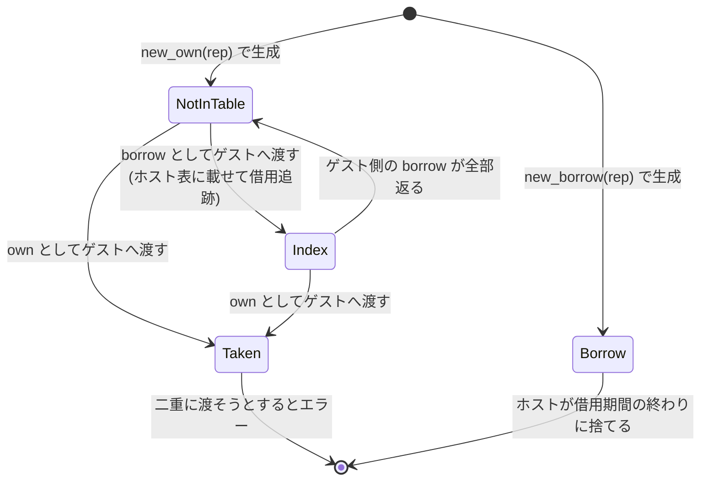

## 結論から

component model の `own<T>` と `borrow<T>` は、Rust の所有権と借用に似ているが**静的検査ではなく動的追跡**で実現されている。実装上その動的追跡は 2 つのカウンタに集約される。

- **`own` ハンドルは `lend_count` を持ち、これが非ゼロの間は削除できない。**
- **`borrow` ハンドルは `scope` を持ち、drop するとその scope の borrow カウントを減らす。呼び出しから戻る時点でカウントが 0 でなければトラップする。**

これが own / borrow の実行時セマンティクスそのものだ。以下、そこに至る構造を見ていく。

## ハンドルは 1 つの表に全部入る

component インスタンスごとに `HandleTable` が 1 つあり ([core module だけでは足りない理由](../why-component/))、そこに **resource も stream も future も task も全部入る**。

```rust title="crates/wasmtime/src/runtime/vm/component/handle_table.rs"
enum Slot {
    Free { next: u32 },

    /// Represents an owned resource handle with the listed representation.
    ///
    /// The `lend_count` tracks how many times this has been lent out as a
    /// `borrow` and if nonzero this can't be removed.
    ResourceOwn { resource: TypedResource, lend_count: u32 },

    /// Represents a borrowed resource handle connected to the `scope`
    /// provided.
    ///
    /// The `rep` is listed and dropping this borrow will decrement the borrow
    /// count of the `scope`.
    ResourceBorrow { resource: TypedResource, scope: u32 },

    HostTask { rep: u32 },
    GuestTask { rep: u32 },
    Stream { ty: TypeStreamTableIndex, rep: u32, state: TransmitLocalState },
    Future { ty: TypeFutureTableIndex, rep: u32, state: TransmitLocalState },
    WaitableSet { rep: u32 },
    ErrorContext { rep: u32 },
}

pub struct HandleTable {
    next: u32,
    slots: TryVec<Slot>,
}
```

[crates/wasmtime/src/runtime/vm/component/handle_table.rs](https://github.com/bytecodealliance/wasmtime/blob/d8a0da6d661605713798c1c9c76be5c28e3159ff/crates/wasmtime/src/runtime/vm/component/handle_table.rs#L49-L118)

`Free { next }` があることから分かるとおり、空きスロットはフリーリストとして連結されている。**表の番号空間が全種類のハンドルで共有される**のは canonical ABI の要求で、ゲストから見れば `stream.read` に渡すハンドルも `resource.drop` に渡すハンドルも同じ 32bit の整数だ。統合しておくと「番号は合っているが種類が違う」を `Slot` の照合 1 回で検出できる。

ハンドル番号には上限がある。

```rust title="crates/wasmtime/src/runtime/vm/component/handle_table.rs"
/// The maximum handle value is specified in
/// <https://github.com/WebAssembly/component-model/blob/main/design/mvp/CanonicalABI.md>
/// currently and keeps the upper bits free for use in the component and ABI.
const MAX_HANDLE: u32 = 1 << 28;
```

[crates/wasmtime/src/runtime/vm/component/handle_table.rs](https://github.com/bytecodealliance/wasmtime/blob/d8a0da6d661605713798c1c9c76be5c28e3159ff/crates/wasmtime/src/runtime/vm/component/handle_table.rs#L7-L10)

**上位 4 ビットは canonical ABI が予約している**ので、表は 2^28 エントリまでしか作れない。文字列の長さが最上位ビットをタグに使っていたのと同じ話で ([文字列の 3 エンコーディングと latin1 の膨張処理](../strings/))、32bit の値の一部をメタ情報に取っておく設計になっている。

## own の削除条件

`own` ハンドルを別の関数に `borrow` として渡すと `lend_count` が増える。

```rust title="crates/wasmtime/src/runtime/vm/component/handle_table.rs"
/// This will increase `lend_count` for owned resources and must be paired
/// with a `resource_undo_lend` below later on (managed by `CallContexts`).
pub fn resource_lend(&mut self, idx: TypedResourceIndex) -> Result<(u32, bool)> {
    match self.get_mut(idx.raw_index())? {
        Slot::ResourceOwn { resource, lend_count } => {
            let rep = resource.rep(&idx)?;
            *lend_count = lend_count.checked_add(1).unwrap();
            Ok((rep, true))
        }
        Slot::ResourceBorrow { resource, .. } => Ok((resource.rep(&idx)?, false)),
        _ => bail!("index {} is not a resource", idx.raw_index()),
    }
}

pub fn remove_resource(&mut self, idx: TypedResourceIndex) -> Result<RemovedResource> {
    let ret = match self.get_mut(idx.raw_index())? {
        Slot::ResourceOwn { resource, lend_count } => {
            if *lend_count != 0 {
                bail!("cannot remove owned resource while borrowed")
            }
            RemovedResource::Own { rep: resource.rep(&idx)? }
        }
        Slot::ResourceBorrow { resource, scope } => {
            // Ensure the drop is done with the right type
            resource.rep(&idx)?;
            RemovedResource::Borrow { scope: *scope }
        }
        _ => bail!("index {} is not a resource", idx.raw_index()),
    };
    self.remove(idx.raw_index())?;
    Ok(ret)
}
```

[crates/wasmtime/src/runtime/vm/component/handle_table.rs](https://github.com/bytecodealliance/wasmtime/blob/d8a0da6d661605713798c1c9c76be5c28e3159ff/crates/wasmtime/src/runtime/vm/component/handle_table.rs#L218-L279)

`cannot remove owned resource while borrowed` の 1 行が、**Rust コンパイラが静的にやることを実行時にやっている箇所**だ。`borrow` から `borrow` を作るときは `lend_count` を触らない (既に貸出中の値をまた見せるだけなので、元の `own` の状態は変わらない)。

## borrow と scope

`borrow` の側は、貸出の記録を「呼び出し」単位で持つ。

```rust title="crates/wasmtime/src/runtime/vm/component/resources.rs"
pub struct CallContext {
    lenders: Vec<TypedResourceIndex>,
    borrow_count: u32,
}
```

`borrow` を作るときに現在の scope の `borrow_count` を増やし、貸し出した `own` のインデックスを `lenders` に積む。`borrow` ハンドルを drop すると `borrow_count` が減る。そして呼び出しから戻る直前に検査が入る。

```rust title="crates/wasmtime/src/runtime/vm/component/resources.rs"
/// Validates that the current scope can be exited.
///
/// This will ensure that this context's active borrows have all been
/// dropped. This will then commit the lend decrements back to the owned
/// resources that were originally passed in.
pub fn validate_scope_exit(&mut self) -> Result<()> {
    let cx = self.task_state.call_context(self.current_scope_id()?)?;
    if cx.borrow_count > 0 {
        bail!("borrow handles still remain at the end of the call")
    }
    for lender in mem::take(&mut cx.lenders) {
        // Note the panics here which should never get triggered in theory
        // due to the dynamic tracking of borrows and such employed for
        // resources.
        self.table_for_index(&lender).resource_undo_lend(lender).unwrap();
    }
    Ok(())
}
```

[crates/wasmtime/src/runtime/vm/component/resources.rs](https://github.com/bytecodealliance/wasmtime/blob/d8a0da6d661605713798c1c9c76be5c28e3159ff/crates/wasmtime/src/runtime/vm/component/resources.rs#L314-L334)

**「呼び出しから戻る時点で borrow が 1 つでも残っていればトラップ」**。これが `borrow<T>` の「その呼び出しの間だけ有効」というセマンティクスの実体だ。そして全部返っていることが確認できて初めて、`lenders` を辿って `lend_count` を戻す。この `validate_scope_exit` は `Func::call_raw` が lifting の直前に呼んでいる ([lifting と lowering、realloc と post-return](../lifting-lowering/))。

`resource_undo_lend` が `.unwrap()` になっているのは、「動的追跡が正しければ失敗しえない」という不変条件の表明で、そのことがコメントに明記されている。

## ホスト側の `Resource<T>` — 32bit + 4 状態

ホストが持つハンドルは `Resource<T>` で、doc がその位置付けを説明している。

```rust title="crates/wasmtime/src/runtime/component/resources/host_static.rs"
/// This type can be thought of as roughly a newtype wrapper around `u32` for
/// use as a resource with the component model. The main guarantee that the
/// component model provides is that the `u32` is not forgeable by guests and
/// there are guaranteed semantics about when a `u32` may be in use by the guest
/// and when it's guaranteed no longer needed. This means that it is safe for
/// embedders to consider the internal `u32` representation "trusted" and use it
/// for things like table indices with infallible accessors that panic on
/// out-of-bounds. This should only panic for embedder bugs, not because of any
/// possible behavior in the guest.
```

[crates/wasmtime/src/runtime/component/resources/host_static.rs](https://github.com/bytecodealliance/wasmtime/blob/d8a0da6d661605713798c1c9c76be5c28e3159ff/crates/wasmtime/src/runtime/component/resources/host_static.rs#L21-L56)

**「この 32bit はゲストに偽造できないので、ホストは信用してよい」**という保証がこの型の存在意義だ。だから「境界外なら panic する」infallible なアクセサでテーブルを引いてよい。panic したらそれは埋め込み側のバグであって、ゲストの悪意ではない。

`T` はただの目印で、`T` の値は一切保持しない (`PhantomData<fn() -> T>`)。同じ型の resource を取り違えるミスを型で防ぐためだけにある。

そして 32bit の `rep` に加えて「状態」がある。

```rust title="crates/wasmtime/src/runtime/component/resources/host.rs"
/// Internal dynamic state tracking for this resource. This can be one of
/// four different states:
///
/// * `BORROW` / `u64::MAX` - this indicates that this is a borrowed
///   resource. The `rep` doesn't live in the host table and this `Resource`
///   instance is transiently available. It's the host's responsibility to
///   discard this resource when the borrow duration has finished.
///
/// * `NOT_IN_TABLE` / `u64::MAX - 1` - this indicates that this is an owned
///   resource not present in any store's table. This resource is not lent
///   out. It can be passed as an `(own $t)` directly into a guest's table
///   or it can be passed as a borrow to a guest which will insert it into
///   a host store's table for dynamic borrow tracking.
///
/// * `TAKEN` / `u64::MAX - 2` - while the `rep` is available the resource
///   has been dynamically moved into a guest and cannot be moved in again.
///   This is used for example to prevent the same resource from being
///   passed twice to a guest.
///
/// * All other values - any other value indicates that the value is an
///   index into a store's table of host resources. ... The low 32-bits of the value are
///   the table index and the upper 32-bits are the generation.
struct AtomicResourceState {
    index: AtomicU32,
    generation: AtomicU32,
}
```

[crates/wasmtime/src/runtime/component/resources/host.rs](https://github.com/bytecodealliance/wasmtime/blob/d8a0da6d661605713798c1c9c76be5c28e3159ff/crates/wasmtime/src/runtime/component/resources/host.rs#L39-L75)

64bit の空間の上端 3 つをセンチネルに使い、それ以外は「表インデックス + 世代」として解釈する。判別は上位 32bit (`generation` フィールド) を見るだけで済む。

```rust title="crates/wasmtime/src/runtime/component/resources/host.rs"
const BORROW: u32 = u32::MAX;
const NOT_IN_TABLE: u32 = u32::MAX - 1;
const TAKEN: u32 = u32::MAX - 2;

fn decode(idx: u32, generation: u32) -> ResourceState {
    match generation {
        Self::BORROW => Self::Borrow,
        Self::NOT_IN_TABLE => Self::NotInTable,
        Self::TAKEN => Self::Taken,
        _ => Self::Index(HostResourceIndex::new(idx, generation)),
    }
}
```

状態遷移はこうなる。



`Taken` の存在理由が明快で、**同じ `Resource<T>` を 2 回ゲストに渡させないため**だ。`Resource<T>` は `Copy` なので、うっかり同じ値を 2 回 lower することが起こりうる。`own` として渡した時点で `Taken` に落とし、2 回目はエラーにする。

## `AtomicU32` を 2 本にしている理由

`AtomicU64` 1 本のほうが素直に見えるが、そうなっていない。理由が 2 つ書かれている。

```rust title="crates/wasmtime/src/runtime/component/resources/host.rs"
/// Note that this is two `AtomicU32` fields but it's not intended to actually
/// be used in conjunction with threads as generally a `Store<T>` lives on one
/// thread at a time. The pair of `AtomicU32` here is used to ensure that this
/// type is `Send + Sync` when captured as a reference to make async
/// programming more ergonomic.
///
/// Also note that two `AtomicU32` here are used instead of `AtomicU64` to be
/// more portable to platforms without 64-bit atomics.
```

**第 1 に、スレッド間共有のためではない。** `Store<T>` は一度に 1 スレッドにしか乗らないので、本来アトミック性は要らない。アトミックにしているのは **`&Resource<T>` を握ったまま `Send + Sync` になってほしいから**で、そうでないと async のコードで `.await` を跨いで参照を持てず、書き味が落ちる。内部可変性を確保する手段としてアトミックを選んだだけで、`Ordering::Relaxed` しか使っていないのもそれと整合している。

**第 2 に、64bit アトミックのないプラットフォームへの移植性。** 32bit の組み込み向けターゲットには `AtomicU64` がないものがある。`swap` の実装も 2 本を順に load / store しているだけで、アトミックなペア更新にはなっていない。単一スレッド前提だから成立する割り切りだ。

## ABA 問題と世代カウンタ

表インデックスを直接持つ設計には、解放済みスロットが再利用されたときに古いインデックスが別の値を指す ABA 問題がついてまわる。Wasmtime はここに世代カウンタを足している。

```rust title="crates/wasmtime/src/runtime/component/resources/host_tables.rs"
/// This metadata is used to prevent the ABA problem with indices handed out as
/// part of `Resource` and `ResourceAny`. Those structures are `Copy` meaning
/// that it's easy to reuse them, possibly accidentally. To prevent issues in
/// the host Wasmtime attaches both an index (within `ResourceTables`) as well
/// as a 32-bit generation counter onto each `HostResourceIndex` which the host
/// actually holds in `Resource` and `ResourceAny`.
///
/// Whenever a slot in the table is allocated the `cur_generation` field is
/// pushed at the corresponding index of `generation_of_table_slot`. Whenever
/// a field is accessed the current value of `generation_of_table_slot` is
/// checked against the generation of the index. Whenever a slot is deallocated
/// the generation is incremented. Put together this means that any access of a
/// deallocated slot should deterministically provide an error.
#[derive(Default)]
pub struct HostResourceData {
    cur_generation: u32,
    table_slot_metadata: TryVec<TableSlot>,
}
```

[crates/wasmtime/src/runtime/component/resources/host_tables.rs](https://github.com/bytecodealliance/wasmtime/blob/d8a0da6d661605713798c1c9c76be5c28e3159ff/crates/wasmtime/src/runtime/component/resources/host_tables.rs#L42-L96)

**動機が具体的に書かれているのがよい。「`Resource` と `ResourceAny` が `Copy` なので、うっかり再利用しやすい」。** 型で防げないのだから、実行時に確実に検出できるようにする。「解放済みスロットへのアクセスは決定的にエラーになる」という保証が目標として明示されている。

`HostResourceIndex` は `(u32, u32)` を 64bit に詰めたもので、下位 32bit が表インデックス、上位 32bit が世代。`AtomicResourceState` の 2 本の `AtomicU32` はまさにこれを 2 分割して持っている。

## 3 つのホスト側ハンドル型

ホストから resource を扱う型は 3 つある。

**`Resource<T>`** は静的型付き。`T` は目印で、`bindgen!` が既定で使う。

**`ResourceAny`** は動的型付きで、ゲスト定義の resource も表せる。`Resource<T>` と違って型パラメータがないので、実行時に型エラーが起きうる。そして重要な違いがある。

```rust title="crates/wasmtime/src/runtime/component/resources/any.rs"
/// Like [`Resource`] this type represents either an `own` or a `borrow`
/// resource internally. Unlike [`Resource`], however, a [`ResourceAny`] must
/// always be explicitly destroyed with the [`ResourceAny::resource_drop`]
/// method. This will update internal dynamic state tracking and invoke the
/// WebAssembly-defined destructor for a resource, if any.
///
/// Note that it is required to call `resource_drop` for all instances of
/// [`ResourceAny`]: even borrows. Both borrows and own handles have state
/// associated with them that must be discarded by the time they're done being
/// used.
```

[crates/wasmtime/src/runtime/component/resources/any.rs](https://github.com/bytecodealliance/wasmtime/blob/d8a0da6d661605713798c1c9c76be5c28e3159ff/crates/wasmtime/src/runtime/component/resources/any.rs#L24-L53)

**`ResourceAny` は borrow であっても明示的に `resource_drop` を呼ばなければならない。** `ResourceAny` は必ずストア内の `HostResourceData` にエントリを持つので、それを回収する手段が要る。`Drop` で自動化できないのは、drop にゲストのデストラクタ呼び出しが伴いうる (= `&mut Store` が要る) からだ。Rust の `Drop` はストアを受け取れない。

**`ResourceDynamic`** は、resource の型を実行時に作れる版だ。

```rust title="crates/wasmtime/src/runtime/component/resources/host_dynamic.rs"
/// The downside of [`Resource`], however, is that all resource types must be
/// statically assigned at compile time. It's not possible to manufacture more
/// types at runtime in some more dynamic situations. That's where
/// [`ResourceDynamic`] comes in.
```

[crates/wasmtime/src/runtime/component/resources/host_dynamic.rs](https://github.com/bytecodealliance/wasmtime/blob/d8a0da6d661605713798c1c9c76be5c28e3159ff/crates/wasmtime/src/runtime/component/resources/host_dynamic.rs#L11-L57)

ホストの型を実行時に列挙するような埋め込み (別言語のオブジェクトを resource として貸し出す、など) では、Rust の型パラメータで種類を区別できない。その場合は `ResourceType::host_dynamic(ty)` で実行時の型値を作る。

## `ResourceTable` は別レイヤ

紛らわしいが、`crates/wasmtime/src/runtime/component/resource_table.rs` の `ResourceTable` はここまでとは**別の層**にある。これは「ホストが `Resource<T>` の 32bit を index として引くための、ホスト自身の表」だ。

```rust title="crates/wasmtime/src/runtime/component/resource_table.rs"
/// The `ResourceTable` type maps a `Resource<T>` to its `T`.
pub struct ResourceTable {
    entries: Vec<Entry>,
    free_head: Option<usize>,
    max_capacity: usize,
}

/// This structure tracks parent and child relationships for a given table entry.
///
/// Parents and children are referred to by table index. We maintain the
/// following invariants:
/// * the parent must exist when adding a child.
/// * whenever a child is created, its index is added to children.
/// * whenever a child is deleted, its index is removed from children.
/// * an entry with children may not be deleted.
struct TableEntry {
    /// The entry in the table, as a boxed dynamically-typed object
    entry: Box<dyn Any + Send>,
    /// The index of the parent of this entry, if it has one.
    parent: Option<u32>,
    /// The indices of any children of this entry.
    children: BTreeSet<u32>,
}
```

[crates/wasmtime/src/runtime/component/resource_table.rs](https://github.com/bytecodealliance/wasmtime/blob/d8a0da6d661605713798c1c9c76be5c28e3159ff/crates/wasmtime/src/runtime/component/resource_table.rs#L8-L109)

`Resource<T>` が保証するのは「この 32bit は偽造されていない」までで、その 32bit が何を指すかはホストが決める。`ResourceTable` はその「何を指すか」の側の既定実装で、`Box<dyn Any + Send>` を保持する型消去された表になっている。

この表には独自の不変条件がある。**親子関係を持ち、子がいるエントリは削除できない。** `ResourceTableError::HasChildren` というエラーがそれ専用に用意されている。ファイルから派生したストリームのように「親が消えたら子が宙に浮く」関係を表すためのもので、WASI の実装が全面的にこれを使う ([なぜ wasi:io だけが別クレートなのか](../wasi-io/))。

容量にも既定上限がある。

```rust title="crates/wasmtime/src/runtime/component/resource_table.rs"
/// Default setting for `ResourceTable::max_capacity`, chosen to be high
/// enough that it doesn't need changing all that often but low enough that
/// exhausting it isn't a massive problem for the host.
const DEFAULT_MAX_CAPACITY: usize = 1_000_000;
```

100 万エントリ。「変更が必要になることは滅多になく、かつ使い切ってもホストにとって致命的でない」という基準で選ばれている。hostcall fuel の 128MiB と同じ発想で、**既定値を「まず当たらないが、当たっても被害が限定される」水準に置く**という方針が繰り返し出てくる。

## 持ち帰り

**`own` / `borrow` を実行時に実現するのに必要だったのは、貸出カウンタ 1 つと scope 単位の借用カウンタ 1 つだけだった。** 静的検査ができない境界でリソースの寿命を管理する必要があるとき、この 2 カウンタの組は素直に流用できる。

もう 1 つは世代カウンタの動機だ。**「`Copy` な型でインデックスを配る」なら ABA は必ず起きる**ので、インデックスに世代を抱き合わせて、解放済みへのアクセスが決定的にエラーになるようにしておく。Wasmtime はこれを 64bit に詰めて `Resource` のサイズを増やさずに実現している。
