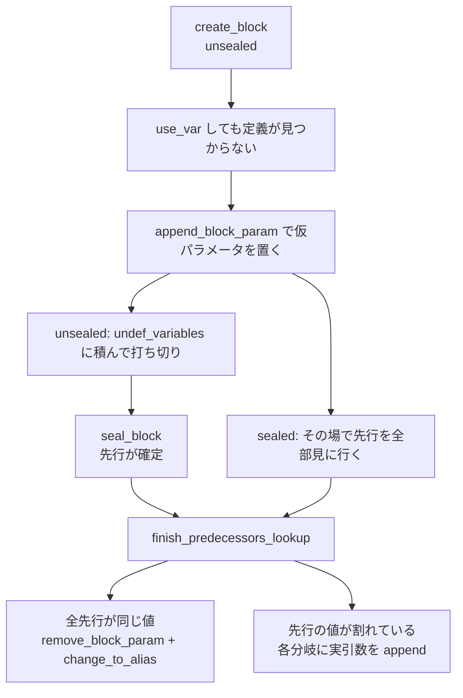

Wasm から CLIF への翻訳器は、ローカル変数もブロック引数も `Variable` に投げて済ませていた ([Wasm のブロック引数を、CLIF のブロック引数にしない](../block-params-not-phi/))。投げられた先が `cranelift-frontend` の `SSABuilder` である。ここが**別パスを立てずに、CFG を組み立てながら SSA を作る**。

```rust title="cranelift/frontend/src/ssa.rs"
//! A SSA-building API that handles incomplete CFGs.
//!
//! The algorithm is based upon Braun M., Buchwald S., Hack S., Leißa R., Mallon C.,
//! Zwinkau A. (2013) Simple and Efficient Construction of Static Single Assignment Form.
//! In: Jhala R., De Bosschere K. (eds) Compiler Construction. CC 2013.
```

[cranelift/frontend/src/ssa.rs](https://github.com/bytecodealliance/wasmtime/blob/d8a0da6d661605713798c1c9c76be5c28e3159ff/cranelift/frontend/src/ssa.rs#L1-L8)

古典的な SSA 構築は、支配辺境 (dominance frontier) を計算してから phi を置く。**支配辺境の計算には完成した CFG が要る**ので、CFG を作り終えてから別パスを走らせることになる。Braun らのアルゴリズムはそれを要求しない。「変数の値が要る」と言われた時点で、先行ブロックを遡って探しに行くだけである。

## API は 3 つしかない

`cranelift-frontend` の設計思想は、モジュールコメントに書かれている。

```rust title="cranelift/frontend/src/lib.rs"
//! # Mutable variables and Cranelift IR values
//!
//! The most interesting feature of this API is that it provides a single way to deal with all your
//! variable problems. ... through calling the functions
//! [`declare_var`](FunctionBuilder::declare_var), [`def_var`](FunctionBuilder::def_var) and
//! [`use_var`](FunctionBuilder::use_var), the [`FunctionBuilder`] will create for you all the
//! Cranelift IR values corresponding to your variables.
//!
//! The moral is that you should use these three functions to handle all your mutable variables,
//! even those that are not present in the source code but artifacts of the translation.
```

[cranelift/frontend/src/lib.rs](https://github.com/bytecodealliance/wasmtime/blob/d8a0da6d661605713798c1c9c76be5c28e3159ff/cranelift/frontend/src/lib.rs#L9-L36)

**「可変変数はすべて `Variable` に投げろ、ソースコードに存在しない翻訳の産物であっても投げろ」**という割り切りだ。Wasm 翻訳器がブロック引数まで `Variable` にしているのは、この "even those that are not present in the source code" に忠実に従った結果である。

同じコメントは逆の助言も添えている。「1 回しか定義されないと事前に分かっている変数は、命令ビルダが返す `Value` を直接使ってよい。`use_var` を通しても動くが、わずかにオーバーヘッドがある (SSA アルゴリズムは変数が不変かどうかを事前に知らない)」。**判断できるなら直接、できないなら投げる。** 翻訳器の `i32.add` が値スタックの `Value` を直接扱っているのはこちらの側だ。

役割は単純だ。`declare_var` が変数の型を登録し、`def_var` が「今いるブロックでこの変数の値はこれ」と記録し、`use_var` が「今いるブロックでこの変数の値は何か」を問う。加えて 4 つ目に `seal_block` がある。

## sealed か unsealed か

`SSABuilder` が各ブロックについて持っている状態はこれだけである。

```rust title="cranelift/frontend/src/ssa.rs"
#[derive(Clone)]
enum Sealed {
    No {
        // List of current Block arguments for which an earlier def has not been found yet.
        undef_variables: EntityList<Variable>,
    },
    Yes,
}

#[derive(Clone, Default)]
struct SSABlockData {
    // The predecessors of the Block with the block and branch instruction.
    predecessors: EntityList<Inst>,
    // A block is sealed if all of its predecessors have been declared.
    sealed: Sealed,
    // If this block is sealed and it has exactly one predecessor, this is that predecessor.
    single_predecessor: PackedOption<Block>,
}
```

[cranelift/frontend/src/ssa.rs](https://github.com/bytecodealliance/wasmtime/blob/d8a0da6d661605713798c1c9c76be5c28e3159ff/cranelift/frontend/src/ssa.rs#L86-L110)

用語は `SSABuilder` の doc コメントに定義がある。ブロックが _filled_ とは「含まれる命令をすべて翻訳し終えた」こと、_sealed_ とは「先行ブロックがすべて宣言済み」であること。そして「**filled な先行ブロックしか宣言できない**」という制約が付く。

**sealed であることが重要なのは、それが「もう先行ブロックは増えない」という約束だからだ。** 前方ジャンプがある言語では、ブロックを作った時点では誰が飛んでくるか分からない。Wasm の `block` は典型で、`br` は後から何本でも現れる。だから翻訳器は `End` に来て初めて `seal_block` を呼ぶ。ループの header は、後ろから戻ってくる `br` があるので、ループの `End` まで seal できない。実際 `code_translator.rs` の `End` はこうなっている。

```rust title="crates/cranelift/src/translate/code_translator.rs"
builder.switch_to_block(next_block);
builder.seal_block(next_block);

// If it is a loop we also have to seal the body loop block
if let ControlStackFrame::Loop { header, .. } = frame {
    builder.seal_block(header)
}
```

一方 `if` の consequent 側のブロックは、先行が `brif` の 1 本だけと確定しているので、その場で seal される (`builder.seal_block(next_block); // Only predecessor is the current block.`)。**構造化制御構文のおかげで、翻訳器は seal できるタイミングを常に正確に知っている。** ゴトー付きの言語のフロントエンド向けには `seal_all_blocks` も用意されているが、doc コメントが「できるだけ早く seal したほうが効率的」と明言している。

## `use_var` が何をするか

`use_var` は 3 段階で答えを探す。

```rust title="cranelift/frontend/src/ssa.rs"
fn use_var_nonlocal(&mut self, func: &mut Function, var: Variable, ty: Type, mut block: Block) {
    // First, try Local Value Numbering (Algorithm 1 in the paper).
    // If the variable already has a known Value in this block, use that.
    if let Some(val) = self.variables[var][block].expand() {
        self.results.push(val);
        return;
    }

    // Otherwise, use Global Value Numbering (Algorithm 2 in the paper).
    // This resolves the Value with respect to its predecessors.
    // Find the most recent definition of `var`, and the block the definition comes from.
    let (val, from) = self.find_var(func, var, ty, block);
    // ...
}
```

[cranelift/frontend/src/ssa.rs](https://github.com/bytecodealliance/wasmtime/blob/d8a0da6d661605713798c1c9c76be5c28e3159ff/cranelift/frontend/src/ssa.rs#L276-L318)

同じブロックに `def_var` があればそれで終わり。これが大半のケースで、`SecondaryMap<Variable, SecondaryMap<Block, PackedOption<Value>>>` を 2 回引くだけで済む。

なければ `find_var` に降りる。ここが**単一先行ブロックの連鎖**を辿る部分だ。

```rust title="cranelift/frontend/src/ssa.rs"
/// If a block has exactly one predecessor, and the block is sealed so we know its predecessors
/// will never change, then its definition for this variable is the same as the definition from
/// that one predecessor. In this case it's easy to see that no block parameter is necessary,
/// but we need to look at the predecessor to see if a block parameter might be needed there.
/// That holds transitively across any chain of sealed blocks with exactly one predecessor each.
```

先行が 1 本しかなく、かつ sealed なら、ブロックパラメータは要らない。その 1 本の先行の定義がそのまま答えになる。この判定が推移的に繋がるので、**単一先行ブロックの連鎖はどこまでも遡れる**。実装は `single_predecessor` を辿るだけのループだ。見つかったら、辿ってきた途中のブロック全部にその定義をキャッシュする (`use_var_nonlocal` の末尾のループ)。「なぜ途中に書き込んでよいのか」の証明が 15 行のコメントで説明されていて、要点は **filled でないブロックは先行として宣言できない**という制約に帰着する。先行として辿れる時点でそのブロックは埋まっているので、後から新しい定義が増えることはない。

## 仮パラメータを置いて、後で消す

連鎖を辿っても定義が見つからないとき (合流点に来たとき、あるいは unsealed なブロックに来たとき) が本番になる。**ここで先にブロックパラメータを追加してしまう。**

```rust title="cranelift/frontend/src/ssa.rs"
// We've promised to return the most recent block where `var` was defined, but we didn't
// find a usable definition. So create one.
let val = func.dfg.append_block_param(block, ty);
var_defs[block] = PackedOption::from(val);
self.record_stack_map_binding(var, val);

// Now every predecessor needs to pass its definition of this variable to the newly added
// block parameter. ...
match &mut self.ssa_blocks[block].sealed {
    Sealed::Yes => self.begin_predecessors_lookup(val, block),
    Sealed::No { undef_variables } => {
        undef_variables.push(var, &mut self.variable_pool);
        self.results.push(val);
    }
}
```

sealed なら、その場で先行ブロックを全部見に行く。**unsealed なら、`undef_variables` に積んで打ち切る。** 先行がまだ増えるかもしれないので、今答えを出しても意味がない。呼び出し側にはとりあえず仮のブロックパラメータを返しておく。

その積み残しを回収するのが `seal_block` だ。

```rust title="cranelift/frontend/src/ssa.rs"
fn seal_one_block(&mut self, block: Block, func: &mut Function) {
    // For each undef var we look up values in the predecessors and create a block parameter
    // only if necessary.
    let mut undef_variables =
        match mem::replace(&mut self.ssa_blocks[block].sealed, Sealed::Yes) {
            Sealed::No { undef_variables } => undef_variables,
            Sealed::Yes => return,
        };

    let predecessors = self.predecessors(block);
    if predecessors.len() == 1 {
        let pred = func.layout.inst_block(predecessors[0]).unwrap();
        self.ssa_blocks[block].single_predecessor = PackedOption::from(pred);
    }
    // ... 変数ごとに begin_predecessors_lookup を回す
}
```

[cranelift/frontend/src/ssa.rs](https://github.com/bytecodealliance/wasmtime/blob/d8a0da6d661605713798c1c9c76be5c28e3159ff/cranelift/frontend/src/ssa.rs#L461-L503)

先行が確定したので `single_predecessor` を埋め、unsealed の間に溜まった変数それぞれについて、先行ブロックを遡る探索を始める。



## 不要と分かったパラメータの消し方

`finish_predecessors_lookup` が最後の判断を下す。先行から集まった値をエイリアス解決してから、sentinel (仮パラメータ) を除いて比べる。

```rust title="cranelift/frontend/src/ssa.rs"
if let Some(pred_val) = pred_val {
    // Here all the predecessors use a single value to represent our variable
    // so we don't need to have it as a block argument.
    // We need to replace all the occurrences of val with pred_val but since
    // we can't afford a re-writing pass right now we just declare an alias.
    func.dfg.remove_block_param(sentinel);
    func.dfg.change_to_alias(sentinel, pred_val);
    pred_val
} else {
    // There is disagreement in the predecessors on which value to use so we have
    // to keep the block argument.
    // ... 各先行の分岐命令に実引数を追加する
}
```

[cranelift/frontend/src/ssa.rs](https://github.com/bytecodealliance/wasmtime/blob/d8a0da6d661605713798c1c9c76be5c28e3159ff/cranelift/frontend/src/ssa.rs#L585-L616)

**全先行が同じ値を渡すなら、ブロックパラメータは要らない。** 削除して、仮パラメータをその値へのエイリアスにする。ここで「今は書き換えパスを走らせる余裕がないのでエイリアスを宣言するだけにする」と明記されているのが正直で、`Value` が別の `Value` を指すという間接が CLIF に残る。この後始末は後で一括して行われる。

先行の意見が割れたときだけ、パラメータを残し、各先行の分岐命令に実引数を追加する。翻訳器が引数なしの `jump` を出していたのは、**この瞬間に引数を足してもらうため**である。`declare_block_predecessor` の doc コメントにも「分岐命令を作るときはジャンプ引数を渡してはいけない。`SSABuilder` が埋める」と書かれている。

## 循環をどう切るか

単一先行の連鎖を辿るループには落とし穴がある。**連鎖が輪になっていたら、永久に回る。** コメントがその場合の扱いを説明している。

```rust title="cranelift/frontend/src/ssa.rs"
/// This runs into a problem, though, if such a chain has a cycle: Blindly following a cyclic
/// chain that never defines this variable would lead to an infinite loop in the compiler. It
/// doesn't really matter what code we generate in that case. Since each block in the cycle has
/// exactly one predecessor, there's no way to enter the cycle from the function's entry block;
/// and since all blocks in the cycle are sealed, the entire cycle is permanently dead code. But
/// we still have to prevent the possibility of an infinite loop.
///
/// To break cycles, we can pick any block within the cycle as the one where we'll add a block
/// parameter. ...
```

[cranelift/frontend/src/ssa.rs](https://github.com/bytecodealliance/wasmtime/blob/d8a0da6d661605713798c1c9c76be5c28e3159ff/cranelift/frontend/src/ssa.rs#L331-L344)

**推論が綺麗だ。** 輪の中の各ブロックが先行を 1 つしか持たないなら、外から輪に入る道がない。全部 sealed なら今後も入る道は増えない。よって輪は丸ごと到達不能で、どんなコードを生成しても構わない。あとは無限ループさえ避ければいい。実装は `visited: EntitySet<Block>` に印を付けて 2 周目で `break` するだけで、そこにブロックパラメータを 1 つ足して終わる。

合流点での探索の側にも循環がある。ループの header で `use_var` すると、先行の 1 つは自分自身に戻ってくる。ここで先にブロックパラメータを置いてから探索に出るのは、**まさにこの再帰を止めるため**だ。`finish_predecessors_lookup` の doc に「無限ループを避けるため、パラメータは呼び出し側が eager に置く」と書かれている。戻ってきた値が sentinel そのものなら「まだ何も決まっていない」を意味するので、比較から除外する。

なお、この探索は Rust の再帰では書かれていない。`Call` の明示スタックと状態機械になっていて、`run_state_machine` の doc に「アルゴリズムは自然には再帰的だが、コールスタックを使い切る危険を避けるため、明示的なスタックと小さな状態機械にした」と理由が書かれている。深い CFG で**コンパイラ自身がスタックオーバーフローする**ことを避けている。信用できない入力を食うコンパイラとして当然の配慮である。

変数が一度も定義されないまま使われた場合は、エラーにせず `iconst 0` などのゼロを置く。これも「到達不能コードでしか起きないので影響がない」という判断で、`SideEffects` として呼び出し側に「このブロックに命令を足した」とだけ伝える。

## 後始末は `Context::optimize` の冒頭にある

その場で構築する代わりに、多少のゴミが残る。掃除はコンパイルの入口で行われる。

```rust title="cranelift/codegen/src/context.rs"
self.compute_cfg();
self.compute_domtree();
self.eliminate_unreachable_code(isa)?;
self.remove_constant_phis(isa)?;

self.func.dfg.resolve_all_aliases();

if opt_level != OptLevel::None {
    self.egraph_pass(isa, ctrl_plane)?;
}
```

[cranelift/codegen/src/context.rs](https://github.com/bytecodealliance/wasmtime/blob/d8a0da6d661605713798c1c9c76be5c28e3159ff/cranelift/codegen/src/context.rs#L160-L197)

`remove_constant_phis` は、SSA 構築が消しきれなかったブロックパラメータを消す。`finish_predecessors_lookup` は「その合流点の先行が全員同じ値か」しか見ない。値が別のブロックパラメータ経由で来ている場合や、ループを跨いで同じ値が回っている場合は、局所的な比較では同じだと分からない。

```rust title="cranelift/codegen/src/remove_constant_phis.rs"
// For each value in Group A, it attempts to establish whether it will have
// the value of exactly one member of Group B.  If so, the formal parameter is
// deleted, all corresponding actual parameters (in jumps/branches to the
// defining block) are deleted, and a rename is inserted.
//
// The entry block is special-cased because (1) we don't know what values flow
// to its formals and (2) in any case we can't change its formals.
```

[cranelift/codegen/src/remove_constant_phis.rs](https://github.com/bytecodealliance/wasmtime/blob/d8a0da6d661605713798c1c9c76be5c28e3159ff/cranelift/codegen/src/remove_constant_phis.rs#L20-L35)

こちらは**関数全体を見る反復的なデータフロー解析**で、定数伝播と同じ束の上で不動点を取る。「実際には 4 回程度で収束するのを見た」というコメントまで付いている。`BlockSummary` の上で回すので命令を毎回舐めずに済み、安い。エントリブロックだけは ABI が決めるので触らない — [CLIF の設計 — データフローと並び順を分ける](../clif-design/) で見た「実ブロック引数を持つのはエントリブロックだけ」という性質が、ここでも例外として現れる。

`resolve_all_aliases` は、`change_to_alias` が残したエイリアスの鎖を全部潰す。実装は「鎖を辿るたびに途中のエイリアスも最終値に張り替える」ので、値の個数に対して線形時間で終わる。ここを通ったあとの CLIF にはエイリアスが残らないので、**後続のパスはエイリアスの存在を考えなくてよい** ([ægraph — 非循環な e-graph という選択](../egraph/))。順番にも意味があり、`eliminate_unreachable_code` が先に走るので、到達不能な循環に置かれた無意味なブロックパラメータやゼロ初期化は `remove_constant_phis` が見る前に消える。

## どう活かすか

このアルゴリズムの本質は、**「完成した構造がないと計算できない」ものを「完成するまで保留できる」ものに置き換えた**ことにある。支配辺境は CFG の完成を要求する。「先行ブロックがまだ増えるかもしれない」という状態を明示的に持てば、要求しなくなる。

保留の実装も学ぶところがある。答えが出せないとき、`SSABuilder` は**先に仮の答え (ブロックパラメータ) を発行して、呼び出し側を待たせない**。仮の答えは循環検出の目印としても働き、後から本当の答えが分かればエイリアスで差し替える。「暫定値を返して後で訂正する」という形は、逐次的にしか情報が入ってこない状況で繰り返し使える。

そして訂正しきれなかったぶんは、後段の専用パス (`remove_constant_phis`) に回す。**その場でできる範囲の処理と、全体を見ないとできない処理を分けて、後者を専用パスに押し出す。** 前段を安く保つための素直な分担になっている。
