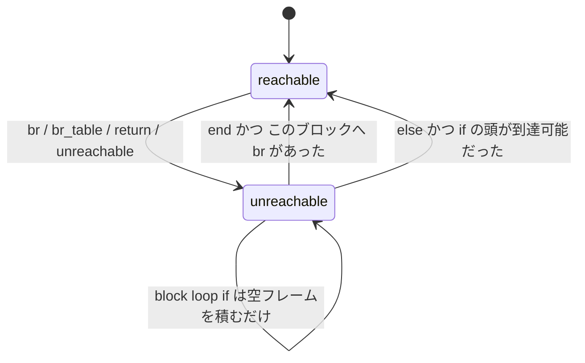

Wasm の実行モデルはスタックマシンだ。`i32.add` は引数を取らず、値スタックから 2 つ pop して 1 つ push する。命令列にレジスタ番号が出てこないぶんバイナリが小さくなる。

だが Wasm の本当に効いている設計判断は、スタックマシンであることではなく、**制御フローに `goto` がないこと**のほうだ。分岐は `block` / `loop` / `if` という入れ子のブロックを「n 段抜ける」形でしか書けない。この制約があるおかげで、**命令列を頭から 1 回なめるだけで、任意の位置における値スタックの高さと、あらゆる分岐の飛び先が確定する**。Wasmtime のフロントエンドが 1 パスで CLIF を吐けるのはこの性質に完全に依存している。

## 2 本のスタックを持って 1 回なめる

翻訳器のモジュールコメントが、やっていることを 3 文で説明している。

```rust title="crates/cranelift/src/translate/code_translator.rs"
//! The translation is done in one pass, opcode by opcode. Two main data structures are used during
//! code translations: the value stack and the control stack. The value stack mimics the execution
//! of the WebAssembly stack machine: each instruction result is pushed onto the stack and
//! instruction arguments are popped off the stack. Similarly, when encountering a control flow
//! block, it is pushed onto the control stack and popped off when encountering the corresponding
//! `End`.
```

[crates/cranelift/src/translate/code_translator.rs](https://github.com/bytecodealliance/wasmtime/blob/d8a0da6d661605713798c1c9c76be5c28e3159ff/crates/cranelift/src/translate/code_translator.rs#L1-L12)

**値スタックに積まれるのは実行時の値ではなく、CLIF の `Value` (SSA の値番号) である**。つまり翻訳器は wasm のスタックマシンを「シミュレート」しているのだが、動かしているのは実際のデータではなく、コンパイル時の名前だ。`i32.add` を翻訳するとは、値番号を 2 つ pop して `iadd` 命令を作り、その結果の値番号を push することを意味する。

これが成立する条件が「値スタックの高さが静的に決まること」だ。もし実行時にしか高さが分からなければ、pop したときに何が出てくるか分からず、この方式は破綻する。

具体例で追ってみる。

```wat
(func (result i32)
  block (result i32)
    i32.const 1
    i32.const 2
    i32.add
  end)
```

| 命令                 | 値スタック | 制御スタック (下が外側)                     |
| -------------------- | ---------- | ------------------------------------------- |
| (関数の入口)         | `[]`       | `[Block{dest: exit, ret: 1, orig: 0}]`      |
| `block (result i32)` | `[]`       | `[..., Block{dest: next, ret: 1, orig: 0}]` |
| `i32.const 1`        | `[v1]`     | 変化なし                                    |
| `i32.const 2`        | `[v1, v2]` | 変化なし                                    |
| `i32.add`            | `[v3]`     | 変化なし                                    |
| `end`                | `[v4]`     | `[Block{dest: exit, ...}]`                  |
| `end` (関数)         | `[]`       | `[]`                                        |

関数そのものも制御スタックの一番外側のフレームとして表現されている。`initialize` が `exit_block` を destination とするフレームを 1 つ push するところから始まるからだ。だから「関数の末尾に到達する」と「一番外側のブロックを抜ける」が同じ処理になる。

`end` のところで `v3` が `v4` に変わっているのが目を引くが、これは仕様の話ではなく Cranelift 側の都合だ。`end` は destination ブロックへジャンプしてから値スタックを元の高さに切り詰め、改めて destination ブロックの引数を push し直す。

```rust title="crates/cranelift/src/translate/code_translator.rs"
Operator::End => {
    let frame = environ.stacks.control_stack.pop().unwrap();
    let next_block = frame.following_code();
    let return_count = frame.num_return_values();

    canonicalise_then_jump(
        environ,
        builder,
        next_block,
        environ.stacks.peekn(return_count),
    );
    // ...
    builder.switch_to_block(next_block);
    builder.seal_block(next_block);

    // If it is a loop we also have to seal the body loop block
    if let ControlStackFrame::Loop { header, .. } = frame {
        builder.seal_block(header)
    }
    // ...
    frame.truncate_value_stack_to_original_size(
        &mut environ.stacks.stack,
        &mut environ.stacks.stack_shape,
    );
    push_block_params(environ, builder, next_block);
}
```

`seal_block` がここで呼べることが重要だ。**ブロックを抜ける分岐はそのブロックの内側にしか書けない**ので、`end` に到達した時点で「このブロックへの分岐はもう二度と増えない」と断言できる。これが SSA 構築の完了条件になる ([SSA をその場で構築する](../ssa-construction/))。

## 制御スタックのフレームが持つ 4 つの値

制御スタックに積まれるフレームは 3 種類しかない。そして doc コメントが、各フレームが持つべきものを列挙している。

```rust title="crates/cranelift/src/translate/stack.rs"
/// A control stack frame can be an `if`, a `block` or a `loop`, each one having the following
/// fields:
///
/// - `destination`: reference to the `Block` that will hold the code after the control block;
/// - `num_return_values`: number of values returned by the control block;
/// - `original_stack_size`: size of the value stack at the beginning of the control block.
///
/// The `loop` frame has a `header` field that references the `Block` that contains the beginning
/// of the body of the loop.
#[derive(Debug)]
pub enum ControlStackFrame {
    If { /* ... */ },
    Block { /* ... */ },
    Loop {
        destination: Block,
        header: Block,
        num_param_values: usize,
        num_return_values: usize,
        original_stack_size: usize,
    },
}
```

[crates/cranelift/src/translate/stack.rs](https://github.com/bytecodealliance/wasmtime/blob/d8a0da6d661605713798c1c9c76be5c28e3159ff/crates/cranelift/src/translate/stack.rs#L44-L96)

**この 4 点セットが、構造化制御構文が提供している保証そのものだ。** `destination` があるということは飛び先が静的に決まっているということ、`num_return_values` があるということは分岐が運ぶ値の個数が決まっているということ、`original_stack_size` があるということはブロックを抜けたあとの値スタックの高さが決まっているということである。この 3 つが揃って初めて、分岐を「引数付きのジャンプ」に落とせる。

`loop` だけが `header` を余分に持つ。`block` や `if` は「ブロックの後ろ」へ抜けるための前方分岐しか持たないのに対し、**`loop` へ分岐すると本体の先頭に戻る**、つまり後方分岐になるからだ。

```rust title="crates/cranelift/src/translate/stack.rs"
pub fn br_destination(&self) -> Block {
    match *self {
        Self::If { destination, .. } | Self::Block { destination, .. } => destination,
        Self::Loop { header, .. } => header,
    }
}
```

ここから重要な帰結が出る。**Wasm の後方分岐は `loop` フレームへの `br` だけである。** 制御フローグラフの循環はこの 1 箇所からしか生まれない。ループ検出という、普通のコンパイラなら支配木の計算を要する解析が、Wasm では「`br` のターゲットが `Loop` フレームか」を見るだけで終わる。

## `br` は「制御スタックを n 段遡る」だけ

分岐命令の翻訳を見ると、Wasm の制御フローが何であるかがそのまま出ている。

```rust title="crates/cranelift/src/translate/code_translator.rs"
Operator::Br { relative_depth } => {
    let i = environ.stacks.control_stack.len() - 1 - (*relative_depth as usize);
    let (return_count, br_destination) = {
        let frame = &mut environ.stacks.control_stack[i];
        // We signal that all the code that follows until the next End is unreachable
        frame.set_branched_to_exit();
        let return_count = if frame.is_loop() {
            frame.num_param_values()
        } else {
            frame.num_return_values()
        };
        (return_count, frame.br_destination())
    };
    canonicalise_then_jump(
        environ,
        builder,
        br_destination,
        environ.stacks.peekn(return_count),
    );
    environ.stacks.popn(return_count);
    environ.stacks.reachable = false;
}
```

`br 2` は「制御スタックの上から 3 番目のフレームへ抜ける」という意味しか持たない。飛び先のアドレスも、ラベル名も出てこない。**`relative_depth` が制御スタックの長さより大きければ検証で弾かれる**ので、この添字計算が範囲外になることはない。

翻訳器のコメントもそう書いている。

```rust title="crates/cranelift/src/translate/code_translator.rs"
/**************************** Branch instructions *********************************
 * The branch instructions all have as arguments a target nesting level, which
 * corresponds to how many control stack frames do we have to pop to get the
 * destination `Block`.
 ***********************************************************************************/
```

飛び先が `loop` なら運ぶ値の個数はそのループの**パラメータ数**、それ以外なら**戻り値の個数**になる。ループの先頭に戻るということは、ループが次の反復で必要とする入力を渡すということだからだ。`br_table` も同じ仕組みで、ターゲットの一覧の中でもっとも浅い深さのフレームから引数の個数を決めている (すべてのターゲットが同じ個数を要求することは検証が保証している)。

## 到達不能コードは「入れ子だけ数える」

`br` や `return` や `unreachable` の直後から、そのブロックの `end` までのコードは到達不能になる。Wasm はこれを構文エラーにせず、**型検査を緩めた状態で読み飛ばすこと**を仕様で定めている。Wasmtime 側では 1 個の bool でこれを表す。

```rust title="crates/cranelift/src/translate/stack.rs"
/// Is the current translation state still reachable? This is false when translating operators
/// like End, Return, or Unreachable.
pub(crate) reachable: bool,
```

そして `translate_operator` の冒頭で分岐する。

```rust title="crates/cranelift/src/translate/code_translator.rs"
pub fn translate_operator(
    validator: &mut FuncValidator<impl WasmModuleResources>,
    op: &Operator,
    operand_types: Option<&[WasmValType]>,
    builder: &mut FunctionBuilder,
    environ: &mut FuncEnvironment<'_>,
) -> WasmResult<()> {
    log::trace!("Translating Wasm opcode: {op:?}");

    if !environ.is_reachable() {
        translate_unreachable_operator(&op, builder, environ)?;
        return Ok(());
    }
    // ...
```

`translate_unreachable_operator` は 500 行の本体と対照的に短い。やることが実質 1 つしかないからだ。

```rust title="crates/cranelift/src/translate/code_translator.rs"
Operator::Loop { blockty: _ }
| Operator::Block { blockty: _ }
| Operator::TryTable { try_table: _ } => {
    environ.stacks.push_block(ir::Block::reserved_value(), 0, 0);
}
```

**到達不能な `block` に対しては、予約値の `Block` と 0 個の戻り値を持つダミーのフレームを積む。** CLIF のブロックを本当に作りはしない。ここでの唯一の目的は「入れ子の深さを数えること」で、対応する `end` を正しく見つけられればそれでいい。読み飛ばしのために `block` / `loop` / `if` / `end` の対応関係だけは追い続けなければならない、という制約が構造にそのまま出ている。

到達不能から復帰する条件は 2 つある。



`end` での復帰判定は `frame.exit_is_branched_to() || reachable_anyway` で、前者は「このブロックの出口へ実際に `br` が来ていたか」だ。`br` の翻訳が `frame.set_branched_to_exit()` を呼んでいたのはこのためである。後者は `if` に `else` がない場合などの特殊ケースで、`loop` については明示的に `false` になる。

```rust title="crates/cranelift/src/translate/code_translator.rs"
ControlStackFrame::Loop { header, .. } => {
    builder.seal_block(header);
    // And loops can't have branches to the end.
    false
}
```

Wasm の `loop` は「ブロックの先頭へのラベル」であって、末尾へのラベルではない。`loop` を抜けるには外側の `block` へ `br` するしかないので、**`loop` の `end` へ分岐してくる経路は原理的に存在しない**。C の `while` に慣れていると `br 0` がループを継続する側なのは戸惑うが、ラベルの位置が違うだけである。

## 何を捨てて何を得たのか

構造化制御構文が捨てたのは、任意のアドレスへのジャンプだ。これは irreducible な制御フローグラフ (複数の入口を持つループ) を Wasm では直接表現できないことを意味する。既存のバイナリを Wasm へ変換するとき、ここが最大の障害になる。

得たものは大きい。分岐先が既知であることは [なぜ WebAssembly が生まれたのか](../why-wasm/) で見た「すべての制御移動が既知かつ型検査済みの宛先へ向かう」性質そのもので、CFI が言語定義に含まれるということだ。そして実装側から見ると、**1 パス・O(命令数) でネイティブコードを吐ける**という恩恵になる。Winch のような単一パスのベースラインコンパイラが成立するのも、この性質が前提にある ([Winch — 単一パスで、見れば分かるコードを吐く](../winch/))。

なお Wasmtime は、値スタックに積んだ値を CLIF のブロック引数へそのまま流し込むことを**していない**。wasm のブロック引数を CLIF のブロック引数に 1 対 1 で対応させると、実際には必要のない引数が大量に生えるからだ。その回避策は [Wasm のブロック引数を、CLIF のブロック引数にしない](../block-params-not-phi/) で扱う。

次は、この命令列が触るデータの側 — 線形メモリを見る ([線形メモリ — ポインタがオフセットになるということ](../linear-memory-semantics/))。
