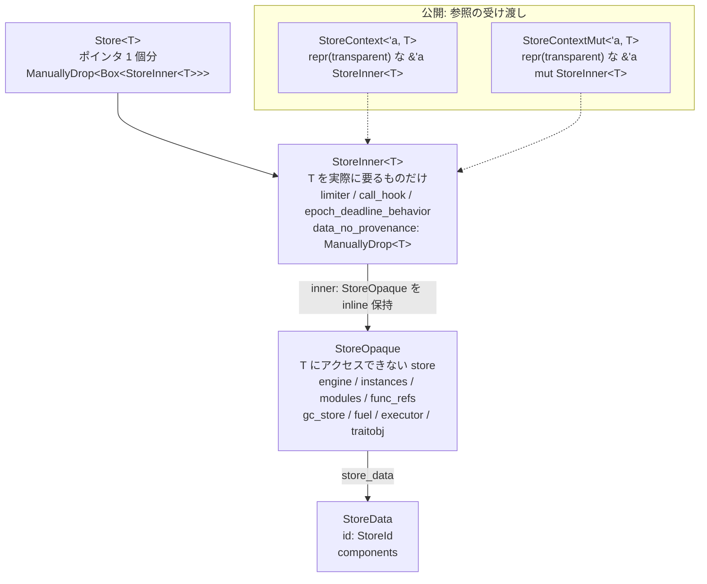

`crates/wasmtime/src/runtime/store.rs` は 1 万行近くあり、その先頭 80 行はまるごと「なぜこんなに型があるのか」の弁明に使われている。結論から言うと、分割の理由は 2 つしかない。**ジェネリック `T` に依存するコードを最小化して単相化を防ぐこと**と、**外に出すのは「可変だが破壊的でない」アクセスだけに限ること**だ。

## モジュールコメントが自己弁明から始まる

```rust title="crates/wasmtime/src/runtime/store.rs"
//! At first glance this is a pretty confusing module where you need to know
//! the difference between:
//!
//! * `Store<T>`
//! * `StoreContext<T>`
//! * `StoreContextMut<T>`
//! * `AsContext`
//! * `AsContextMut`
//! * `StoreInner<T>`
//! * `StoreOpaque`
//! * `StoreData`
//!
//! There's... quite a lot going on here, and it's easy to be confused. This
//! comment is ideally going to serve the purpose of clarifying what all these
//! types are for and why they're motivated.
```

[crates/wasmtime/src/runtime/store.rs](https://github.com/bytecodealliance/wasmtime/blob/d8a0da6d661605713798c1c9c76be5c28e3159ff/crates/wasmtime/src/runtime/store.rs#L1-L18)

このコメントはまず「内側」と「外側」を切り分ける。`store` モジュール自体は crate 非公開で、外に出ているのは `Store<T>`、`StoreContext<T>`、`StoreContextMut<T>`、`AsContext`、`AsContextMut` の 5 つだけ。`StoreInner<T>` / `StoreOpaque` / `StoreData` は名前こそ `pub` だが、`wasmtime` crate の外からは見えない。



## `Store<T>` がポインタ 1 個分であることは load-bearing

```rust title="crates/wasmtime/src/runtime/store.rs"
//! * `Store<T>` - this type is just a pointer large. It's primarily just
//!   intended to be consumed by the outside world. Note that the "just a
//!   pointer large" is a load-bearing implementation detail in Wasmtime. This
//!   enables it to store a pointer to its own trait object which doesn't need
//!   to change over time.
```

`Store<T>` の中身は `ManuallyDrop<Box<StoreInner<T>>>` だけなので、`Store` 自体を move してもヒープ上の `StoreInner<T>` は動かない。**だから `StoreInner` の内部に「自分自身を指すポインタ」を保持できる。** 実際 `Store::new` の中でそれをやっている。

```rust title="crates/wasmtime/src/runtime/store.rs"
let store_data =
    <NonNull<ManuallyDrop<T>>>::from(&mut inner.data_no_provenance).cast::<()>();
inner.inner.vm_store_context.store_data = store_data.into();

inner.traitobj = StorePtr(Some(NonNull::from(&mut *inner)));
```

[crates/wasmtime/src/runtime/store.rs](https://github.com/bytecodealliance/wasmtime/blob/d8a0da6d661605713798c1c9c76be5c28e3159ff/crates/wasmtime/src/runtime/store.rs#L768-L779)

`traitobj` は `*mut dyn VMStore` で、libcall から「今どの Store で実行中か」を引くために `VMContext` 経由で JIT コードに渡される。`Store<T>` が move されるたびにこのポインタを貼り直す必要があったら、API は成立しない。

## `StoreOpaque` — 単相化を避けるための本体

分割の第一の理由は、生成される機械語の量だ。

```rust title="crates/wasmtime/src/runtime/store.rs"
//! * `StoreInner<T>` - ... This structure only contains things which actually
//!   need `T` itself. The downside of this structure is that it's always
//!   generic and means that code is monomorphized into consumer crates. We
//!   strive to have things be as monomorphic as possible in `wasmtime` so this
//!   type is not heavily used.
//!
//! * `StoreOpaque` - this is the primary contents of the `StoreInner<T>` type.
//!   Stored inline in the outer type the "opaque" here means that it's a
//!   "store" but it doesn't have access to the `T`. This is the primary
//!   "internal" reference that Wasmtime uses since `T` is rarely needed by the
//!   internals of Wasmtime.
```

`StoreInner<T>` に触るコードはすべて `T` ごとにコピーされ、**しかもそのコピーは `wasmtime` crate ではなく利用者の crate 側でコンパイルされる**。`Store<MyState>` を 3 種類作れば、そのぶん 3 倍のコードが利用者側に生える。だから Wasmtime は `T` を必要とするものだけを `StoreInner<T>` に残し、残り全部を非ジェネリックな `StoreOpaque` に押し込んだ。

`StoreInner<T>` に実際に残っているのは、リソースリミッタ、コールフック、epoch の締切ハンドラ、デバッグハンドラ、そして `T` 本体だけだ。一方 `StoreOpaque` は `engine` / `instances` / `modules` / `func_refs` / `gc_store` / `fuel_reserve` / `executor` など、Store のほぼ全部を持つ。

"opaque" という語の意味も明示されている ——「store ではあるが `T` にアクセスできない」。抽象度が高いという意味ではなく、**型引数が見えないという意味の不透明さ**だ。

## `&mut StoreInner<T>` を外に出さない

分割の第二の理由が、このモジュールで一番重要な不変条件になっている。

```rust title="crates/wasmtime/src/runtime/store.rs"
//! A major caveat with these representations is that the internal `&mut
//! StoreInner<T>` is never handed out publicly to consumers of this crate, only
//! through a wrapper of `StoreContextMut<'_, T>`. The reason for this is that
//! we want to provide mutable, but not destructive, access to the contents of a
//! `Store`. For example if a `StoreInner<T>` were replaced with some other
//! `StoreInner<T>` then that would drop live instances, possibly those
//! currently executing beneath the current stack frame. This would not be a
//! safe operation.
//!
//! This means, though, that the `wasmtime` crate, which liberally uses `&mut
//! StoreOpaque` internally, has to be careful to never actually destroy the
//! contents of `StoreOpaque`. This is an invariant that we, as the authors of
//! `wasmtime`, must uphold for the public interface to be safe.
```

[crates/wasmtime/src/runtime/store.rs](https://github.com/bytecodealliance/wasmtime/blob/d8a0da6d661605713798c1c9c76be5c28e3159ff/crates/wasmtime/src/runtime/store.rs#L66-L79)

問題は Rust の `&mut T` が持つ 2 つの能力のうち片方だ。`&mut x` があれば `*x = other` と丸ごと置き換えられる。もし利用者が `&mut StoreInner<T>` を持てたら、`std::mem::replace` で Store の中身を新品にすり替えられる。すると **古い `StoreInner<T>` が drop され、そこにぶら下がっていたインスタンスが解放される。ホスト関数の中でそれをやれば、今まさに自分より下のスタックフレームで実行中の wasm コードのメモリが消える。**

だから公開されるのは `#[repr(transparent)] StoreContextMut<'a, T>(&'a mut StoreInner<T>)` という newtype で、内側のフィールドは `pub(crate)` になっている。newtype を丸ごと代入しても、それは参照の入れ替えであって指し先の破壊ではない。

そしてこの不変条件は片側からしか守れない。`wasmtime` 自身は `&mut StoreOpaque` を大量に使い回すので、**「内部コードは絶対に `StoreOpaque` の中身を破壊しない」という約束を、作者が手で守る**しかない。コメントの最後の一文がそれを明言している。

## `PhantomPinned` と、そこに付いた率直なコメント

`StoreOpaque` の先頭フィールドは `marker::PhantomPinned` で、その上に 20 行のコメントがある。

```rust title="crates/wasmtime/src/runtime/store.rs"
pub struct StoreOpaque {
    // This `StoreOpaque` structure has references to itself. These aren't
    // immediately evident, however, so we need to tell the compiler that it
    // contains self-references. This notably suppresses `noalias` annotations
    // when this shows up in compiled code because types of this structure do
    // indeed alias itself. An example of this is `default_callee` holds a
    // `*mut dyn Store` to the address of this `StoreOpaque` itself, indeed
    // aliasing!
    //
    // It's somewhat unclear to me at this time if this is 100% sufficient to
    // get all the right codegen in all the right places. For example does
    // `Store` need to internally contain a `Pin<Box<StoreInner<T>>>`? Do the
    // contexts need to contain `Pin<&mut StoreInner<T>>`? I'm not familiar
    // enough with `Pin` to understand if it's appropriate here ...
    //
    // In any case this seems like a good mid-ground for now where we're at
    // least telling the compiler something about all the aliasing happening
    // within a `Store`.
    _marker: marker::PhantomPinned,
```

[crates/wasmtime/src/runtime/store.rs](https://github.com/bytecodealliance/wasmtime/blob/d8a0da6d661605713798c1c9c76be5c28e3159ff/crates/wasmtime/src/runtime/store.rs#L439-L461)

`PhantomPinned` を入れる目的は「動かせなくする」ことではなく、**`&mut StoreOpaque` に付く LLVM の `noalias` 属性を抑えること**だ。Store の内部には自分自身を指す生ポインタがあり、`noalias` は嘘になる。

そしてコメントは「これで 100% 十分かは自分にはよく分からない」「`Pin` に詳しくないので適切かどうか判断できない」と正直に書いている。ここは Wasmtime の中でも数少ない、**「今のところの妥協」であることを明記した箇所**だ。

## `data_no_provenance` — 名前が使用禁止を叫んでいる

`StoreInner<T>` が持つ `T` のフィールド名は `data` ではなく `data_no_provenance` になっている。

```rust title="crates/wasmtime/src/runtime/store.rs"
    /// The user's `T` data.
    ///
    /// Don't actually access it via this field, however! Use the
    /// `Store{,Inner,Context,ContextMut}::data[_mut]` methods instead, to
    /// preserve stacked borrows and provenance in the face of potential
    /// direct-access of `T` from Wasm code (via unsafe intrinsics).
    ///
    /// The only exception to the above is when taking ownership of the value,
    /// e.g. in `Store::into_data`, after which nothing can access this field
    /// via raw pointers anymore so there is no more provenance to preserve.
    data_no_provenance: ManuallyDrop<T>,
```

[crates/wasmtime/src/runtime/store.rs](https://github.com/bytecodealliance/wasmtime/blob/d8a0da6d661605713798c1c9c76be5c28e3159ff/crates/wasmtime/src/runtime/store.rs#L249-L259)

理由は、wasm 側から `T` を直接触る経路があることだ。`Store::new` は `&mut data_no_provenance` から作った生ポインタを `VMStoreContext::store_data` に格納し、それが JIT コードに渡る。**フィールドを直接借りると、そのポインタの provenance が無効化され、wasm 側からのアクセスが未定義動作になる。** だから正規の経路は、逆に生ポインタ側の provenance を借りてくる。

```rust title="crates/wasmtime/src/runtime/store.rs"
    fn data(&self) -> &T {
        // We are actually just accessing `&self.data_no_provenance` but we must
        // do so with the `VMStoreContext::store_data` pointer's provenance. If
        // we did otherwise, i.e. directly accessed the field, we would
        // invalidate that pointer, which would in turn invalidate any direct
        // `T` accesses that Wasm code makes via unsafe intrinsics.
        let data: *const ManuallyDrop<T> = &raw const self.data_no_provenance;
        let provenance = self.inner.vm_store_context.store_data.as_ptr().cast::<T>();
        let ptr = provenance.with_addr(data.addr());
        // ...
        unsafe { &*ptr }
    }
```

[crates/wasmtime/src/runtime/store.rs](https://github.com/bytecodealliance/wasmtime/blob/d8a0da6d661605713798c1c9c76be5c28e3159ff/crates/wasmtime/src/runtime/store.rs#L1354-L1369)

**アドレスはフィールドから取り、provenance はポインタから取る。** `with_addr` はまさにこのためにある API だ。名前に `_no_provenance` を付けるという手段は、コンパイラでは強制できない規約を、grep で見つかる形にしている。

## `StoreId` — 不一致は panic であってエラーではない

`StoreData` は id を持つ。この id はプロセスグローバルの `AtomicU64` から採番される。

```rust title="crates/wasmtime/src/runtime/store/data.rs"
    pub fn allocate() -> StoreId {
        // When 64-bit atomics are allowed then allow 2^63 stores at which point
        // we start panicking to prevent overflow.
        //
        // If a store is created once per microsecond then this will last the
        // current process for 584,540 years before overflowing.
        const OVERFLOW_THRESHOLD: u64 = 1 << 63;

        static NEXT_ID: AtomicU64 = AtomicU64::new(0);
        let id = NEXT_ID.fetch_add(1, Relaxed);
        if id > OVERFLOW_THRESHOLD {
            NEXT_ID.store(OVERFLOW_THRESHOLD, Relaxed);
            panic!("store id allocator overflow");
        }
        StoreId(NonZeroU64::new(id + 1).unwrap())
    }

    #[inline]
    pub fn assert_belongs_to(&self, store: StoreId) {
        if *self == store {
            return;
        }
        store_id_mismatch();
    }
}

#[cold]
fn store_id_mismatch() {
    panic!("object used with the wrong store");
}
```

[crates/wasmtime/src/runtime/store/data.rs](https://github.com/bytecodealliance/wasmtime/blob/d8a0da6d661605713798c1c9c76be5c28e3159ff/crates/wasmtime/src/runtime/store/data.rs#L142-L214)

`assert_belongs_to` は `Func` や `Memory` を触るたびに呼ばれるので、`#[inline]` な等値比較 1 回で済むように作られている。失敗パスは `#[cold]` の別関数に切り出され、panic メッセージの文字列も呼び出し側のコードには乗らない。**この検査は「Store を渡し間違えた」ときにしか失敗しないので、`Result` ではなく panic になる**という判断が `Store` の doc に書かれている。

```text title="crates/wasmtime/src/runtime/store.rs"
The `wasmtime` crate will panic if the [`Store`] argument passed in to these
operations is incorrect. In other words it's considered a programmer error
rather than a recoverable error for the wrong [`Store`] to be used when
calling APIs.
```

なお `StoreData` は、モジュールコメントが書いている「Store への wasm アイテムの参照はすべてこの構造体の中のテーブルへのインデックスである」という説明より、現在はずっと小さい。実際に残っているのは `id` と component model 用のデータだけで、インスタンスの表 (`instances`) やホストグローバルの表は `StoreOpaque` 側に移っている。`Func` に至ってはもう表を経由しない ([Func は 2 ワードしかない](../func-two-words/))。

## `AsContextMut` と手動 reborrow

外向きの 2 つのトレイトは `AsRef` / `AsMut` の類似物で、`Store<T>`、`Caller<'_, T>`、`StoreContext(Mut)<'_, T>` のどれを持っていても同じメソッドを呼べるようにする。ただし `&mut impl AsContextMut` というジェネリック境界には Rust 側の制約が付いてくる。

```text title="crates/wasmtime/src/runtime/store/context.rs"
As of Rust 1.53.0, generic methods that take a generic `&mut T` do not get
"automatic reborrowing" and therefore you cannot call multiple generic methods
with the same `&mut T` without manually inserting reborrows.
```

[crates/wasmtime/src/runtime/store/context.rs](https://github.com/bytecodealliance/wasmtime/blob/d8a0da6d661605713798c1c9c76be5c28e3159ff/crates/wasmtime/src/runtime/store/context.rs#L57-L96)

非ジェネリックなメソッドなら `&mut *cx` の挿入をコンパイラがやってくれるが、ジェネリックだとやってくれない。だから `instance.get_export(&mut *cx, "a")` のように手で書く必要がある。この doc には `compile_fail` 属性を付けた「失敗する例」と、それを直した例の両方が置かれていて、doctest として実際に検査されている。**「コンパイルが通らないこと」をテストする**という使い方だ。

## デストラクタの順序を `ManuallyDrop` 2 段で作る

最後に細かいが面白い箇所。`Store<T>` は `ManuallyDrop<Box<StoreInner<T>>>` を持ち、その `StoreInner<T>` は `ManuallyDrop<T>` を持つ。この二重構造の意味は `Store::into_data` の中に 25 行のコメントで説明されている。

```rust title="crates/wasmtime/src/runtime/store.rs"
        // * When a `Store<T>` is normally dropped, the custom destructor for
        //   `Store<T>` will drop `T`, then the `self.inner` field. ...
        //   This cleans up all internal fields and doesn't touch `T` because
        //   it's wrapped in `ManuallyDrop`.
        //
        // * When calling this method we skip the top-level destructor for
        //   `Store<T>` with `mem::forget`. This skips both the destructor for
        //   `T` and the destructor for `StoreInner<T>`. We do, however, run the
        //   destructor for `Box<StoreInner<T>>` which, like above, will skip
        //   the destructor for `T` since it's `ManuallyDrop`.
        unsafe {
            let mut inner = ManuallyDrop::take(&mut self.inner);
            core::mem::forget(self);
            ManuallyDrop::take(&mut inner.data_no_provenance)
        }
```

[crates/wasmtime/src/runtime/store.rs](https://github.com/bytecodealliance/wasmtime/blob/d8a0da6d661605713798c1c9c76be5c28e3159ff/crates/wasmtime/src/runtime/store.rs#L845-L877)

「`T` を返して残りを片付ける」場合と「全部片付ける」場合で、`T` だけ扱いを変えたい。フラグを持って実行時に分岐する代わりに、**両方の経路で `ManuallyDrop` を使い、どちらが `T` を引き取るかをコード側で決め打つ**という設計になっている。

## どう活かすか

`StoreOpaque` の分割は、ジェネリックなハンドル型を設計するときにそのまま使える。**「`T` を本当に要るものだけ `T` 付きの層に置き、残りを非ジェネリックな内層に落とす」**と、生成コード量と、内部コードの取り回しの両方が改善する。Rust に限らず、テンプレート単相化のあるどの言語でも効く定石だ。

`&mut` を newtype で包んで「置き換え」を封じるのも汎用性がある。Rust の `&mut` は「変更」と「破壊」の両方を許すが、API として出したいのは前者だけ、という場面は多い。`#[repr(transparent)]` な newtype はコストゼロでその区別を作れる。
