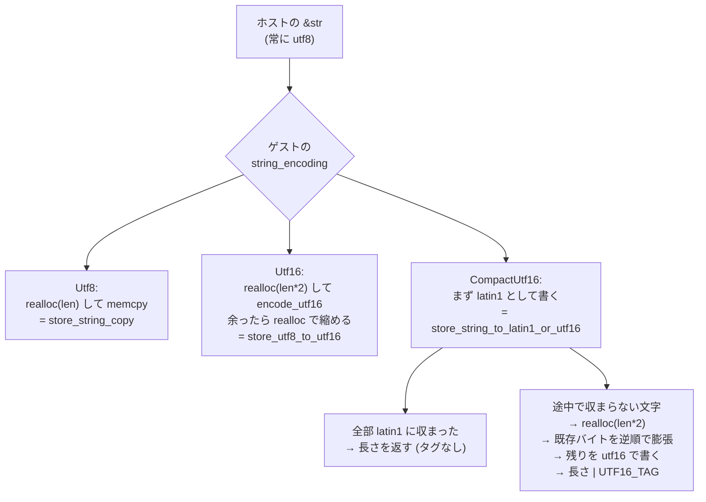

## エンコーディングは component ごとに違う

component model の `string` は「文字列」という抽象的な型で、バイト列としての表現は component ごとに決まる。canonical options の一部として指定され、Wasmtime では 3 値の enum になっている。

```rust title="crates/environ/src/component/info.rs"
/// Possible encodings of strings within the component model.
pub enum StringEncoding {
    Utf8,
    Utf16,
    CompactUtf16,
}
```

[crates/environ/src/component/info.rs](https://github.com/bytecodealliance/wasmtime/blob/d8a0da6d661605713798c1c9c76be5c28e3159ff/crates/environ/src/component/info.rs#L561-L568)

`CompactUtf16` は「latin1 か utf16 のどちらか」という**可変表現**で、どちらであるかは実行時に長さフィールドの最上位ビットで判別する。

なぜ 3 種類も要るのか。**それぞれの言語処理系が内部で使っている表現が違い、どれかに統一すると必ずどこかで変換コストが乗るからだ。** Rust の `String` は UTF-8、JavaScript・Java・C# の文字列は仕様上 UTF-16、そして実際の JS エンジン (V8 や SpiderMonkey) は「全部 latin1 に収まるなら 1 バイト、そうでなければ 2 バイト」という 2 表現を切り替えている。ASCII だけの文字列がメモリの大半を占めるという実測がその背景にある。

もし component model が「文字列は常に UTF-8」と決めていたら、JS ホストは境界を跨ぐたびに UTF-16 と UTF-8 の変換をすることになる。逆に「常に UTF-16」なら Rust 側が毎回変換する。**どちらの側にも「変換なしで済む」経路を用意するために、両方を認めて変換規則を全部定義した**というのが 3 種類ある理由だ。

## lowering の 6 通りの経路

ホスト (Wasmtime) の文字列は Rust の `&str` なので常に UTF-8 だが、書き込み先のエンコーディングは 3 通りある。



実装は `lower_string` の 1 関数に収まっている。

```rust title="crates/wasmtime/src/runtime/component/func/typed.rs"
        // This corresponds to `store_string_copy` in the canonical ABI where
        // the host's representation is utf-8 and the wasm module wants utf-8 so
        // a copy is all that's needed (and the `realloc` can be precise for the
        // initial memory allocation).
        StringEncoding::Utf8 => {
            if string.len() > MAX_STRING_BYTE_LENGTH {
                bail!("string length of {} too large to copy into wasm", string.len());
            }
            let ptr = cx.realloc(0, 0, 1, string.len())?;
            cx.as_slice_mut()[ptr..][..string.len()].copy_from_slice(string.as_bytes());
            Ok((ptr, string.len()))
        }

        // This corresponds to `store_utf8_to_utf16` in the canonical ABI. Here
        // an over-large allocation is performed and then shrunk afterwards if
        // necessary.
        StringEncoding::Utf16 => {
            let size = string.len() * 2;
            // ...
            let mut ptr = cx.realloc(0, 0, 2, size)?;
            let mut copied = 0;
            let bytes = &mut cx.as_slice_mut()[ptr..][..size];
            for (u, bytes) in string.encode_utf16().zip(bytes.chunks_mut(2)) {
                // ... 2 バイトずつ書く
                copied += 1;
            }
            if (copied * 2) < size {
                ptr = cx.realloc(ptr, size, 2, copied * 2)?;
            }
            Ok((ptr, copied))
        }
```

[crates/wasmtime/src/runtime/component/func/typed.rs](https://github.com/bytecodealliance/wasmtime/blob/d8a0da6d661605713798c1c9c76be5c28e3159ff/crates/wasmtime/src/runtime/component/func/typed.rs#L1355-L1470)

UTF-8 なら `realloc` で正確なサイズを確保して `memcpy` するだけ。UTF-16 では**必要量が事前に分からない**ので、「UTF-8 のバイト長 × 2」という上界で確保してから書き、余ったら `realloc` で縮める。UTF-8 の n バイトは UTF-16 では最大 n 個の 16bit 単位にしかならない (ASCII の 1 バイトが 1 単位、3 バイト文字が 1 単位、4 バイト文字が 2 単位) ので、この上界は正しい。

返り値の `len` の意味がエンコーディングによって違うことにも注意がいる。UTF-8 では**バイト数**、UTF-16 では**16bit 単位の個数** (`copied`) だ。canonical ABI の `string` の長さは「符号単位の個数」であって「バイト数」ではない。

## 最上位ビットで latin1 と utf16 を分ける

`CompactUtf16` は長さフィールドの最上位ビットをタグに使う。

```rust title="crates/wasmtime/src/runtime/component/func/typed.rs"
// FIXME(#4311): these probably need different constants for memory64
const UTF16_TAG: usize = 1 << 31;
const MAX_STRING_BYTE_LENGTH: usize = (1 << 31) - 1;
```

[crates/wasmtime/src/runtime/component/func/typed.rs](https://github.com/bytecodealliance/wasmtime/blob/d8a0da6d661605713798c1c9c76be5c28e3159ff/crates/wasmtime/src/runtime/component/func/typed.rs#L1308-L1310)

**`UTF16_TAG` が立っていれば utf16、立っていなければ latin1。** 長さは 32bit のうち下位 31bit しか使えないので、文字列の上限が `(1 << 31) - 1` になる。この上限が `MAX_STRING_BYTE_LENGTH` として全エンコーディングに共通で適用され、超えると `string length of N too large to copy into wasm` で失敗する。

```text
長さフィールド (32bit)
 31                                                        0
+--+--------------------------------------------------------+
|T |                   長さ (31bit)                          |
+--+--------------------------------------------------------+
 |
 +-- T = 0: latin1。バイト数 = 長さ。1 文字 1 バイト。
     T = 1: utf16。16bit 単位の個数 = 長さ。バイト数 = 長さ * 2。
```

## 実装の山場 — 途中で膨らませる

`CompactUtf16` の lowering が一番込み入っている。ホストは UTF-8 の文字列を持っていて、それを latin1 として書き始める。しかし途中で U+0100 以上の文字に当たったら、**そこまで書いた latin1 バイトを 2 倍に広げて utf16 に変えなければならない**。

```rust title="crates/wasmtime/src/runtime/component/func/typed.rs"
StringEncoding::CompactUtf16 => {
    // This corresponds to `store_string_to_latin1_or_utf16`
    let bytes = string.as_bytes();
    let mut iter = string.char_indices();
    let mut ptr = cx.realloc(0, 0, 2, bytes.len())?;
    let mut dst = &mut cx.as_slice_mut()[ptr..][..bytes.len()];
    let mut result = 0;
    while let Some((i, ch)) = iter.next() {
        // Test if this `char` fits into the latin1 encoding.
        if let Ok(byte) = u8::try_from(u32::from(ch)) {
            dst[result] = byte;
            result += 1;
            continue;
        }

        // .. if utf16 is forced to be used then the allocation is
        // bumped up to the maximum size.
        let worst_case = bytes.len().checked_mul(2)
            .ok_or_else(|| format_err!("byte length overflow"))?;
        if worst_case > MAX_STRING_BYTE_LENGTH {
            bail!("byte length too large");
        }
        ptr = cx.realloc(ptr, bytes.len(), 2, worst_case)?;
        dst = &mut cx.as_slice_mut()[ptr..][..worst_case];

        // Previously encoded latin1 bytes are inflated to their 16-bit
        // size for utf16
        for i in (0..result).rev() {
            dst[2 * i] = dst[i];
            dst[2 * i + 1] = 0;
        }

        // and then the remainder of the string is encoded.
        for (u, bytes) in string[i..].encode_utf16().zip(dst[2 * result..].chunks_mut(2)) {
            // ...
            result += 1;
        }
        if worst_case > 2 * result {
            ptr = cx.realloc(ptr, worst_case, 2, 2 * result)?;
        }
        return Ok((ptr, result | UTF16_TAG));
    }
    if result < bytes.len() {
        ptr = cx.realloc(ptr, bytes.len(), 2, result)?;
    }
    Ok((ptr, result))
}
```

[crates/wasmtime/src/runtime/component/func/typed.rs](https://github.com/bytecodealliance/wasmtime/blob/d8a0da6d661605713798c1c9c76be5c28e3159ff/crates/wasmtime/src/runtime/component/func/typed.rs#L1414-L1466)

膨張の核心は `for i in (0..result).rev()` の 3 行だ。**逆順でなければならない。** 同じ領域の中で `dst[i]` を `dst[2*i]` に移すので、前から回すと未処理のバイトを上書きしてしまう。後ろから回せば書き込み先 `2*i` は常に読み出し元 `i` より後ろにあり、まだ読んでいない領域を潰さない。

```text
result = 4、"abcd" まで latin1 で書いた状態から膨張する

前:  [ a ][ b ][ c ][ d ][ ? ][ ? ][ ? ][ ? ]
       0    1    2    3    4    5    6    7

i=3:                dst[6]=dst[3]='d', dst[7]=0
     [ a ][ b ][ c ][ d ][ ? ][ ? ][ d ][ 0 ]
i=2:           dst[4]=dst[2]='c', dst[5]=0
     [ a ][ b ][ c ][ d ][ c ][ 0 ][ d ][ 0 ]
i=1:      dst[2]=dst[1]='b', dst[3]=0
     [ a ][ b ][ b ][ 0 ][ c ][ 0 ][ d ][ 0 ]
i=0: dst[0]=dst[0]='a', dst[1]=0
     [ a ][ 0 ][ b ][ 0 ][ c ][ 0 ][ d ][ 0 ]

前から回すと i=1 の時点で dst[2] を上書きし、'c' が消える
```

もう 1 つ、`realloc` の呼ばれ方も特徴的だ。この経路では **最大 3 回 `realloc` が呼ばれる**。最初に「UTF-8 のバイト長」で確保し、膨張時に「その 2 倍」に伸ばし、最後に実際に使った量へ縮める。ゲストのアロケータを 3 回叩くことになるが、それでも「先に 2 倍確保して ASCII 文字列でも常に倍の領域を掴む」よりは良い、という判断になっている。ASCII だけの文字列 (実際には大多数) では `realloc` は最初の 1 回と、`result == bytes.len()` なので縮小もなしで済む。

## 「ホストの文字列が latin1 だったことにする」

この実装で最も面白いのは、canonical ABI の書き込みパターンを**わざと別のものに読み替えている**ことだ。関数冒頭のコメントがそれを説明している。

```rust title="crates/wasmtime/src/runtime/component/func/typed.rs"
// Note that in general the wasm module can't assume anything about what the
// host strings are encoded as. Additionally hosts are allowed to have
// differently-encoded strings at runtime. Finally when copying a string
// into wasm it's somewhat strict in the sense that the various patterns of
// allocation and such are already dictated for us.
//
// In general what this means is that when copying a string from the host
// into the destination we need to follow one of the cases of copying into
// WebAssembly. It doesn't particularly matter which case as long as it ends
// up in the right encoding. For example a destination encoding of
// latin1+utf16 has a number of ways to get copied into and we do something
// here that isn't the default "utf8 to latin1+utf16" since we have access
// to simd-accelerated helpers in the `encoding_rs` crate. This is ok though
// because we can fake that the host string was already stored in latin1
// format and follow that copy pattern instead.
```

[crates/wasmtime/src/runtime/component/func/typed.rs](https://github.com/bytecodealliance/wasmtime/blob/d8a0da6d661605713798c1c9c76be5c28e3159ff/crates/wasmtime/src/runtime/component/func/typed.rs#L1355-L1373)

canonical ABI は「ホストの表現 × ゲストの表現」の各組み合わせについて書き込み手順を定義しているが、**ホスト側の表現を何と主張するかはホストの自由**だ。Wasmtime のホスト文字列は Rust の `&str` なので本来 UTF-8 だが、latin1+utf16 が相手のときは「ホストの文字列は既に latin1 だった」ことにして `latin1 → latin1+utf16` のパターンを辿る。

理由は性能で、そちらのパターンは `encoding_rs` クレートの SIMD 補助が効く形になっている。**「規約が複数の正解を許しているとき、どれを選ぶかは実装の自由度である」**を明示的に利用した最適化で、それをコメントで宣言してある。lift 側でも `decode_latin1` が `encoding_rs::mem::decode_latin1` を呼んでいて、同じクレートの高速化が使われる。

## lift 側 — コピーせず、検証を遅らせる

ゲストから文字列を受け取るときは `WasmStr` を作る。ここでやるのは**範囲検査と燃料の消費だけ**で、デコードはしない。

```rust title="crates/wasmtime/src/runtime/component/func/typed.rs"
pub(crate) fn new(ptr: usize, len: usize, cx: &mut LiftContext<'_>) -> Result<WasmStr> {
    let (byte_len, align) = match cx.options().string_encoding {
        StringEncoding::Utf8 => (Some(len), 1_usize),
        StringEncoding::Utf16 => (len.checked_mul(2), 2),
        StringEncoding::CompactUtf16 => {
            if len & UTF16_TAG == 0 {
                (Some(len), 2)
            } else {
                ((len ^ UTF16_TAG).checked_mul(2), 2)
            }
        }
    };
    debug_assert!(align.is_power_of_two());
    if ptr & (align - 1) != 0 {
        bail!("string pointer not aligned to {align}");
    }
    match byte_len.and_then(|len| ptr.checked_add(len)) {
        Some(n) if n <= cx.memory().len() => cx.consume_fuel(n - ptr)?,
        _ => bail!("string pointer/length out of bounds of memory"),
    }
    Ok(WasmStr { ptr, len, options: cx.options_index(), instance: cx.instance_handle() })
}
```

[crates/wasmtime/src/runtime/component/func/typed.rs](https://github.com/bytecodealliance/wasmtime/blob/d8a0da6d661605713798c1c9c76be5c28e3159ff/crates/wasmtime/src/runtime/component/func/typed.rs#L1509-L1534)

エンコーディングごとに「長さ → バイト数」の換算とアラインメント要求が変わる。`CompactUtf16` では `UTF16_TAG` を見て 1 バイト単位か 2 バイト単位かを決め、utf16 側では `len ^ UTF16_TAG` でタグを落としてから 2 倍する。乗算も加算も `checked_` 付きで、オーバーフローで境界検査をすり抜けることを防いでいる。

範囲内だと分かったところで `consume_fuel(n - ptr)` を呼び、**ゲストが指示したバイト数だけ hostcall fuel を消費する** ([lifting と lowering、realloc と post-return](../lifting-lowering/))。ここで足りなければトラップする。

デコードは `to_str()` まで遅延される。

```rust title="crates/wasmtime/src/runtime/component/func/typed.rs"
pub(crate) fn to_str_from_memory<'a>(
    &self,
    encoding: StringEncoding,
    memory: &'a [u8],
) -> Result<Cow<'a, str>> {
    match encoding {
        StringEncoding::Utf8 => self.decode_utf8(memory),
        StringEncoding::Utf16 => self.decode_utf16(memory, self.len),
        StringEncoding::CompactUtf16 => {
            if self.len & UTF16_TAG == 0 {
                self.decode_latin1(memory)
            } else {
                self.decode_utf16(memory, self.len ^ UTF16_TAG)
            }
        }
    }
}
```

返り値が `Cow<'a, str>` なのがこの型の価値だ。**UTF-8 なら `str::from_utf8` が成功した時点でゲストのメモリへの参照をそのまま返せる**ので、`Cow::Borrowed` になりコピーが起きない。UTF-16 と latin1 は表現が違うので `String` を作るしかなく、`Cow::Owned` になる。

そしてコード中の TODO が、まだ削れるコピーがあることを認めている。

```rust title="crates/wasmtime/src/runtime/component/func/typed.rs"
// TODO: should add accessors for specifically utf-8 and utf-16 that perhaps
// in an opt-in basis don't do validation. Additionally there should be some
// method that returns `[u16]` after validating to avoid the utf16-to-utf8
// transcode.
```

UTF-16 のゲストから受け取った文字列を UTF-16 のまま扱いたいホストにとって、現状は「utf16 → utf8 の変換」が必ず挟まる。`&str` を返す API にした時点でこれは避けられない。

## 持ち帰り

3 エンコーディングの共存は「1 つに標準化すればよかったのでは」という疑問を招くが、**標準化とは変換コストをどちらか一方に押し付けることでもある**。境界の両側に別々の実情があるとき、どちらも変換なしで通れる道を作るのは、それ自体が設計判断になる。

そして latin1 の膨張処理は「規約に複数の正解があるなら、実装が有利なほうを選んでよい」という考え方の実例だ。**規約を読むとき、それが何を強制していて何を自由にしているかを分けて読めると、性能の余地はそこに現れる。**
