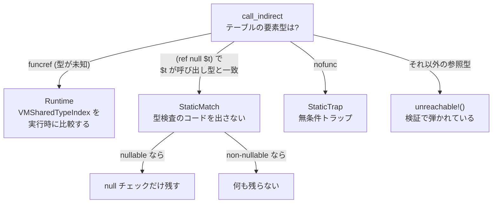

C の関数ポインタを wasm にコンパイルすると、関数のアドレスにはならない。**テーブルのインデックスになる。**

Wasm には「関数のアドレス」を得る手段がない。`i32.load` が読めるのは線形メモリだけで、関数の機械語は線形メモリの中にはいない。代わりに Wasm はテーブルという別の記憶域を持ち、関数の実体はそこにだけ置かれる。プログラムが触れるのは「テーブルの何番目か」という整数だけだ。

## なぜポインタではなくテーブルなのか

[なぜ WebAssembly が生まれたのか](../why-wasm/) で見た 5 つの性質のうち、「すべての制御移動が既知かつ型検査済みの宛先へ向かう」を成立させるには、間接呼び出しの飛び先を有限の集合に閉じ込める必要がある。もし関数のアドレスが `i32` として線形メモリに書けたら、線形メモリを壊した攻撃者が任意のアドレスへ制御を移せてしまう。

テーブルはこの穴を 3 段階で塞ぐ。

まず、**テーブルの要素はプログラムが直接書き換えられる形では線形メモリに存在しない**。テーブルは線形メモリとは別の記憶域で、触れるのは `table.get` / `table.set` / `call_indirect` といった専用命令だけだ。整数を関数参照に変換する命令は存在しない。線形メモリを全部 `0xff` で埋めても、テーブルの中身は 1 バイトも変わらない。

次に、**インデックスは実行時に範囲検査される**。テーブルの長さを超えたインデックスはトラップになる。

最後に、**取り出した要素の型が実行時に検査される**。`call_indirect` は「この型で呼ぶ」という型インデックスを命令自身に持っていて、テーブルから取り出した関数の実際の型と一致しなければトラップする。

この 3 つが揃って、「間接呼び出しの飛び先は、テーブルに入れられた関数のうち、型が一致するもの」という有限で型付きの集合に閉じる。**関数ポインタを整数から作れないという性質が、CFI そのものになっている。**

Wasmtime のテーブル型は 3 フィールドしかない。

```rust title="crates/environ/src/types.rs"
/// WebAssembly table.
#[derive(Debug, Clone, Copy, Hash, Eq, PartialEq, Serialize, Deserialize)]
pub struct Table {
    /// The type of the index used to access the table.
    pub idx_type: IndexType,
    /// Tables are constrained by limits for their minimum and optionally maximum size.
    /// The limits are given in numbers of entries.
    pub limits: Limits,
    /// The table elements' Wasm type.
    pub ref_type: WasmRefType,
}
```

[crates/environ/src/types.rs](https://github.com/bytecodealliance/wasmtime/blob/d8a0da6d661605713798c1c9c76be5c28e3159ff/crates/environ/src/types.rs#L2227-L2237)

`ref_type` が `WasmRefType` であることに注目したい。**テーブルの要素型は `funcref` に限らず、参照型なら何でもよい。** reference-types proposal 以降、`externref` のテーブル (ホストのオブジェクトを wasm 側で番号で管理するのに使う) も、`(ref null $mytype)` のような具体型のテーブルも作れる。`call_indirect` ができるのは関数の階層に属するテーブルだけで、それ以外は検証で弾かれる ([型システム — 4 つの独立した型階層](../type-system/))。

`limits` の単位はバイトではなく**要素数**だ。線形メモリと違って、テーブルには「ページ」という概念がない。

## 型検査は 4 通りに分岐する

仕様上の `call_indirect` は「範囲検査 → 要素をロード → null 検査 → 型検査 → 呼び出し」という手続きだ。だがこのうち型検査は、**テーブルの型が具体的なら静的に決着する**。Wasmtime はこの判定を 1 つの関数に集約している。

```rust title="crates/cranelift/src/func_environ.rs"
enum CheckIndirectCallTypeSignature {
    Runtime,
    StaticMatch {
        /// Whether or not the funcref may be null or if it's statically known
        /// to not be null.
        may_be_null: bool,
    },
    StaticTrap,
}
```

分岐は `table.ref_type.heap_type` に対する match で決まる。

```rust title="crates/cranelift/src/func_environ.rs"
match table.ref_type.heap_type {
    // Functions do not have a statically known type in the table, a
    // typecheck is required. Fall through to below to perform the
    // actual typecheck.
    WasmHeapType::Func => {}

    // Functions that have a statically known type are either going to
    // always succeed or always fail. Figure out by inspecting the types
    // further.
    WasmHeapType::ConcreteFunc(EngineOrModuleTypeIndex::Module(table_ty)) => {
        // If `ty_index` matches `table_ty`, then this call is
        // statically known to have the right type, so no checks are
        // necessary.
        let specified_ty = self.env.module.types[ty_index].unwrap_module_type_index();
        if specified_ty == table_ty {
            return CheckIndirectCallTypeSignature::StaticMatch {
                may_be_null: table.ref_type.nullable,
            };
        }
    }

    // Tables of `nofunc` can only be inhabited by null, so go ahead and
    // trap with that.
    WasmHeapType::NoFunc => {
        assert!(table.ref_type.nullable);
        self.env
            .trap(self.builder, crate::TRAP_INDIRECT_CALL_TO_NULL);
        return CheckIndirectCallTypeSignature::StaticTrap;
    }

    // Engine-indexed types don't show up until runtime and it's a Wasm
    // validation error to perform a call through a non-function table,
    // so these cases are dynamically not reachable.
    WasmHeapType::ConcreteFunc(EngineOrModuleTypeIndex::Engine(_))
    // ... (残りの参照型すべて)
    | WasmHeapType::None => {
        unreachable!()
    }
}
```

[crates/cranelift/src/func_environ.rs](https://github.com/bytecodealliance/wasmtime/blob/d8a0da6d661605713798c1c9c76be5c28e3159ff/crates/cranelift/src/func_environ.rs#L2207-L2305)



4 番目の `unreachable!()` が興味深い。**「関数以外のテーブルに対する `call_indirect` は Wasm の検証エラーである」という事実に、コード生成器が寄りかかっている。** ここに到達したらそれは検証をすり抜けたということで、正しく動く道はない。パニックさせるのが正しい。同じ理由で `EngineOrModuleTypeIndex::Engine` も到達不能とされている。コンパイル時に見えるのはモジュール内インデックスだけで、Engine のインデックスは実行時にしか現れないからだ。

3 番目の `NoFunc` も面白い。`nofunc` は関数階層の bottom 型で、**null 以外の値を 1 つも持てない**。だから `nofunc` のテーブルは、長さがいくつあろうと全要素が null であることが型から確定する。`call_indirect` は必ず「null 呼び出し」でトラップするので、範囲検査もロードも型検査も全部飛ばして `trap` 命令 1 つに落とせる。

## null 検査はトラップ付きロードで済ませる

型検査が実行時に必要な場合、Wasmtime は null 検査を独立した分岐として吐かない。テーブルから取り出した funcref ポインタの先にある `VMSharedTypeIndex` をロードする、その**ロード自体にトラップコードを付ける**。

```rust title="crates/cranelift/src/func_environ.rs"
// Load the callee's `VMSharedTypeIndex`.
//
// Note that the callee may be null in which case this load may
// trap. If so use the `TRAP_INDIRECT_CALL_TO_NULL` trap code.
let trap_code = if self.env.clif_memory_traps_enabled() {
    Some(crate::TRAP_INDIRECT_CALL_TO_NULL)
} else {
    self.env
        .trapz(self.builder, funcref_ptr, crate::TRAP_INDIRECT_CALL_TO_NULL);
    None
};
let callee_sig_id = self
    .env
    .alias_regions
    .vm_func_ref()
    .type_index()
    .trap_code(trap_code)
    .load(&mut self.builder.cursor(), funcref_ptr);
```

funcref が null なら、そのロードはアドレス 0 付近を読むことになって SIGSEGV になる。シグナルハンドラは「この PC でフォルトしたら `TRAP_INDIRECT_CALL_TO_NULL`」という表を引いて、wasm のトラップに翻訳する。**null 検査の比較命令と分岐命令が、生成コードから丸ごと消える。** シグナルが使えない構成 (`clif_memory_traps_enabled()` が偽) のときだけ明示的な `trapz` が入る。この仕組み自体は [wasm のトラップはシグナルで実現される](../traps-via-signals/) で扱う。

型検査そのものは、GC が絡まなければ `VMSharedTypeIndex` の整数比較 1 回になる。Engine 全体で型が一意な `u32` に intern されているからだ。GC の部分型が絡むと本物の部分型判定が必要になる。詳しくは [call_indirect の型チェックが整数比較 1 回になるまで](../call-indirect-typecheck/) を参照。

## call_ref は署名を検査しないが、null 検査は消せない

function-references proposal は `call_ref` という命令を足した。これは `(ref null $t)` 型の値を直接呼ぶもので、テーブルを経由しない。値の型がすでに `$t` だと分かっているので、**署名の検査は要らない**。型システムが保証している。

だが null 検査は残る。そしてその理由についてのコメントが率直だ。

```rust title="crates/cranelift/src/func_environ.rs"
/// Call a typed function reference.
pub fn call_ref(
    self,
    sig_ref: ir::SigRef,
    callee: ir::Value,
    args: &[ir::Value],
) -> WasmResult<CallRets> {
    // FIXME: the wasm type system tracks enough information to know whether
    // `callee` is a null reference or not. In some situations it can be
    // statically known here that `callee` cannot be null in which case this
    // can be `None` instead. This requires feeding type information from
    // wasmparser's validator into this function, however, which is not
    // easily done at this time.
    let callee_load_trap_code = Some(crate::TRAP_NULL_REFERENCE);

    self.unchecked_call(sig_ref, callee, callee_load_trap_code, args)
}
```

**「Wasm の型システムは、callee が非 null だと分かる情報を持っている。ただしその情報を wasmparser の validator からこの関数まで流す仕組みが今はない」。** 消せない理由が「原理的に無理」ではなく「配管がない」だと明記されているのは珍しく、そして正直だ。

これは Wasm の参照型が `nullable: bool` を型の一部として持っていること ([型システム — 4 つの独立した型階層](../type-system/)) が、実装側で活かしきれていない箇所でもある。`(ref $t)` (非 null) と `(ref null $t)` は別の型なので、原理的には検証器がその区別を知っている。落ちているのは検証器と翻訳器の間の情報の受け渡しだけだ。

## どう活かすか

「間接参照を生ポインタではなくハンドル (テーブルのインデックス) にする」というのは、Wasm に限らず境界を引くときの定番の手だ。プラグイン機構でも、FFI でも、リソース管理でも同じ形が現れる。ハンドルには 3 つの利点がある。範囲検査を 1 箇所に集約できること、実体を移動しても値が壊れないこと、そして**外から任意の値を渡されても実体を捏造できない**ことだ。

そして Wasmtime の実装が示しているのは、**その検査のコストは型情報があれば静的に消せる**ということでもある。`nofunc` のテーブルが無条件トラップになり、具体型のテーブルが検査ゼロになるのは、型が「起こりうること」を狭めた結果だ。動的検査を設計に入れるときは、同時に「この検査が不要だと静的に判定できる条件は何か」を考えておくと、後から効いてくる。

次は、ここまで前提にしてきた「検証」が具体的に何を保証しているのかを整理する ([検証が保証してくれる 6 つのこと](../validation/))。
