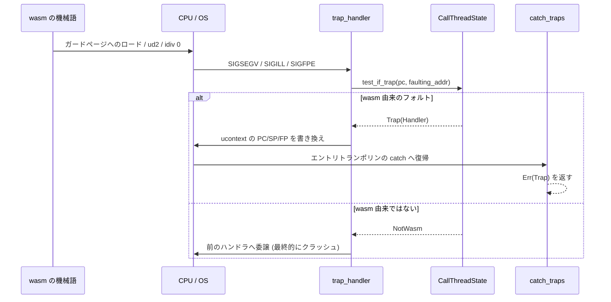

wasm の仕様上、線形メモリの範囲外アクセスも `unreachable` 命令も 0 除算も「トラップ」であり、実行を中断して呼び出し元にエラーを返さなければならない。素直に実装するなら、生成コードに比較と条件分岐を並べることになる。

Wasmtime はそうしない。**トラップの大半は CPU のフォルトとして起こし、シグナルハンドラで受け取る**。正常に動いている限り、生成コードには余計な命令が 1 つも入らない。



このページはこの図の左半分、つまり「どのシグナルを、どういう設定で捕まえているか」を扱う。判定の中身は [「これは wasm 由来のフォルトか」を 3 段階で判定する](../is-this-wasm/)、巻き戻しの実装は [longjmp を使わず、ucontext を書き換えて戻る](../unwind-via-ucontext/) で扱う。

## 何を、どのシグナルで捕まえるか

Unix 側のハンドラ設置は 1 つの関数に集約されている。ここを読むと「wasm のトラップとして飛びうるシグナル」の全リストがそのまま得られる。

```rust title="crates/wasmtime/src/runtime/vm/sys/unix/signals.rs"
fn foreach_handler(mut f: impl FnMut(*mut libc::sigaction, i32)) {
    // Allow handling OOB with signals on all architectures
    f(&raw mut PREV_SIGSEGV, libc::SIGSEGV);

    // Handle `unreachable` instructions which execute `ud2` right now
    f(&raw mut PREV_SIGILL, libc::SIGILL);

    // x86 and s390x use SIGFPE to report division by zero
    if cfg!(target_arch = "x86_64") || cfg!(target_arch = "s390x") {
        f(&raw mut PREV_SIGFPE, libc::SIGFPE);
    }

    // Sometimes we need to handle SIGBUS too:
    // - On Darwin, guard page accesses are raised as SIGBUS.
    if cfg!(target_vendor = "apple") || cfg!(target_os = "freebsd") {
        f(&raw mut PREV_SIGBUS, libc::SIGBUS);
    }

    // TODO(#1980): x86-32, if we support it, will also need a SIGFPE handler.
    // TODO(#1173): ARM32, if we support it, will also need a SIGBUS handler.
}
```

[crates/wasmtime/src/runtime/vm/sys/unix/signals.rs](https://github.com/bytecodealliance/wasmtime/blob/d8a0da6d661605713798c1c9c76be5c28e3159ff/crates/wasmtime/src/runtime/vm/sys/unix/signals.rs#L72-L91)

4 つのシグナルの役割はそれぞれ違う。

**SIGSEGV は線形メモリの境界外アクセス。** これは全アーキで必要になる。線形メモリは 4GiB の予約領域と 32MiB のガード領域を伴って `mmap` されていて ([4GiB 予約と 32MiB ガードの配置](../memory-layout/))、実際にアクセス可能なのは現在のメモリサイズ分だけだ。その外を触ればページフォルトになる。**境界チェックの命令が消えるのはこの仕組みがあるからで**、消せる条件は [境界チェックを「消す」ための条件を数式で追う](../bounds-check-elision/) が扱う。

**SIGILL は `unreachable` と、明示的なトラップ命令。** コメントにあるとおり x86 では `ud2` が出る。`unreachable` だけではなく、整数オーバーフローや `i32.trunc_f64_s` の変換失敗など、比較の結果として確実にトラップすると分かった箇所も「条件付きジャンプ + トラップ命令」に落ちる。aarch64 では `udf` 命令になる。

**SIGFPE は x86_64 と s390x に限られる。** この 2 つのアーキの除算命令は 0 除算とオーバーフローで自らフォルトを起こすので、除数のチェックを書かずに済む。aarch64 はそうではなく、`udiv` は 0 除算でもフォルトしない。だから ISLE の規則にこう書かれている。

```text title="cranelift/codegen/src/isa/aarch64/lower.isle"
;; Note that aarch64's `udiv` doesn't trap so to respect the semantics of
;; CLIF's `udiv` the check for zero needs to be manually performed.
```

[cranelift/codegen/src/isa/aarch64/lower.isle](https://github.com/bytecodealliance/wasmtime/blob/d8a0da6d661605713798c1c9c76be5c28e3159ff/cranelift/codegen/src/isa/aarch64/lower.isle#L1113-L1114)

つまり aarch64 では 0 除算のチェックが実際の比較命令として出て、トラップ命令に落ち、結果として SIGILL になる。**同じ wasm 命令でも、アーキが助けてくれるかどうかで届くシグナルが変わる**。

**SIGBUS は Darwin と FreeBSD でのみ設置する。** これらのプラットフォームではガードページへのアクセスが SEGV ではなく BUS として届くことがある。

## sigaction のフラグ 3 つ

ハンドラの設置側には、3 つのフラグそれぞれについて理由が書かれている。

```rust title="crates/wasmtime/src/runtime/vm/sys/unix/signals.rs"
// The flags here are relatively careful, and they are...
//
// SA_SIGINFO gives us access to information like the program
// counter from where the fault happened.
//
// SA_ONSTACK allows us to handle signals on an alternate stack,
// so that the handler can run in response to running out of
// stack space on the main stack. Rust installs an alternate
// stack with sigaltstack, so we rely on that.
//
// SA_NODEFER allows us to reenter the signal handler if we
// crash while handling the signal, and fall through to the
// Breakpad handler by testing handlingSegFault.
handler.sa_flags = libc::SA_SIGINFO | libc::SA_NODEFER | libc::SA_ONSTACK;
handler.sa_sigaction = (trap_handler as *const ()).addr();
```

[crates/wasmtime/src/runtime/vm/sys/unix/signals.rs](https://github.com/bytecodealliance/wasmtime/blob/d8a0da6d661605713798c1c9c76be5c28e3159ff/crates/wasmtime/src/runtime/vm/sys/unix/signals.rs#L38-L52)

`SA_SIGINFO` は必須だ。これがないとハンドラは `siginfo_t` も `ucontext` も受け取れず、**「どの PC でフォルトしたか」が分からない**。Wasmtime の判定はすべて PC から始まるので、これがなければ何も始まらない。フォルトしたアドレス (`si_addr`) もここから取る。

`SA_ONSTACK` は、スタックオーバーフローの扱いに関わる。wasm のスタックオーバーフローは基本的にプロローグの明示チェックで検出する設計だが ([スタックオーバーフローは、ガードページではなく明示チェック](../stack-limit/))、それでもホスト側のスタックが尽きた状況でハンドラが動く必要はある。通常のスタックの上でハンドラを走らせようとすると、スタックが尽きているのだからそこでもフォルトする。Rust の標準ライブラリが `sigaltstack` で代替スタックを用意しているので、Wasmtime はそれに乗っている。

`SA_NODEFER` は、ハンドラ実行中に同じシグナルをブロックしない設定だ。ハンドラの中で更にクラッシュしたときに、次のハンドラ (Breakpad など) へ制御が渡るようにするためのもので、Wasmtime 自身のバグを覆い隠さないための配慮になっている。

## 自分が起こしたフォルトだけを拾おうとする

このアーキテクチャで一番効いている設計方針は、実は「どのシグナルを取るか」ではなく「取ったシグナルをどれだけ手放すか」の側にある。アーキテクチャ文書がこう書いている。

```text title="docs/contributing-architecture.md"
Note that Wasmtime tries
to only catch signals that happen from JIT code itself as to not accidentally
cover up other bugs.
```

[docs/contributing-architecture.md](https://github.com/bytecodealliance/wasmtime/blob/d8a0da6d661605713798c1c9c76be5c28e3159ff/docs/contributing-architecture.md#L307-L350)

プロセス全体の SIGSEGV を横取りしている以上、Wasmtime のハンドラにはホスト側の本物のヌルポインタ参照も飛んでくる。そこで「wasm 由来ではない」と判定したものは、必ず元のハンドラへ委譲する。

```rust title="crates/wasmtime/src/runtime/vm/sys/unix/signals.rs"
// This signal is not for any compiled wasm code we expect, so we
// need to forward the signal to the next handler. If there is no
// next handler (SIG_IGN or SIG_DFL), then it's time to crash. To do
// this, we set the signal back to its original disposition and
// return. This will cause the faulting op to be re-executed which
// will crash in the normal way.
```

[crates/wasmtime/src/runtime/vm/sys/unix/signals.rs](https://github.com/bytecodealliance/wasmtime/blob/d8a0da6d661605713798c1c9c76be5c28e3159ff/crates/wasmtime/src/runtime/vm/sys/unix/signals.rs#L204-L212)

前のハンドラが `SIG_DFL` や `SIG_IGN` だった場合の処理が面白い。ハンドラを元の設定に戻してから return する。すると **フォルトした命令が再実行され、今度は誰も捕まえないので「普通のやり方で」クラッシュする**。コアダンプもデバッガも、Wasmtime が介在しなかった場合とまったく同じものを見ることになる。

なお、`trap_handler` はもっと手前でも降参する。TLS を引いて「そもそも wasm を実行していない」と分かったらそこで即座に委譲する。

```rust title="crates/wasmtime/src/runtime/vm/sys/unix/signals.rs"
let handled = tls::with(|info| {
    // If no wasm code is executing, we don't handle this as a wasm
    // trap.
    let info = match info {
        Some(info) => info,
        None => return false,
    };
```

[crates/wasmtime/src/runtime/vm/sys/unix/signals.rs](https://github.com/bytecodealliance/wasmtime/blob/d8a0da6d661605713798c1c9c76be5c28e3159ff/crates/wasmtime/src/runtime/vm/sys/unix/signals.rs#L141-L148)

## なぜ条件分岐ではないのか

ガードページ + シグナルという方式の利点は 1 つに尽きる。**正常パスのコストがゼロになる**ことだ。

境界チェックを比較命令で書けば、線形メモリへのロード・ストアのすべてに比較と分岐が付く。命令数が増えるだけでなく、分岐予測のエントリを消費し、命令スケジューリングの自由度も下がる。しかも wasm のコードは典型的にメモリアクセスだらけだ。C や Rust からコンパイルされた wasm では、ローカル変数以外のほぼすべてが線形メモリの読み書きになる。

一方フォルト方式なら、正常時に実行される命令はロード命令そのものだけになる。トラップが起きたときのコスト (シグナル配送、ハンドラ、テーブル検索) は非常に高いが、**トラップは「起きたら実行が終わる」イベントなので、遅くて構わない**。この非対称性がそのまま設計に反映されている。

対価として、Wasmtime は「プロセス全体のシグナルハンドラを書き換えるライブラリ」になった。他のシグナルを使うソフトウェアとの共存が問題になり、macOS では mach ports、Windows では continue ハンドラという追加の仕掛けが必要になっている ([バックトレースの作り方と、macOS・Windows の事情](../backtrace-and-platforms/))。

## Pulley では前提が変わる

[Pulley](../pulley/) はバイトコードインタプリタなので、wasm のコードはネイティブ命令として実行されない。生成される「テキストセクション」もネイティブコードではなく、その事実は ELF のセクションフラグに現れている。

```rust title="crates/environ/src/obj.rs"
/// Flag for the `sh_flags` field in the ELF text section that indicates that
/// the text section does not itself need to be executable. This is used for the
/// Pulley target, for example, to indicate that it does not need to be made
/// natively executable as it does not contain actual native code.
pub const SH_WASMTIME_NOT_EXECUTED: object::elf::SectionFlags = object::elf::SectionFlags(1 << 0);
```

[crates/environ/src/obj.rs](https://github.com/bytecodealliance/wasmtime/blob/d8a0da6d661605713798c1c9c76be5c28e3159ff/crates/environ/src/obj.rs#L28-L32)

実行可能ページを作らないので、当然ネイティブのフォルトも起きない。Pulley では境界チェックもトラップ判定もインタプリタのループの中で明示的に行われ、シグナルハンドラは登場しない。このページで見てきた仕組みは丸ごとネイティブバックエンド専用のものだ ([Pulley は「インタプリタ」ではなくターゲット ISA である](../pulley-as-isa/))。

## どう活かすか

「頻繁に通る道にチェックを置きたいが、チェックが重い」という形の問題では、**MMU に検査を代行させられないかを疑う価値がある**。ガードページを置いてフォルトを拾う、`mprotect` で書き込みを検出する、といった手は、正常パスの命令数をゼロにできる数少ない方法だ。

同時に、この選択には「プロセス全体の資源 (シグナルハンドラ) を専有する」という副作用が付いてくる。Wasmtime が macOS と Windows のために書いた追加のコード量は、その代価がどれくらいになるかの実例になっている。
