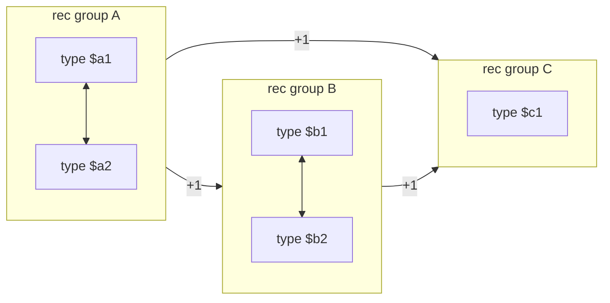

エンジンにロードされた全モジュールの型は、`TypeRegistry` に intern される。型を重複排除しておけば [`call_indirect` の型チェックが整数比較 1 回で済む](../call-indirect-typecheck/) からだ。

問題は、そこに登録された型をいつ消してよいかだ。モジュールは動的にロードされ、アンロードされる。異なるモジュールが同じ型を共有する。そして Wasm GC の型は互いに参照し、循環しうる。**動的ライフタイム・共有・循環。この 3 つが揃ったら tracing GC が要る、というのが教科書的な結論**だ。

Wasmtime はそうしていない。理由が `type_registry.rs` の冒頭に、長いコメントとして書かれている。

## MVP のときは簡単だった

```rust title="crates/wasmtime/src/runtime/type_registry.rs"
// With Wasm MVP, managing type lifetimes within the registry was easy: we only
// cared about canonicalizing types so that `call_indirect` was fast and we
// didn't waste memory on many copies of the same function type definition.
// Function types could only take and return simple scalars (i32/f64/etc...) and
// there were no type-to-type references. We could simply deduplicate function
// types and reference count their entries in the registry.
```

[crates/wasmtime/src/runtime/type_registry.rs](https://github.com/bytecodealliance/wasmtime/blob/d8a0da6d661605713798c1c9c76be5c28e3159ff/crates/wasmtime/src/runtime/type_registry.rs#L34-L82)

MVP の関数型は `i32` や `f64` といったスカラを取って返すだけで、**型が別の型を参照するということがなかった**。だから型ごとに参照カウントするだけで足りた。カウントが 0 になったら消す。それ以上考えることがない。

## 2 つの提案が状況を変えた

```rust title="crates/wasmtime/src/runtime/type_registry.rs"
// The typed function references and GC proposals change everything. The former
// introduced function types that take a reference to a function of another
// specific type. This is a type-to-type reference. The latter introduces struct
// and array types that can have references to other struct, array, and function
// types, as well as recursion groups that allow cyclic references between
// types. Now type canonicalization additionally enables fast type checks and
// downcasts *across* modules: so that two modules which define the same struct
// type, for example, can pass instances of that struct type to each other, and
// we can quickly check that those instances are in fact of the expected types.
//
// But how do we manage the lifetimes of types that can reference other types as
// Wasm modules are dynamically loaded and unloaded from the engine? These
// modules can define subsets of the same types and there can be cyclic type
// references. Dynamic lifetimes, sharing, and cycles is a classic combination
// of constraints that push a design towards a tracing garbage collector (or,
// equivalently, a reference-counting collector with a cycle collector).
```

typed function references が「特定の型の関数への参照を取る関数型」を持ち込んだ。これが最初の型間参照だ。Wasm GC が struct と array を持ち込み、それらが他の struct・array・関数型を参照できるようにし、さらに **再帰グループ (recursion group) が型の間の循環参照を許した**。

`(rec (type $a (struct (field (ref $b)))) (type $b (struct (field (ref $a)))))` のような定義が正当な wasm になる。`$a` は `$b` を、`$b` は `$a` を参照する。

**「動的ライフタイム、共有、そして循環は、設計を tracing GC (あるいは同等の、サイクルコレクタ付き参照カウント) へと押しやる古典的な制約の組合せである」**。ここまでは、よくある結論に見える。

## 2 つの性質が抜け道になった

しかしその次の段落で方向が変わる。

```rust title="crates/wasmtime/src/runtime/type_registry.rs"
// However, we can rely on the following properties:
//
// 1. The unit of type canonicalization is a whole recursion group.
//
// 2. Type-to-type reference cycles may only happen within a recursion group and
//    therefore type-to-type references across recursion groups are acyclic.
//
// Therefore, our type registry makes the following design decisions:
//
// * We manage the lifetime of whole recursion groups, not individual
//   types. That is, every type in the recursion group stays alive as long as
//   any type in the recursion group is kept alive. This is effectively mandated
//   by property (1) and the hash consing it implies.
//
// * We still use naive reference counting to manage the lifetimes of recursion
//   groups. A type-to-type reference that crosses the boundary from recursion
//   group A to recursion group B will increment B's reference count when A is
//   first registered and decrement B's reference count when A is removed from
//   the registry. Because of property (2) we don't need to worry about cycles,
//   which are the classic weakness of reference counting.
```

**性質 (2) が鍵だ。循環は再帰グループの内側にしか起きえない。つまり再帰グループを 1 個のノードと見なせば、グループ間の参照関係は DAG になる**。

これは wasm の型システムが保証している。再帰グループは「相互再帰しうる型のかたまり」を明示的に囲む構文で、あるグループの型が参照できる他グループの型は、そのグループより前に定義されたものだけだ。後から定義されるグループを参照できないので、グループ間に閉路は作れない。

そして性質 (1) により、重複排除の単位も再帰グループ全体になる。個々の型を単独で正規化することはできない (グループ内の相互参照は、グループ全体を見ないと同一性が判定できない) ので、そもそも型 1 個の寿命を独立に管理することに意味がない。

この 2 つを合わせると、**再帰グループを単位に素朴な参照カウントをすればよい**という結論になる。グループ A の型がグループ B の型を参照していれば、A の登録時に B のカウントを 1 増やし、A の登録解除時に 1 減らす。グループ内の循環はカウントの対象にならない。グループごと生きるかグループごと死ぬかしかないからだ。



グループ内の双方向の矢印は参照カウントに影響しない。グループ間の矢印だけが `refcount` を動かし、その関係は必ず非循環になる。**「循環参照には GC が要る」という一般論に対して、「循環が閉じた領域の中にしか起きない」という条件を見つけたので、その領域を 1 単位に潰した**という形だ。

## 正規化が 2 種類ある

この設計から、型参照の表現が 3 値になる。

```rust title="crates/environ/src/types.rs"
pub enum EngineOrModuleTypeIndex {
    /// An index within an engine, canonicalized among all modules that can
    /// interact with each other.
    Engine(VMSharedTypeIndex),

    /// An index within the current Wasm module, canonicalized within just this
    /// current module.
    Module(ModuleInternedTypeIndex),

    /// An index within the containing type's rec group. This is only used when
    /// hashing and canonicalizing rec groups, and should never appear outside
    /// of the engine's type registry.
    RecGroup(RecGroupRelativeTypeIndex),
}
```

[crates/environ/src/types.rs](https://github.com/bytecodealliance/wasmtime/blob/d8a0da6d661605713798c1c9c76be5c28e3159ff/crates/environ/src/types.rs#L340-L358)

**第 3 のバリアントには「型レジストリの外に現れてはならない」という但し書きが付いている**。再帰グループ相対のインデックスは、グループ同士を比較して同一かどうか判定するときにだけ意味を持つ。グループの中で 0 番目の型、1 番目の型、という相対位置に置き換えてしまえば、別のモジュールで別のインデックスに置かれた同じ形の再帰グループとハッシュ値が一致する。

だから正規化 (canonicalization) が 2 種類ある。

```rust title="crates/environ/src/types.rs"
/// This produces types that are suitable for usage by the runtime (only
/// contains `VMSharedTypeIndex` type references).
///
/// This does not produce types that are suitable for hash consing types
/// (must have recgroup-relative indices for type indices referencing other
/// types in the same recgroup).
fn canonicalize_for_runtime_usage<F>(&mut self, module_to_engine: &mut F)
```

```rust title="crates/environ/src/types.rs"
/// This produces types that are suitable for hash consing and deduplicating
/// recgroups (types may have recgroup-relative indices for references to
/// other types within the same recgroup).
///
/// This does *not* produce types that are suitable for usage by the runtime
/// (only contain `VMSharedTypeIndex` type references).
fn canonicalize_for_hash_consing<F>(
    &mut self,
    rec_group_range: Range<ModuleInternedTypeIndex>,
    module_to_engine: &mut F,
)
```

[crates/environ/src/types.rs](https://github.com/bytecodealliance/wasmtime/blob/d8a0da6d661605713798c1c9c76be5c28e3159ff/crates/environ/src/types.rs#L45-L140)

**目的が違うので出力も違い、混ぜると panic する**。どちらの実装も、既に `RecGroup(_)` になっている参照を見つけたら `panic!("should not already be canonicalized for hash consing")` で落ちる。`is_canonicalized_for_runtime_usage` / `is_canonicalized_for_hash_consing` という述語も両方用意されていて、`debug_assert!` で状態を確かめられるようになっている。「同じ名前の操作が 2 つあり、片方の結果をもう片方の入力にしてはならない」という危うい設計を、型ではなく実行時チェックで守っている箇所だ。

## GC を有効にすると部分型判定が要る

MVP なら型チェックは「同一かどうか」だけで済む。`VMSharedTypeIndex` がエンジン全体で一意なので、整数の比較 1 回で終わる。

Wasm GC が入ると `ref.cast` や `ref.test` のために**部分型判定**が要る。Wasmtime はこれを表示 (display) 方式で解く。各型について、根から自分の直前までの祖先の列を配列で持っておく。

```rust title="crates/wasmtime/src/runtime/type_registry.rs"
// A map from a registered type to its complete list of supertypes.
//
// The supertypes are ordered from super- to subtype, i.e. the immediate
// parent supertype is the last element and the least-upper-bound of all
// supertypes is the first element.
//
// Types without any supertypes are omitted from this map. This means that
// we never allocate any backing storage for this map when Wasm GC is not in
// use.
type_to_supertypes: TrySecondaryMap<VMSharedTypeIndex, Option<Box<[VMSharedTypeIndex]>>>,
```

判定はこうなる。

```rust title="crates/wasmtime/src/runtime/type_registry.rs"
// Therefore, if we have the path to the root for each type (we do) then
// we can simply check if `sup` is at index `supertypes(sup).len()`
// within `supertypes(sub)`.
let inner = self.0.read();
let sub_supertypes = inner.supertypes(sub);
let sup_supertypes = inner.supertypes(sup);
sub_supertypes.get(sup_supertypes.len()) == Some(&sup)
```

[crates/wasmtime/src/runtime/type_registry.rs](https://github.com/bytecodealliance/wasmtime/blob/d8a0da6d661605713798c1c9c76be5c28e3159ff/crates/wasmtime/src/runtime/type_registry.rs#L1721-L1780)

**単一継承なら、`sub` が `sup` の部分型であることと、`sup` が `sub` の祖先列の「`sup` の深さ」の位置にいることが同値になる**。だから配列の添字アクセス 1 回と比較 1 回で終わる。継承の連鎖を遡るループが要らない。

そして「上位型を持たない型はこのマップから省かれる。つまり Wasm GC を使っていないときは、このマップのために領域を確保することが一切ない」。**GC を使わない構成で GC のためのコストを払わない**という配慮が、データ構造の側に入っている。

## 「見えない依存」が各所に散っている

参照カウントである以上、誰かが `RegisteredType` を持ち続けていなければ型は消える。この「持ち続ける」責務が、一見関係なさそうな場所に現れる。

ホスト関数を `Func::wrap` で作ると、その状態にこういうフィールドが入る。

```rust title="crates/wasmtime/src/runtime/func.rs"
// State stored inside a `VMArrayCallHostFuncContext`.
struct HostFuncState<F> {
    // The actual host function.
    func: F,

    // NB: We have to keep our `VMSharedTypeIndex` registered in the engine for
    // as long as this function exists.
    _ty: RegisteredType,
}
```

[crates/wasmtime/src/runtime/func.rs](https://github.com/bytecodealliance/wasmtime/blob/d8a0da6d661605713798c1c9c76be5c28e3159ff/crates/wasmtime/src/runtime/func.rs#L2238-L2246)

アンダースコア始まりのフィールドで、読まれることはない。**存在すること自体が仕事**だ。`VMFuncRef` の中に `VMSharedTypeIndex` が入っていて、それが `call_indirect` の型チェックで比較されるので、その関数が生きている限りインデックスが有効でなければならない。

同じ形が `Table` や `Tag` を単体で作るときにも現れる。テーブルの trampoline は要素型の `RegisteredType` を渡し、タグの trampoline は 2 つ渡す。

```rust title="crates/wasmtime/src/runtime/trampoline/tag.rs"
// Both the tag's signature type and its exception type are referred to by
// engine-level type index from the dummy module's `Tag`, so both
// `RegisteredType`s must be handed to the instance's runtime info to keep
// those indices rooted in the engine's type registry for as long as the
// instance (and thus the store) is alive.
let runtime_info = ModuleRuntimeInfo::bare_with_registered_types(
    try_new::<Arc<_>>(module)?,
    store.engine(),
    [func_ty, exn_ty],
)?;
```

[crates/wasmtime/src/runtime/trampoline/tag.rs](https://github.com/bytecodealliance/wasmtime/blob/d8a0da6d661605713798c1c9c76be5c28e3159ff/crates/wasmtime/src/runtime/trampoline/tag.rs#L28-L46)

「signature 型と exception 型の 2 つがエンジンレベルのインデックスで参照されるので、両方を root しなければならない」と理由まで書いてある。**参照カウント方式の代償が、こういう「持っているだけのフィールド」として実装のあちこちに現れる**。1 か所忘れると、型が消えた後にそのインデックスを使う経路でパニックか誤判定が起きる。tracing GC ならルート探索が自動でやってくれる部分を、人間が漏れなく列挙する形になっている。

## どう活かすか

このページの持ち帰りは、**「循環参照があるから GC が要る」という結論に飛びつく前に、循環がどこに閉じ込められているかを見る**ことだ。Wasmtime の場合、循環は言語仕様上「再帰グループの内側」にしか作れなかった。その領域を 1 つのノードに潰せば、残りは DAG なので参照カウントで足りる。

一般化すると、**循環を含みうる強連結成分をあらかじめ縮約できるなら、参照カウントは使える**。Wasmtime が幸運だったのは、その強連結成分の境界が「再帰グループ」として言語仕様に明示されていて、実行時に計算する必要がなかった点だ。自前のデータ構造で同じことをやるなら、成分の境界を自分で決めるか計算するコストがかかる。

そしてもう 1 つ。**「なぜ tracing GC にしなかったのか」を、依拠している性質の番号付きリストとして残しておく**のは非常に良い書き方だ。将来この 2 つの性質が崩れる提案が来たら (たとえば再帰グループを跨ぐ循環が許されたら)、この設計はそこで破綻する。何が前提だったかが書いてあれば、そのとき何を見直すべきかが即座に分かる。
