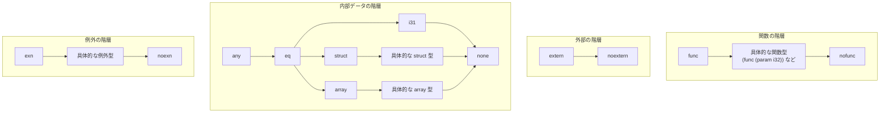
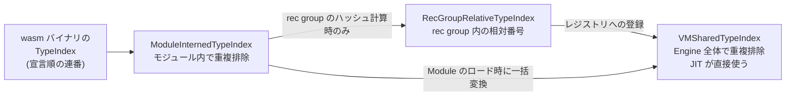

Wasm の値型は 6 つしかない。`i32` / `i64` / `f32` / `f64` / `v128`、そして参照型だ。

```rust title="crates/wasmtime/src/runtime/types.rs"
#[derive(Clone, Hash)]
pub enum ValType {
    // NB: the ordering of variants here is intended to match the ordering in
    // `wasmtime_environ::WasmType` to help improve codegen when converting.
    //
    /// Signed 32 bit integer.
    I32,
    /// Signed 64 bit integer.
    I64,
    /// Floating point 32 bit integer.
    F32,
    /// Floating point 64 bit integer.
    F64,
    /// A 128 bit number.
    V128,
    /// An opaque reference to some type on the heap.
    Ref(RefType),
}
```

[crates/wasmtime/src/runtime/types.rs](https://github.com/bytecodealliance/wasmtime/blob/d8a0da6d661605713798c1c9c76be5c28e3159ff/crates/wasmtime/src/runtime/types.rs#L88-L103)

冒頭のコメントに注意しておく価値がある。**variant の並び順を `wasmtime_environ::WasmValType` と意図的に揃えてある**。この 2 つの enum は crate をまたいで頻繁に相互変換されるので、判別子の値が一致していれば変換の match が単なるコピーに潰れる可能性が上がる。型定義の並び順が最適化の話になるのは珍しくないが、その意図がコメントで残されているのは親切だ。

符号がないことにも触れておく。`i32` は「32 ビット幅の整数」であって、符号付きか符号なしかは**型ではなく命令の側**が決める。`i32.div_s` と `i32.div_u` が別の命令なのはそのためだ。浮動小数点も IEEE 754 の binary32 / binary64 そのままで、NaN のビットパターンだけが非決定的な余地を残している。

面白いのはここから先、参照型の内側だ。

## 参照型は 4 つ (実装上は 5 つ) の独立した格子を持つ

`RefType` は「null を許すか」の bool と `HeapType` の組でしかない。中身は `HeapType` が全部持っている。そして `HeapType` の doc コメントには、Wasm の参照型がどういう部分型関係にあるかが ASCII 図で丸ごと描かれている。

```rust title="crates/wasmtime/src/runtime/types.rs"
/// Wasm has three different heap type hierarchies:
///
/// 1. Function types
/// 2. External types
/// 3. Internal (struct and array) types
/// 4. Exception types
///
/// Each hierarchy has a top type (the common supertype of which everything else
/// in its hierarchy is a subtype of) and a bottom type (the common subtype of
/// which everything else in its hierarchy is supertype of).
```

[crates/wasmtime/src/runtime/types.rs](https://github.com/bytecodealliance/wasmtime/blob/d8a0da6d661605713798c1c9c76be5c28e3159ff/crates/wasmtime/src/runtime/types.rs#L602-L719)

「three」と書いてあって 4 つ並んでいるのは、後から例外の階層が足された名残だ。実際には継続 (`cont` / `nocont`) が stack-switching proposal で加わっているので、コード上の `HeapTopType` は 5 variant ある。

重要な性質は 2 つだ。**それぞれの階層に top と bottom がある**こと、そして **階層をまたいだ部分型関係が一切ない**ことである。`funcref` と `externref` の間に共通の親はない。Wasm には「あらゆる参照の top」に相当する型が存在しない。



`i31` が階層のどこにいるかは特に注目に値する。**`i31` は 31 ビットの整数を、ヒープに割り付けずにポインタのビットに直接詰め込んだもの**で、それでいて `eq` の部分型として「参照」の側に置かれている。GC を持つ言語を Wasm に落とすとき、小さな整数のためにヒープ割り付けを強いられないようにするための逃げ道だ。実装側でどう表現されるかは [VMGcRef はポインタではない](../vmgcref/) で扱う。

bottom 型 (`nofunc` / `noextern` / `none` / `noexn` / `nocont`) は、値としては null しか持てない。`(ref null nofunc)` は「null 以外にありえない関数参照」であり、`(ref nofunc)` は**要素を 1 つも持たない型**になる。これが後で効いてくる。`nofunc` のテーブルに対する `call_indirect` は、無条件にトラップするコードへコンパイルできる ([テーブルと間接呼び出し](../tables-and-call-indirect/))。

## `Eq` をあえて実装していない

`ValType` / `RefType` / `HeapType` / `FuncType` はどれも `Clone` と `Hash` を derive しているが、**`Eq` も `PartialEq` も derive していない**。理由は 4 つの型すべてに同じ文言で書かれている。

```rust title="crates/wasmtime/src/runtime/types.rs"
/// `ValType` does not implement `Eq`, because reference types have a subtyping
/// relationship, and so 99.99% of the time you actually want to check whether
/// one type matches (i.e. is a subtype of) another type. You can use the
/// [`ValType::matches`] and [`Val::matches_ty`][crate::Val::matches_ty] methods
/// to perform these types of checks. If, however, you are in that 0.01%
/// scenario where you need to check precise equality between types, you can use
/// the [`ValType::eq`] method.
```

これは型システムの話というより **API 設計の話**だ。部分型関係がある世界では `a == b` はほとんどの場面で間違った質問で、正しい質問は「`a` を `b` の場所に置けるか」つまり `a.matches(b)` である。だが `==` は書きやすく、`derive(PartialEq)` は 1 行で済んでしまう。だから**書けなくした**。等価判定が本当に欲しい 0.01% の人には、関連関数として `eq` を用意してある。

```rust title="crates/wasmtime/src/runtime/types.rs"
/// Is value type `a` precisely equal to value type `b`?
///
/// Returns `false` even if `a` is a subtype of `b` or vice versa, if they
/// are not exactly the same value type.
pub fn eq(a: &Self, b: &Self) -> bool {
    a.matches(b) && b.matches(a)
}
```

「両方向に matches するなら等しい」という定義になっている。一方 `FuncType::eq` は別の実装で、インデックスの比較 1 回で終わる。

```rust title="crates/wasmtime/src/runtime/types.rs"
pub fn eq(a: &FuncType, b: &FuncType) -> bool {
    assert!(a.comes_from_same_engine(b.engine()));
    a.type_index() == b.type_index()
}
```

構造を比較しないで済むのは、**同じ Engine の中で構造的に同じ型は必ず同じ `VMSharedTypeIndex` に intern されている**からだ。`FuncType::matches` も同じ性質を使って、まず `type_index()` の一致を見て早期に `true` を返す近道を持っている。

なお、内部表現の `WasmValType` / `WasmRefType` / `WasmHeapType` のほうは普通に `PartialEq, Eq, Hash` を derive している。こちらは「正規化済みインデックスの上での構造的等価」という明確な意味を持つ内部型なので、`==` があっても誤解を招かない。**公開 API では危険な演算子を消し、内部では使う**という切り分けである。

## 型インデックスは 3 つのスコープを持つ

`WasmHeapType::ConcreteFunc` などが持つ「具体的な型への参照」は、単なる `u32` ではなく `EngineOrModuleTypeIndex` という 3 値の enum になっている。

```rust title="crates/environ/src/types.rs"
/// An interned type index, either at the module or engine level.
#[derive(Debug, Copy, Clone, PartialEq, Eq, Hash, Serialize, Deserialize)]
pub enum EngineOrModuleTypeIndex {
    /// An index within an engine, canonicalized among all modules that can
    /// interact with each other.
    Engine(VMSharedTypeIndex),

    /// An index within the current Wasm module, canonicalized within just this
    /// current module.
    Module(ModuleInternedTypeIndex),

    /// An index within the containing type's rec group. This is only used when
    /// hashing and canonicalizing rec groups, and should never appear outside
    /// of the engine's type registry.
    RecGroup(RecGroupRelativeTypeIndex),
}
```

[crates/environ/src/types.rs](https://github.com/bytecodealliance/wasmtime/blob/d8a0da6d661605713798c1c9c76be5c28e3159ff/crates/environ/src/types.rs#L343-L358)

3 つが必要な理由は、それぞれの doc コメントに書かれている。

`ModuleInternedTypeIndex` は「1 つの wasm モジュールの中でだけ重複排除されたインデックス」だ。**モジュールが違えば同じ番号が違う型を指しうるので、実行時の型検査には使えない**。`call_indirect` は別モジュール由来の関数を呼びうるからだ。

```rust title="crates/environ/src/types.rs"
/// A canonicalized type index into an engine's shared type registry.
///
/// This is canonicalized/deduped at the level of a whole engine, across all the
/// modules loaded into that engine, not just at the level of a single
/// particular module. This means that `VMSharedTypeIndex` is usable for
/// e.g. checking that function signatures match during an indirect call
/// (potentially to a function defined in a different module) at runtime.
#[repr(transparent)] // Used directly by JIT code.
#[derive(Copy, Clone, PartialEq, Eq, Hash, PartialOrd, Ord, Debug, Serialize, Deserialize)]
pub struct VMSharedTypeIndex(u32);
```

`#[repr(transparent)]` と「Used directly by JIT code.」に注目したい。**`VMSharedTypeIndex` は生成された機械語が直接ロードして比較する値である**。`call_indirect` の型検査が最終的に整数比較 1 回になるのは、Engine 全体で型が一意な `u32` に潰されているからだ ([call_indirect の型チェックが整数比較 1 回になるまで](../call-indirect-typecheck/))。`Default` が `u32::MAX` になっていて、`new` がその値を拒否するのは、機械語側で「未登録」を表す sentinel が要るためである。

3 つ目の `RecGroup` は、rec group を Engine に登録する前のハッシュ計算にだけ現れる。相互再帰する型の集まりをハッシュするには、グループ内の相互参照を「グループ内の何番目」という相対番号で表さなければ、循環してハッシュが停止しない。だからこの variant は「型レジストリの外に出てはならない」と明記されている。



型がこの経路を通って Engine に登録され、参照カウントで管理される仕組みは [型のライフタイムを、再帰グループ単位の参照カウントで管理する](../type-registry/) で扱う。

## どう活かすか

このページから持ち帰れるのは 2 つある。

1 つは **「その型に `==` を持たせてよいか」を意識的に決める**ということ。部分型や暗黙変換がある領域で構造的等価をデフォルトで提供すると、利用側は 99% の場面で間違った比較を書く。Rust なら `derive(PartialEq)` を書かないだけで、その間違いをコンパイルエラーにできる。

もう 1 つは **同じ「インデックス」でも、有効なスコープが違えば別の型にする**こと。`ModuleInternedTypeIndex` と `VMSharedTypeIndex` はどちらも中身は `u32` だが、混同すると「別モジュールの型が偶然一致してサンドボックスを抜ける」という最悪のバグになる。型で分ければ変換を書き忘れた瞬間にコンパイルが止まる。

次は、この型が付く命令列そのものを見る ([スタックマシンと構造化制御構文](../stack-machine/))。
