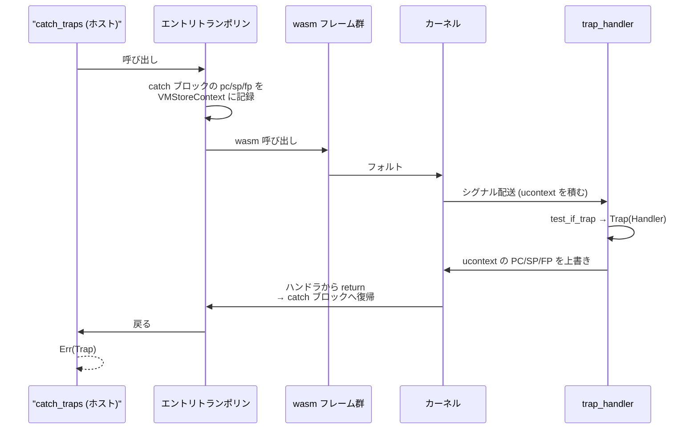

シグナルハンドラの中で「これは wasm のトラップだ」と判定できた ([「これは wasm 由来のフォルトか」を 3 段階で判定する](../is-this-wasm/))。次は wasm のフレームを全部飛び越えて、`catch_traps` を呼んだ地点まで戻らなければならない。

Wasmtime はここで `longjmp` を使わない。**シグナルハンドラの中で、OS がスタックに積んだレジスタ保存領域そのものを書き換える**。ハンドラから return すると、カーネルは書き換えられた値でレジスタを復元するので、フォルトした命令の次ではなく、まったく別の場所から実行が再開される。



## ucontext を書き換える

`trap_handler` の判定結果が `Trap` だったときにすることは、たった 1 行だ。

```rust title="crates/wasmtime/src/runtime/vm/sys/unix/signals.rs"
match test {
    TrapTest::NotWasm => { /* ... */ }
    TrapTest::HandledByEmbedder => true,
    TrapTest::Trap(handler) => {
        unsafe {
            store_handler_in_ucontext(context, &handler);
        }
        true
    }
}
```

[crates/wasmtime/src/runtime/vm/sys/unix/signals.rs](https://github.com/bytecodealliance/wasmtime/blob/d8a0da6d661605713798c1c9c76be5c28e3159ff/crates/wasmtime/src/runtime/vm/sys/unix/signals.rs#L171-L188)

`context` は `sigaction` に `SA_SIGINFO` を付けたときにハンドラの第 3 引数として渡ってくる `ucontext_t` だ。フォルトした瞬間のレジスタの中身が全部入っている。ここを書き換える。

```rust title="crates/wasmtime/src/runtime/vm/sys/unix/signals.rs"
unsafe fn store_handler_in_ucontext(cx: *mut libc::c_void, handler: &Handler) {
    cfg_select! {
        all(any(target_os = "linux", target_os = "android", target_os = "illumos"), target_arch = "x86_64") => {
            let cx = unsafe { cx.cast::<libc::ucontext_t>().as_mut().unwrap() };
            cx.uc_mcontext.gregs[libc::REG_RIP as usize] = handler.pc as _;
            cx.uc_mcontext.gregs[libc::REG_RSP as usize] = handler.sp as _;
            cx.uc_mcontext.gregs[libc::REG_RBP as usize] = handler.fp as _;
            cx.uc_mcontext.gregs[libc::REG_RAX as usize] = 0;
            cx.uc_mcontext.gregs[libc::REG_RDX as usize] = 0;
        }
        // ... 各アーキ分
```

[crates/wasmtime/src/runtime/vm/sys/unix/signals.rs](https://github.com/bytecodealliance/wasmtime/blob/d8a0da6d661605713798c1c9c76be5c28e3159ff/crates/wasmtime/src/runtime/vm/sys/unix/signals.rs#L348-L357)

書き換えるのは 5 本だけだ。命令ポインタ (RIP)、スタックポインタ (RSP)、フレームポインタ (RBP)、そして例外のペイロードを渡す 2 本 (RAX / RDX) に 0 を入れる。トラップの場合はペイロードがないので 0 になる。

書き換える値は `Handler` という 3 ワードの構造体で運ばれる。

```rust title="crates/unwinder/src/throw.rs"
pub struct Handler {
    /// Program counter of handler return point.
    pub pc: usize,
    /// Stack pointer to restore before jumping to handler.
    pub sp: usize,
    /// Frame pointer to restore before jumping to handler.
    pub fp: usize,
}
```

[crates/unwinder/src/throw.rs](https://github.com/bytecodealliance/wasmtime/blob/d8a0da6d661605713798c1c9c76be5c28e3159ff/crates/unwinder/src/throw.rs#L24-L31)

そしてこの 3 つは `VMStoreContext` から作られる。

```rust title="crates/wasmtime/src/runtime/vm/traphandlers.rs"
fn entry_trap_handler(vm_store_context: &VMStoreContext) -> Handler {
    unsafe {
        let fp = *vm_store_context.last_wasm_entry_fp.get();
        let sp = *vm_store_context.last_wasm_entry_sp.get();
        let pc = *vm_store_context.last_wasm_entry_trap_handler.get();
        Handler { pc, sp, fp }
    }
}
```

[crates/wasmtime/src/runtime/vm/traphandlers.rs](https://github.com/bytecodealliance/wasmtime/blob/d8a0da6d661605713798c1c9c76be5c28e3159ff/crates/wasmtime/src/runtime/vm/traphandlers.rs#L1034-L1042)

`last_wasm_entry_trap_handler` は、ホストが wasm を呼ぶときにトランポリン自身が書き込むフィールドだ。

```rust title="crates/environ/src/vmtypes.rs"
/// The last trap handler from a host-to-wasm entry trampoline on the stack.
///
/// This field is configured when the host calls into wasm by the trampoline
/// itself. It stores the `pc` of an exception handler suitable to handle
/// all traps (or uncaught exceptions).
pub last_wasm_entry_trap_handler: UnsafeCell<usize>,
```

[crates/environ/src/vmtypes.rs](https://github.com/bytecodealliance/wasmtime/blob/d8a0da6d661605713798c1c9c76be5c28e3159ff/crates/environ/src/vmtypes.rs#L415-L421)

## 実体は Cranelift の例外サポート

「エントリトランポリンに置いた catch ブロック」というのは比喩ではない。**Wasmtime のトラップは、Cranelift の例外機構の上に実装されている**。

```text title="docs/contributing-architecture.md"
Wasmtime today implements traps with the support for exceptions in Cranelift.
Notably the entry trampoline into WebAssembly sets up an "base handler" used to
catch all traps, and when a trap happens this is resumed to. The exception
handler itself takes care of, for example, restoring registers.
```

[docs/contributing-architecture.md](https://github.com/bytecodealliance/wasmtime/blob/d8a0da6d661605713798c1c9c76be5c28e3159ff/docs/contributing-architecture.md#L314-L317)

エントリトランポリンは「すべてのトラップを捕まえる base handler」を設置してから wasm を呼ぶ。トラップが起きたらそこへ resume する。callee-saved レジスタの復元はハンドラ側のコードが担当するので、シグナルハンドラは PC・SP・FP を差し替えるだけでよい。

なお、同じ文書の Traps 節には `longjmp` という記述が残っているが、これは古い。現在のコードに `longjmp` は登場せず、`Handler::resume` と ucontext の書き換えに置き換わっている。

## ホスト発のトラップは経路が違う

フォルトによらないトラップもある。ホスト関数が `Err` を返した、`Func::wrap` に渡したクロージャが panic した、fuel が尽きた、といった場合だ。これらはシグナルを経由しないので、ucontext を書き換える相手がいない。

こちらは `raise` という libcall を通る。

```rust title="crates/wasmtime/src/runtime/vm/libcalls.rs"
fn raise(store: &mut dyn VMStore, _instance: InstanceId) {
    // SAFETY: this is only called from compiled wasm so we know that wasm has
    // already been entered. It's a dynamic safety precondition that the trap
    // information has already been arranged to be present.
    unsafe { crate::runtime::vm::traphandlers::raise_preexisting_trap(store) }
}
```

[crates/wasmtime/src/runtime/vm/libcalls.rs](https://github.com/bytecodealliance/wasmtime/blob/d8a0da6d661605713798c1c9c76be5c28e3159ff/crates/wasmtime/src/runtime/vm/libcalls.rs#L1106-L1111)

流れはこうなる。ホスト関数が `Err` を返す → その情報を `CallThreadState` に**記録するだけ**して、センチネル値を返り値として wasm へ戻る → wasm 側のトランポリンがセンチネルを検査し、`raise` libcall を呼ぶ → `raise_preexisting_trap` が記録済みの情報を読んで `Handler::resume` する。

つまり **「記録」と「制御移動」が別の関数に分かれている**。記録側が `catch_unwind_and_record_trap` で、制御移動側が `raise_preexisting_trap` だ。

```rust title="crates/wasmtime/src/runtime/vm/traphandlers.rs"
pub fn catch_unwind_and_record_trap<R>(
    store: &mut dyn VMStore,
    f: impl FnOnce(&mut dyn VMStore) -> R,
) -> R::Abi
where
    R: HostResult,
{
    let (ret, unwind) = R::maybe_catch_unwind(store, |store| f(store));
    if let Some(unwind) = unwind {
        tls::with(|info| info.unwrap().record_unwind(unwind));
    }
    ret
}
```

[crates/wasmtime/src/runtime/vm/traphandlers.rs](https://github.com/bytecodealliance/wasmtime/blob/d8a0da6d661605713798c1c9c76be5c28e3159ff/crates/wasmtime/src/runtime/vm/traphandlers.rs#L125-L141)

分けている理由は、ホスト関数の Rust フレームをきちんと畳んでから制御を移すためだ。ホスト関数の中でいきなり `Handler::resume` すると、そのホスト関数自身のローカル変数のデストラクタが飛ぶ。いったん普通に return して wasm 側に戻り、そこから巻き戻す。

センチネル値の設計は `HostResultHasUnwindSentinel` にある。`()` は `bool` の `false`、`u32` は `u64::MAX`、`*mut u8` は全ビット 1 のポインタ、というように**型ごとに「正常な値としては絶対に現れない値」を 1 つ決めておき、Cranelift 側のコードがそれと比較する**。

```rust title="crates/wasmtime/src/runtime/vm/traphandlers.rs"
/// A 32-bit return value can be inflated to a 64-bit return value in the ABI.
/// In this manner a successful result is a zero-extended 32-bit value and the
/// failure sentinel is `u64::MAX` or -1 as a signed integer.
unsafe impl HostResultHasUnwindSentinel for u32 {
    type Abi = u64;
    const SENTINEL: u64 = u64::MAX;
    fn into_abi(self) -> u64 {
        self.into()
    }
}
```

[crates/wasmtime/src/runtime/vm/traphandlers.rs](https://github.com/bytecodealliance/wasmtime/blob/d8a0da6d661605713798c1c9c76be5c28e3159ff/crates/wasmtime/src/runtime/vm/traphandlers.rs#L353-L361)

この仕組みの詳細は [libcall はトランポリンと sentinel 返り値で呼ぶ](../libcall-trampoline/) が扱う。

`raise_preexisting_trap` の挙動は実行器で分かれる。Pulley では return してインタプリタが制御移動を行い、ネイティブでは戻らない。

```rust title="crates/wasmtime/src/runtime/vm/traphandlers.rs"
/// Note that this function is used both for Pulley and for native execution.
/// For Pulley this function will return and the interpreter will be
/// responsible for handling the control-flow transfer. For native this
/// function will not return as the control flow transfer will be handled
/// internally.
```

[crates/wasmtime/src/runtime/vm/traphandlers.rs](https://github.com/bytecodealliance/wasmtime/blob/d8a0da6d661605713798c1c9c76be5c28e3159ff/crates/wasmtime/src/runtime/vm/traphandlers.rs#L84-L99)

## デストラクタが飛ぶことが安全性要件になっている

ucontext の書き換えも `Handler::resume` も、スタックフレームを機械的に飛ばす操作だ。Rust の `Drop` は一切走らない。この事実が、安全性の前提条件としてはっきり書かれている。

```rust title="crates/wasmtime/src/runtime/vm/traphandlers.rs"
/// # Unsafety
///
/// This function is not safe if a corresponding handler wasn't already
/// setup in the entry trampoline. Additionally this isn't safe as it may
/// skip all Rust destructors on the stack, if there are any, for native
/// executors as `Handler::resume` will be used.
unsafe fn unwind(&self, store: &mut dyn VMStore) {
```

[crates/wasmtime/src/runtime/vm/traphandlers.rs](https://github.com/bytecodealliance/wasmtime/blob/d8a0da6d661605713798c1c9c76be5c28e3159ff/crates/wasmtime/src/runtime/vm/traphandlers.rs#L769-L776)

`raise_preexisting_trap` にも同じ条件が書かれている。「wasm がスタック上にあるときにのみ安全。加えて Rust のデストラクタがスタック上にあってはならない。飛ばされて実行されない」。

これは Wasmtime の内部規約であると同時に、**libcall を書く人への制約**でもある。トラップを返しうる libcall の中で `Vec` や `MutexGuard` をローカルに持つと、そのメモリは解放されず、そのロックは解放されない。この規約が [libcall はトランポリンと sentinel 返り値で呼ぶ](../libcall-trampoline/) の設計を縛っている。

## ホストの panic を wasm フレームを越えて運ぶ

もう 1 つ重要なのが panic の扱いだ。ホスト関数の中で Rust の `panic!` が起きたとき、素直に考えれば Rust のアンワインダにそのまま巻き戻させればよい。しかし Wasmtime はそうしない。

```rust title="crates/wasmtime/src/runtime/vm/traphandlers.rs"
/// The reasons why Wasmtime might unwind, stored within `CallThreadState`.
pub enum UnwindReason {
    /// The host panicked.
    ///
    /// In this situation Wasmtime must transfer the panic payload across Wasm
    /// code since the native unwinder isn't guaranteed to be able to unwind
    /// wasm. Once wasm is unwound, however, the panic is re-thrown on the
    /// other side to propagate like usual.
    #[cfg(all(feature = "std", panic = "unwind"))]
    Panic(Box<dyn std::any::Any + Send>),

    /// Wasm or the host raised a trap for some reason.
    Trap(Result<Box<Trap>, OutOfMemory>),
}
```

[crates/wasmtime/src/runtime/vm/traphandlers.rs](https://github.com/bytecodealliance/wasmtime/blob/d8a0da6d661605713798c1c9c76be5c28e3159ff/crates/wasmtime/src/runtime/vm/traphandlers.rs#L678-L697)

理由が明記されている。**ネイティブのアンワインダが wasm のフレームをアンワインドできる保証がない**。Cranelift は `preserve_frame_pointers` を付けてフレームポインタチェーンは維持するが、DWARF の CFI が完全な巻き戻しに耐える保証まではしていない。

だから panic のペイロードを `catch_unwind` で受け止め、`Box<dyn Any + Send>` として `CallThreadState` に載せ、トラップとまったく同じ経路で wasm フレームを飛び越える。wasm を抜けきってから改めて投げ直す。

```rust title="crates/wasmtime/src/runtime/vm/traphandlers.rs"
match result {
    Ok(x) => Ok(x),
    Err(UnwindReason::Trap(reason)) => Err(crate::trap::from_runtime_box(store.0, reason?)),
    #[cfg(all(feature = "std", panic = "unwind"))]
    Err(UnwindReason::Panic(panic)) => std::panic::resume_unwind(panic),
}
```

[crates/wasmtime/src/runtime/vm/traphandlers.rs](https://github.com/bytecodealliance/wasmtime/blob/d8a0da6d661605713798c1c9c76be5c28e3159ff/crates/wasmtime/src/runtime/vm/traphandlers.rs#L473-L479)

`resume_unwind` は panic ハンドラを再度呼ばずに巻き戻しだけを再開する API なので、**呼び出し元から見ると「ホスト関数の panic がそのまま伝播してきた」ように見える**。バックトレースは wasm の区間で途切れるが、panic のペイロード (`panic!` に渡したメッセージなど) は保たれる。

`UnwindReason::Trap` が `Result<Box<Trap>, OutOfMemory>` になっているのも意図的で、コメントに「`Box` に入れておくと `CallThreadState` への出し入れが最適化される。そうしないとホットな関数に memcpy だらけの大きなスローパスができる」と書かれている。

## どう活かすか

「例外を投げる」実装を自分で持つことは滅多にないが、この設計から取り出せるものが 2 つある。

1 つは **「記録」と「制御移動」を分ける**という形だ。エラー情報を先に安全な場所へ置き、実際のジャンプは、飛ばしても困らない位置まで戻ってから行う。デストラクタや後始末を持つフレームを跨がずに済む。

もう 1 つは **「別レイヤのアンワインダを信用しない」**という判断だ。Wasmtime は Rust の panic を Rust のアンワインダに任せず、いったん値に落として自分の経路で運ぶ。異なるコンパイラが生成したフレームが混ざるスタックでは、「巻き戻せるはず」という期待は根拠が要る。
