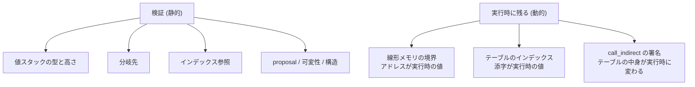

Wasm のバイナリを実行する前に、必ず検証が走る。ここで通ったコードは「サンドボックスの中に留まる」ことが保証される。

だが検証が保証しているものを「型が合っている」で片付けると、実装側から見た価値を取り逃がす。**検証の本当の役割は、実行時に何をチェックしなくてよいかを確定させることだ。** 検証を通ったあとに残る動的チェックは、コード生成のコストとして毎回払うことになる。だから「何が残るか」がそのまま性能を決める。

このページでは、検証が確定させる 6 つのことを挙げ、そのあとで**なぜ 3 つのチェックだけが実行時に残るのか**を見る。

## 検証は Wasmtime の仕事ではない

まず位置づけを確認しておく。**Wasmtime は検証器を持っていない。** 検証は `wasm-tools` リポジトリの `wasmparser` crate がやる。

```toml title="crates/environ/Cargo.toml"
wasmparser = { workspace = true, features = ['validate', 'serde', 'features'] }
```

[crates/environ/Cargo.toml](https://github.com/bytecodealliance/wasmtime/blob/d8a0da6d661605713798c1c9c76be5c28e3159ff/crates/environ/Cargo.toml#L28)

`validate` と `features` という feature を明示的に有効化している。前者が検証器本体、後者が「どの proposal を有効とみなすか」を実行時に切り替える機構だ。

Wasmtime 側の入口はこうなっている。

```rust title="crates/wasmtime/src/compile.rs"
// First a `ModuleEnvironment` is created which records type information
// about the wasm module. This is where the WebAssembly is parsed and
// validated. Afterwards `types` will have all the type information for
// this module.
let mut parser = wasmparser::Parser::new(0);
let mut validator = wasmparser::Validator::new_with_features(engine.features());
parser.set_features(*validator.features());
```

[crates/wasmtime/src/compile.rs](https://github.com/bytecodealliance/wasmtime/blob/d8a0da6d661605713798c1c9c76be5c28e3159ff/crates/wasmtime/src/compile.rs#L60-L90)

`Validator` は `Engine` の feature 集合から作られる。つまり **「何が valid か」は Engine の設定によって変わる**。同じバイナリが、ある Engine では通り、別の Engine では拒否される。この feature 集合がどう決まるかは [proposal の地図](../proposals/) で扱う。

## 検証が確定させる 6 つのこと

### 1. すべての命令位置における値スタックの型と高さ

これが型検査の中核だ。`i32.add` の直前には値スタックに `i32` が 2 つ以上あり、上から 2 つが `i32` であること。実行してみないと分からない、ということが一切ない。

保証されるのは型だけでなく**高さ**でもある。分岐で合流する経路が異なる高さのスタックを持つことは許されない。これによって、[スタックマシンと構造化制御構文](../stack-machine/) で見た「値スタックに CLIF の値番号を積んでシミュレートする」という 1 パス翻訳が成立する。

### 2. すべての分岐先が存在する制御ブロックであること

`br N` の `N` が制御スタックの深さを超えていないこと。そして飛び先のブロックが要求する値の型と個数が、分岐時点の値スタックの先頭と一致すること。

これが [なぜ WebAssembly が生まれたのか](../why-wasm/) の「すべての制御移動が既知かつ型検査済みの宛先へ向かう」の前半を実現する。**分岐先が実行時に決まることはない。**

### 3. すべてのインデックス参照が範囲内であること

`local.get 5` の 5、`call 12` の 12、`global.set 3` の 3、`table.get 1` の 1、`memory.init 7` の 7。これらは全部、対応する index space の長さ未満でなければならない。

**この保証が効いているせいで、Wasmtime のコンパイラは `self.env.module.tables[table_index]` のような添字アクセスを、範囲チェックなしで書ける。** [テーブルと間接呼び出し](../tables-and-call-indirect/) で見た `unreachable!()` のアームも、この保証への依存だ。「関数以外のテーブルに `call_indirect` する」バイナリは検証を通らないから、そこに到達したらそれは Wasmtime のバグである。

なお `memory.init` の `data` セグメント番号を検証するために datacount セクションが要る、という話は [Wasm バイナリは 12 のセクションでできている](../binary-format/) で見たとおりだ。

### 4. 使われている命令とその型が、有効な proposal の範囲に収まっていること

`v128.load` を使うには simd proposal が有効でなければならない。`externref` を書けるのは reference-types が有効なときだけ。これは仕様の話ではなく実装の話に見えるが、**Wasmtime にとっては安全性の話**でもある。バックエンドが対応していない命令が翻訳器まで届けばパニックするので、feature 集合はコンパイラの能力に合わせて絞られる。

### 5. 可変性と最終性の制約

`global.set` の対象が `mut` であること。`(type (sub final $t) ...)` を継承しようとしていないこと。データの構造ではなく、宣言された属性に対する検査だ。

### 6. モジュール構造の整合性

セクションが仕様の順序で現れること。function セクションのエントリ数と code セクションのエントリ数が一致すること。datacount と data セクションの個数が一致すること。start 関数の型が `[] -> []` であること。

この 6 番目があるおかげで、[Wasm バイナリは 12 のセクションでできている](../binary-format/) で見た `translate_payload` は「セクションが順に 1 回ずつ来る」という前提で書ける。同じセクションが 2 回来たらどうする、という分岐がどこにもない。

## 検証だけを走らせることもできる

コンパイルせずに検証だけしたい場合のために、`Module::validate` がある。

```rust title="crates/wasmtime/src/runtime/module.rs"
pub fn validate(engine: &Engine, binary: &[u8]) -> Result<()> {
    let mut validator = Validator::new_with_features(engine.features());

    let mut functions = Vec::new();
    for payload in Parser::new(0).parse_all(binary) {
        let payload = payload?;
        if let ValidPayload::Func(a, b) = validator.payload(&payload)? {
            functions.push((a, b));
        }
        // ...
    }

    engine.run_maybe_parallel(functions, |(validator, body)| {
        validator.into_validator(Default::default()).validate(&body)
    })?;
    Ok(())
}
```

[crates/wasmtime/src/runtime/module.rs](https://github.com/bytecodealliance/wasmtime/blob/d8a0da6d661605713798c1c9c76be5c28e3159ff/crates/wasmtime/src/runtime/module.rs#L564-L607)

構造が `Module::new` と同じ形をしているのが分かる。セクションを順に舐めて、関数本体だけは `Vec` に溜めておき、最後に**並列に**検証する。これができるのは、関数本体の検証が他の関数本体を一切必要としないからだ。function セクションで全シグネチャが確定しているので、n 番目の関数は単独で検査できる ([Wasm バイナリは 12 のセクションでできている](../binary-format/))。

`Module::new` との違いは、CLIF への翻訳と機械語生成をしないことだけである。検証そのものは同じ `wasmparser::Validator` が同じ順序で行い、`Module::new` の側では検証と翻訳が**インターリーブ**される。1 つの関数について「検証してすぐ翻訳する」という形にすれば、バイト列を 2 回読まずに済む ([パースと検証をインターリーブし、関数本体だけ遅延する](../interleaved-validation/))。

`Module::validate` が役に立つのは「受け取ったバイナリを弾くかどうかだけ早く決めたい」場面だ。コンパイルは検証より 1 桁以上高価なので、入口で捨てられるものは捨てたほうがいい。

## 実行時に残るチェックは 3 つだけ

検証が通っても、以下の 3 つは実行時に検査するしかない。



理由はどれも同じ形をしている。**検証が確定させられるのは「命令に書かれている即値」であって、「スタックに載る値」ではない。**

`i32.load` のアドレスは値スタックから来る。その値は前の命令の計算結果で、入力次第で何にでもなりうる。だからアドレスが線形メモリの範囲内かどうかは、実行するまで分からない。

`call_indirect` のテーブルインデックスも同様に値スタックから来る。そして取り出される要素の型は、`table.set` や `table.init`、あるいはホスト側の API によって**実行中に変わりうる**。テーブルは可変なので、検証時点の中身を静的に知る方法がない。

3 つとも「これを検査しなければサンドボックスを抜けられる」チェックであることに注意したい。線形メモリの外を読めればホストのメモリが見え、テーブルの外を読めば任意のバイト列を関数として呼び、型の合わない関数を呼べば ABI が壊れてスタックが破損する。

一方で、wasm には他にもトラップする命令がある。`i32.div_s` のゼロ除算、`i32.trunc_f32_s` の範囲外変換、`unreachable` 命令。これらも実行時チェックだが、**性質が違う。** 検査しなくてもサンドボックスは破れない (x86 の `idiv` はゼロ除算で `#DE` 例外を出すだけだ)。トラップするのは「未定義動作を作らない」という [なぜ WebAssembly が生まれたのか](../why-wasm/) の 5 番目の性質のためで、決定性の要求から来ている。**安全性のためのチェックと、決定性のためのチェックは別物である。**

## 3 つのうち 2 つは、条件が揃えば消える

そして Wasmtime の面白いところは、この 3 つのうち 2 つを**特定の条件下で生成コードから消す**ことだ。

線形メモリの境界チェックは、予約領域 + ガード領域が「wasm が計算しうるアドレスの上界」をカバーしていれば、命令を 1 つも吐かずに済む。範囲外アクセスは必ず未マップページに当たって SIGSEGV になるからだ ([線形メモリ — ポインタがオフセットになるということ](../linear-memory-semantics/)、[境界チェックを「消す」ための条件を数式で追う](../bounds-check-elision/))。

`call_indirect` の署名チェックは、テーブルの要素型が具体的なら静的に決着する。`nofunc` のテーブルなら無条件トラップに、型が一致する具体型のテーブルなら検査ゼロになる ([テーブルと間接呼び出し](../tables-and-call-indirect/))。

消せないのはテーブルのインデックス範囲チェックだけだ。テーブルは線形メモリのような巨大な予約領域を持たないので、仮想メモリの保護に肩代わりさせられない。

## どう活かすか

このページの構造がそのまま持ち帰りになる。**「事前検査で何が確定するか」を列挙し、「その結果として実行時に何が不要になるか」を突き合わせる。** そして残ったチェックについて「これは安全性のためか、意味論のためか」を分ける。

Wasm の設計が優れているのは、この 3 つの層が明確に分かれていることだ。静的に決まるもの (型、制御フロー、インデックス)、動的だが安全性に必須のもの (メモリ境界、テーブル範囲、署名)、動的だが決定性のためのもの (ゼロ除算、変換の範囲)。**どの層に属するかで、実装が払っていいコストが違う。** 安全性に必須のものは絶対に省けないが、それでも仮想メモリのような別のメカニズムに肩代わりさせる余地はある。

次は、これらの検査を規定する「どの proposal が有効か」の話に進む ([proposal の地図 — Wasm は今も動いている](../proposals/))。
