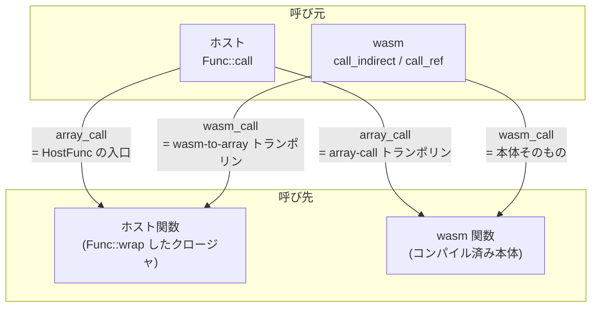

wasm の `funcref` 値、テーブルの要素、import された関数。これらの実行時表現は全部 `VMFuncRef` という 1 つの構造体だ。フィールドは 4 つしかなく、そのうち 2 つが関数ポインタになっている。**呼び出し規約が 2 種類あるので、エントリポイントも 2 つ必要**だからだ。

```rust title="crates/environ/src/vmtypes.rs"
/// The VM caller-checked "funcref" record, for caller-side signature checking.
#[derive(Debug, Clone)]
#[repr(C)]
#[snake_name = vm_func_ref]
pub struct VMFuncRef {
    /// Function pointer for this funcref if being called via the "array"
    /// calling convention that `Func::new` et al use.
    pub array_call: VmPtr<VMArrayCallFunction>,

    /// Function pointer for this funcref if being called via the calling
    /// convention we use when compiling Wasm.
    #[readonly]
    pub wasm_call: Option<VmPtr<VMWasmCallFunction>>,

    /// Function signature's type id.
    #[readonly]
    pub type_index: VMSharedTypeIndex,

    /// The VM state associated with this function.
    #[readonly]
    pub vmctx: VmPtr<VMOpaqueContext>,
}
```

[crates/environ/src/vmtypes.rs#L98-L154](https://github.com/bytecodealliance/wasmtime/blob/d8a0da6d661605713798c1c9c76be5c28e3159ff/crates/environ/src/vmtypes.rs#L98-L154)

## 4 つのフィールドが誰に対応するか

`array_call` は**ホストから呼ぶための入口**だ。引数を `ValRaw` の配列に詰めて渡す規約で、引数の個数や型が何であっても Rust から見た関数シグネチャが 1 つになる ([array-call ABI — 全関数が同じ Rust シグネチャになる](../array-call-abi/))。`Func::call` はここを通る。

`wasm_call` は**コンパイル済みの wasm から呼ぶための入口**だ。こちらは Cranelift が wasm 関数をコンパイルするときと同じ規約 (`CallConv::Tail`) で、引数はレジスタに乗る。`call_indirect` や `call_ref` はここを間接呼び出しする。

`type_index` は `VMSharedTypeIndex` で、`call_indirect` の型チェックが整数 1 回の比較で済むよう Engine 単位でインターンされた型 ID だ ([call_indirect の型チェックが整数比較 1 回になるまで](../call-indirect-typecheck/))。

`vmctx` は `VMOpaqueContext` へのポインタで、**この関数が実際は何なのかによって指す先の型が違う**。core wasm 関数なら `*mut VMContext`、`Func::wrap` で作ったホスト関数なら `*mut VMArrayCallHostFuncContext`、component の関数なら `*mut VMComponentContext`。どれも先頭 4 バイトが magic になっていて、キャスト時に debug_assert で照合される ([VMContext — JIT コードが固定オフセットで触る構造体](../vmcontext/))。



呼び元が使うフィールドは呼び元の側だけで決まる。**呼び先がホストか wasm かを、呼び元は知らなくてよい。** ホストは常に `array_call` を、wasm は常に `wasm_call` を叩き、辻褄を合わせるのはトランポリンの仕事になる。

## wasm_call だけが Option である理由

4 つのうち `wasm_call` だけが `Option` になっている。理由は doc コメントに全部書かれている。

```text title="crates/environ/src/vmtypes.rs"
/// Most functions come with a function pointer that we can use when they
/// are called from Wasm. The notable exception is when we `Func::wrap` a
/// host function, and we don't have a Wasm compiler on hand to compile a
/// Wasm-to-native trampoline for the function. In this case, we leave
/// `wasm_call` empty until the function is passed as an import to Wasm (or
/// otherwise exposed to Wasm via tables/globals). At this point, we look up
/// a Wasm-to-native trampoline for the function in the Wasm's compiled
/// module and use that fill in `VMFunctionImport::wasm_call`. **However**
/// there is no guarantee that the Wasm module has a trampoline for this
/// function's signature. The Wasm module only has trampolines for its
/// types, and if this function isn't of one of those types, then the Wasm
/// module will not have a trampoline for it. This is actually okay, because
/// it means that the Wasm cannot actually call this function. But it does
/// mean that this field needs to be an `Option` even though it is non-null
/// the vast vast vast majority of the time.
```

[crates/environ/src/vmtypes.rs#L113-L127](https://github.com/bytecodealliance/wasmtime/blob/d8a0da6d661605713798c1c9c76be5c28e3159ff/crates/environ/src/vmtypes.rs#L113-L127)

論理の流れを分解するとこうなる。

`Func::wrap(&mut store, |a: i32| a + 1)` を呼んだ時点で、Wasmtime はこのクロージャの `array_call` 入口は作れる。しかし `wasm_call` 入口は、この型シグネチャ用の wasm-to-array トランポリンを**コンパイルしないと**得られない。そして `Func::wrap` の時点でコンパイラが使える保証がない (`cranelift` feature を切ったビルドもある)。

一方、wasm モジュールをコンパイルするときには、そのモジュールが必要とする型のトランポリンが一緒にコンパイルされる ([コンパイル対象は「関数」だけではない](../compile-inputs/))。だから、このホスト関数を import として受け取るモジュールが現れたら、そのモジュールが持っているトランポリンの中から `type_index` が一致するものを探せばよい。

そして最後の一手が効いている。**もしモジュールがその型のトランポリンを持っていなかったら、それはそのモジュールがこの関数を呼べないということなので、`None` のままで構わない。** 呼べない関数に入口がなくても誰も困らない。

これに対して `VMFunctionImport` は同じ 4 フィールドを持ちながら `wasm_call` が非 `Option` になっている。

```rust title="crates/environ/src/vmtypes.rs"
/// An imported function.
///
/// Basically the same as `VMFuncRef`, except that `wasm_call` is not optional.
#[derive(Debug, Clone)]
#[repr(C)]
#[snake_name = vm_function_import]
pub struct VMFunctionImport {
    /// Same as `VMFuncRef::array_call`.
    #[readonly]
    #[can_move]
    pub array_call: VmPtr<VMArrayCallFunction>,

    /// Same as `VMFuncRef::wasm_call`, except always non-null. Must be filled
    /// in by the time Wasm is importing this function!
    #[readonly]
    #[can_move]
    pub wasm_call: VmPtr<VMWasmCallFunction>,
    // ...
}
```

[crates/environ/src/vmtypes.rs#L156-L187](https://github.com/bytecodealliance/wasmtime/blob/d8a0da6d661605713798c1c9c76be5c28e3159ff/crates/environ/src/vmtypes.rs#L156-L187)

**import として `VMContext` に置かれている以上、その関数は呼ばれうる**。呼ばれうるなら入口がなければならない。だからここでは非 `Option` が不変条件になり、コンパイル済みコードは null チェックなしにロードして間接呼び出しできる。レイアウトは `VMFuncRef` と同一なので、変換はキャスト 1 回で済む。

```rust title="crates/wasmtime/src/runtime/vm/vmcontext.rs"
pub(crate) fn as_vm_function_import(&self) -> Option<&VMFunctionImport> {
    if self.wasm_call.is_some() {
        // Safety: `VMFuncRef` and `VMFunctionImport` have the same layout
        // and `wasm_call` is non-null.
        Some(unsafe { NonNull::from(self).cast::<VMFunctionImport>().as_ref() })
    } else {
        None
    }
}
```

## 穴を誰がいつ埋めるか

穴の管理は Store が持つ `FuncRefs` が引き受ける。

```rust title="crates/wasmtime/src/runtime/store/func_refs.rs"
/// An arena of `VMFuncRef`s.
///
/// Allows a store to pin and own funcrefs so that it can patch in trampolines
/// for `VMFuncRef`s that are missing a `wasm_call` trampoline and
/// need Wasm to supply it.
#[derive(Default)]
pub struct FuncRefs {
    /// A bump allocation arena where we allocate `VMFuncRef`s such
    /// that they are pinned and owned.
    bump: AlwaysMut<bumpalo::Bump>,

    /// Pointers into `self.bump` for entries that need `wasm_call` field filled
    /// in.
    with_holes: TryVec<SendSyncPtr<VMFuncRef>>,

    /// General-purpose storage of "function things" that need to live as long
    /// as the entire store.
    storage: TryVec<Storage>,
}
```

[crates/wasmtime/src/runtime/store/func_refs.rs#L13-L31](https://github.com/bytecodealliance/wasmtime/blob/d8a0da6d661605713798c1c9c76be5c28e3159ff/crates/wasmtime/src/runtime/store/func_refs.rs#L13-L31)

`bumpalo::Bump` を使うのは、**一度渡したポインタが二度と動いてはいけない**からだ。`VMFuncRef` へのポインタは wasm のテーブルにもグローバルにも `wasmtime::Func` にも入る。`Vec` に置いて再確保が起きたら全部が dangling になる。bump アロケータは確保済みの領域を移動しないので、この要求を満たす。

`with_holes` は「まだ埋まっていない `VMFuncRef` へのポインタ」のリストで、`fill` はこれを走査して埋まったものを取り除く。

```rust title="crates/wasmtime/src/runtime/store/func_refs.rs"
/// Patch any `VMFuncRef::wasm_call`s that need filling in.
pub fn fill(&mut self, modules: &ModuleRegistry) {
    self.with_holes
        .retain_mut(|f| unsafe { !try_fill(f.as_mut(), modules) });
}

unsafe fn try_fill(func_ref: &mut VMFuncRef, modules: &ModuleRegistry) -> bool {
    debug_assert!(func_ref.wasm_call.is_none());

    // Debug assert that the vmctx is a `VMArrayCallHostFuncContext` as
    // that is the only kind that can have holes.
    unsafe {
        let _ = VMArrayCallHostFuncContext::from_opaque(func_ref.vmctx.as_non_null());
    }

    func_ref.wasm_call = modules
        .wasm_to_array_trampoline(func_ref.type_index)
        .map(|f| f.into());
    func_ref.wasm_call.is_some()
}
```

`Storage` の 4 variant (`InstancePreDefinitions` / `InstancePreFuncRefs` / `BoxHost` / `ArcHost`) は、`VMFuncRef` が指す先の `vmctx` を Store の生存期間中ずっと生かしておくための箱だ。`Func::new` で作った一意所有のホスト関数は `BoxHost`、`Linker` 経由で複数の Store に共有されるものは `ArcHost` になる。

`fill` の呼び出しはインスタンス化の経路にある。import の型検査をする直前と、`InstancePre` からインスタンス化する直前だ。

```rust title="crates/wasmtime/src/runtime/instance.rs"
// When pushing functions into `OwnedImports` it's required that their
// `wasm_call` fields are all filled out. This `module` is guaranteed
// to have any trampolines necessary for functions so register the
// module with the store and then attempt to fill out any outstanding
// holes.
//
// Note that under normal operation this shouldn't do much as the list
// of funcs-with-holes should generally be empty. As a result the
// process of filling this out is not super optimized at this point.
let (modules, engine, breakpoints) = store.modules_and_engine_and_breakpoints_mut();
modules.register_module(module, engine, breakpoints)?;
let (funcrefs, modules) = store.func_refs_and_modules();
funcrefs.fill(modules);
```

[crates/wasmtime/src/runtime/instance.rs#L227-L239](https://github.com/bytecodealliance/wasmtime/blob/d8a0da6d661605713798c1c9c76be5c28e3159ff/crates/wasmtime/src/runtime/instance.rs#L227-L239)

**モジュールを Store に登録してから `fill` を呼ぶ**、という順序が本質だ。埋める材料 (トランポリン) がそのモジュールの中にあるので、登録が先でなければ見つからない。

## 「決してトリップしない unwrap」

穴が全部埋まっている、という不変条件はどこで観測されるか。`Func` を `VMFunctionImport` に変換する場所だ。ここに 20 行以上のコメントが付いている。

```rust title="crates/wasmtime/src/runtime/func.rs"
// Note that this is a load-bearing `unwrap` here, but is never expected
// to trip at runtime. The general problem is that host functions do not
// have a `wasm_call` function so the `VMFuncRef` type has an optional
// pointer there. This is only able to be filled out when a function is
// "paired" with a module where trampolines are present to fill out
// `wasm_call` pointers.
//
// This pairing of modules doesn't happen explicitly but is instead
// managed lazily throughout Wasmtime. Specifically the way this works
// is one of:
//
// * When a host function is created the store's list of modules are
//   searched for a wasm trampoline. If not found the `wasm_call` field
//   is left blank.
//
// * When a module instantiation happens, which uses this function, the
//   module will be used to fill any outstanding holes that it has
//   trampolines for.
//
// This means that by the time we get to this point any relevant holes
// should be filled out. Thus if this panic actually triggers then it's
// indicative of a missing `fill` call somewhere else.
let func_import = func_ref.as_vm_function_import().unwrap();
```

[crates/wasmtime/src/runtime/func.rs#L1215-L1245](https://github.com/bytecodealliance/wasmtime/blob/d8a0da6d661605713798c1c9c76be5c28e3159ff/crates/wasmtime/src/runtime/func.rs#L1215-L1245)

**この対応付けは明示的には起きず、Wasmtime 全体で遅延的に管理されている**、と書いてある。その状態で `unwrap` を書くなら、破れたときに何を疑えばよいかを残しておく必要がある。ここでの答えは「どこかで `fill` の呼び出しが漏れている」だ。不変条件が 1 か所で成立するのではなく複数の経路の合意として成立している場合、コメントが唯一のドキュメントになる。

## 線形探索であること

トランポリンの探索は `ModuleRegistry` に対する線形走査になっている。

```rust title="crates/wasmtime/src/runtime/module/registry.rs"
pub fn wasm_to_array_trampoline(
    &self,
    sig: VMSharedTypeIndex,
) -> Option<NonNull<VMWasmCallFunction>> {
    // TODO: We are doing a linear search over each module. This is fine for
    // now because we typically have very few modules per store (almost
    // always one, in fact). If this linear search ever becomes a
    // bottleneck, we could avoid it by incrementally and lazily building a
    // `VMSharedSignatureIndex` to `SignatureIndex` map.
    for module in self.modules.values() {
        if let Some(trampoline) = module.wasm_to_array_trampoline(sig) {
            return Some(trampoline);
        }
    }
    None
}
```

[crates/wasmtime/src/runtime/module/registry.rs#L368-L385](https://github.com/bytecodealliance/wasmtime/blob/d8a0da6d661605713798c1c9c76be5c28e3159ff/crates/wasmtime/src/runtime/module/registry.rs#L368-L385)

Store あたりのモジュール数は普通 1 なので問題にならない、という前提が置かれている。ただし `fill` 側は `with_holes` の全件に対してこれを回すので、**ホスト関数を数百個 `Linker` に登録してから毎回インスタンス化する**ような使い方では効いてくる。この構図が `InstancePre` の価値でもある。`Linker::instantiate_pre` で `InstancePre` を作っておけば、穴埋めと型検査がその時点で 1 回だけ済み、以降のインスタンス化では埋め済みの `VMFuncRef` の配列を使い回す ([Linker と、インスタンス化の「後戻りできない点」](../linker-and-instantiation/))。

## ホスト関数側の vmctx

`Func::wrap` したクロージャの `vmctx` が指す先はこうなっている。

```rust title="crates/wasmtime/src/runtime/vm/vmcontext/vm_host_func_context.rs"
/// The `VM*Context` for array-call host functions.
///
/// Its `magic` field must always be
/// `wasmtime_environ::VM_ARRAY_CALL_HOST_FUNC_MAGIC`, and this is how you can
/// determine whether a `VM*Context` is a `VMArrayCallHostFuncContext` versus a
/// different kind of context.
#[repr(C)]
pub struct VMArrayCallHostFuncContext {
    magic: u32,
    // _padding: u32, // (on 64-bit systems)
    pub(crate) func_ref: VMFuncRef,
    host_state: Box<dyn Any + Send + Sync>,
}
```

[crates/wasmtime/src/runtime/vm/vmcontext/vm_host_func_context.rs#L13-L25](https://github.com/bytecodealliance/wasmtime/blob/d8a0da6d661605713798c1c9c76be5c28e3159ff/crates/wasmtime/src/runtime/vm/vmcontext/vm_host_func_context.rs#L13-L25)

自分自身の `VMFuncRef` を内包し、`vmctx` フィールドは自分を指す (構築時に `NonNull::dangling()` で初期化してから自己参照に差し替えている)。`host_state` に本物のクロージャが `Box<dyn Any>` として入る。`try_fill` が `VMArrayCallHostFuncContext::from_opaque` を呼んで捨てているのは、**穴を持ちうるのはこの種類の context だけ**という不変条件を debug ビルドで確認するためだ。

## `Func` との棲み分け

`wasmtime::Func` の側の表現 (`StoreId` + `*mut VMFuncRef` の 2 ワード) と、その形に至った経緯は [Func は 2 ワードしかない](../func-two-words/) にある。このページで見たのはその生ポインタが指す先の中身で、`Func` が「安全な API の側の表現」、`VMFuncRef` が「コンパイル済みコードと共有する側の表現」という分担になっている。

## どう活かすか

`Option` になっているフィールドを見たら、「どのタイミングで埋まるのか」「埋まらないことがあるならそれは何を意味するのか」を疑う価値がある。ここでの答えは、**埋まらない場合は呼ばれないので問題にならない**、というものだった。「不正な状態を表現不能にする」のが原則だとしても、時間的に不可避な穴は存在する。そのときに `Option` を選ぶなら、埋める責任の所在と、埋め忘れたときに何が起きるかを、コード上に残しておく必要がある。
