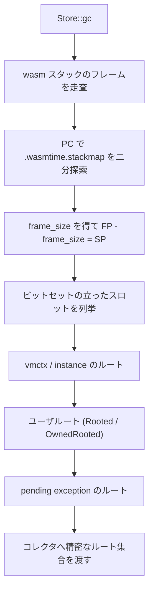

Wasm GC 提案が入ったことで、Wasmtime は `externref` / `anyref` / struct / array といった「回収されうる参照」を扱う必要が出た。その実行時表現がこれになる。

```rust title="crates/wasmtime/src/runtime/vm/gc/gc_ref.rs"
#[derive(Debug, PartialEq, Eq, Hash)]
#[repr(transparent)]
pub struct VMGcRef(NonZeroU32);
```

**ポインタではなく、32bit のヒープ内インデックス**だ。そして `Clone` も `Copy` も実装していない。この 2 つがこのページの主題になる。

## 32bit である理由と、最下位ビット

doc コメントが「これは実際にはポインタではなく、Wasm GC ヒープへのコンパクトなインデックスである」と明示している。線形メモリのアドレスが `i32` のオフセットになっているのと同じ発想で、**GC ヒープの基底からの相対位置だけを持てば、64bit のホストポインタを wasm 側に渡さずに済む**。ヒープの外を指すことが構造的にできなくなり、表現も半分のサイズで済む。

さらに最下位ビットが特別扱いされている。

```text
VMGcRef (32bit)

 31                                                      1   0
+---------------------------------------------------------+---+
|                    ヒープ内インデックス / 31bit 整数値        | D |
+---------------------------------------------------------+---+
                                                             |
                              D = 1 → i31ref のアンボックス値 (上位 31bit が値)
                              D = 0 → GC ヒープへのインデックス
                              全体が 0 → null (NonZeroU32)
```

```rust title="crates/wasmtime/src/runtime/vm/gc/gc_ref.rs"
/// If this bit is set on a GC reference, then the GC reference is actually an
/// unboxed `i31`.
///
/// Must be kept in sync with `wasmtime_cranelift::I31_REF_DISCRIMINANT`.
pub const I31_REF_DISCRIMINANT: u32 = 1;

/// Create a new `VMGcRef` from the given index into a GC heap.
///
/// Returns `None` when the index is not 2-byte aligned and therefore
/// conflicts with the `i31ref` discriminant.
pub fn from_heap_index(index: NonZeroU32) -> Option<Self> {
    if (index.get() & Self::I31_REF_DISCRIMINANT) == 0 {
        Some(Self::from_raw_non_zero_u32(index))
    } else {
        None
    }
}
```

[crates/wasmtime/src/runtime/vm/gc/gc_ref.rs](https://github.com/bytecodealliance/wasmtime/blob/d8a0da6d661605713798c1c9c76be5c28e3159ff/crates/wasmtime/src/runtime/vm/gc/gc_ref.rs#L124-L228)

`i31ref` は Wasm GC 提案が持つ「ヒープに置かない 31bit 整数の参照」で、小さな整数を GC オブジェクトとして確保しないための逃げ道だ。これをタグビットで表現しているので、**`i31ref` は割り当ても回収もバリアも一切必要としない**。実際 `copy_i31` は「これは i31 なのでバリアなしにコピーしてよい」という主張を `assert!` 付きで表現するだけの関数になっている。代償として、ヒープ内インデックスは必ず 2 バイト境界に揃っていなければならない。

## `Clone` を実装しないことでバリアを強制する

ここが設計として一番おもしろい。

```rust title="crates/wasmtime/src/runtime/vm/gc/gc_ref.rs"
/// ## `VMGcRef` and GC Barriers
///
/// Depending on the garbage collector in use, cloning, writing, and dropping a
/// `VMGcRef` may require invoking GC barriers (little snippets of code provided
/// by the collector to ensure it is correctly tracking all GC references).
///
/// Therefore, to encourage correct usage of GC barriers, this type does *NOT*
/// implement `Clone` or `Copy`. Use `GcStore::clone_gc_ref`,
/// `GcStore::write_gc_ref`, and `GcStore::drop_gc_ref` to clone, write, and
/// drop `VMGcRef`s respectively.
///
/// As an escape hatch, if you really need to copy a `VMGcRef` without invoking
/// GC barriers and you understand why that will not lead to GC bugs in this
/// particular case, you can use the `unchecked_copy` method.
```

`VMGcRef` は中身が `NonZeroU32` 1 個で、`Copy` にしない理由は技術的には何もない。にもかかわらず外している。**`Copy` にしてしまうと「複製した」という事実がコードに現れなくなり、参照カウント方式のコレクタ ([DRC](../drc/)) でカウントの増加を呼び忘れてもコンパイルが通ってしまう**からだ。`Copy` を外すと、複製したい場所では必ず `GcStore::clone_gc_ref` のような明示的な呼び出しが要るようになる。

逃げ道として `unchecked_copy` が残されているが、その doc も「バリアを走らせないと、リーク・パニック・誤った結果につながりうる。ただしメモリ安全性は壊れない」と、失う保証の範囲を正確に書いている。**「型で強制して、抜け道には名前を付ける」**という形が徹底されている。

## ヘッダのビットパック

ヒープ上のオブジェクトは共通のヘッダを持つ。

```rust title="crates/wasmtime/src/runtime/vm/gc/gc_ref.rs"
#[repr(C, align(8))]
#[derive(Debug, Clone, Copy)]
pub struct VMGcHeader {
    /// The object's `VMGcKind` and 27 bits of space reserved for however the GC
    /// sees fit to use it.
    kind: u32,

    /// The object's type index.
    ty: VMSharedTypeIndex,
}
```

`kind` の上位ビットが `VMGcKind`、残りがコレクタの自由領域になる。実装上は `VMGcKind::MASK = 0b111111 << 26` なので **上位 6bit が種別、下位 26bit が自由領域** (アクセサも `reserved_u26` / `set_reserved_u26` という名前になっている)。後半の `ty` は [型レジストリ](../type-registry/) が払い出す `VMSharedTypeIndex` で、`externref` のように具体型を持たない場合は `reserved_value()` が入る。

`VMGcKind` の値の割り当てにも仕掛けがある。

````rust title="crates/environ/src/gc.rs"
/// `VMGcKind` is a bitset where to test if `a` is a subtype of an
/// "abstract-ish" type `b`, we can simply use a single bitwise-and operation:
///
/// ```ignore
/// a <: b   iff   a & b == b
/// ```
pub enum VMGcKind {
    ExternRef      = 0b010000 << 26,
    AnyRef         = 0b100000 << 26,
    EqRef          = 0b101000 << 26,
    ArrayRef       = 0b101010 << 26,
    StructRef      = 0b101100 << 26,
    ExnRef         = 0b000001 << 26,
}
````

[crates/environ/src/gc.rs](https://github.com/bytecodealliance/wasmtime/blob/d8a0da6d661605713798c1c9c76be5c28e3159ff/crates/environ/src/gc.rs#L460-L496)

抽象型の階層をビットの包含関係に埋め込んであるので、**`ref.test` のような抽象型の部分型判定が AND 1 回と比較 1 回になる**。`ArrayRef` が `AnyRef` と `EqRef` のビットを両方含んでいるのが見て取れる。

このヘッダは JIT コードからも直接読まれるので、オフセットが `wasmtime_environ` の定数と一致していることを `const _: () = { assert!(...) }` で固定している。サイズ・アラインメント・`kind` と `ty` のオフセットの 4 つを `offset_of!` と突き合わせるので、コンパイラ側の定数とランタイム側の構造体がずれたらビルドが落ちる。[VMContext のレイアウトをマクロ 1 箇所で定義している](../layout-macro/) のと同じ発想が、ここでは静的アサートの形で現れている。

## ルートはどこにあるか

GC のとき「まだ生きている参照」を集める必要がある。wasm のフレームに埋まっている参照を見つけるのがスタックマップの仕事だ。

コンパイル時に、各セーフポイントの PC に対して「そのフレームのサイズ」と「フレーム内のどのスロットに GC 参照が入っているか」のビットセットが記録され、`.wasmtime.stackmap` として実行ファイルに埋め込まれる ([.cwasm は ELF そのものである](../cwasm/))。実行時はこれを引く。

```rust title="crates/environ/src/stack_map.rs"
fn lookup(&self, pc: u32) -> Option<StackMap<'a>> {
    let pc_index = self
        .pcs
        .binary_search_by_key(&pc, |v| v.get(LittleEndian))
        .ok()?;
    self.get(pc_index)
}

/// Given a frame pointer, get the stack pointer.
pub unsafe fn sp(&self, fp: *mut usize) -> *mut usize {
    let frame_size = usize::try_from(self.frame_size).unwrap();
    unsafe { fp.byte_sub(frame_size) }
}

/// Given the stack pointer, get a reference to each live GC reference in
/// the stack frame.
pub unsafe fn live_gc_refs(&self, sp: *mut usize) -> impl Iterator<Item = *mut u32> + '_ {
    self.offsets().map(move |i| {
        // ...
        let ptr_to_gc_ref = unsafe { sp.byte_add(i) };
        // ...
        ptr_to_gc_ref.cast::<u32>()
    })
}
```

[crates/environ/src/stack_map.rs](https://github.com/bytecodealliance/wasmtime/blob/d8a0da6d661605713798c1c9c76be5c28e3159ff/crates/environ/src/stack_map.rs#L29-L140)

**PC で二分探索してフレームサイズを得て、FP から引いて SP を求め、そこからビットセットの立っている位置だけを列挙する**。バックトレースで得た各フレームに対してこれを回せば、スタック上の GC 参照が全部出てくる。フレームサイズを記録しておく理由もここにある。フレームポインタは分かるがスタックポインタは分からないので、差分を静的に持っておく必要がある。

集める順番は決まっている。

```rust title="crates/wasmtime/src/runtime/store/gc.rs"
self.trace_wasm_stack_roots(gc_roots_list);
// ...
self.trace_wasm_continuation_roots(gc_roots_list);   // stack-switching 有効時
// ...
self.trace_vmctx_roots(gc_roots_list);
// ...
self.trace_instance_roots(gc_roots_list);
// ...
self.trace_user_roots(gc_roots_list);
// ...
self.trace_pending_exception_roots(gc_roots_list);
```

[crates/wasmtime/src/runtime/store/gc.rs](https://github.com/bytecodealliance/wasmtime/blob/d8a0da6d661605713798c1c9c76be5c28e3159ff/crates/wasmtime/src/runtime/store/gc.rs#L675-L760)

各ステップの間に `yield_now().await` が挟まっているのが特徴的で、**ルート探索そのものが async 実行器をブロックしないように区切られている**。ヒープが大きいと探索も長くなるので、[fiber](../why-fiber/) の上で走っているなら途中で譲る。



## 埋め込み API 側は間接参照を選んだ

ホストの Rust コードが GC オブジェクトを掴んでいる間も、それはルートでなければならない。この API の設計方針が `rooting.rs` の冒頭に、優先順位付きで書かれている。**安全性 > ムービング GC への対応 > 性能 > 人間工学**の順だ。

そして最初の設計軸が「GC 参照の実体をどこに置くか」になる。

```text title="crates/wasmtime/src/runtime/gc/enabled/rooting.rs"
- Where the GC reference itself is held. A root object could
  directly hold the underlying GC reference ... However, goal (2)
  requires that the GC is able to update references when objects
  move during a GC. Thus, such "direct roots" would need to be
  registered somehow in a global root registry, and would need to
  unregister themselves when dropped.
  ...
  For the above reasons, all of our rooting types below use
  indirection. This avoids the need for an unsafe
  intrusive-linked-list for global registration, or a shared
  reference to a mutex-protected registry, or some other
  error-prone technique.
```

[crates/wasmtime/src/runtime/gc/enabled/rooting.rs](https://github.com/bytecodealliance/wasmtime/blob/d8a0da6d661605713798c1c9c76be5c28e3159ff/crates/wasmtime/src/runtime/gc/enabled/rooting.rs#L1-L145)

**「オブジェクトが動くかもしれない」という前提を守るために、1 段のポインタ追跡を払う**という取引だ。実体は `Store` の `RootSet` にあり、ユーザが持つのはそこへのタグ付きインデックスでしかない。だから GC がオブジェクトを移動させたら `RootSet` の中身だけ書き換えればよく、ユーザが持っているハンドルは触らなくてよい。所有権的にも「`Store` がポインタを所有し、ルート型はスロットを所有する」と整理できる。

その上に 2 種類のルートが載る。**`RootScope` + `Rooted<T>`** はスコープの LIFO 性を利用していて、「作成と破棄が非常に速く、おおむね bump allocation と同等」。V8 の `HandleScope` に近いと明記されている。**`OwnedRooted<T>`** は RAII で、内部に `Arc<()>` を 1 つ持ち、最後のクローンが drop された時点で論理的にルートから外れる。こちらは SpiderMonkey の `PersistentRooted<T>` に近いが、「あちらはスレッドごとの `JSContext` にルートを登録することでミューテーションのコストを避けている。Wasmtime は `Store` が `Send` である必要があるのでその手は使えない」と、真似できなかった理由まで書かれている。

`RootScope` には API 上の空白がひとつあって、それにも理由が付いている。

```rust title="crates/wasmtime/src/runtime/gc/enabled/rooting.rs"
// NB: we MUST NOT expose a method like
//
//     pub fn store(&mut self) -> &mut Store { ... }
//
// because callers could do treacherous things like
//
//     let scope1 = RootScope::new(&mut store1);
//     let scope2 = RootScope::new(&mut store2);
//     std::mem::swap(scope1.store(), scope2.store());
//
// and then we would start truncate the store's GC root set's LIFO roots to
// the wrong lengths.
```

`RootScope` は drop 時に「スコープ開始時点の長さまでルート集合を切り詰める」ことで機能している。中の `Store` を差し替えられると、記録した長さと切り詰める相手が食い違う。**「`store()` を生やしたくなるが、生やしてはならない」ことを、具体的な攻撃コードと共にコメントに残してある**。代わりに `AsContext`/`AsContextMut` を実装して、必要な操作だけを通す形にしている。

## ABI 変換の途中で GC してはいけない

もう 1 つ、型として現れている制約がある。ホストの値を wasm の生の ABI 表現に変換している最中は GC を起こしてはならない。

```text title="crates/wasmtime/src/runtime/func/typed.rs"
// NB: We _must not_ trigger a GC when passing refs from host code into Wasm
// (e.g. returned from a host function or passed as arguments to a Wasm
// function). After insertion into the activations table, the reference is
// no longer rooted. If multiple references are being sent from the host
// into Wasm and we allowed GCs during insertion, then the following events
// could happen:
//
// ... (A を挿入して表が満杯になる → 呼び出し元の A への参照が消える →
//      B の挿入で GC が走る → A が回収される) ...
//
// * We transfer control to Wasm, giving it A and B. Wasm uses A. That's a
//   use-after-free bug.
//
// In conclusion, to prevent uses-after-free bugs, we cannot GC while
// converting types into their raw ABI forms.
```

[crates/wasmtime/src/runtime/func/typed.rs](https://github.com/bytecodealliance/wasmtime/blob/d8a0da6d661605713798c1c9c76be5c28e3159ff/crates/wasmtime/src/runtime/func/typed.rs#L350-L380)

**「まだ wasm のフレームに入っていないので、スタックスキャンでは見つからない」**という一瞬の隙間があり、そこで GC が走ると use-after-free になる。use-after-free に至る 5 ステップが具体的に書き下してある。

対策は `AutoAssertNoGc` という RAII 型で、生成時に GC ヒープの `enter_no_gc_scope()` を呼び、drop 時に抜ける。[`TypedFunc`](../typed-func/) の値変換関数のシグネチャは `&mut AutoAssertNoGc<'_>` を要求するので、**「GC してはいけない区間である」ことが引数の型として現れる**。`unsafe fn disabled` という抜け道もあるが、`debug_assertions` が有効なときは普通の `new` に落ちるので、デバッグビルドでは常に検査される。

## どう活かすか

このページで繰り返し出てくるのは、**守りたい規律を型に載せる**という手つきだ。`Copy` を外してバリアを強制する、`&mut AutoAssertNoGc` を要求して no-GC 区間を表明する、`store()` を生やさないことで LIFO の破壊を防ぐ。どれも実行時チェックではなく、「間違った書き方がコンパイルを通らない」という形になっている。

そして抜け道には必ず `unchecked_` や `unsafe` という名前が付き、doc に「これを誤ると何が壊れるか」「何は壊れないか」が書いてある。安全性の境界を曖昧にせず、破ったときの被害範囲まで明記しておくのは、レビューする側にとって非常に助かる書き方だ。
