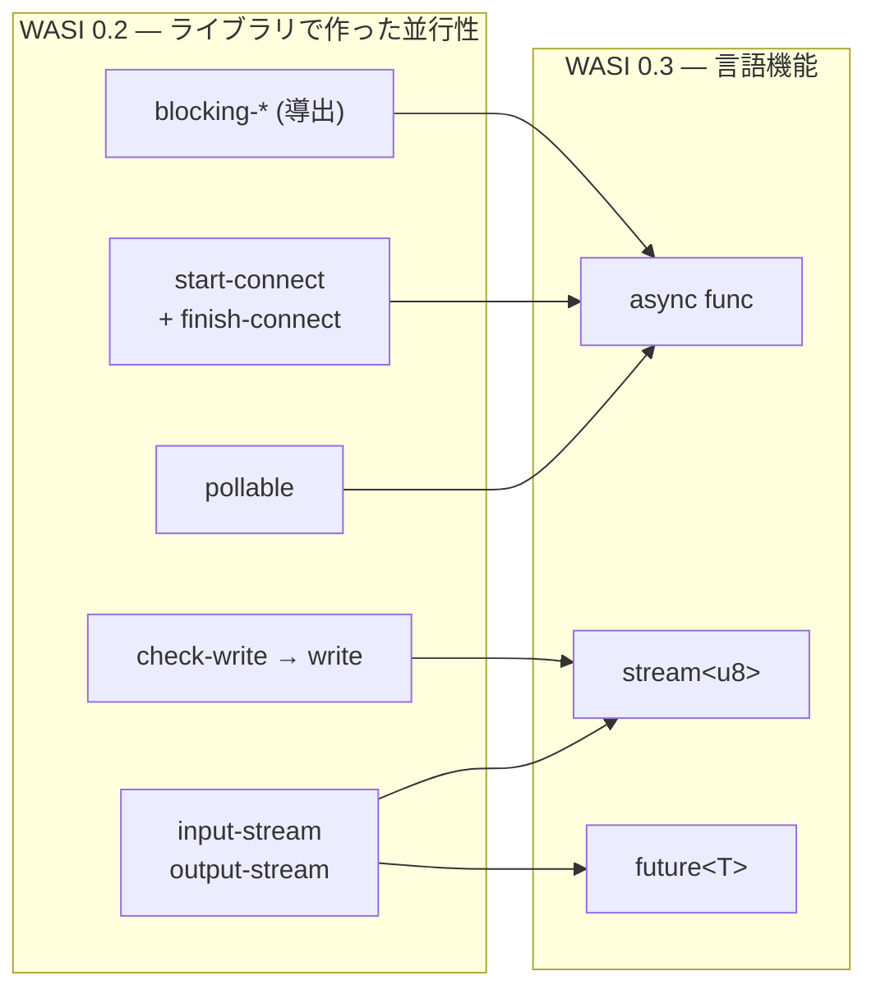

`crates/wasi/src/p3/wit/deps/` を見ると、この章で最も雄弁な事実に行き当たる。

```text
$ ls crates/wasi/src/p2/wit/deps/
cli.wit  clocks.wit  filesystem.wit  io.wit  random.wit  sockets.wit

$ ls crates/wasi/src/p3/wit/deps/
cli.wit  clocks.wit  filesystem.wit  random.wit  sockets.wit
```

**`io.wit` が無い。** [なぜ wasi:io だけが別クレートなのか](../wasi-io/) で「WASI 全体の土台」と呼んだパッケージが、0.3 の依存関係から消えている。土台が消えても他が立っているのは、その役割を **Component Model の言語機能が引き取った**からだ。

`wasi:io` の WIT 自身が、これを予告していた。

```wit title="crates/wasi-io/wit/deps/io.wit"
/// WASI I/O is an I/O abstraction API which is currently focused on providing
/// stream types.
///
/// In the future, the component model is expected to add built-in stream types;
/// when it does, they are expected to subsume this API.
interface streams {
```

[crates/wasi-io/wit/deps/io.wit](https://github.com/bytecodealliance/wasmtime/blob/d8a0da6d661605713798c1c9c76be5c28e3159ff/crates/wasi-io/wit/deps/io.wit#L79-L86)

**「component model が組み込みのストリーム型を追加したら、この API はそれに吸収される見込みである」。** その通りになった。

## 何が何に置き換わるのか



p3 の `cli.wit` を見ると、対応がそのまま読める。

```wit title="crates/wasi/src/p3/wit/deps/cli.wit"
interface run {
  /// Run the program.
  run: async func() -> result;
}
```

```wit title="crates/wasi/src/p3/wit/deps/cli.wit"
interface stdin {
  use types.{error-code};

  /// Return a stream for reading from stdin.
  ///
  /// This function returns a stream which provides data read from stdin,
  /// and a future to signal read results.
  ///
  /// If the stream's readable end is dropped the future will resolve to success.
  ///
  /// Multiple streams may be active at the same time. The behavior of concurrent
  /// reads is implementation-specific.
  read-via-stream: func() -> tuple<stream<u8>, future<result<_, error-code>>>;
}
```

[crates/wasi/src/p3/wit/deps/cli.wit](https://github.com/bytecodealliance/wasmtime/blob/d8a0da6d661605713798c1c9c76be5c28e3159ff/crates/wasi/src/p3/wit/deps/cli.wit#L44-L82)

**`run: async func`。** 0.2 の `run: func() -> result` は同期関数で、その中でゲストが自分でイベントループを回していた。`async func` は Component Model が非同期の呼び出し規約を持つようになったことを意味する。

**標準入力が `stream<u8>` を返す。** `input-stream` という resource ではなく、Component Model の組み込み型だ。付いてくる `future<result<_, error-code>>` はエラーの通知路で、[permit モデル](../permit-model/) で見た「待ち合わせにエラー経路を作らない」という分離がここでも保たれている。ストリームはデータだけを運び、結果は future が運ぶ。

0.3 の `imports` world から `wasi:io` の import が丸ごと消えていることも確認できる ([crates/wasi/src/p3/wit/deps/cli.wit#L181-L216](https://github.com/bytecodealliance/wasmtime/blob/d8a0da6d661605713798c1c9c76be5c28e3159ff/crates/wasi/src/p3/wit/deps/cli.wit#L181-L216))。0.2 の同じ world の先頭 3 行を占めていた `wasi:io/error` / `wasi:io/poll` / `wasi:io/streams` は、そこにない。

## 2 段階 API が 1 つの `async func` になる

置き換えが最も分かりやすいのがソケットだ。0.2 の TCP 接続はこうだった。

```wit title="crates/wasi/src/p2/wit/deps/sockets.wit"
start-connect: func(network: borrow<network>, remote-address: ip-socket-address) -> result<_, error-code>;
finish-connect: func() -> result<tuple<input-stream, output-stream>, error-code>;
```

[crates/wasi/src/p2/wit/deps/sockets.wit](https://github.com/bytecodealliance/wasmtime/blob/d8a0da6d661605713798c1c9c76be5c28e3159ff/crates/wasi/src/p2/wit/deps/sockets.wit#L345-L347)

**`start-connect` で開始し、`subscribe` した pollable が ready になったら `finish-connect` で結果を取る。** ブロックしない呼び出しに分解する、という 0.2 の作法そのままだ。`bind` も `listen` も同じ形をしていて、`start-bind` / `finish-bind`、`start-listen` / `finish-listen` がある。

0.3 ではこうなる。

```wit title="crates/wasi/src/p3/wit/deps/sockets.wit"
connect: async func(remote-address: ip-socket-address) -> result<_, error-code>;
```

```wit title="crates/wasi/src/p3/wit/deps/sockets.wit"
/// Start listening and return a stream of new inbound connections.
listen: func() -> result<stream<tcp-socket>, error-code>;
```

[crates/wasi/src/p3/wit/deps/sockets.wit](https://github.com/bytecodealliance/wasmtime/blob/d8a0da6d661605713798c1c9c76be5c28e3159ff/crates/wasi/src/p3/wit/deps/sockets.wit#L253)、[同 L325](https://github.com/bytecodealliance/wasmtime/blob/d8a0da6d661605713798c1c9c76be5c28e3159ff/crates/wasi/src/p3/wit/deps/sockets.wit#L325)

**`connect` が 1 つの `async func` になり、`listen` は「新しい接続のストリーム」を返す。** `accept` という関数がなくなっている。接続を受けることは、`stream<tcp-socket>` から要素を取り出すことになった。ファイルサイズも `sockets.wit` が 45KB から 40KB に縮んでいる。

`wasi:http` 側では world の分割が起きる。0.2 の `proxy` world が、0.3 では `service` と `middleware` の 2 つになった。

```wit title="crates/wasi-http/src/p3/wit/deps/http.wit"
/// The `wasi:http/middleware` world captures HTTP services that forward HTTP
/// Requests to another handler.
///
/// Components may implement this world to allow them to participate in handler
/// "chains" where a `request` flows through handlers on its way to some terminal
/// `service` and corresponding `response` flows in the opposite direction.
world middleware {
  import types;
  import handler;      // 前段として別のハンドラを呼べる
  // ...
  export handler;
}
```

[crates/wasi-http/src/p3/wit/deps/http.wit](https://github.com/bytecodealliance/wasmtime/blob/d8a0da6d661605713798c1c9c76be5c28e3159ff/crates/wasi-http/src/p3/wit/deps/http.wit#L466-L509)

**`service` は `handler` を export するだけ、`middleware` は import も export もする。** import と export のシグネチャが一致するので、component を数珠つなぎにできる。リクエストが下流へ流れ、レスポンスが逆向きに戻る。ミドルウェアという概念が、world の形だけで表現されている。これは [core module だけでは足りない理由](../why-component/) で見た合成可能性が、実際に効いてくる場面だ。

## ホスト側の非同期実装

0.3 を支えるランタイム側の仕組みは `concurrent.rs` にある。冒頭の doc が全体像を要約している。

```rust title="crates/wasmtime/src/runtime/component/concurrent.rs"
//! At the core of this support is an event loop which schedules and switches
//! between guest tasks and any host tasks they create.  Each
//! `Store` will have at most one event loop running at any given
//! time, and that loop may be suspended and resumed by the host embedder using
//! e.g. `StoreContextMut::run_concurrent`.  The `StoreContextMut::poll_until`
//! function contains the loop itself, while the
//! `StoreOpaque::concurrent_state` field holds its state.
```

[crates/wasmtime/src/runtime/component/concurrent.rs](https://github.com/bytecodealliance/wasmtime/blob/d8a0da6d661605713798c1c9c76be5c28e3159ff/crates/wasmtime/src/runtime/component/concurrent.rs#L1-L51)

**ストアごとに、同時に高々 1 本のイベントループ。** `Store` は 1 つの主体しか触れないという不変条件 ([Store が 5 つの型に割れている理由](../store-five-types/)) が、非同期になっても保たれている。ゲストのタスクもホストのタスクも、このループの中でスケジュールされる。

公開 API は doc が列挙している通りだ。`[Typed]Func::call_concurrent` でホスト→ゲストの呼び出しを開始し、`StoreContextMut::run_concurrent` でループを回し、`{Future,Stream}Reader::{new,pipe}` で Component Model の `future` / `stream` を作って繋ぎ、`LinkerInstance::func_wrap_concurrent` で並行なホスト関数を登録する。

その並行なホスト関数が受け取るのが `Accessor` という型だ。

```rust title="crates/wasmtime/src/runtime/component/concurrent.rs"
pub struct Accessor<T: 'static, D = HasSelf<T>>
where
    D: HasData + ?Sized,
{
    token: StoreToken<T>,
    get_data: fn(&mut T) -> D::Data<'_>,
}
```

[crates/wasmtime/src/runtime/component/concurrent.rs](https://github.com/bytecodealliance/wasmtime/blob/d8a0da6d661605713798c1c9c76be5c28e3159ff/crates/wasmtime/src/runtime/component/concurrent.rs#L345-L351)

doc の言い方では **「await 点の間では (しかし await をまたいでは) ストアへのアクセスを提供する」**。`&mut Store` を持ったまま `.await` すると、その間ストアが占有されて他のタスクが進めなくなる。`Accessor` はストアへの参照ではなくトークンと射影関数だけを持ち、`Accessor::with` を呼んだ瞬間だけストアを借りる。**「借用を await にまたがせない」という規律が、型として表現されている。**

`stream` と `future` のハンドルは、resource と同じ表に同居する。

```rust title="crates/wasmtime/src/runtime/vm/component/handle_table.rs"
/// Represents the state of a stream or future handle from the perspective of a
/// given component instance.
pub enum TransmitLocalState {
    /// The write end of the stream or future.
    Write {
        /// Whether the component instance has been notified that the stream or
        /// future is "done" ...
        done: bool,
    },
    /// The read end of the stream or future.
    Read { done: bool },
    /// A read or write is in progress.
    Busy,
}
```

[crates/wasmtime/src/runtime/vm/component/handle_table.rs](https://github.com/bytecodealliance/wasmtime/blob/d8a0da6d661605713798c1c9c76be5c28e3159ff/crates/wasmtime/src/runtime/vm/component/handle_table.rs#L12-L32)

読み端・書き端・進行中という 3 状態で、`done` は「相手が消えたことをこのインスタンスに通知済みか」を持つ。**`stream` と `future` は、resource と同じハンドル空間で、同じ所有権の規則で扱われる。** ゲストから見れば「渡されたハンドル」という点で `pollable` と変わらないが、その先の待ち合わせは ABI が面倒を見る。

## 0.2 は何を払っていたのか

ここまでの 8 ページで見てきたものを、失われる側から並べ直すと、0.2 の設計上のコストがはっきりする。

**pollable が「Future の工場」だったこと** ([pollable は Future ではない](../pollable/))。同じ待ち合わせ対象を何度も poll する必要があったので、1 回で消費される `Future` を持てず、`for<'a> fn(&'a mut dyn Any) -> DynFuture<'a>` という関数ポインタを持つ設計になった。`poll` は `select_all` ではなく手書きの `PollList` になり、同じ対象を指す複数の pollable を `BTreeMap` で重複排除する必要があった。「常に ready な pollable」で mio が餓死しないよう、ゼロ長 sleep が意図的に `yield_now()` する `Deadline::Past { yielded: bool }` というハックまで要った。**言語が非同期を持てば、これらは全部要らない。** ゲストの `await` はホストの `await` にそのまま繋がり、待ち合わせのスケジューリングはイベントループが行う。

**permit モデルだったこと** ([permit モデル — check-write してから write する](../permit-model/))。`write` がブロックできないので、書ける量を `check-write` で先に貰い、超過すればトラップする、という契約が必要だった。`blocking_*` はそこから導出され、`Pollable::ready()` の「早すぎる ready」に備えて `MAX_BLOCKING_ATTEMPTS = 10` という安全弁まで置かれた。**`stream<u8>` になれば、バックプレッシャは ABI の内側の話になる。** 書ける量を問い合わせる関数も、それを守らなかったときのトラップも、外に出てこない。

**2 段階 API だったこと。** `start-connect` / `finish-connect` のペアは、`connect: async func` の 1 行になる。関数の個数が減り、状態機械がゲストのコードから消える。

**待ち合わせを 1 か所に集約する必要があったこと。** `wasi:io/poll` が全 WASI の待ち合わせを引き受けていたのは、同期呼び出ししか持たない環境で複数の I/O を並行に進める唯一の方法だったからだ。それは POSIX が `select`/`poll`/`epoll` で辿った道と同じで、**同じ制約からは同じ形が出てくる**という良い例だった。

すべてのコストが **「core wasm には非同期の呼び出し規約がない」**という 1 点から来ていた。言語にないものをライブラリで作れば、こうなる。ライブラリで作られたものは、言語に入った瞬間に不要になる。

## 断り書き

0.3 はまだ進行中だ。`wasmtime-wasi` の crate doc も **「WASIp3 のサポートは実験的で、不安定で、不完全である (experimental, unstable and incomplete)」**と明記している ([crates/wasi/src/lib.rs#L13](https://github.com/bytecodealliance/wasmtime/blob/d8a0da6d661605713798c1c9c76be5c28e3159ff/crates/wasi/src/lib.rs#L13))。`p3` フィーチャは既定で有効だが、`wasmtime serve` は p3 の world を先に試して駄目なら p2 に落ちる ([wasmtime serve](../wasmtime-serve/))。リポジトリの中では 2 つの世代が並走している。

`wasi:io` が完全に消える、と断言できるのは p3 の `wit/deps/` に `io.wit` が無いという事実までで、0.2 のサポートがいつまで続くか、0.2 の component をどう扱うかは、このリポジトリの記述からは読み取れない。**確実なのは、p3 の WIT が `pollable` を一度も参照していないこと**だけだ。

## この章を振り返る

83 ページかけて、`wasmtime run hello.wasm` の内側を追ってきた。

前半で見たのは、**「知らないコードを安全に速く走らせる」という要求が、どこまで具体的な形に落ちるか**だった。線形メモリとオフセットが境界チェックになり、境界チェックが消える条件が数式になり、Spectre 緩和がアドレスの潰し込みになった。構造化制御構文が SSA 構築になり、e-graph の書き換え規則になり、ISLE の決定木になった。トラップは ucontext の書き換えになり、`VMContext` のフィールド順は即値のビット幅の都合で決まった。**どの設計判断にも、辿れる理由があった。**

後半で見たのは、**「では import として何を渡すのか」**だった。Component Model が型と所有権を持ち込み、WASI がそれを使って OS の機能をケイパビリティとして貸し出す。既定は全部閉じていて、`ambient_authority()` という名前がアンビエント権限の使用箇所を可視化し、ソケットの許可判定は async クロージャとして外部に委譲できる。Preview 1 は Preview 2 の上に載り、その変換アダプタは libc もアロケータもパニックもない wasm として書かれている。

そして最後に、その全部の土台だった `wasi:io` が、言語機能に置き換わって消えていく。

**この章を通して繰り返し出てきたのは、「制約が形を決める」という同じ話だった。** 8GiB の予約が境界チェックを消し、非同期規約の不在が permit モデルを生み、1 ページの制限が文字列リテラルを proc-macro に変え、39 ビットのアドレス空間が起動時の実測を要求した。制約が変われば形も変わる。`wasi:io` が消えるのは、その最も大きな実例になる。

コードを読んで「なぜこうなっているのか」を知りたいとき、探すべきは設計思想ではなく制約のほうだ。**Wasmtime はその制約を、コメントとコミットメッセージに書き残している。** この章で引用してきたものは、ほとんどが設計者自身の言葉だった。
