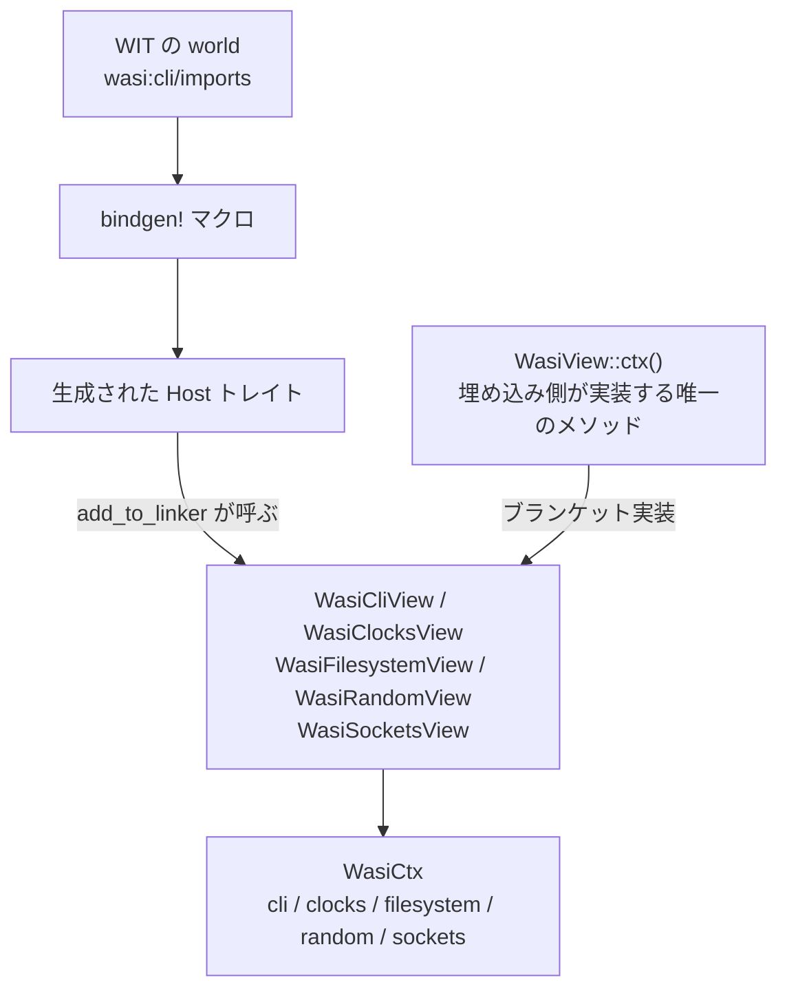

WASI 0.2 は「システムコールの一覧」ではなく、**Component Model の world** として定義されている。[WIT — インタフェースを型で書く](../wit/) で見た world という構文が、そのまま WASI の単位になっている。

そして wasmtime 側の実装は、その world をそのまま鏡写しにはしていない。**状態を持つ `WasiCtx` は「版 (p1/p2/p3)」ではなく「ドメイン (cli/clocks/filesystem/random/sockets)」で切られていて**、`p2/` と `p3/` は WIT バインディングを載せるだけの薄い層になっている。このページはその切り方を読む。

## world としての WASI

`wasi:cli` パッケージには world が 2 つある。`imports` と `command` だ。

```wit title="crates/wasi/src/p2/wit/deps/cli.wit"
world imports {
  import environment;
  import exit;
  import wasi:io/error@0.2.12;
  import wasi:io/poll@0.2.12;
  import wasi:io/streams@0.2.12;
  import stdin;
  import stdout;
  import stderr;
  import terminal-input;
  import terminal-output;
  import terminal-stdin;
  import terminal-stdout;
  import terminal-stderr;
  import wasi:clocks/monotonic-clock@0.2.12;
  import wasi:clocks/wall-clock@0.2.12;
  import wasi:clocks/timezone@0.2.12;
  import wasi:filesystem/types@0.2.12;
  import wasi:filesystem/preopens@0.2.12;
  import wasi:sockets/network@0.2.12;
  import wasi:sockets/instance-network@0.2.12;
  import wasi:sockets/udp@0.2.12;
  import wasi:sockets/udp-create-socket@0.2.12;
  import wasi:sockets/tcp@0.2.12;
  import wasi:sockets/tcp-create-socket@0.2.12;
  import wasi:sockets/ip-name-lookup@0.2.12;
  import wasi:random/random@0.2.12;
  import wasi:random/insecure@0.2.12;
  import wasi:random/insecure-seed@0.2.12;
}
```

[crates/wasi/src/p2/wit/deps/cli.wit](https://github.com/bytecodealliance/wasmtime/blob/d8a0da6d661605713798c1c9c76be5c28e3159ff/crates/wasi/src/p2/wit/deps/cli.wit#L142-L185)

**これが「WASI 0.2 が提供しているもの」の全部**だ。26 個の interface で、環境変数・終了・標準入出力・端末・時計・タイムゾーン・ファイルシステム・ソケット・名前解決・乱数、そして `wasi:io` の 3 つ。POSIX の 400 を超えるシステムコールと比べると、驚くほど少ない。

そして `command` world は、この `imports` を丸ごと繰り返した上で最後に 1 行足しただけのものになっている。

```wit title="crates/wasi/src/p2/wit/deps/cli.wit"
world command {
  // ... imports world と完全に同じ import が並ぶ ...

  @since(version = 0.2.0)
  export run;
}
```

[crates/wasi/src/p2/wit/deps/cli.wit](https://github.com/bytecodealliance/wasmtime/blob/d8a0da6d661605713798c1c9c76be5c28e3159ff/crates/wasi/src/p2/wit/deps/cli.wit#L187-L233)

**両者の差は `export run` だけ**である。この分割には意味があって、`imports` は「ホストが提供する側」の記述、`command` は「そのホストの上で走るコマンドプログラム」の記述になる。ホスト実装 (wasmtime) は `imports` を満たせばよく、`export run` を要求するかどうかは埋め込み側が決める。`wasmtime serve` のように `run` を持たない component を動かす場合は、`imports` 側だけを使う。

## `WasiCtx` は版で切られていない

WIT がこう分かれているのに対し、Rust 側の状態は**ドメインで切られている**。

```rust title="crates/wasi/src/ctx.rs"
#[derive(Default)]
pub struct WasiCtx {
    pub(crate) cli: WasiCliCtx,
    pub(crate) clocks: WasiClocksCtx,
    pub(crate) filesystem: WasiFilesystemCtx,
    pub(crate) random: WasiRandomCtx,
    pub(crate) sockets: WasiSocketsCtx,
}
```

[crates/wasi/src/ctx.rs](https://github.com/bytecodealliance/wasmtime/blob/d8a0da6d661605713798c1c9c76be5c28e3159ff/crates/wasi/src/ctx.rs#L529-L536)

ここに `p1` も `p2` も `p3` も現れない。crate のモジュール構成も同じ形をしている。

```rust title="crates/wasi/src/lib.rs"
pub mod cli;
pub mod clocks;
mod ctx;
mod error;
pub mod filesystem;
#[cfg(feature = "p1")]
pub mod p0;
#[cfg(feature = "p1")]
pub mod p1;
pub mod p2;
#[cfg(feature = "p3")]
pub mod p3;
pub mod random;
pub mod runtime;
pub mod sockets;
mod view;
```

[crates/wasi/src/lib.rs](https://github.com/bytecodealliance/wasmtime/blob/d8a0da6d661605713798c1c9c76be5c28e3159ff/crates/wasi/src/lib.rs#L33-L51)

`cli` `clocks` `filesystem` `random` `sockets` がドメインの実体で、`p1` `p2` `p3` が版ごとの WIT バインディング層だ。**ファイルサイズを見ると、この非対称がはっきりする。** `filesystem.rs` は 41KB あるが、`p3/mod.rs` は 6KB しかない。preopen の解決も、ソケットのアドレス検査も、時計の実装も、全部版に依らない側にある。版ごとの層がやるのは、生成された `Host` トレイトを実装して、その中からドメイン側の関数を呼ぶことだけだ。

この形にしておくと、**同じ `WasiCtx` に p1 と p2 の両方を同時にリンクできる**。後で見るように、Preview 1 の実装 ([Preview 1 を Preview 2 の上に再実装する](../preview1/)) はまさに同じ `WasiCtx` の上に載っている。

## 1 メソッドの trait から 5 ドメインが導出される

埋め込み側が実装しなければならない trait は 1 つ、メソッドも 1 つだけだ。

```rust title="crates/wasi/src/view.rs"
pub trait WasiView: Send {
    /// Yields mutable access to the [`WasiCtx`] configuration used for this
    /// context.
    fn ctx(&mut self) -> WasiCtxView<'_>;
}

pub struct WasiCtxView<'a> {
    /// The [`WasiCtx`], or configuration, of the guest.
    pub ctx: &'a mut WasiCtx,
    /// Resources, such as files/streams, that the guest is using.
    pub table: &'a mut ResourceTable,
}
```

[crates/wasi/src/view.rs](https://github.com/bytecodealliance/wasmtime/blob/d8a0da6d661605713798c1c9c76be5c28e3159ff/crates/wasi/src/view.rs#L36-L49)

ホスト関数の実装が必要とするのは `WasiCtx` (設定) と `ResourceTable` (ゲストが握っているハンドルの表、[resource — ハンドルで所有権を渡す](../resources/)) の 2 つで、`WasiCtxView` はその組でしかない。

そしてドメインごとのビュー trait は、**すべてブランケット実装で自動導出される**。

```rust title="crates/wasi/src/view.rs"
impl<T: WasiView> crate::cli::WasiCliView for T {
    fn cli(&mut self) -> crate::cli::WasiCliCtxView<'_> {
        let WasiCtxView { ctx, table } = self.ctx();
        crate::cli::WasiCliCtxView {
            ctx: &mut ctx.cli,
            table,
        }
    }
}

impl<T: WasiView> crate::clocks::WasiClocksView for T {
    fn clocks(&mut self) -> crate::clocks::WasiClocksCtxView<'_> {
        let WasiCtxView { ctx, table } = self.ctx();
        crate::clocks::WasiClocksCtxView {
            ctx: &mut ctx.clocks,
            table,
        }
    }
}
// filesystem / random / sockets も同型
```

[crates/wasi/src/view.rs](https://github.com/bytecodealliance/wasmtime/blob/d8a0da6d661605713798c1c9c76be5c28e3159ff/crates/wasi/src/view.rs#L51-L95)

**1 メソッドを書けば 5 ドメイン分のアクセス経路が生える。** これが効くのは、ドメイン別 trait のほうが本来の粒度だからだ。`wasi-tls` のように「ソケットだけ欲しい」実装は `WasiSocketsView` だけを要求でき、埋め込み側は全部入りの `WasiView` を 1 回実装すればそれが満たされる。細かい trait を並べる設計の使いにくさ (実装が 5 つ必要になる) を、ブランケット実装で消している。



## sync と async で bindgen が 2 回走る

`add_to_linker_sync` と `add_to_linker_async` は 2 つの別関数だが、中身の大半は共有されている。

```rust title="crates/wasi/src/p2/mod.rs"
pub fn add_to_linker_with_options_async<T: WasiView>(
    linker: &mut Linker<T>,
    options: &bindings::LinkOptions,
) -> wasmtime::Result<()> {
    add_async_io_to_linker(linker)?;
    add_nonblocking_to_linker(linker, options)?;

    let l = linker;
    bindings::filesystem::types::add_to_linker::<T, WasiFilesystem>(l, T::filesystem)?;
    bindings::sockets::tcp::add_to_linker::<T, WasiSockets>(l, T::sockets)?;
    bindings::sockets::udp::add_to_linker::<T, WasiSockets>(l, T::sockets)?;
    bindings::sockets::udp_create_socket::add_to_linker::<T, WasiSockets>(l, T::sockets)?;
    Ok(())
}
```

[crates/wasi/src/p2/mod.rs](https://github.com/bytecodealliance/wasmtime/blob/d8a0da6d661605713798c1c9c76be5c28e3159ff/crates/wasi/src/p2/mod.rs#L320-L332)

sync 版は同じ構造で、`bindings::` の代わりに `bindings::sync::` を使う ([crates/wasi/src/p2/mod.rs#L460-L474](https://github.com/bytecodealliance/wasmtime/blob/d8a0da6d661605713798c1c9c76be5c28e3159ff/crates/wasi/src/p2/mod.rs#L460-L474))。共通部分の `add_nonblocking_to_linker` には 19 個の interface が並んでいて、**sync/async で差し替わるのは 6 interface だけ**だ。`io/poll`、`io/streams`、`filesystem/types`、`sockets/tcp`、`sockets/udp`、`sockets/udp-create-socket`。理由は単純で、**この 6 つだけがブロックしうる関数を含んでいる**。時計も乱数も環境変数も端末も、ホスト側で待つ必要がないので、非同期にする意味がない。

その 6 つのために、`bindgen!` マクロが 2 回走る。async 側の呼び出しには「どの関数を `async` にするか」の明示的な列挙がある。

```rust title="crates/wasi/src/p2/bindings.rs"
imports: {
    // Only these functions are `async` and everything else is sync
    // meaning that it basically doesn't need to block. These functions
    // are the only ones that need to block.
    //
    // Note that at this time `only_imports` works on function names
    // which in theory can be shared across interfaces, so this may
    // need fancier syntax in the future.
    "wasi:filesystem/types.[method]descriptor.advise": async | tracing | trappable,
    // ... 27 個続く ...
    default: tracing | trappable,
},
```

[crates/wasi/src/p2/bindings.rs](https://github.com/bytecodealliance/wasmtime/blob/d8a0da6d661605713798c1c9c76be5c28e3159ff/crates/wasi/src/p2/bindings.rs#L331-L376)

**「全部 async」ではなく「必要なものだけ async」という選択**だ。async にすると `Future` を返す trait メソッドになり、呼び出しごとに状態機械が挟まる。時計を読むだけの関数にそれを払う理由がない。

sync 側の `bindgen!` は逆に `with:` で「同期メソッドしか持たない interface」を async 版のモジュールへ丸ごとエイリアスしている ([crates/wasi/src/p2/bindings.rs#L148-L186](https://github.com/bytecodealliance/wasmtime/blob/d8a0da6d661605713798c1c9c76be5c28e3159ff/crates/wasi/src/p2/bindings.rs#L148-L186))。リソース型もすべて async 側と同じ型を指すよう指定されているので、**`Descriptor` や `TcpSocket` は sync/async で同一の型**になる。生成されるのはトレイトと `add_to_linker` だけで、状態の型は 1 つしかない。

## `wasi-common` は消えた

古い記事を読むときの注意点がひとつある。かつて `crates/wasi-common` という crate があり、Preview 1 の実装本体はそこにあった。これは**削除済み**だ。

```text title="git log b4b23fe583"
Remove wasi-threads and wasi-common

For more context and rationale, see
https://github.com/bytecodealliance/rfcs/pull/47. With `main` now as the
Wasmtime 47.0.0 branch this commit deletes this support from `main`.
Note that Wasmtime 46.0.0 will be the last version with support, and
Wasmtime 36.0.0, which has support, will continue to be supported by the
project for another year.
```

同じコミットで `wasi-threads` も消えている。**`WasiCtx` と `wasi_common::WasiCtx` が別物として並立していた時代は終わっていて、いま `WasiCtx` と言えば `wasmtime_wasi::WasiCtx` ひとつだけ**である。Preview 1 が欲しい場合の入口も `wasmtime_wasi::p1` に一本化された。

## `wasi:cli` の外側

`wasmtime-wasi` crate が持つのは `wasi:cli` world の範囲だけで、それ以外の WASI 提案は別 crate になっている。

- **`wasmtime-wasi-io`** — `pollable` / `input-stream` / `output-stream` の trait だけを置く `no_std` crate。他の全部が依存する土台で、なぜ分かれているかは [なぜ wasi:io だけが別クレートなのか](../wasi-io/) で見る。
- **`wasmtime-wasi-http`** — `wasi:http`。ホスト側は hyper を使って実際にリクエストを送受信し、`wasmtime serve` の実体でもある ([wasmtime serve — epoch で止めず、yield で逃がす](../wasmtime-serve/))。
- **`wasmtime-wasi-nn`** — `wasi:nn`。推論バックエンド (OpenVINO など) を `Backend` トレイトの裏に隠し、名前でモデルを引く `GraphRegistry` を持つ。WIT 版と witx 版の両方の入口がある。
- **`wasmtime-wasi-config`** — `wasi:config`。`HashMap<String, String>` を設定変数としてゲストに見せるだけの、極小の実装。
- **`wasmtime-wasi-keyvalue`** — `wasi:keyvalue`。現状のバックエンドはインメモリのみ。
- **`wasmtime-wasi-tls`** — `wasi:tls`。TLS はストリームを別のところから貰う前提なので、doc も「`wasi:cli` world をネットワーク機能つきで有効にするのが一般的だろう」と書いている。

いずれも `WasiCtxBuilder` とは独立した専用のコンテキスト型と `add_to_linker` を持ち、埋め込み側が「渡したいものだけ」リンカに足す形になる。**必要な world を必要なだけ組み立てるという Component Model の設計が、crate の分け方にそのまま出ている。**

## どう活かすか

`WasiView` の形は、「粗い trait 1 つ」と「細かい trait を並べる」のどちらを取るかという、よくある設計の分かれ道に対する答えになっている。**実装者には粗い trait を、利用者には細かい trait を見せて、間をブランケット実装で繋ぐ。** 利用者側 (`wasi-tls` のようなプラグイン crate) は必要な範囲だけを型で要求でき、実装者側 (埋め込みアプリ) はメソッド 1 つ書けば済む。

そして「版で切らずドメインで切る」ほうも持ち帰りになる。API の版はいずれ増え、いずれ消える。状態を版で切ると、版が増えるたびに状態が二重化し、版を消すときに全部を追う羽目になる。**変わるもの (インタフェースの版) と変わらないもの (何を貸すか) の境目にモジュールの線を引く**と、`p3` を足すのが「薄い層を 1 枚足す」だけで済む。
