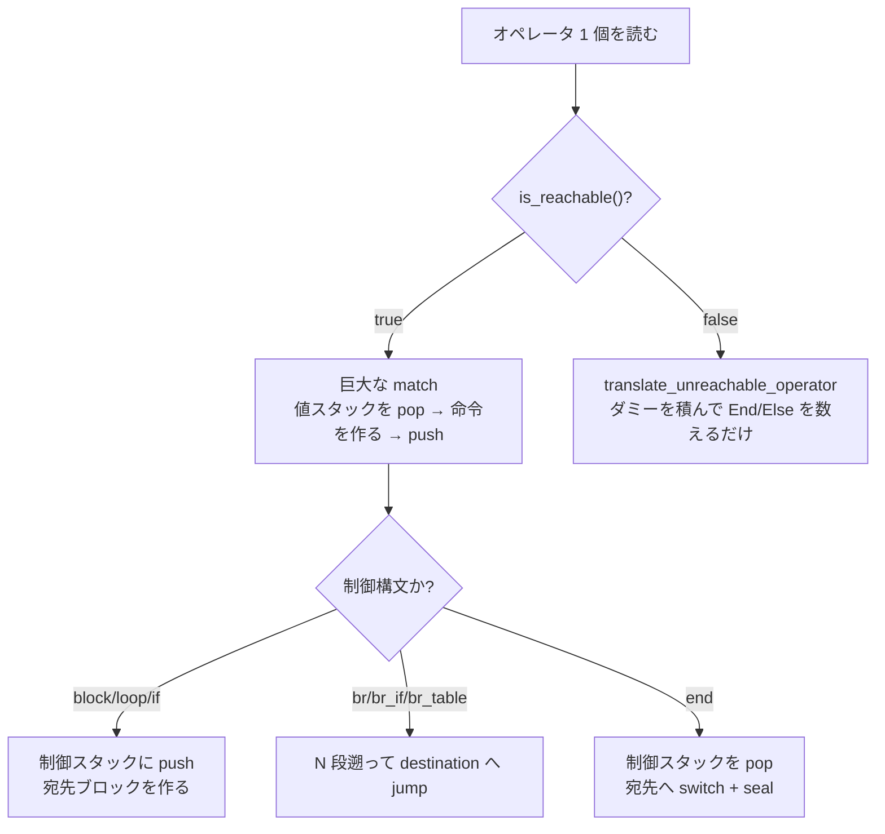

Wasm の関数本体は、バイト列を先頭から 1 回舐めるだけで Cranelift IR (CLIF) になる。AST も作らないし、「まず CFG を作ってから SSA に変換する」という段も踏まない。翻訳器が持っている状態は、**値スタックと制御スタックという 2 本の `Vec` だけ**である。

設計者自身がモジュールコメントの冒頭にそう書いている。

```rust title="crates/cranelift/src/translate/code_translator.rs"
//! This module contains the bulk of the interesting code performing the translation between
//! WebAssembly and Cranelift IR.
//!
//! The translation is done in one pass, opcode by opcode. Two main data structures are used during
//! code translations: the value stack and the control stack. The value stack mimics the execution
//! of the WebAssembly stack machine: each instruction result is pushed onto the stack and
//! instruction arguments are popped off the stack. Similarly, when encountering a control flow
//! block, it is pushed onto the control stack and popped off when encountering the corresponding
//! `End`.
//!
//! Another data structure, the translation state, records information concerning unreachable code
//! status and about if inserting a return at the end of the function is necessary.
```

[crates/cranelift/src/translate/code_translator.rs](https://github.com/bytecodealliance/wasmtime/blob/d8a0da6d661605713798c1c9c76be5c28e3159ff/crates/cranelift/src/translate/code_translator.rs#L1-L12)

値スタックは Wasm のスタックマシンの実行をそのまま真似る。ただし積まれているのは値そのものではなく **CLIF の `Value`(SSA 値の番号)** だ。つまり、翻訳とは「Wasm のスタック操作を、SSA 値の番号のスタック操作として実行する」ことに等しい。`i32.add` は値スタックから 2 つ `Value` を pop し、`iadd` 命令を作り、その結果の `Value` を push する。これだけで、スタックマシンから SSA への変換が終わっている。

## 翻訳の骨格

`FuncTranslator::translate_body` が関数 1 本の翻訳の入口で、やっていることは驚くほど短い。

```rust title="crates/cranelift/src/translate/func_translator.rs"
let mut builder = FunctionBuilder::new(func, &mut self.func_ctx);
let entry_block = builder.create_block();
builder.append_block_params_for_function_params(entry_block);
builder.switch_to_block(entry_block);
builder.seal_block(entry_block); // Declare all predecessors known.

// ...

let num_params = declare_wasm_parameters(&mut builder, entry_block, environ);

// Set up the translation state with a single pushed control block representing the whole
// function and its return values.
let exit_block = builder.create_block();
environ.stacks.initialize(&builder.func.signature, exit_block);

parse_local_decls(&mut reader, &mut builder, num_params, environ, validator)?;
// ...
parse_function_body(validator, reader, &mut builder, environ)?;

builder.finalize(environ.target_config());
```

[crates/cranelift/src/translate/func_translator.rs](https://github.com/bytecodealliance/wasmtime/blob/d8a0da6d661605713798c1c9c76be5c28e3159ff/crates/cranelift/src/translate/func_translator.rs#L53-L120)

エントリブロックを作り、関数引数を `Variable` に写し取り、**関数全体を表す制御フレームを 1 つだけ積み**、ローカル宣言を読み、あとは `parse_function_body` がオペレータを 1 つずつ読んで `translate_operator` に流すだけだ。「関数全体も 1 つの Wasm ブロックである」という仕様の性質を、制御スタックの底に置いた 1 フレームでそのまま表現している。だから最後の `End` は特別扱いを必要とせず、他の `End` と同じ経路を通る。

`parse_function_body` のループはこれだけである。

```rust title="crates/cranelift/src/translate/func_translator.rs"
while !reader.eof() {
    let pos = reader.original_position();
    builder.set_srcloc(cur_srcloc(&reader.get_binary_reader()));

    let op = reader.read()?;
    environ.next_srcloc = cur_srcloc(&reader.get_binary_reader());
    let operand_types =
        validate_op_and_get_operand_types(validator, environ, &mut operand_types, &op, pos)?;

    translate_operator(validator, &op, operand_types, builder, environ)?;
}
```

[crates/cranelift/src/translate/func_translator.rs](https://github.com/bytecodealliance/wasmtime/blob/d8a0da6d661605713798c1c9c76be5c28e3159ff/crates/cranelift/src/translate/func_translator.rs#L285-L305)

(`environ.before_translate_operator` / `after_translate_operator` のフックは省いた。) 検証と翻訳が同じループの中で交互に走っていることに注意したい ([パースと検証をインターリーブし、関数本体だけ遅延する](../interleaved-validation/))。翻訳器は「検証済みのオペレータしか来ない」ことを前提にして書かれていて、値スタックの深さや型の整合性を自分では確かめない。`debug_assert!` はあるが、リリースビルドでは消える。

## 2 本のスタックが持っているもの

状態はすべて `FuncTranslationStacks` に集まっている。

```rust title="crates/cranelift/src/translate/stack.rs"
/// Keeps track of Wasm's operand and control stacks, as well as reachability
/// for each control frame.
pub struct FuncTranslationStacks {
    /// A stack of values corresponding to the active values in the input wasm function at this
    /// point.
    pub(crate) stack: Vec<Value>,
    // ...
    /// A stack of active control flow operations at this point in the input wasm function.
    pub(crate) control_stack: Vec<ControlStackFrame>,
    // ...
    pub(crate) block_param_vars: SecondaryMap<Block, SmallVec<[Variable; 6]>>,
    pub(crate) handlers: HandlerState,
    /// Is the current translation state still reachable? This is false when translating operators
    /// like End, Return, or Unreachable.
    pub(crate) reachable: bool,
}
```

[crates/cranelift/src/translate/stack.rs](https://github.com/bytecodealliance/wasmtime/blob/d8a0da6d661605713798c1c9c76be5c28e3159ff/crates/cranelift/src/translate/stack.rs#L257-L296)

制御フレームは 3 種類しかない。

```rust title="crates/cranelift/src/translate/stack.rs"
pub enum ControlStackFrame {
    If {
        destination: Block,
        else_data: ElseData,
        num_param_values: usize,
        num_return_values: usize,
        original_stack_size: usize,
        exit_is_branched_to: bool,
        blocktype: wasmparser::BlockType,
        else_is_cold: bool,
        head_is_reachable: bool,
        consequent_ends_reachable: Option<bool>,
    },
    Block {
        destination: Block,
        // ... num_param_values / num_return_values / original_stack_size
        exit_is_branched_to: bool,
        try_table_info: Option<(HandlerStateCheckpoint, Vec<Block>)>,
    },
    Loop {
        destination: Block,
        header: Block,
        // ...
    },
}
```

[crates/cranelift/src/translate/stack.rs](https://github.com/bytecodealliance/wasmtime/blob/d8a0da6d661605713798c1c9c76be5c28e3159ff/crates/cranelift/src/translate/stack.rs#L44-L95)

どのフレームも `original_stack_size` を覚えている。**Wasm の `br N` が「制御スタックを N 段遡る」で表現できるのは、各フレームが自分に入ったときの値スタックの高さを覚えているからだ**。`End` で値スタックをその高さまで truncate すれば、ブロックの内側で余ったオペランドは自動的に捨てられる。`br` の宛先は `Block` なら `destination`、`Loop` なら `header` になる — これが「`br` はブロックからは抜けるが、ループには戻る」という Wasm のセマンティクスの実装のすべてである。

`Loop` だけが `header` を余分に持っているのも同じ理由だ。ループは入口と出口が別のブロックになるが、`block` と `if` は出口しか要らない。

## 4 命令を追う

`(block (result i32) i32.const 1 br 0 end)` に相当する列を追うと、2 本のスタックの動きはこうなる。

| オペレータ           | 値スタック | 制御スタック                        | CLIF 側で起きること                                               |
| -------------------- | ---------- | ----------------------------------- | ----------------------------------------------------------------- |
| (関数入口)           | `[]`       | `[Block{exit}]`                     | `block0` を作り seal                                              |
| `block (result i32)` | `[]`       | `[Block{exit}, Block{b1}]`          | 結果 1 個ぶんの `Variable` を持つ `block1` を作る                 |
| `i32.const 1`        | `[v1]`     | 同上                                | `v1 = iconst.i32 1`                                               |
| `br 0`               | `[]`       | 同上 (`exit_is_branched_to = true`) | `def_var(var_b1, v1)` してから `jump block1`、`reachable = false` |
| `end`                | `[v2]`     | `[Block{exit}]`                     | `block1` に切り替えて seal、`v2 = use_var(var_b1)` を push        |

分岐に値が乗るとき、CLIF のジャンプ命令には引数を付けない。`def_var` で `Variable` に書いてから引数なしの `jump` を出す。この判断が次のページの主題になる ([Wasm のブロック引数を、CLIF のブロック引数にしない](../block-params-not-phi/))。



## `local.get` は CLIF に何も残さない

Wasm のローカル変数は、CLIF の命令には一切現れない。`translate_operator` の該当箇所にコメントで明記されている。

```rust title="crates/cranelift/src/translate/code_translator.rs"
/********************************** Locals ****************************************
 *  `get_local` and `set_local` are treated as non-SSA variables and will completely
 *  disappear in the Cranelift Code
 ***********************************************************************************/
Operator::LocalGet { local_index } => {
    let val = builder.use_var(Variable::from_u32(*local_index));
    environ.stacks.push1(val);
    let label = ValueLabel::from_u32(*local_index);
    builder.set_val_label(val, label);
}
```

[crates/cranelift/src/translate/code_translator.rs](https://github.com/bytecodealliance/wasmtime/blob/d8a0da6d661605713798c1c9c76be5c28e3159ff/crates/cranelift/src/translate/code_translator.rs#L142-L153)

`local.get` は `use_var` 1 回、`local.set` は `def_var` 1 回に落ちる。ローカル用のスタックスロットを確保して load/store を出す、という素朴な実装をしていない。**「Wasm のローカルは可変変数である」という事実を、`cranelift-frontend` の `Variable` にそのまま投げてしまい、SSA への変換は向こうにやらせる**。翻訳器が phi の挿入位置を考える場面は最後まで出てこない ([SSA をその場で構築する](../ssa-construction/))。

## 到達不能コードは、翻訳しないで数える

`br` や `return` や `unreachable` の直後から、対応する `End` までのコードは実行されないが、**Wasm の検証はそこも型検査する**ので、バイト列としては読み飛ばせない。ここで Wasmtime が取っている手は徹底している。`translate_operator` の最初の 4 行がそれだ。

```rust title="crates/cranelift/src/translate/code_translator.rs"
if !environ.is_reachable() {
    translate_unreachable_operator(&op, builder, environ)?;
    return Ok(());
}
```

[crates/cranelift/src/translate/code_translator.rs](https://github.com/bytecodealliance/wasmtime/blob/d8a0da6d661605713798c1c9c76be5c28e3159ff/crates/cranelift/src/translate/code_translator.rs#L121-L133)

到達不能側の処理は、CLIF を 1 命令も作らない。`block` / `loop` / `if` が来たら、宛先ブロックの代わりに**予約値のダミー**を積むだけである。

```rust title="crates/cranelift/src/translate/code_translator.rs"
Operator::Loop { blockty: _ }
| Operator::Block { blockty: _ }
| Operator::TryTable { try_table: _ } => {
    environ.stacks.push_block(ir::Block::reserved_value(), 0, 0);
}
```

[crates/cranelift/src/translate/code_translator.rs](https://github.com/bytecodealliance/wasmtime/blob/d8a0da6d661605713798c1c9c76be5c28e3159ff/crates/cranelift/src/translate/code_translator.rs#L3469-L3474)

パラメータ数も結果数も `0` を渡していて、値スタックには何も積まない。到達不能側では値スタックが意味を持たないからだ。**制御スタックはネストの深さを数えるカウンタとしてだけ使われる**。

到達可能性が戻るのは 2 か所しかない。`Else` に来て `if` の頭が到達可能だった場合と、`End` に来て「そのフレームの出口へ実際に `br` された (`exit_is_branched_to`)」か `if` の consequent が到達可能に終わっていた場合だ。この判定が `translate_unreachable_operator` の `End` 節に丁寧に書き下されていて、`Loop` には「ループの末尾へは分岐できない」から常に `false` になる、という注記まで付いている。

ダミーで済むのは、到達不能な `if` の内側から外へ分岐する `br` もまた到達不能で、CLIF 側のブロックを一切参照しないからである。`Block::reserved_value()` が実際に使われることは起きない。

## `if` の `else` ブロックは、必要になるまで作らない

`if` の翻訳には遅延がひとつ仕込まれている。`else` が現れるかどうかは、`else` に出会うまで分からない。ここで先に `else` 用のブロックを作ってしまうと、`else` がない `if` では空ブロックがゴミとして残る。

```rust title="crates/cranelift/src/translate/stack.rs"
pub enum ElseData {
    /// The `if` does not already have an `else` block.
    ///
    /// This doesn't mean that it will never have an `else`, just that we
    /// haven't seen it yet.
    NoElse {
        /// If we discover that we need an `else` block, this is the jump
        /// instruction that needs to be fixed up to point to the new `else`
        /// block rather than the destination block after the `if...end`.
        branch_inst: Inst,
        /// The placeholder block we're replacing.
        placeholder: Block,
    },
    /// We have already allocated an `else` block.
    ///
    /// ... sometimes we can tell based on the block's type
    /// signature that the signature is not valid if there isn't an `else`. In
    /// these cases, we pre-allocate the `else` block.
    WithElse { else_block: Block },
}
```

[crates/cranelift/src/translate/stack.rs](https://github.com/bytecodealliance/wasmtime/blob/d8a0da6d661605713798c1c9c76be5c28e3159ff/crates/cranelift/src/translate/stack.rs#L14-L41)

`If` の翻訳 ([code_translator.rs#L290-L367](https://github.com/bytecodealliance/wasmtime/blob/d8a0da6d661605713798c1c9c76be5c28e3159ff/crates/cranelift/src/translate/code_translator.rs#L290-L367)) は、まず `params == results` かどうかを見る。等しければ `else` は省略可能なので、条件が偽のときの飛び先を **`if...end` の後ろのブロック (`destination`) にしておく**。後で `else` が現れたら `builder.change_jump_destination(branch_inst, placeholder, else_block)` で分岐先を差し替える。等しくなければ「`else` なしでは型が合わない」ことが確定するので、その場で `else` ブロックを作る (`ElseData::WithElse`)。

`if` の引数を値スタックに **2 回積んでおく**という小細工もある。`Else` の節にコメントがあり、「`else` のパラメータを `ControlStackFrame` に別の `Vec` として保存せずに済ませるため」だと書かれている。1 パスの翻訳器で、関数ごとにヒープ確保を増やさないことにかなり気を遣っている。

## `br_table` だけがクリティカルエッジを切る

Wasm の `br_table` は、他の分岐と同じくブロック引数を渡せる。CLIF の `br_table` は渡せない。この食い違いの吸収が、翻訳器の中で唯一「ブロックを余分に作る」箇所になっている。

```rust title="crates/cranelift/src/translate/code_translator.rs"
 * The `br_table` case is much more complicated because Cranelift's `br_table` instruction
 * does not support jump arguments like all the other branch instructions. That is why, in
 * the case where we would use jump arguments for every other branch instruction, we
 * need to split the critical edges leaving the `br_tables` by creating one `Block` per
 * table destination; the `br_table` will point to these newly created `Blocks` and these
 * `Block`s contain only a jump instruction pointing to the final destination, this time with
 * jump arguments.
 *
 * This system is also implemented in Cranelift's SSA construction algorithm, because
 * `use_var` located in a destination `Block` of a `br_table` might trigger the addition
 * of jump arguments in each predecessor branch instruction, one of which might be a
 * `br_table`.
```

[crates/cranelift/src/translate/code_translator.rs](https://github.com/bytecodealliance/wasmtime/blob/d8a0da6d661605713798c1c9c76be5c28e3159ff/crates/cranelift/src/translate/code_translator.rs#L487-L509)

実装は素直に 2 分岐している。`br_table` の全宛先のうち**最も浅い深さのフレーム**を見て、そのフレームが受け取る値の個数が 0 なら、ジャンプテーブルは宛先ブロックを直接指す。0 でなければ、宛先の深さごとに 1 つ中継ブロックを作り (同じ深さは `HashMap` で共有する)、`br_table` はそちらを指し、中継ブロックが引数付きの `jump` を出す。

最も浅いフレームだけを見て判断してよいのは、Wasm の検証がすでに「すべての宛先が同じ数・同じ型の値を受け取る」ことを保証しているからだ。ここでも翻訳器は検証結果に乗っかっている。

そして引用したコメントの後半が重要だ。**同じクリティカルエッジ分割が SSA 構築側にも実装されている**。翻訳器が「引数がないから直接指してよい」と判断したエッジでも、後から `use_var` がブロックパラメータを要求すれば、`br_table` に引数を足す必要が生じる。そのときエッジを切るのは `cranelift-frontend` の側になる。

## どう活かすか

この翻訳器から持ち帰れるのは、**入力の構造がすでに決まっているなら、それを写す形の状態を持てば中間表現は要らない**という点だ。Wasm はスタックマシンで、制御構文は入れ子になっている。だから状態も「値のスタック」と「制御のスタック」の 2 本で足り、パーサから IR まで一直線に繋がる。

もうひとつは、**難しい判断を下流に押し付ける割り切り**である。ローカル変数もブロック引数も、SSA にする仕事は自分でやらず `Variable` に投げる。到達不能コードは翻訳せずに数える。型検査は検証器に任せて自分では確かめない。翻訳器の責務が「Wasm のセマンティクスを CLIF の語彙に写すこと」だけに絞られているから、4600 行ある巨大な `match` が読める形に保たれている。
