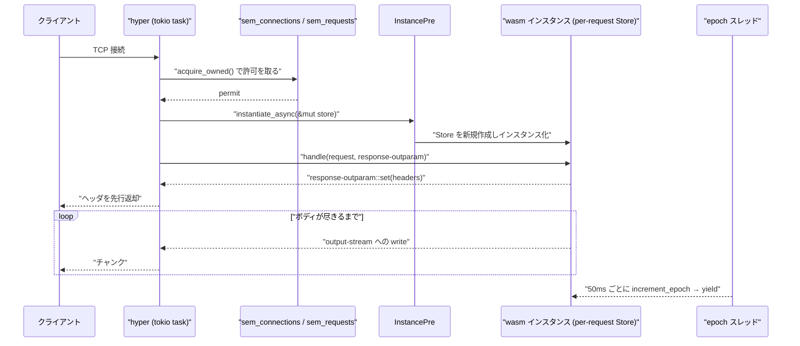

`wasmtime serve app.wasm` は、`wasi:http/proxy` world の component を HTTP サーバとして動かす。hyper がソケットを受け、リクエストごとに wasm のインスタンスを作り、レスポンスをストリームのまま返す。**サーバの骨格を [wasi:io](../wasi-io/) の抽象の上に組み立てるとどうなるか**の実例になっている。



## p3 を試して、駄目なら p2

起動時に `InstancePre` (インスタンス化の直前まで解決を済ませた状態、[Linker と、インスタンス化の「後戻りできない点」](../linker-and-instantiation/)) を作り、そこから 2 世代のバインディングを試す。

```rust title="src/commands/serve.rs"
let instance = match wasmtime_wasi_http::p3::bindings::ServicePre::new(instance.clone()) {
    Ok(pre) => ProxyPre::P3(pre),
    Err(_) => ProxyPre::P2(wasmtime_wasi_http::p2::bindings::ProxyPre::new(instance)?),
};
```

[src/commands/serve.rs](https://github.com/bytecodealliance/wasmtime/blob/d8a0da6d661605713798c1c9c76be5c28e3159ff/src/commands/serve.rs#L585-L592)

**WASI 0.3 の `wasi:http/service` を先に試し、export が合わなければ 0.2 の `wasi:http/proxy` に落ちる。** component の export はビルド時に確定しているので、この判定は 1 回だけで済む。バージョンネゴシエーションをプロトコルではなく型の一致で行っている形だ。

## リクエストごとに `Store` を作る

`wasmtime serve` の中心的な設計判断がこれだ。

```rust title="src/commands/serve.rs"
async fn instantiate(
    &self,
) -> Result<Instance<Self::StoreData, Self::WorkerExpiration, Self::WorkerState>> {
    let instance_id = self.next_instance_id.fetch_add(1, Ordering::Relaxed);
    let mut store = self
        .cmd
        .new_store(self.component.engine(), Some(instance_id))?;
    let proxy = self.instantiate_into(&mut store).await?;
    // ...
}
```

[src/commands/serve.rs](https://github.com/bytecodealliance/wasmtime/blob/d8a0da6d661605713798c1c9c76be5c28e3159ff/src/commands/serve.rs#L875-L901)

**`Store` が新しく作られるので、線形メモリもリソース表も `WasiCtx` も、リクエストごとに新品になる。** 前のリクエストが書いたグローバル変数は残らないし、開いたままのハンドルも残らない。ゲスト側にどんなバグがあっても、リクエスト間で状態が漏れない。「隔離の単位をリクエストにする」という判断で、これは `Store` が [5 つの型に割れている](../store-five-types/) 設計と、[copy-on-write でインスタンス化を速くする](../cow-instantiation/) 仕組みがあって初めて現実的になる。

とはいえ完全に毎回作り直すわけではなく、再利用の上限が世代で違う。

```rust title="src/commands/serve.rs"
const DEFAULT_WASIP3_MAX_INSTANCE_REUSE_COUNT: usize = 128;
const DEFAULT_WASIP2_MAX_INSTANCE_REUSE_COUNT: usize = 1;
const DEFAULT_WASIP3_MAX_INSTANCE_CONCURRENT_REUSE_COUNT: usize = 16;
```

[src/commands/serve.rs](https://github.com/bytecodealliance/wasmtime/blob/d8a0da6d661605713798c1c9c76be5c28e3159ff/src/commands/serve.rs#L47-L49)

**p2 は 1 (=毎回作り直す)、p3 は 128。** さらに p3 は 1 インスタンスで 16 リクエストを同時に扱える。0.2 の `incoming-handler` は同期的な形なので、1 インスタンスで同時に 2 つのリクエストを扱えない。0.3 の `service` は非同期の world なので、1 つのインスタンスの中で複数のリクエストが並行して進める ([WASI 0.3 で wasi:io が消える](../wasi-03/))。**API の非同期化が、そのまま「インスタンスあたりのスループット」の話になっている。**

同時実行数の制御はセマフォで、接続とリクエストの 2 段になっている。既定はどちらも 1000。接続の許可は `acquire_owned()` で取ってから `accept()` するので、**上限に達している間はカーネルの accept キューに溜まる**。アプリ側でキューを持たない。

## epoch は「止める」ではなく「譲る」

タイムアウトやプロファイリングが有効なとき、専用スレッドが一定間隔で epoch を進める。

```rust title="src/commands/serve.rs"
/// When executing with a timeout enabled, this is how frequently epoch
/// interrupts will be executed to check for timeouts.
const EPOCH_INTERRUPT_PERIOD: Duration = Duration::from_millis(50);

impl EpochThread {
    fn spawn(interval: std::time::Duration, engine: Engine) -> Self {
        let shutdown = Arc::new(AtomicBool::new(false));
        let handle = {
            let shutdown = Arc::clone(&shutdown);
            Some(std::thread::spawn(move || {
                while !shutdown.load(Ordering::Relaxed) {
                    std::thread::sleep(interval);
                    engine.increment_epoch();
                }
            }))
        };
        EpochThread { shutdown, handle }
    }
}
```

[src/commands/serve.rs](https://github.com/bytecodealliance/wasmtime/blob/d8a0da6d661605713798c1c9c76be5c28e3159ff/src/commands/serve.rs#L953-L978)

50ms ごとにカウンタを 1 進めるだけのスレッドが 1 本。**この 1 本で、プロセス内の全インスタンスの割り込みが賄える** ([エポック割り込み](../epoch/))。

そして肝心なのは、その割り込みで何をするかだ。

```rust title="src/commands/serve.rs"
// Profiling disabled but there's a global request timeout
if cmd.run.common.wasm.timeout.is_some() || cmd.run.common.debug.debugger.is_some() {
    store.epoch_deadline_async_yield_and_update(1);
    store.set_epoch_deadline(1);
}
```

[src/commands/serve.rs](https://github.com/bytecodealliance/wasmtime/blob/d8a0da6d661605713798c1c9c76be5c28e3159ff/src/commands/serve.rs#L1005-L1012)

**`epoch_deadline_async_yield_and_update` は、デッドラインを超えたときにトラップさせず、非同期に yield して実行を継続する。** タイムアウトが設定されているのに、epoch はタイムアウトの判定に使われていない。実際の期限判定は上の層 (`HostWorkerExpiration` が持つ `request_timeout` と `tokio::time::sleep`) が行う。

なぜ分けるのか。epoch はゲストのコードに埋め込まれた**カウンタ比較**で、ループの先頭と関数の入口でしか発火しない。これは「wasm が実行中であることを検出する」には十分だが、「何秒経ったか」を測るものではない。一方、`.await` に戻りさえすれば、tokio のタイマとレースさせて期限判定ができる。**epoch は「制御を返させる仕掛け」として使い、判定は時間を正しく測れる層に任せる。**

この使い分けが効くのは、**ゲストが無限ループに入っても、それがサーバ全体を止めない**からだ。epoch がなければ、計算ループに入った wasm は tokio のワーカースレッドを占有し続け、`.await` に戻らないので他のリクエストも進まない。yield させれば、そのワーカーは他のタスクを動かせる。epoch でトラップさせる (=殺す) 選択肢もあるが、それだと「重い計算だが正当なリクエスト」まで殺してしまう。**譲らせるだけなら、正当なリクエストは遅くなるだけで済む。**

## レスポンスはストリームのまま返る

レスポンスの型はこうなっている。

```rust title="crates/wasi-http/src/ctx.rs"
/// Convenience type definition for the bodies used in this crate.
pub type WasiBody = UnsyncBoxBody<Bytes, Error>;
```

[crates/wasi-http/src/ctx.rs](https://github.com/bytecodealliance/wasmtime/blob/d8a0da6d661605713798c1c9c76be5c28e3159ff/crates/wasi-http/src/ctx.rs#L155)

`handle_request` の返り値は `hyper::Response<WasiBody>` で、**ボディはバイト列ではなくストリーム**だ。ゲストが `response-outparam::set` でヘッダを設定した時点でヘッダをクライアントへ返し、ボディはゲストが `output-stream` に書くたびに流れていく。ゲストが全部書き終わるのを待たない。

逆向き (受信) の橋渡しが `p2/body.rs` にあり、hyper のボディを `wasi:io/streams` の `input-stream` に見せている。

```rust title="crates/wasi-http/src/p2/body.rs"
impl InputStream for HostIncomingBodyStream {
    fn read(&mut self, size: usize) -> Result<Bytes, StreamError> {
        loop {
            if !self.buffer.is_empty() {
                let len = size.min(self.buffer.len());
                let chunk = self.buffer.split_to(len);
                return Ok(chunk);
            }
            // ...
            let future = body.frame();
            futures::pin_mut!(future);
            match poll_noop(future) {
                Some(result) => {
                    self.record_frame(result);
                }
                None => return Ok(Bytes::new()),
            }
        }
    }
}
```

[crates/wasi-http/src/p2/body.rs](https://github.com/bytecodealliance/wasmtime/blob/d8a0da6d661605713798c1c9c76be5c28e3159ff/crates/wasi-http/src/p2/body.rs#L169-L204)

**`poll_noop` は「何もしない waker」で 1 回だけ poll する。** `InputStream::read` は絶対にブロックしてはならない ([permit モデル](../permit-model/)) ので、`await` できない。すでにフレームが届いていれば取り出し、届いていなければ空の `Bytes` を返す。待つのは `Pollable::ready()` の側で、そちらは `body.frame().await` を素直に呼べる。**同じ hyper のボディを、待たない経路と待つ経路の 2 通りで叩いている。**

トレイラは oneshot チャネルで渡される。HTTP のトレイラはボディの後に来るので、ボディを読み切った側からトレイラを待つ側へ、値を 1 回だけ送る形が合う。そして `Drop` の実装が面白い。

```rust title="crates/wasi-http/src/p2/body.rs"
impl Drop for HostIncomingBodyStream {
    fn drop(&mut self) {
        // When a body stream is dropped, for whatever reason, attempt to send
        // the body back to the `tx` which will provide the trailers if desired.
        let prev = mem::replace(&mut self.state, IncomingBodyStreamState::Closed);
        if let IncomingBodyStreamState::Open { body, tx } = prev {
            let _ = tx.send(StreamEnd::Remaining(body));
        }
    }
}
```

[crates/wasi-http/src/p2/body.rs](https://github.com/bytecodealliance/wasmtime/blob/d8a0da6d661605713798c1c9c76be5c28e3159ff/crates/wasi-http/src/p2/body.rs#L217-L229)

**ゲストがストリームを途中で捨てても、まだ読んでいないボディ本体はチャネル経由で返送される。** ゲストは「ボディは要らないがトレイラは欲しい」と言えるので、ストリームを drop してもボディを捨ててはいけない。`wasi:io` の 3 つの resource が独立している ([なぜ wasi:io だけが別クレートなのか](../wasi-io/)) ぶん、ハンドルの寿命が分かれ、こういう受け渡しが必要になる。

## `wasi:http/proxy` には filesystem も sockets も無い

サーバとして動く component が何を触れるかは、world が決めている。

```wit title="crates/wasi-http/wit/deps/http.wit"
world proxy {
  import wasi:io/poll@0.2.12;
  import wasi:clocks/monotonic-clock@0.2.12;
  import wasi:clocks/wall-clock@0.2.12;
  import wasi:random/random@0.2.12;
  import wasi:io/error@0.2.12;
  import wasi:io/streams@0.2.12;
  import wasi:cli/stdout@0.2.12;
  import wasi:cli/stderr@0.2.12;
  import wasi:cli/stdin@0.2.12;
  import types;
  import outgoing-handler;

  export incoming-handler;
}
```

[crates/wasi-http/wit/deps/http.wit](https://github.com/bytecodealliance/wasmtime/blob/d8a0da6d661605713798c1c9c76be5c28e3159ff/crates/wasi-http/wit/deps/http.wit#L707-L733)

**`wasi:filesystem` も `wasi:sockets` も `wasi:cli/environment` も無い。** 時計と乱数と標準出力と、HTTP の送受信だけ。任意の TCP 接続もできない (`outgoing-handler` 経由の HTTP リクエストだけ)。ホスト側の `add_to_linker_proxy_interfaces_async` もこれに厳密に対応していて、リンクされる interface は `wall-clock` / `monotonic-clock` / `random` / `stdin` / `stdout` / `stderr` の 6 つに絞られている ([crates/wasi/src/p2/mod.rs#L371-L399](https://github.com/bytecodealliance/wasmtime/blob/d8a0da6d661605713798c1c9c76be5c28e3159ff/crates/wasi/src/p2/mod.rs#L371-L399))。

**世界の狭さが、そのままリンカに渡す関数の少なさになっている。** ケイパビリティを絞るのに設定を書く必要がなく、world を選ぶだけでよい。

## `-Scli` の意味が run と serve で違う

その絞りを外すフラグがあるのだが、名前が本来の意味と一致していない。

```rust title="src/commands/serve.rs"
// Repurpose the `-Scli` flag of `wasmtime run` for `wasmtime serve`
// to serve as a signal to enable all WASI interfaces instead of just
// those in the `proxy` world. If `-Scli` is present then add all
// `command` APIs and then additionally add in the required HTTP APIs.
//
// If `-Scli` isn't passed then use the `add_to_linker_async`
// bindings which adds just those interfaces that the proxy interface
// uses.
if cli == Some(true) {
    self.run.add_wasmtime_wasi_to_linker(linker)?;
    wasmtime_wasi_http::p2::add_only_http_to_linker_async(linker)?;
    // ...
} else {
    wasmtime_wasi_http::p2::add_to_linker_async(linker)?;
    // ...
}
```

[src/commands/serve.rs](https://github.com/bytecodealliance/wasmtime/blob/d8a0da6d661605713798c1c9c76be5c28e3159ff/src/commands/serve.rs#L452-L480)

`wasmtime run` における `-Scli` は「`wasi:cli` を有効にする」というフラグだが、`serve` では **「proxy world 以外の WASI も全部リンクする」**という別の意味に転用されている。コメント自身が **"Repurpose"** と書いていて、流用であることを隠していない。

正しくは `--wasi-all` のような別フラグを足すべきところを、既存のフラグに意味を足している。CLI のフラグを増やすと互換性の面倒が増えるので、この判断自体は理解できる。**注目したいのは、その妥協をコメントで明示していること**だ。「なぜ `-Scli` がここで全 WASI を意味するのか」は、コードからは絶対に読み取れない。

## pooling allocator を使うかを、4TB の予約を試して決める

起動時にもうひとつ、実行環境を実測する処理が走る。

```rust title="src/commands/serve.rs"
/// The pooling allocator is tailor made for the `wasmtime serve` use case, so
/// try to use it when we can. The main cost of the pooling allocator, however,
/// is the virtual memory required to run it. Not all systems support the same
/// amount of virtual memory, for example some aarch64 and riscv64 configuration
/// only support 39 bits of virtual address space.
///
/// The pooling allocator, by default, will request 1000 linear memories each
/// sized at 6G per linear memory. This is 6T of virtual memory which ends up
/// being about 42 bits of the address space. This exceeds the 39 bit limit of
/// some systems, so there the pooling allocator will fail by default.
fn use_pooling_allocator_by_default() -> Result<Option<bool>> {
    use wasmtime::{Config, Memory, MemoryType};
    const BITS_TO_TEST: u32 = 42;
    let mut config = Config::new();
    config.wasm_memory64(true);
    config.memory_reservation(1 << BITS_TO_TEST);
    let engine = Engine::new(&config)?;
    let mut store = Store::new(&engine, ());
    let ty = MemoryType::new64(0, Some(1 << (BITS_TO_TEST - 16)));
    if Memory::new(&mut store, ty).is_ok() {
        Ok(Some(true))
    } else {
        Ok(None)
    }
}
```

[src/commands/serve.rs](https://github.com/bytecodealliance/wasmtime/blob/d8a0da6d661605713798c1c9c76be5c28e3159ff/src/commands/serve.rs#L1362-L1399)

**サイズ 0 で上限 42 ビットの線形メモリを実際に 1 回作ってみて、成功したら pooling allocator を使う。** [インスタンスアロケータ](../instance-allocator/) は 1000 個の線形メモリを各 6GiB で予約するので、合計 6TiB ≒ 42 ビットの仮想アドレス空間を要求する。39 ビットしかない構成ではこれが失敗する。

判定を `#[cfg]` の静的な条件にしていないのが要点だ。**同じ `aarch64-unknown-linux-gnu` というターゲットの中に、39 ビットの構成と 48 ビットの構成が両方ある。** コンパイル時には区別できないので、実行時に試すしかない。「サポートされているか」をカタログから引くのではなく、**やってみて成功したかで決める**。判定条件を実測に置き換えるのは、環境の多様性が仕様化しきれないときの現実的な逃げ方になっている。

## `u64::from_str` を使わない

細かいが、姿勢の出ている箇所をひとつ。

```rust title="crates/wasi-http/src/lib.rs"
fn get_content_length(headers: &http::HeaderMap) -> wasmtime::Result<Option<u64>> {
    let Some(v) = headers.get(header::CONTENT_LENGTH) else {
        return Ok(None);
    };
    let v = v.to_str()?;
    // RFC 9110 defines `Content-Length` as `1*DIGIT`. `u64`'s `FromStr` is more
    // lenient and also accepts a leading `+`, so reject anything that isn't a
    // non-empty run of decimal digits before parsing.
    if v.is_empty() || !v.bytes().all(|b| b.is_ascii_digit()) {
        wasmtime::bail!("invalid `content-length` header value: {v:?}");
    }
    let v = v.parse()?;
    Ok(Some(v))
}
```

[crates/wasi-http/src/lib.rs](https://github.com/bytecodealliance/wasmtime/blob/d8a0da6d661605713798c1c9c76be5c28e3159ff/crates/wasi-http/src/lib.rs#L44-L85)

**`u64::from_str` は `+5` を通してしまう。** RFC 9110 の `Content-Length` は `1*DIGIT` なので `+5` は不正だが、Rust の標準パーサはそれを受け入れる。HTTP のリクエストスマグリングは、まさにこういう「パーサ間の解釈の差」から生まれる。前段のプロキシが `+5` を拒否し、後段が受け入れれば、そこにずれが生まれる。

だから **パースの前に全桁が ASCII 数字であることを確認する**。テストも `+5` / `-5` / ` 5` / `""` が全部エラーになることを直接確かめている。標準ライブラリの寛容さが、仕様の厳密さと一致しないことがある。**プロトコルを実装するときは、言語のパーサの許容範囲を仕様と突き合わせる。**

## どう活かすか

`wasmtime serve` から持ち帰れるものは 3 つある。

**隔離の単位を明示的に選ぶこと。** ここではリクエストが単位で、`Store` がその境界になっている。「どこまでが漏れてよくて、どこからが漏れてはいけないか」を先に決めると、状態の置き場所が自動的に決まる。

**「止める」と「譲る」を区別すること。** epoch はどちらにも使えるが、`serve` は譲らせるほうを選び、殺す判断は時間を正しく測れる層に置いた。割り込みの機構と、それを使って何を決めるかは、別々に設計してよい。

**環境の能力は、宣言ではなく実測で確かめること。** 4TB の予約を 1 回試すコストは起動時の一瞬で、それで「この機械で pooling allocator が動くか」という問いに確実に答えられる。`cfg!` で書ける条件が現実を写していないなら、実測に置き換える。

次はこの章の締めくくりとして、ここまで見てきた WASI 0.2 の作りが 0.3 でどう変わるかを見る ([WASI 0.3 で wasi:io が消える](../wasi-03/))。
