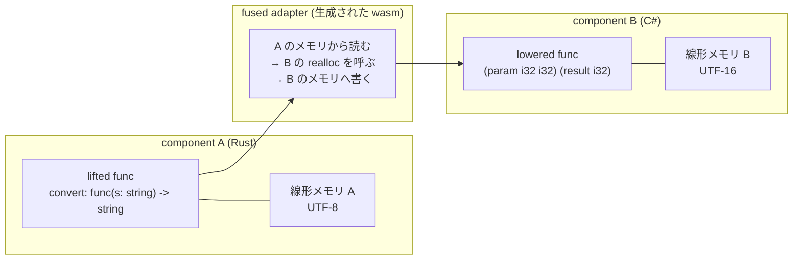

## core wasm には「文字列」がない

Wasm の関数シグネチャに書ける型は `i32` / `i64` / `f32` / `f64` (と参照型) だけだ ([型システム — 4 つの独立した型階層](../type-system/))。だから「文字列を受け取る関数」を core wasm で書くと、必ず `(param i32 i32)` のような整数の組になる。

この整数の組が何を意味するのかは、**言語のツールチェーンごとの慣習でしかない**。Rust なら「線形メモリ上のバイト列の先頭オフセットと長さ、中身は UTF-8」だが、C# や Java なら UTF-16 かもしれず、C なら NUL 終端で長さは渡さないかもしれない。さらに「そのバイト列を誰がいつ解放するのか」も決まっていない。呼ばれた側が解放するのか、呼んだ側が呼び出し後に解放するのか、そもそも解放しないのか。

そしてこの慣習は、**2 つのモジュールが同じ線形メモリを共有していることを暗黙に前提にしている**。ポインタは線形メモリへのオフセットでしかない ([線形メモリ — ポインタがオフセットになるということ](../linear-memory-semantics/)) から、渡した `i32` は受け取った側の線形メモリでは全く別の場所を指す。同じメモリを共有すれば動くが、共有した瞬間に「互いのヒープを自由に踏み合える 2 つのモジュール」になる。片方が Rust で片方が Go だとすると、GC の管理する領域を相手が書き換えられることになる。

component model は、この空白を埋める層だ。**「文字列」「レコード」「バリアント」「リスト」といった型を言語非依存に定義し、それを core wasm の整数と線形メモリにどう落とすかの規約 (canonical ABI) を決める。** その規約に従っている限り、Rust で書かれたモジュールと Go で書かれたモジュールが、互いのメモリを一切共有せずに文字列をやり取りできる。



**A と B は互いの線形メモリを見られない。** 見られるのは間に挟まったアダプタだけで、そのアダプタも wasm として生成されサンドボックスの中で動く ([FACT — 融合アダプタを wasm で生成するという判断](../fact/))。これが shared-nothing linking と呼ばれる考え方で、Wasmtime のセキュリティ文書は WASI のケイパビリティモデルをその前段と位置付けている。

```text title="docs/security.md"
WASI's security
model keeps users safe today, and also helps us prepare for shared-nothing
linking and nanoprocesses in the future.
```

[docs/security.md](https://github.com/bytecodealliance/wasmtime/blob/d8a0da6d661605713798c1c9c76be5c28e3159ff/docs/security.md#L94-L95)

## shared-nothing が実装のどこに現れるか

「メモリを共有しない」という原則は、Wasmtime の中では 2 つの具体的な形をとる。

1 つは、**canonical options がインスタンスごとに memory と realloc を指す**こと。lift / lower の各操作には「どの線形メモリを使うか」「どのアロケータを呼ぶか」が紐づいていて、それはコンポーネントインスタンスごとに別々に解決される。

```rust title="crates/environ/src/component/info.rs"
pub struct LinearMemoryOptions {
    /// The memory used by these options, if specified.
    pub memory: Option<RuntimeMemoryIndex>,
    /// The realloc function used by these options, if specified.
    pub realloc: Option<RuntimeReallocIndex>,
}

pub struct CanonicalOptions {
    /// The component instance that this bundle was associated with.
    pub instance: RuntimeComponentInstanceIndex,

    /// The encoding used for strings.
    pub string_encoding: StringEncoding,
    // ...
    /// The data model (GC objects or linear memory) used with these canonical
    /// options.
    pub data_model: CanonicalOptionsDataModel,
}
```

[crates/environ/src/component/info.rs](https://github.com/bytecodealliance/wasmtime/blob/d8a0da6d661605713798c1c9c76be5c28e3159ff/crates/environ/src/component/info.rs#L500-L549)

もう 1 つは、**サブコンポーネントインスタンスごとに状態が分かれている**こと。1 つのトップレベル component の中に複数の (サブ)component インスタンスがあり、その各々がハンドル表と並行実行の状態を持つ。

```rust title="crates/wasmtime/src/runtime/vm/component.rs"
pub struct InstanceState {
    /// Represents the Component Model Async state of a (sub-)component instance.
    #[cfg(feature = "component-model-async")]
    concurrent_state: ConcurrentInstanceState,

    /// State of handles (e.g. resources, waitables, etc.) for this instance.
    handle_table: HandleTable,
    // ...
}
```

[crates/wasmtime/src/runtime/vm/component.rs](https://github.com/bytecodealliance/wasmtime/blob/d8a0da6d661605713798c1c9c76be5c28e3159ff/crates/wasmtime/src/runtime/vm/component.rs#L52-L69)

ハンドル表がインスタンスごとに分かれているというのが、resource のセマンティクスの土台になる。同じリソースを指すハンドルの番号は、インスタンスが違えば違う ([own は貸出中に消せない、borrow は scope に縛られる](../resources/))。

## component は module と違って「元の構造を捨てる」

Wasmtime の `Component` は `Module` の component 版だが、内部の設計思想が全く違う。`crates/environ/src/component/info.rs` の冒頭にそれが書かれている。

```rust title="crates/environ/src/component/info.rs"
// Compared to the `Module` structure for core wasm this type is pretty
// significantly different. The core wasm `Module` corresponds roughly 1-to-1
// with the structure of the wasm module itself, but instead a `Component` is
// more of a "compiled" representation where the original structure is thrown
// away in favor of a more optimized representation.
```

[crates/environ/src/component/info.rs](https://github.com/bytecodealliance/wasmtime/blob/d8a0da6d661605713798c1c9c76be5c28e3159ff/crates/environ/src/component/info.rs#L1-L47)

`Module` はバイナリの構造とほぼ 1 対 1 に対応するが、`Component` は「コンパイル済み表現」であって元の構造は捨てられる。理由が 3 つ挙がっている。

**第 1 に、index space ごとの `PrimaryMap` を作らずに済ませたい。** component の中には function / module / instance / type などの index space があるが、この情報は「インスタンス化した後は基本的に要らない」。だから最初から作らないことで、component を実行時に軽くし、インスタンス化を速くする。

**第 2 に、文字列探索を全部コンパイル時に倒したい。** component は任意にネストでき、内部でのインスタンス化は文字列マッチで行われる。しかし「component の import 以外の構造は静的に既知」なので、どの export がどの import に繋がるかを事前に完全に解決できる。

```rust title="crates/environ/src/component/info.rs"
// * Components can have arbitrary nesting and internally do instantiations via
//   string-based matching. At instantiation-time, though, we want to do as few
//   string-lookups in hash maps as much as we can since they're significantly
//   slower than index-based lookups. Furthermore while the imports of a
//   component are not statically known the rest of the structure of the
//   component is statically known which enables the ability to track precisely
//   what matches up where and do all the string lookups at compile time instead
//   of instantiation time.
```

**第 3 に、AOT を成立させたい。** データフロー解析をしておけば「どのアダプタにトランポリンが必要か」「どの関数がある component から lift されて別の component に lower されるか (= fused adapter)」を列挙できる。列挙できれば全部を事前にコンパイルできるので、実行時にコンパイラを持たない構成が可能になる ([.cwasm は ELF そのものである](../cwasm/))。

## 設計者が自分で書いている限界

同じコメントが、この設計が何を犠牲にしているかも書いている。**これがこの `info.rs` の冒頭コメントで最も価値のある部分だ。**

```rust title="crates/environ/src/component/info.rs"
// Note, however, that the current design of `Component` has fundamental
// limitations which it was not designed for. For example there is no feasible
// way to implement either importing or exporting a component itself from the
// root component. Currently we rely on the ability to have static knowledge of
// what's coming from the host which at this point can only be either functions
// or core wasm modules. Additionally one flat list of initializers for a
// component are produced instead of initializers-per-component which would
// otherwise be required to export a component from a component.
//
// For now this tradeoff is made as it aligns well with the intended use case
// for components in an embedding. This may need to be revisited though if the
// requirements of embeddings change over time.
```

component 仕様上は「component が component を import / export する」ことができるが、Wasmtime の現在の設計ではそれが実装不可能である。原因は 2 つで、(a) ホストから来るものが「関数か core wasm モジュールか」のどちらかであることを静的知識として前提にしていること、(b) **component ごとの initializer 列ではなく 1 本の平坦な initializer 列に潰していること** ([component のコンパイルは 4 段階](../component-pipeline/))。

そして「埋め込みの用途にはこのトレードオフが合っているので今はこれでよいが、埋め込みの要件が変われば見直す必要がある」と結んでいる。**性能のために仕様の一部を実装可能性ごと捨てている**という判断を、理由と再検討条件付きで残してあるのは珍しい。

## 外から見た違い

component は core module とはバイナリのプリアンブルが違う別のフォーマットで、パーサの入口で弾かれる。core module のバリデータに component を渡すと即座に失敗する。

```rust title="crates/wasmtime/src/runtime/module.rs"
if let wasmparser::Payload::Version { encoding, .. } = &payload {
    if let wasmparser::Encoding::Component = encoding {
        bail!("component passed to module validation");
    }
}
```

[crates/wasmtime/src/runtime/module.rs](https://github.com/bytecodealliance/wasmtime/blob/d8a0da6d661605713798c1c9c76be5c28e3159ff/crates/wasmtime/src/runtime/module.rs#L592-L597)

逆向きも同じで、component のトランスレータに core module を渡すと `attempted to parse a wasm module with a component parser` になる ([crates/environ/src/component/translate.rs](https://github.com/bytecodealliance/wasmtime/blob/d8a0da6d661605713798c1c9c76be5c28e3159ff/crates/environ/src/component/translate.rs#L836-L843))。

つまり `cargo build --target wasm32-wasip1` が吐くのは core module であって component ではない。component にするには `wasm-tools component new` 相当の変換が要る。この変換を埋め込み側が自分で書くのは例外的で、Wasmtime のサンプルもわざわざそう断っている。

```rust title="examples/component/main.rs"
/// This function is only needed until rust can natively output a component.
///
/// Generally embeddings should not be expected to do this programmatically, but instead
/// language specific tooling should be used, for example in Rust `cargo component`
/// is a good way of doing that
fn convert_to_component(path: impl AsRef<Path>) -> Result<Vec<u8>> {
    let bytes = &fs::read(&path).context("failed to read input file")?;
    wit_component::ComponentEncoder::default()
        .module(&bytes)
        .to_wasmtime_result()?
        .encode()
        .to_wasmtime_result()
}
```

[examples/component/main.rs](https://github.com/bytecodealliance/wasmtime/blob/d8a0da6d661605713798c1c9c76be5c28e3159ff/examples/component/main.rs#L22-L36)

## 埋め込み API の対応関係

component 用の埋め込み API は、core wasm 側の API と同じ形をなぞるように作られている。`crates/wasmtime/src/runtime/component/mod.rs` の doc がその方針を明言している。

```rust title="crates/wasmtime/src/runtime/component/mod.rs"
//! This module contains the embedding API for the [Component Model] in
//! Wasmtime. ... The embedding API here is mirrored after the
//! core wasm embedding API at the crate root and is intended to have the same
//! look-and-feel while handling concepts of the component model.
//!
//! * [`Component`] - a compiled component ready to be instantiated. Similar to
//!   a [`Module`](crate::Module) for core wasm.
//!
//! * [`Linker`] - a component-style location for defining host functions. This
//!   is not the same as [`wasmtime::Linker`](crate::Linker) for core wasm
//!   modules.
//!
//! * [`bindgen!`] - a macro to generate Rust bindings for a [WIT] [world].
```

[crates/wasmtime/src/runtime/component/mod.rs](https://github.com/bytecodealliance/wasmtime/blob/d8a0da6d661605713798c1c9c76be5c28e3159ff/crates/wasmtime/src/runtime/component/mod.rs#L1-L28)

`component::Component` / `component::Linker` / `component::Instance` は、それぞれ `Module` / `Linker` / `Instance` に対応する別の型だ ([Engine・Store・Module・Instance の役割分担](../engine-store-module-instance/))。名前が同じで中身が違うので、`use` で混ざると分かりにくいエラーになる。

そして core wasm 側にない要素が 1 つある。**`bindgen!` マクロだ。** core wasm には「渡す型」がないのでバインディング生成する対象がないが、component には WIT で書かれた型定義があり、そこから Rust の trait と型を機械生成できる。この WIT が次のページの主題になる ([WIT を読む — world・interface・resource](../wit/))。
