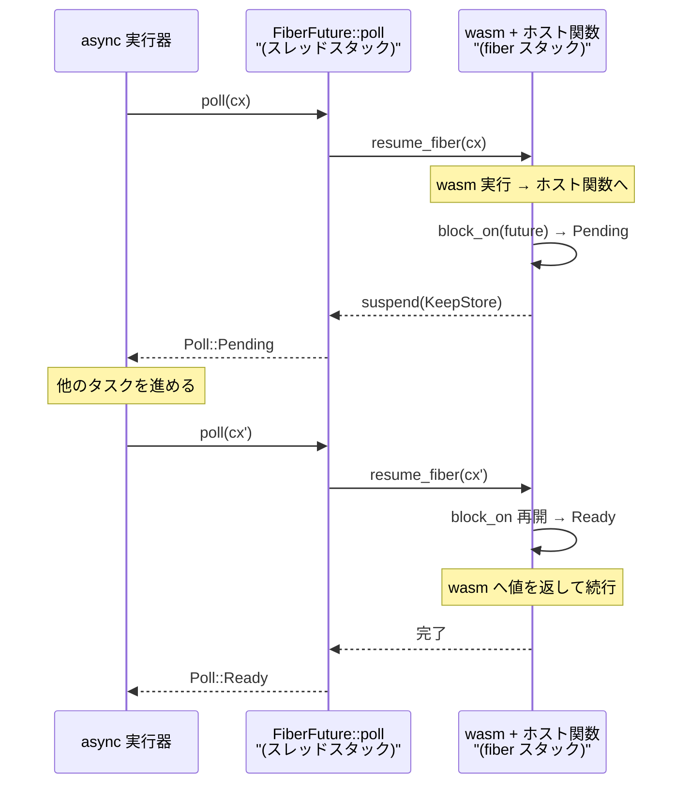

Wasmtime の `*_async` API は、内部で**専用のネイティブスタックを 1 本確保し、その上で wasm を走らせる**。ホスト関数が `.await` したくなったら、そのスタックごと切り替えて元の呼び出し元へ戻る。

なぜここまでするのか。答えは「Rust の `Future` が待つ方法」と「wasm のフレームの性質」が噛み合わないからだ。

## `Pending` を返せる場所がない

Rust の非同期は、待つことを **`poll` から `Poll::Pending` を返して呼び出しスタックを畳む**ことで表現する。畳んだ時点でローカル変数は `Future` の構造体の中に移されていて、次に `poll` されたときに再構築される。この仕組みは、スタック上の状態を全部コンパイラが把握できることを前提にしている。

wasm を実行しているときのスタックはこうなっている。

```text
ホストのスレッドスタック
  +---------------------------+
  | 埋め込み側の Rust コード     |
  +---------------------------+
  | wasm へのエントリトランポリン  |
  +---------------------------+
  | wasm 関数 f                | <- Cranelift が生成した機械語
  +---------------------------+
  | wasm 関数 g                |
  +---------------------------+
  | ホスト関数 (WASI の read)    | <- ここで await したい
  +---------------------------+
```

一番下のホスト関数は Rust で書かれていて、`async fn` かもしれない。しかし `Poll::Pending` を返して呼び出し元に戻ろうとすると、その途中に **`f` と `g` という「Future を返す形になっていない機械語」**がある。Cranelift が生成した wasm 関数は、値を返して抜けたらローカルは消える。中断して後で再開する手段を持っていない。

だからスタックを畳む代わりに、**スタックごと脇へ置く**。`crates/wasmtime/src/lib.rs` のモジュールドキュメントがそう説明している。

```text title="crates/wasmtime/src/lib.rs"
To implement futures in a way that WebAssembly sees asynchronous host
functions as synchronous, all async Wasmtime futures will execute on a
separately allocated native stack from the thread otherwise executing
Wasmtime. This separate native stack can then be switched to and from.
Using this whenever an `async` host function returns a future that
resolves to `Pending` we switch away from the temporary stack back to
the main stack and propagate the `Pending` status.
```

[crates/wasmtime/src/lib.rs](https://github.com/bytecodealliance/wasmtime/blob/d8a0da6d661605713798c1c9c76be5c28e3159ff/crates/wasmtime/src/lib.rs#L179-L246)

**「ゲストから見てホスト関数が同期的に見えるように futures を実装するため」**という書き出しがすべてを言っている。wasm は自分が中断されたことを知らない。`call` 命令から戻ってきたら結果が入っている、という同期的な世界観のままでいられる。中断は wasm の下の層で起きている。

## スタックはこう置かれている

fiber のスタックは、`crates/fiber/src/unix.rs` の冒頭にレイアウトが図解されている。

```text title="crates/fiber/src/unix.rs"
0xB000 +-----------------------+   <- top of stack
       | &Cell<RunResult>      |   <- where to store results
0xAff8 +-----------------------+
       | *const u8             |   <- last sp to resume from
0xAff0 +-----------------------+   <- 16-byte aligned
       |                       |
       ~        ...            ~   <- actual native stack space to use
       |                       |
0x1000 +-----------------------+
       |  guard page           |
0x0000 +-----------------------+
```

[crates/fiber/src/unix.rs](https://github.com/bytecodealliance/wasmtime/blob/d8a0da6d661605713798c1c9c76be5c28e3159ff/crates/fiber/src/unix.rs#L1-L30)

**スタックの一番上の 2 ワードが、切り替えのための固定スロットになっている**。片方は結果の置き場所、もう片方は「次に再開するときのスタックポインタ」だ。`resume` は自分の再開情報をここに書いてから fiber 側へ飛び、`suspend` はそれを読んで戻り、代わりに自分の再開情報を書き込む。切り替えの本体はこの 2 ワードのやり取りとレジスタの保存・復元だけで、それ以上の管理構造を持たない。

底にはガードページがある。これが踏まれたときの扱いが独特で、通常の wasm トラップ判定を通さず、**専用のメッセージを出して即座に abort する**。

```rust title="crates/wasmtime/src/runtime/vm/sys/unix/signals.rs"
TrapTest::NotWasm => {
    if let Some(faulting_addr) = faulting_addr {
        let range = unsafe { &info.vm_store_context.get().as_ref().async_guard_range };
        if range.start.addr() <= faulting_addr && faulting_addr < range.end.addr() {
            abort_stack_overflow();
        }
    }
    false
}
```

```rust title="crates/wasmtime/src/runtime/vm/sys/unix/signals.rs"
pub fn abort_stack_overflow() -> ! {
    unsafe {
        let msg = "execution on async fiber has overflowed its stack";
        libc::write(libc::STDERR_FILENO, msg.as_ptr().cast(), msg.len());
        libc::abort();
    }
}
```

[crates/wasmtime/src/runtime/vm/sys/unix/signals.rs](https://github.com/bytecodealliance/wasmtime/blob/d8a0da6d661605713798c1c9c76be5c28e3159ff/crates/wasmtime/src/runtime/vm/sys/unix/signals.rs#L170-L234)

`async_guard_range` は `VMStoreContext` に置かれた「今の fiber のガードページの範囲」で、wasm 由来でないフォルトのアドレスをこれに照らす。wasm 側のスタックオーバーフローは [プロローグの明示チェック](../stack-limit/) が先に捕まえるので、ここに来るのは**ホスト側のコードが fiber スタックを食い潰した場合**だ。トラップにして wasm へ返しても意味がないので落とす。

## 2 つの `poll` が向かい合っている

実装は、外側と内側で 2 つの `poll` が対になる形をしている。

外側は `FiberFuture::poll`。fiber を再開し、その結果が「suspend した」なら `Poll::Pending` を返す。

```rust title="crates/wasmtime/src/runtime/fiber.rs"
fn poll(self: Pin<&mut Self>, cx: &mut Context<'_>) -> Poll<Self::Output> {
    let me = self.get_mut();
    // ... `cx` の寿命を 'static に伸ばして fiber 側へ渡す ...
    let cx: &mut Context<'static> = unsafe { change_context_lifetime(cx) };
    let cx = NonNull::from(cx);

    match resume_fiber(me.store, me.fiber.as_mut().unwrap(), Ok(cx)) {
        Ok(Ok(())) => Poll::Ready(Ok(None)),
        Ok(Err(e)) => Poll::Ready(Err(e)),
        Err(StoreFiberYield::KeepStore) => Poll::Pending,
        // ...
    }
}
```

内側は `BlockingContext::block_on`。fiber の上で走っていて、渡された future を `poll` し、`Pending` なら fiber を suspend する。

```rust title="crates/wasmtime/src/runtime/fiber.rs"
pub(crate) fn block_on<F>(&mut self, future: F) -> Result<F::Output>
where
    F: Future + Send,
{
    let mut future = core::pin::pin!(future);
    loop {
        match future.as_mut().poll(self.future_cx.as_mut().unwrap()) {
            Poll::Ready(v) => break Ok(v),
            Poll::Pending => self.suspend(StoreFiberYield::KeepStore)?,
        }
    }
}
```

[crates/wasmtime/src/runtime/fiber.rs](https://github.com/bytecodealliance/wasmtime/blob/d8a0da6d661605713798c1c9c76be5c28e3159ff/crates/wasmtime/src/runtime/fiber.rs#L299-L310)

**`Pending` は fiber の switch に翻訳され、fiber の switch は外側で `Pending` に翻訳し直される**。この対称性が全体の骨格になっている。

厄介なのは `&mut Context<'_>` の受け渡しだ。future を `poll` するには waker を含む `Context` が要るが、これは外側の `poll` の引数として一瞬だけ存在する参照で、wasm のフレームを跨いで引数として渡す道がない。そこで `AsyncState` に生ポインタとして置く。

```rust title="crates/wasmtime/src/runtime/fiber.rs"
/// The `Context` pointer last provided in `Future for FiberFuture`.
///
/// Like `current_suspend` above this is an example of a piece of context
/// which needs to be carried over a WebAssembly function frame which
/// otherwise doesn't take this as a parameter.
current_future_cx: Option<NonNull<Context<'static>>>,
```

[crates/wasmtime/src/runtime/fiber.rs](https://github.com/bytecodealliance/wasmtime/blob/d8a0da6d661605713798c1c9c76be5c28e3159ff/crates/wasmtime/src/runtime/fiber.rs#L26-L100)

`'static` は嘘で、コメントもそれを認めている。「この寿命パラメータは安全でない形で `'static` に変更されているが、これは正しくない」。実際の安全性は `BlockingContext` を作る経路を絞り、そこから取れる寿命が必ず元の `Context` より短くなるように型で縛ることで担保している。**「wasm のフレームを跨いで文脈を運ぶ」という要求が、そのまま unsafe の発生源になっている**のがよく分かる場所だ。



## async かどうかは設定しない

以前は `Config::async_support(true)` で明示的に有効化していたが、今は非推奨で中身が空になっている。

```rust title="crates/wasmtime/src/config.rs"
#[doc(hidden)]
#[deprecated(note = "no longer has any effect")]
#[cfg(feature = "async")]
pub fn async_support(&mut self, _enable: bool) -> &mut Self {
    self
}
```

[crates/wasmtime/src/config.rs](https://github.com/bytecodealliance/wasmtime/blob/d8a0da6d661605713798c1c9c76be5c28e3159ff/crates/wasmtime/src/config.rs#L426-L431)

代わりに **`Store` は「async が必要か」を自分で気付く**。ひとつは import 側からで、`InstancePre` を組むときに全ホスト関数の asyncness を畳み込んでおき、インスタンス化時に `Store` へ伝える。

```rust title="crates/wasmtime/src/runtime/instance.rs"
let mut asyncness = Asyncness::No;
for item in &items {
    match item {
        Definition::Extern { .. } => {}
        Definition::HostFunc(f) => {
            // ...
            asyncness = asyncness | f.asyncness();
        }
    }
}
```

もうひとつは `Store` 側の設定で、`fuel_async_yield_interval` / `epoch_deadline_async_yield_and_update` / `limiter_async` がそれぞれ `set_async_required(Asyncness::Yes)` を呼ぶ。いずれかが立つと、以後 `Func::call` のような同期 API はエラーになる。

```rust title="crates/wasmtime/src/runtime/store.rs"
pub(crate) fn validate_sync_call(&self) -> Result<()> {
    #[cfg(feature = "async")]
    if self.async_state.async_required {
        bail!("store configuration requires that `*_async` functions are used instead");
    }
    Ok(())
}
```

**「async にする」という独立したスイッチをなくし、実際に fiber を必要とする機能から逆算する**という形になっている。設定の組み合わせ間違い (async のホスト関数を登録したのに `async_support` を忘れる) が構造的に起きなくなる。

## `poll` の中で untrusted なコードを走らせるということ

fiber を用意しても、まだ問題が残る。`Future::poll` の doc は「速やかに戻れ、ブロックするな」と要求しているが、fiber の上で走るのは wasm で、それが信頼できないコードなら無限ループしうる。

`lib.rs` はこの状況を正面から扱っている。「あなたの WebAssembly が untrusted なら、最悪の場合 `poll` メソッドが任意に長い時間を取り、他のすべての非同期タスクをブロックしかねない」。そして解決策を 2 つ挙げ、**最も効率的なのは [`Config::epoch_interruption`](../epoch/) と `Store::epoch_deadline_async_yield_and_update` の組み合わせだ**とする。定期的に `Engine::increment_epoch` を呼べば、走行中の wasm が定期的に yield して `poll` から戻る。「コンパイル済みコードへの計装がかなり軽い」のが利点で、「増分が通常タイマベースなので、スケジューリングがやや非決定的になる」のが欠点だと整理されている。

もう一方の [fuel](../fuel/) による yield は決定的だが、「コンパイル済みコードへの計装が epoch チェックよりも著しく高価だ」と書かれている。どちらの場合も、無限実行を防ぐには wasm 実行の future 全体にタイムアウトを掛けることを推奨している。

**yield 機構がなければ fiber は「ブロックしないための道具」として不完全**だ、というのがここの要点になる。fiber が解くのは「ホスト関数が待てるようにする」ことで、「wasm が長く走りすぎないようにする」ことは解かない。この 2 つを合わせて初めて、1 スレッドの上で複数のゲストを協調的に走らせられる。[wasmtime serve](../wasmtime-serve/) が組み合わせているのがまさにこの形で、サーバサイドでは 1 リクエストの wasm が実行スレッドを占有すると他のリクエストが全部止まるので、両方が要る。

## どう活かすか

「言語ランタイムの中断機構と、その上に乗せたい非同期モデルが噛み合わない」という状況は、Wasmtime に限らず起きる。C のライブラリのコールバックの中から Rust の future を待ちたいときも同じ構図になる。**スタックを畳めないなら、スタックを取っておく**というのが一般解で、コストはスタック 1 本分のメモリと切り替えのレジスタ保存になる。

一方で、この選択は「スタックに紐づいた暗黙の状態」を全部自分で管理する義務を連れてくる。TLS もシグナルハンドラが見る範囲も、スタックが変われば意味が変わる。何を save/restore する必要があるかは [fiber を切り替えるとき、何を save/restore するのか](../fiber-state-swap/) で見る。
