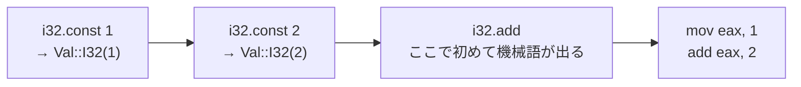

Winch は中間表現を持たない。Wasm のオペレータを 1 つ読むごとに機械語を出す。では `i32.const 1` を読んだら何が出るのか。

```rust title="winch/codegen/src/visitor.rs"
    fn visit_i32_const(&mut self, val: i32) -> Self::Output {
        self.context.stack.push(Val::i32(val));

        Ok(())
    }
```

[winch/codegen/src/visitor.rs](https://github.com/bytecodealliance/wasmtime/blob/d8a0da6d661605713798c1c9c76be5c28e3159ff/winch/codegen/src/visitor.rs)

**何も出ない。** 影スタックに値を積むだけだ。`local.get` も同じで、ローカルを読み出す命令は出ず、「ローカル `n` を指す値」が積まれるだけになる。

```rust title="winch/codegen/src/visitor.rs"
    fn visit_local_get(&mut self, index: u32) -> Self::Output {
        use WasmValType::*;
        let context = &mut self.context;
        let slot = context.frame.get_wasm_local(index);
        match slot.ty {
            I32 | I64 | F32 | F64 | V128 => context.stack.push(Val::local(index, slot.ty)),
            // ...
        }

        Ok(())
    }
```

## 値の 4 つの居場所

これを可能にしているのが `Val` という enum だ。Wasm の値スタック上の 1 要素が、どこにあるかを表現している。

```rust title="winch/codegen/src/stack.rs"
/// Value definition to be used within the shadow stack.
#[derive(Debug, Eq, PartialEq, Copy, Clone)]
pub(crate) enum Val {
    /// I32 Constant.
    I32(i32),
    /// I64 Constant.
    I64(i64),
    /// F32 Constant.
    F32(Ieee32),
    /// F64 Constant.
    F64(Ieee64),
    /// V128 Constant.
    V128(i128),
    /// A register value.
    Reg(TypedReg),
    /// A local slot.
    Local(Local),
    /// Offset to a memory location.
    Memory(Memory),
}
```

[winch/codegen/src/stack.rs](https://github.com/bytecodealliance/wasmtime/blob/d8a0da6d661605713798c1c9c76be5c28e3159ff/winch/codegen/src/stack.rs)

居場所は 4 種類ある。**即値**（コンパイル時に値が分かっている）、**レジスタ**（すでに物理レジスタに載っている）、**ローカル**（関数のローカルスロットにある）、**メモリ**（スタックスロットに退避されている）。

値が実際にレジスタへ運ばれるのは、それを使う命令が来たときだ。`pop_to_reg` がその変換を行う。即値なら `mov` 即値、ローカルならフレームからのロード、メモリならスタックスロットからのロード、既にレジスタにあるなら何もしない。



`i32.const 1; i32.const 2; i32.add` という 3 命令に対して、機械語が出るのは 3 つ目だけになる。**中間表現を持たないのに、定数をレジスタに置いてから足すという無駄が消えている。** これが Winch の言う「非常に限定的な peephole 最適化」の実体だ。

なぜこれが「最適化」ではなく「遅延」で済むのか。値スタックは Wasm のセマンティクスをそのまま写したものなので、**値が積まれてから使われるまでの間に、その値を観測できる者がいない**。だから実体化を遅らせても意味は変わらない。これは [Wasm のブロック引数を、CLIF のブロック引数にしない](../block-params-not-phi/) で見た Cranelift 側の判断とも似た構造で、どちらも「Wasm のスタックマシンという形が、悲観的な実体化を不要にしている」ことを利用している。

## レジスタ割り当てはビットセット 1 個

値をレジスタに実体化するには、空いているレジスタが要る。Winch のレジスタアロケータは、フリーリストをビットセットで持つだけの単一パス実装だ。

```rust title="winch/codegen/src/regalloc.rs"
/// The register allocator.
///
/// The register allocator uses a single-pass algorithm;
/// its implementation uses a bitset as a freelist
/// to track per-class register availability.
///
/// If a particular register is not available upon request
/// the register allocation will perform a "spill", essentially
/// moving Local and Register values in the stack to memory.
/// This process ensures that whenever a register is requested,
/// it is going to be available.
pub(crate) struct RegAlloc {
    /// The register set.
    regset: RegSet,
}
```

[winch/codegen/src/regalloc.rs](https://github.com/bytecodealliance/wasmtime/blob/d8a0da6d661605713798c1c9c76be5c28e3159ff/winch/codegen/src/regalloc.rs)

取得の実装がこの設計を端的に表している。

```rust title="winch/codegen/src/regalloc.rs"
    pub fn reg_for_class<F>(&mut self, class: RegClass, spill: &mut F) -> Result<Reg>
    where
        F: FnMut(&mut RegAlloc) -> Result<()>,
    {
        match self.regset.reg_for_class(class) {
            Some(reg) => Ok(reg),
            None => {
                spill(self)?;
                self.regset
                    .reg_for_class(class)
                    .ok_or_else(|| format_err!(CodeGenError::expected_register_to_be_available()))
            }
        }
    }
```

空きがあれば返す。なければ `spill` コールバックを呼び、**その後は必ず取れる**という前提で再試行する。取れなかったら内部エラーだ。

`spill` が何をするかは呼び出し側が渡す。実体は「影スタック上の `Val::Reg` と `Val::Local` をメモリに退避し、`Val::Memory` に書き換える」処理になる。ここで `Val` の 4 つの居場所が効いてくる。**レジスタが足りなくなったら、影スタックの要素の居場所を書き換えるだけでよい。** 値の identity は影スタック上の位置で決まっているので、物理的にどこにあるかは自由に変えられる。

Cranelift の regalloc2 が生存区間を計算し、干渉グラフを持ち、線形走査やバックトラッキングをするのと比べると、あまりに素朴に見える。だがこれで足りる。**Winch は「値スタックの上から順に使う」という Wasm の性質を利用しているので、生存区間を計算する必要がない。** スタックの下にある値ほど長生きする、という順序が最初から分かっている。

## 何を捨てているか

この方式が出すコードは、Cranelift の出すものより明らかに悪い。共通部分式は除去されないし、ループ不変式は巻き上げられないし、レジスタの割り当ては貪欲でしかない。

代わりに得られるのは、コンパイル時間の短さと、**出力の予測可能性**だ。Winch の設計原則にある「見れば分かる。どの WebAssembly オペレータからどの機械語が出るかが明白であること」([Winch — 単一パスで、見れば分かるコードを吐く](../winch/)) は、この単純さの上に成り立っている。値の遅延実体化は原則を破っているように見えるが、破り方が局所的なので、`i32.add` のところで何が出るかは依然として読んで追える。

## どう活かすか

「表現を遅延させる」という手は、コンパイラ以外でも使える。

要点は 2 つある。1 つは、**遅延させてよい区間を、意味論から特定すること**。Winch の場合は「値が積まれてから使われるまでは誰も観測できない」という Wasm の性質が根拠になっている。この根拠がないところで遅延すると、単にバグになる。

もう 1 つは、**遅延した結果として「まだ決まっていない状態」を型で持つこと**。`Val` が 4 つの居場所を enum で持っているので、どの状態にあるかは常に明示されている。`Option<Reg>` のようなあいまいな表現にしていたら、spill の実装は書けなかっただろう。
